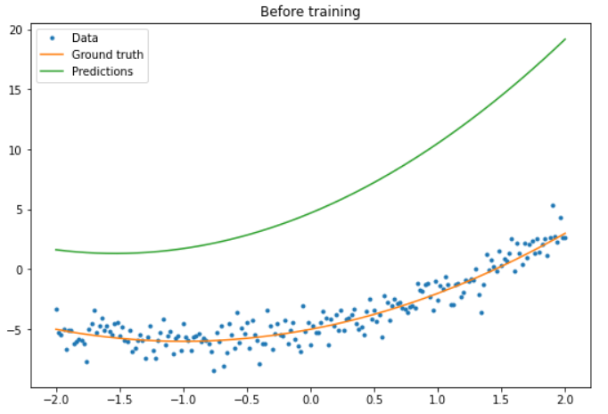
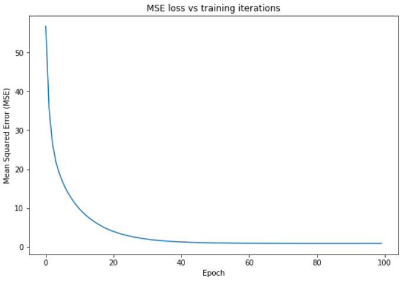
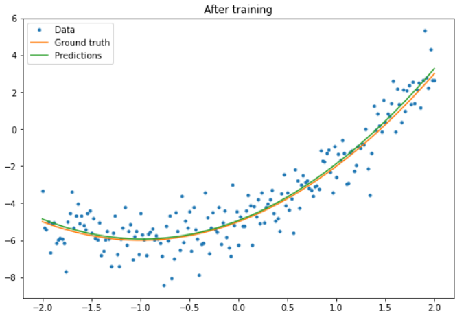
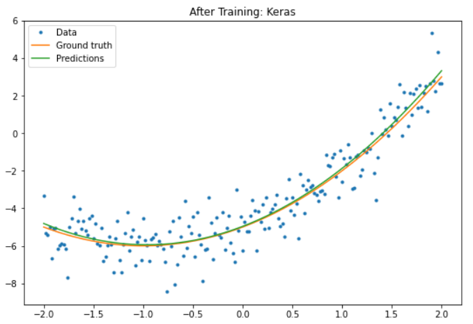

# TensorFlow 基础

- [TensorFlow 基础](#tensorflow-基础)
  - [1. 简介](#1-简介)
  - [2. 张量](#2-张量)
  - [3. 变量](#3-变量)
  - [4. 自动微分](#4-自动微分)
  - [5. Graph 和 tf.function](#5-graph-和-tffunction)
  - [6. Module, layer 和 model](#6-module-layer-和-model)
  - [7. 训练循环](#7-训练循环)
  - [8. 参考](#8-参考)

Last updated: 2022-09-21, 15:10
@author Jiawei Mao
*****

## 1. 简介

下面对 TensorFlow 的基础知识进行简要概述。

TensorFlow 是一个端到端的机器学习平台，支持：

- 基于多维数组的数值计算（类似 NumPy）；
- GPU 和分布式处理；
- 自动微分；
- 模型的构建、训练和导出；
- ......

## 2. 张量

TensorFlow 将高维数组称为张量（tensor），以 [tf.Tensor](https://www.tensorflow.org/api_docs/python/tf/Tensor) 对象表示。下面是一个二维张量：

```python
import tensorflow as tf

x = tf.constant([[1., 2., 3.],
                 [4., 5., 6.]])
print(x)
print(x.shape)
print(x.dtype)
```

```txt
tf.Tensor(
[[1. 2. 3.]
 [4. 5. 6.]], shape=(2, 3), dtype=float32)
(2, 3)
<dtype: 'float32'>
```

`shape` 和 `dtype` 是 `tf.Tensor` 最重要的两个属性：

- `Tensor.shape`，张量在各个轴上的大小；
- `Tensor.dtype`，张量包含的元素的类型。

TensorFlow 为张量实现了标准数学运算，以及许多用于机器学习的运算。例如：

```python
>>> x = tf.constant([[1., 2., 3.],
                     [4., 5., 6.]])
>>> x + x # 元素加
<tf.Tensor: shape=(2, 3), dtype=float32, numpy=
array([[ 2.,  4.,  6.],
       [ 8., 10., 12.]], dtype=float32)>
>>> 5 * x # 元素乘
<tf.Tensor: shape=(2, 3), dtype=float32, numpy=
array([[ 5., 10., 15.],
       [20., 25., 30.]], dtype=float32)>
>>> x @ tf.transpose(x) # 矩阵乘
<tf.Tensor: shape=(2, 2), dtype=float32, numpy=
array([[14., 32.],
       [32., 77.]], dtype=float32)>
>>> tf.concat([x, x, x], axis=0) # 拼接
<tf.Tensor: shape=(6, 3), dtype=float32, numpy=
array([[1., 2., 3.],
       [4., 5., 6.],
       [1., 2., 3.],
       [4., 5., 6.],
       [1., 2., 3.],
       [4., 5., 6.]], dtype=float32)>
>>> tf.nn.softmax(x, axis=-1)
<tf.Tensor: shape=(2, 3), dtype=float32, numpy=
array([[0.09003057, 0.24472848, 0.6652409 ],
       [0.09003057, 0.24472848, 0.6652409 ]], dtype=float32)>
>>> tf.reduce_sum(x)
<tf.Tensor: shape=(), dtype=float32, numpy=21.0>
```

> **!NOTE** 通常支持 Tensor 输入的 TF 函数，也支持可以使用 [tf.convert_to_tensor](https://www.tensorflow.org/api_docs/python/tf/convert_to_tensor) 转换为张量的数据类型。如下所示。

```python
tf.convert_to_tensor([1, 2, 3])
```

```txt
<tf.Tensor: shape=(3,), dtype=int32, numpy=array([1, 2, 3])>
```

```python
tf.reduce_sum([1, 2, 3])
```

```txt
<tf.Tensor: shape=(), dtype=int32, numpy=6>
```

在 CPU 上运行大型运算可能会很慢，TensorFlow 支持使用 GPU 等加速硬件快速执行操作。查看配置环境是否支持 GPU：

```python
if tf.config.list_physical_devices('GPU'):
  print("TensorFlow **IS** using the GPU")
else:
  print("TensorFlow **IS NOT** using the GPU")
```

详情请参考 [Tensor 指南](https://www.tensorflow.org/guide/tensor)。

## 3. 变量

`tf.Tensor` 对象不可变（immutable），在 TensorFlow 中使用 `tf.Variable` 存储可变张量（如模型的权重必须可变）。

```python
>>> var = tf.Variable([0.0, 0.0, 0.0])
>>> var
<tf.Variable 'Variable:0' shape=(3,) dtype=float32, numpy=array([0., 0., 0.], dtype=float32)>
>>> var.assign([1, 2, 3])
<tf.Variable 'UnreadVariable' shape=(3,) dtype=float32, numpy=array([1., 2., 3.], dtype=float32)>
>>> var.assign_add([1, 1, 1])
<tf.Variable 'UnreadVariable' shape=(3,) dtype=float32, numpy=array([2., 3., 4.], dtype=float32)>
```

详情请参考[变量指南](https://www.tensorflow.org/guide/variable)。

## 4. 自动微分

[梯度下降](https://en.wikipedia.org/wiki/Gradient_descent) 及其相关算法是现代机器学习的基石。

为了实现梯度下降算法，TensorFlow 实现了自动微分（autodiff）功能，即使用微积分计算梯度。一般用来计算模型的误差（error）或损失（loss）相对权重（weight）的梯度。例如：

```python
>>> x = tf.Variable(1.0)
>>> def f(x):
      y = x**2 + 2*x - 5
      return y
>>> f(x)
<tf.Tensor: shape=(), dtype=float32, numpy=-2.0>
```

在 $x=1.0$ 时，$y=f(x)=(1^2+2\times 1-5)=-2$。

$y$ 的导数 $y'=f'(x)=(2\times x+2)=4$。TensorFlow 可以自动完成该计算：

```python
>>> with tf.GradientTape() as tape:
      y = f(x)
>>> g_x = tape.gradient(y, x)  # g(x) = dy/dx
>>> g_x
<tf.Tensor: shape=(), dtype=float32, numpy=4.0>
```

这里只是对单个标量 `x` 求导，TensorFlow 可以同时对任意数量的非标量张量计算梯度。

详情请参考 [梯度和自动微分指南](https://www.tensorflow.org/guide/autodiff)。

## 5. Graph 和 tf.function

除了像使用 Python 库一样交互式地使用 TensorFlow，TensorFlow 还支持：

- **性能优化**，加快训练和推理；
- **导出模型**，在训练完后保存模型。

要使用这些功能，需要使用 `tf.function` 将纯 TensorFlow 代码和常规 Python 代码区分开：

```python
@tf.function
def my_func(x):
  print('Tracing.\n')
  return tf.reduce_sum(x)
```

**第一次**在 Python 中执行 `tf.function`，TensorFlow 会捕获一个完整的、优化的计算图（graph），用来表示函数中 TensorFlow 执行的计算。

```python
>>> x = tf.constant([1, 2, 3])
>>> my_func(x)
Tracing.
<tf.Tensor: shape=(), dtype=int32, numpy=6>
```

**再次**调用 `my_func`，TensorFlow 只执行优化的 graph，跳过非 TensorFlow 操作。如下所示，再次调用 `my_func` 不打印 "Tracing"，因为 `print` 是 Python 函数，不是 TensorFlow 函数。

```python
>>> x = tf.constant([10, 9, 8])
>>> my_func(x)
<tf.Tensor: shape=(), dtype=int32, numpy=27>
```

对不同签名（`shape` 和 `dtype`）的输入，graph 无法重用，此时会生成一个新的计算图：

```python
x = tf.constant([10.0, 9.1, 8.2], dtype=tf.float32)
my_func(x)
```

```txt
Tracing.
<tf.Tensor: shape=(), dtype=float32, numpy=27.3>
```

捕获计算图有两个好处：

- 大多时候执行速度显著提高；
- 可以使用 `tf.saved_model` 保存计算图。

详情请参考 [Graph 指南](https://www.tensorflow.org/guide/intro_to_graphs)。

## 6. Module, layer 和 model

`tf.Module` 类用于管理变量 `tf.Variable` 以及对变量进行的操作 `tf.function`。`tf.Module` 支持两个重要特性：

1. 支持使用 [tf.train.Checkpoint](https://www.tensorflow.org/api_docs/python/tf/train/Checkpoint) 保存和恢复变量值。该功能在训练模型期间十分有用，可用来快速保存和恢复模型状态；
2. 支持使用 `tf.saved_model` 导入和导出 `tf.Variable` 值和 `tf.function` 计算图。

下面演示导出 `tf.Module` 对象：

```python
class MyModule(tf.Module):
  def __init__(self, value):
    self.weight = tf.Variable(value)

  @tf.function
  def multiply(self, x):
    return x * self.weight
```

```python
>>> mod = MyModule(3)
>>> mod.multiply(tf.constant([1, 2, 3]))
<tf.Tensor: shape=(3,), dtype=int32, numpy=array([3, 6, 9])>
```

保存 `Module`：

```python
>>> save_path = './saved'
>>> tf.saved_model.save(mod, save_path)
INFO:tensorflow:Assets written to: .saved\assets
```

保存的 SavedModel 不依赖于创建它的代码，保存后可以从 Python、其它绑定语言或 [TensorFlow Serving](https://www.tensorflow.org/tfx/serving/docker) 中重新加载该模型。也可以在 TensorFlow Lite 或 TensorFlow JS 中运行。

```python
>>> reloaded = tf.saved_model.load(save_path)
>>> reloaded.multiply(tf.constant([1, 2, 3]))
<tf.Tensor: shape=(3,), dtype=int32, numpy=array([3, 6, 9])>
```

`tf.keras.layers.Layer` 和 `tf.keras.Model` 类都是在 `tf.Module` 的基础上构建，额外提供了便于构建、训练和保存模型的方法。

详情请参考 [模块、层和模型指南](https://www.tensorflow.org/guide/intro_to_modules)。

## 7. 训练循环

现在将上面的功能组合在一起，创建一个简单的模型，并从头开始训练。

首先，生成一些样本数据，下面生成一组大致符合二次曲线的数据点：

```python
import matplotlib
from matplotlib import pyplot as plt

matplotlib.rcParams['figure.figsize'] = [9, 6]
```

```python
x = tf.linspace(-2, 2, 201)
x = tf.cast(x, tf.float32)

def f(x):
    y = x ** 2 + 2 * x - 5
    return y

y = f(x) + tf.random.normal(shape=[201])

plt.plot(x.numpy(), y.numpy(), '.', label='Data')
plt.plot(x, f(x), label='Ground truth')
plt.legend()
```


使用随机初始化的 weights 和 bias 创建模型：

```python
class Model(tf.Module):

    def __init__(self):
        # 随机生成 weight 和 bias
        rand_init = tf.random.uniform(shape=[3], minval=0., maxval=5., seed=22)
        # 初始化模型参数
        self.w_q = tf.Variable(rand_init[0])
        self.w_l = tf.Variable(rand_init[1])
        self.b = tf.Variable(rand_init[2])

    @tf.function
    def __call__(self, x):
        # Quadratic Model : quadratic_weight * x^2 + linear_weight * x + bias
        return self.w_q * (x ** 2) + self.w_l * x + self.b
```

在训练前，先观察一下模型的表现：

```python
quad_model = Model()
```

```python
def plot_preds(x, y, f, model, title):
    plt.figure()
    plt.plot(x, y, '.', label='Data')
    plt.plot(x, f(x), label='Ground truth')
    plt.plot(x, model(x), label='Predictions')
    plt.title(title)
    plt.legend()
```

```python
plot_preds(x, y, f, quad_model, 'Before training')
```



然后，为模型定义损失函数。鉴于该模型旨在预测连续值，使用均方误差（MSE）作为损失函数就挺好。给定预测向量 $\hat{y}$ 和目标向量 $y$，MSE 定义为预测值和真实值之间平方差的均值。

$$MSE=\frac{1}{m}\sum_{i=1}^m (\hat{y}_i-y_i)^2$$

```python
def mse_loss(y_pred, y):
    return tf.reduce_mean(tf.square(y_pred - y))
```

接下来编写训练循环。在循环中利用 MSE 损失函数及其相对输入的梯度，迭代更新模型参数。使用小批量（mini-batch）进行训练既省内存，又可以加快收敛速度。[tf.data.Dataset](https://www.tensorflow.org/api_docs/python/tf/data/Dataset) 包含批处理和洗牌功能。

```python
batch_size = 32
dataset = tf.data.Dataset.from_tensor_slices((x, y))
dataset = dataset.shuffle(buffer_size=x.shape[0]).batch(batch_size)
```

```python
# 设置训练参数
epochs = 100
learning_rate = 0.01
losses = []

# 定义训练循环
for epoch in range(epochs):
    for x_batch, y_batch in dataset:
        with tf.GradientTape() as tape:
            batch_loss = mse_loss(quad_model(x_batch), y_batch)
        # 根据梯度更新模型参数
        grads = tape.gradient(batch_loss, quad_model.variables)
        for g, v in zip(grads, quad_model.variables):
            v.assign_sub(learning_rate * g)
    # 记录每个 epoch 模型的 loss
    loss = mse_loss(quad_model(x), y)
    losses.append(loss)
    if epoch % 10 == 0:
        print(f'Mean squared error for step {epoch}: {loss.numpy():0.3f}')

# Plot model results
print("\n")
plt.plot(range(epochs), losses)
plt.xlabel("Epoch")
plt.ylabel("Mean Squared Error (MSE)")
plt.title('MSE loss vs training iterations');
```

```txt
Mean squared error for step 0: 56.740
Mean squared error for step 10: 9.715
Mean squared error for step 20: 3.977
Mean squared error for step 30: 1.997
Mean squared error for step 40: 1.282
Mean squared error for step 50: 1.042
Mean squared error for step 60: 0.954
Mean squared error for step 70: 0.923
Mean squared error for step 80: 0.913
Mean squared error for step 90: 0.909
```



查看训练后模型的表现：

```python
plot_preds(x, y, f, quad_model, 'After training')
```



可以看到效果还不错。不过 `tf.keras` 模块提供了通用训练工具，不需要自己写 for 循环进行训练，上面的代码可以更简洁。例如，使用 `Model.compile` 和 `Model.fit` 实现训练循环。

首先使用 [tf.keras.Sequential](https://www.tensorflow.org/api_docs/python/tf/keras/Sequential) 创建一个 Keras Sequential 模型。Keras 中全连接层是最简单的 layer 之一，用 [tf.keras.layers.Dense](https://www.tensorflow.org/api_docs/python/tf/keras/layers/Dense) 表示。全连接层能够学习 $Y=WX+\overrightarrow{b}$ 形式的多维线性关系。为了学习 $w_1x^2+w_2x+b$ 形式的非线性方程，Dense 的输入应为以 $x^2$ 和 $x$ 为特征的矩阵。可以用 [tf.keras.layers.Lambda](https://www.tensorflow.org/api_docs/python/tf/keras/layers/Lambda) 执行这种堆叠转换。

```python
new_model = tf.keras.Sequential([
    tf.keras.layers.Lambda(lambda x: tf.stack([x, x ** 2], axis=1)),
    tf.keras.layers.Dense(units=1, kernel_initializer=tf.random.normal)])
```

```python
new_model.compile(
    loss=tf.keras.losses.MSE,
    optimizer=tf.keras.optimizers.SGD(learning_rate=0.01))

history = new_model.fit(x, y,
                        epochs=100,
                        batch_size=32,
                        verbose=0)

new_model.save('./my_new_model')
```

```txt
INFO:tensorflow:Assets written to: ./my_new_model\assets
```

查看训练后模型的性能：

```python
plt.plot(history.history['loss'])
plt.xlabel('Epoch')
plt.ylim([0, max(plt.ylim())])
plt.ylabel('Loss [Mean Squared Error]')
plt.title('Keras training progress');
```


```python
plot_preds(x, y, f, new_model, 'After Training: Keras')
```



详情请参考[训练循环指南](https://www.tensorflow.org/guide/basic_training_loops)。

## 8. 参考

- https://www.tensorflow.org/guide/basics
