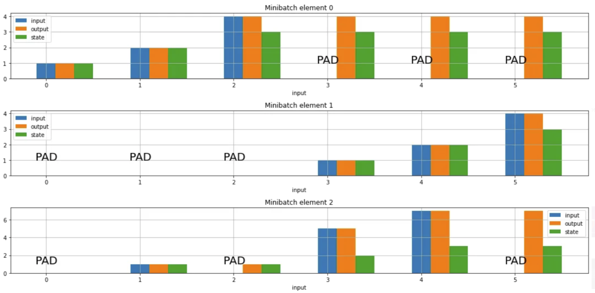

# 屏蔽和填充序列

- [屏蔽和填充序列](#屏蔽和填充序列)
  - [导入包](#导入包)
  - [简介](#简介)
  - [填充序列数据](#填充序列数据)
  - [屏蔽 (Masking)](#屏蔽-masking)
  - [屏蔽生成层：Embedding 和 Masking](#屏蔽生成层embedding-和-masking)
  - [Functional API 和 Sequential API 中 mask 的传播](#functional-api-和-sequential-api-中-mask-的传播)
  - [直接将 mask 张量传递给 layer](#直接将-mask-张量传递给-layer)
  - [自定义 mask 生成层](#自定义-mask-生成层)
  - [自定义 mask 传播层](#自定义-mask-传播层)
  - [自定义 mask 使用层](#自定义-mask-使用层)
  - [总结](#总结)
  - [个人总结](#个人总结)
  - [参考](#参考)

Last updated: 2023-02-18, 12:47
****

## 导入包

```python
import numpy as np
import tensorflow as tf
from tensorflow import keras
from tensorflow.keras import layers
```

## 简介

**屏蔽**（Masking）是告诉序列处理层输入数据缺少某些时间步，因此在处理数据时应该跳过这些时间步。

**填充**（Padding）是一种特殊的 masking，其屏蔽的时间步位于序列的开头或结尾。填充是为了支持批处理：使同一批次的所有序列长度相同，需要填充或裁剪部分序列。

## 填充序列数据

序列数据不同样本长度不同很常见。例如，下面是按单词标记化后的文本：

```python
[
  ["Hello", "world", "!"],
  ["How", "are", "you", "doing", "today"],
  ["The", "weather", "will", "be", "nice", "tomorrow"],
]
```

使用 vocabulary 转换为整数向量：

```python
[
  [71, 1331, 4231]
  [73, 8, 3215, 55, 927],
  [83, 91, 1, 645, 1253, 927],
]
```

此时数据是一个嵌套列表，样本长度分别为 3, 5 和 6。由于深度学习模型要求输入数据为单个张量（本例中 shape 为 `(batch_size, 6, vocab_size)`），对长度小于最长样本的样本，需要填充占位符（也可以在填充短样本前截断长样本）。

Keras 使用 `tf.keras.utils.pad_sequences` 裁剪和填充 Python 列表到指定长度。例如：

```python
raw_inputs = [
    [711, 632, 71],
    [73, 8, 3215, 55, 927],
    [83, 91, 1, 645, 1253, 927],
]

# 默认填充 0，可以使用 `value` 参数设置填充值
# `padding` 为 "pre" (在开头填充) 或 "post" (在末尾填充)
# 在 rnn 中推荐使用 "post" 填充，这样才能使用 CuDNN 实现的 layers
padded_inputs = tf.keras.preprocessing.sequence.pad_sequences(
    raw_inputs, padding="post"
)
print(padded_inputs)
```

```txt
[[ 711  632   71    0    0    0]
 [  73    8 3215   55  927    0]
 [  83   91    1  645 1253  927]]
```

## 屏蔽 (Masking)

统一样本长度后，需要告诉模型哪些数据是填充值应该忽略，该机制就是**屏蔽**（masking）。

在 Keras 模型中设置屏蔽的方法有三种：

1. 添加 `keras.layers.Masking` layer
2. 为 `keras.layers.Embedding` layer 添加设置 `mask_zero=True`
3. 对支持 `mask` 参数的 layer 手动传入该参数，如 RNN layer

## 屏蔽生成层：Embedding 和 Masking

`Embedding` 和 `Masking` 生成一个 shape 为 `(batch, sequence_length)` 的 2D mask 张量并将其放在 layer 的输出后面实现屏蔽，两者的屏蔽张量均保存在 `_keras_mask` 字段中。

```py
embedding = layers.Embedding(input_dim=5000, output_dim=16, mask_zero=True)
masked_output = embedding(padded_inputs)

print(masked_output._keras_mask) # 查看屏蔽张量

masking_layer = layers.Masking()
# 将 2D 扩展为 3D 模拟嵌入层的 lookup，嵌入维度为 10
unmasked_embedding = tf.cast(
    tf.tile(tf.expand_dims(padded_inputs, axis=-1), [1, 1, 10]), tf.float32
)

masked_embedding = masking_layer(unmasked_embedding)
print(masked_embedding._keras_mask) # 查看屏蔽张量
```

```txt
tf.Tensor(
[[ True  True  True False False False]
 [ True  True  True  True  True False]
 [ True  True  True  True  True  True]], shape=(3, 6), dtype=bool)
tf.Tensor(
[[ True  True  True False False False]
 [ True  True  True  True  True False]
 [ True  True  True  True  True  True]], shape=(3, 6), dtype=bool)
```

从输出结果可以看出，屏蔽张量是一个 `(batch_size, sequence_length)` 2D boolean 张量，`False` 表示在处理时忽略该时间步。

> 下面屏蔽张量以 mask 表示。

## Functional API 和 Sequential API 中 mask 的传播

在 Functional API 或 Sequential API 中，由 `Embedding` 或 `Masking` layer 生成的 mask 会通过网络传播给任何能处理 mask 的 layer，如 RNN。Keras 会自动获取与输入对应的 mask，并将其传递给能处理的 layer。

例如，在 Sequential 模型中，`LSTM` 会自动接收 mask 忽略填充值：

```py
model = keras.Sequential(
    [layers.Embedding(input_dim=5000, output_dim=16, mask_zero=True),
     layers.LSTM(32),]
)
```

在 Functional 模型中也是如此：

```py
inputs = keras.Input(shape=(None,), dtype="int32")
x = layers.Embedding(input_dim=5000, output_dim=16, mask_zero=True)(inputs)
outputs = layers.LSTM(32)(x)

model = keras.Model(inputs, outputs)
```

## 直接将 mask 张量传递给 layer

能处理 mask 的 layer（如 `LSTM`）的 `__call__` 方法包含一个 `mask` 参数。

与此同时，生成 mask 的 layer (如 `Embedding`)包含一个可调用的 `compute_mask(input, previous_mask)` 方法。

因此，可以将生成 mask 的 layer 的 `compute_mask()` 方法的返回值传递给支持 mask 的 layer 的 `__call__` 方法，例如：

```py
class MyLayer(layers.Layer):
    def __init__(self, **kwargs):
        super(MyLayer, self).__init__(**kwargs)
        self.embedding = layers.Embedding(input_dim=5000, output_dim=16, mask_zero=True)
        self.lstm = layers.LSTM(32)

    def call(self, inputs):
        x = self.embedding(inputs)
        # 也可以手动创建屏蔽张量，只要求 shape 为 
        # (batch_size, timesteps) 的 boolean 张量
        mask = self.embedding.compute_mask(inputs)
        output = self.lstm(x, mask=mask)  # lstm 会忽略屏蔽的值
        return output

layer = MyLayer()
x = np.random.random((32, 10)) * 100
x = x.astype("int32")
layer(x)
```

```txt
<tf.Tensor: shape=(32, 32), dtype=float32, numpy=
array([[ 2.0880729e-03,  2.6909247e-04, -4.2011710e-03, ...,
        -5.1532323e-03,  1.9728949e-03, -3.6257019e-03],
       [-6.4831548e-03,  6.1432961e-03, -6.3060718e-03, ...,
         6.5392083e-03, -1.4919225e-02,  2.1958009e-04],
       [-4.0175468e-03,  5.7841614e-03, -3.5060355e-03, ...,
        -2.4199060e-03, -1.2076424e-02, -1.2099898e-02],
       ...,
       [ 2.6612869e-03, -6.2108418e-05,  2.4627263e-03, ...,
        -7.3106021e-05, -5.0613028e-03, -4.2670751e-03],
       [ 7.6040311e-04,  1.7915958e-03, -7.6822803e-04, ...,
        -3.5597316e-03,  1.3597875e-03, -5.5020670e-03],
       [-1.0287251e-02, -2.7874522e-03, -1.5572733e-02, ...,
        -4.6893870e-03, -1.1392428e-02, -6.2933145e-03]], dtype=float32)>
```

## 自定义 mask 生成层

有时需要自己生成 mask，或者需要修改当前 mask。

例如，输出时间维度和输入时间维度不同的 layer，如在时间维度上串联的 `Concatenate` layer，需要修改当前 mask，以便下游 layer 能正确处理 mask。

为此，需要在自定义 layer 中根据当前输入和 mask 实现 `layer.compute_mask()` 方法，生成新的 mask。

下面是一个需要修改当前 mask 的 `TemporalSplit` layer:

```python
class TemporalSplit(keras.layers.Layer):
    """沿时间维度将输入张量拆分成两个张量"""
    def call(self, inputs):
        # 预计输入为 3D，mask 为 2D，将输入张量沿着时间轴（axis 1）
        # 拆分为 2 个子张量
        return tf.split(inputs, 2, axis=1)

    def compute_mask(self, inputs, mask=None):
        # 如果有 mask，也需要拆分为 2 个
        if mask is None:
            return None
        return tf.split(mask, 2, axis=1)


first_half, second_half = TemporalSplit()(masked_embedding)
print(first_half._keras_mask)
print(second_half._keras_mask)
```

```txt
tf.Tensor(
[[ True  True  True]
 [ True  True  True]
 [ True  True  True]], shape=(3, 3), dtype=bool)
tf.Tensor(
[[False False False]
 [ True  True False]
 [ True  True  True]], shape=(3, 3), dtype=bool)
```

另一个根据输入值生成 mask 的 layer `CustomEmbedding`:

```python
class CustomEmbedding(keras.layers.Layer):
    def __init__(self, input_dim, output_dim, mask_zero=False, **kwargs):
        super(CustomEmbedding, self).__init__(**kwargs)
        self.input_dim = input_dim
        self.output_dim = output_dim
        self.mask_zero = mask_zero

    def build(self, input_shape):
        self.embeddings = self.add_weight(
            shape=(self.input_dim, self.output_dim),
            initializer="random_normal",
            dtype="float32",
        )

    def call(self, inputs):
        return tf.nn.embedding_lookup(self.embeddings, inputs)

    def compute_mask(self, inputs, mask=None):
        if not self.mask_zero:
            return None
        return tf.not_equal(inputs, 0)


layer = CustomEmbedding(10, 32, mask_zero=True)
x = np.random.random((3, 10)) * 9
x = x.astype("int32")

y = layer(x)
mask = layer.compute_mask(x)

print(mask)
```

```sh
tf.Tensor(
[[ True  True  True  True  True  True  True  True  True  True]
 [ True  True  True  True  True False  True  True  True  True]
 [ True  True  True  True  True  True  True  True False  True]], shape=(3, 10), dtype=bool)
```

## 自定义 mask 传播层

大多数 layer 不修改时间维度，因此也不需要修改 mask，但是它们可能需要将当前的 mask 传播到下一层。自定义层默认会销毁 mask，因为框架无法判断传播的 mask 是否安全。

如果你的自定义 layer 不修改时间维度，并且希望它能够传播输入的 mask，则可以在构造函数中设置 `self.supports_masking = True`。这样，`compute_mask()` 的默认行为只是传递当前 mask。例如：

```py
class MyActivation(keras.layers.Layer):
    def __init__(self, **kwargs):
        super(MyActivation, self).__init__(**kwargs)
        # 表示该层可以安全地传播 mask
        self.supports_masking = True

    def call(self, inputs):
        return tf.nn.relu(inputs)
```

这样就可以在 mask 生成层（如 `Embedding`）和 mask 使用层（如 `LSTM`）使用这个自定义层，它会将 mask 传递到 LSTM 层。

```py
inputs = keras.Input(shape=(None,), dtype="int32")
x = layers.Embedding(input_dim=5000, output_dim=16, mask_zero=True)(inputs)
x = MyActivation()(x)  # Will pass the mask along
print("Mask found:", x._keras_mask)
outputs = layers.LSTM(32)(x)  # Will receive the mask

model = keras.Model(inputs, outputs)
```

```sh
Mask found: KerasTensor(type_spec=TensorSpec(shape=(None, None), dtype=tf.bool, name=None), name='Placeholder_1:0')
```

## 自定义 mask 使用层

mask 使用层在 `call` 方法中接收 `mask` 参数，并使用 mask 信息确定是否跳过某些时间步。

只需要在 `call` 方法签名中添加 `mask=None` 参数，则与该层输入关联的 mask 会传递到该层。

例如，下面的 layer 对输入序列在时间维度（axis 1）计算 softmax，同时屏蔽 mask 时间步：

```py
class TemporalSoftmax(keras.layers.Layer):
    def call(self, inputs, mask=None):
        broadcast_float_mask = tf.expand_dims(tf.cast(mask, "float32"), -1)
        inputs_exp = tf.exp(inputs) * broadcast_float_mask
        inputs_sum = tf.reduce_sum(
            inputs_exp * broadcast_float_mask, axis=-1, keepdims=True
        )
        return inputs_exp / inputs_sum


inputs = keras.Input(shape=(None,), dtype="int32")
x = layers.Embedding(input_dim=10, output_dim=32, mask_zero=True)(inputs)
x = layers.Dense(1)(x)
outputs = TemporalSoftmax()(x)

model = keras.Model(inputs, outputs)
y = model(np.random.randint(0, 10, size=(32, 100)), np.random.random((32, 100, 1)))
```

## 总结

以上是 Keras 中需要了解的所有填充和屏蔽内容。总结一下：

- 屏蔽是 layer 忽略输入序列的某些时间步；
- 有些 layer 可以生成 mask: `Embedding` 可以根据输入值生成 mask (`mask_zero=True` 时)，`Masking` 层也可以；
- 有些 layer 可以使用 mask: 在它们的 `__call__` 方法中公开 `mask` 参数，RNN 层就是如此；
- 在函数 API 和串联 API 中，mask 信息会自动传播；
- 当单独使用 layers 时，可以手动传递 `mask` 参数；
- 可以自定义 layer，实现 mask 的生成、修改和使用。

## 个人总结

- padding 是为了支持变长序列的 batch 训练；
- padding 后不 masking，也可能学习到好的模型，但会浪费计算资源；


- 对 RNN，忽略所有 mask 时间步，mask 时间步的输出和状态从上一步非 mask 的时间步复制而来。



对 right-padded 序列（minibatch element 0），RNN 的隐藏状态为最后一个有效输入步骤的状态。

对 left-padded 序列（minibatch element 1），RNN 开始的时间步都是默认状态，直到第一个有效输入。

而 minibatch element 2 是中间包含 pad 的情况，

## 参考

- https://www.tensorflow.org/guide/keras/masking_and_padding
- https://towardsdatascience.com/how-does-masking-work-in-an-rnn-and-variants-and-why-537bf63c306d
