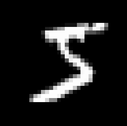

# RNN with Keras

- [RNN with Keras](#rnn-with-keras)
  - [1. 简介](#1-简介)
  - [2. 配置](#2-配置)
  - [3. 内置 RNN 层的一个简单示例](#3-内置-rnn-层的一个简单示例)
  - [4. 输出和状态](#4-输出和状态)
  - [5. RNN layers 和 RNN cells](#5-rnn-layers-和-rnn-cells)
  - [6. Cross-batch statefulness](#6-cross-batch-statefulness)
    - [6.1 RNN State Reuse](#61-rnn-state-reuse)
  - [7. 双向 RNN](#7-双向-rnn)
  - [8. 性能优化和 CuDNN 内核](#8-性能优化和-cudnn-内核)
    - [8.1 使用 CuDNN 内核](#81-使用-cudnn-内核)
  - [9. list/dict 或嵌套输入](#9-listdict-或嵌套输入)
    - [9.1 定义支持嵌套输入的 cell](#91-定义支持嵌套输入的-cell)
    - [9.2 构建具有嵌套 IO 的 RNN 模型](#92-构建具有嵌套-io-的-rnn-模型)
    - [9.3 用随机数训练模型](#93-用随机数训练模型)
  - [10. 参考](#10-参考)

Last updated: 2022-08-03, 10:48
@author Jiawei Mao
****

## 1. 简介

循环神经网络（Recurrent neural network, RNN）是一类擅长对时间序列或自然语言等序列数据建模的神经网络。

实践中，RNN layer 使用 `for` 循环迭代序列的时间步，同时维护一个内部状态，该状态对看过的时间步信息进行编码。

> 内部状态不是 weight，而是记录序列、时间步等状态信息，即 hidden state。所以重置状态步影响权重。

Keras RNN API 的特点：

- **使用简单**：内置的 `keras.layers.RNN`, `keras.layers.LSTM` 和 `keras.layers.GRU` 不需要复杂配置，就可用于构建 RNN 模型；
- **自定义简单**：可以自定义 RNN cell 层（`for` 循环内部，即单个时间步的处理方法），然后与通用 `keras.layers.RNN` 层(`for` 循环本身)一起使用，就可以构建自定义 RNN 模型。

## 2. 配置

```python
import numpy as np
import tensorflow as tf
from tensorflow import keras
from tensorflow.keras import layers
```

## 3. 内置 RNN 层的一个简单示例

Keras 有三个内置的 RNN 层：

1. `keras.layers.SimpleRNN`，全连接 RNN，上一个时间步的输出馈送到下一个时间步；
2. `keras.layers.GRU`
3. `keras.layers.LSTM`

在 2015 年初，Keras 推出了第一个可重用的 LSTM 和 GRU 的开源 Python 实现。

下面是一个简单的 `Sequential` 模型，输入为整数序列，将每个整数嵌入到 64 维向量，然后在 `LSTM` 层中处理：

```python
model = keras.Sequential()
# 添加嵌入层，vocab size 为 1000，输出嵌入维度 64
model.add(layers.Embedding(input_dim=1000, output_dim=64))

# 添加包含 128 个内部单元的 LSTM 层
model.add(layers.LSTM(128))

# 添加包含 10 个单元的 Dense 层
model.add(layers.Dense(10))

model.summary()
```

```txt
Model: "sequential"
_________________________________________________________________
Layer (type)                 Output Shape              Param #   
=================================================================
embedding (Embedding)        (None, None, 64)          64000     
_________________________________________________________________
lstm (LSTM)                  (None, 128)               98816     
_________________________________________________________________
dense (Dense)                (None, 10)                1290      
=================================================================
Total params: 164,106
Trainable params: 164,106
Non-trainable params: 0
_________________________________________________________________
```

内置 RNN 支持：

- 通过 `dropout` 和 `recurrent_dropout` 参数提供循环 dropout 功能；
- 通过 `go_backwards` 参数提供反向处理输入序列的功能；
- 通过 `unroll` 参数展开循环，在 CPU 上处理短序列时可以大大提高速度。

## 4. 输出和状态

RNN 层对每个样本默认输出一个向量，对应最后一个时间步 RNN cell 的输出。输出 shape 为 `(batch_size, units)`，其中 `units` 和 RNN 层构造函数的 `units` 参数一致，即隐藏状态长度。

如果设置 `return_sequences=True`，RNN 层返回整个输出序列的隐状态，每个时间步对应一个输出向量。此时输出 shape 为 `(batch_size, timesteps, units)`。

```python
model = keras.Sequential()
model.add(layers.Embedding(input_dim=1000, output_dim=64))

# GRU 的输出为 3D 张量，shape 为 (batch_size, timesteps, 256)
model.add(layers.GRU(256, return_sequences=True))

# SimpleRNN 输出 2D 张量，shape 为 (batch_size, 128)
model.add(layers.SimpleRNN(128))

model.add(layers.Dense(10))

model.summary()
```

```txt
Model: "sequential_1"
_________________________________________________________________
Layer (type)                 Output Shape              Param #   
=================================================================
embedding_1 (Embedding)      (None, None, 64)          64000     
_________________________________________________________________
gru (GRU)                    (None, None, 256)         247296    
_________________________________________________________________
simple_rnn (SimpleRNN)       (None, 128)               49280     
_________________________________________________________________
dense_1 (Dense)              (None, 10)                1290      
=================================================================
Total params: 361,866
Trainable params: 361,866
Non-trainable params: 0
_________________________________________________________________
```

另外，RNN 层可以返回其内部的最终状态。返回的内部状态可用于恢复 RNN 状态，也可以用来初始化另一个 RNN。该设置通常用在 encoder-decoder seq2seq 模型，其中 encoder 的最终状态用于 decoder 的初始状态。

将 `return_state` 设置为 `True` 使 RNN 返回其内部状态。注意 LSTM 有 2 个状态张量，而 `GRU` 只有一个。

使用 `initial_state` 配置 RNN 层的初始状态。注意内部状态的 shape 要和 layer 的 unit size 匹配，如下:

```python
encoder_vocab = 1000
decoder_vocab = 2000

encoder_input = layers.Input(shape=(None,))
encoder_embedded = layers.Embedding(input_dim=encoder_vocab, output_dim=64)(
    encoder_input
)

# 除了输出，额外返回状态
output, state_h, state_c = layers.LSTM(64, return_state=True, name="encoder")(
    encoder_embedded
)
encoder_state = [state_h, state_c] # hidden state & cell state

decoder_input = layers.Input(shape=(None,))
decoder_embedded = layers.Embedding(input_dim=decoder_vocab, output_dim=64)(
    decoder_input
)

# 将 2 个状态作为新 LSTM 层的初始状态
decoder_output = layers.LSTM(64, name="decoder")(
    decoder_embedded, initial_state=encoder_state
)
output = layers.Dense(10)(decoder_output)

model = keras.Model([encoder_input, decoder_input], output)
model.summary()
```

```txt
Model: "model"
__________________________________________________________________________________________________
Layer (type)                    Output Shape         Param #     Connected to                     
==================================================================================================
input_1 (InputLayer)            [(None, None)]       0                                            
__________________________________________________________________________________________________
input_2 (InputLayer)            [(None, None)]       0                                            
__________________________________________________________________________________________________
embedding_2 (Embedding)         (None, None, 64)     64000       input_1[0][0]                    
__________________________________________________________________________________________________
embedding_3 (Embedding)         (None, None, 64)     128000      input_2[0][0]                    
__________________________________________________________________________________________________
encoder (LSTM)                  [(None, 64), (None,  33024       embedding_2[0][0]                
__________________________________________________________________________________________________
decoder (LSTM)                  (None, 64)           33024       embedding_3[0][0]                
                                                                 encoder[0][1]                    
                                                                 encoder[0][2]                    
__________________________________________________________________________________________________
dense_2 (Dense)                 (None, 10)           650         decoder[0][0]                    
==================================================================================================
Total params: 258,698
Trainable params: 258,698
Non-trainable params: 0
__________________________________________________________________________________________________
```

## 5. RNN layers 和 RNN cells

除了内置 RNN layer，RNN API 还提供 cell-level API。与处理批量输入序列的 RNN layer不同，RNN cell 只处理单个时间步。

cell 是 RNN layer `for` 循环内部部分。将 cell 包裹在 `keras.layers.RNN` 中，就获得能够处理批量序列的 layer，例如 `RNN(LSTMCell(10))`。

在数学上，`RNN(LSTMCell(10))` 与 `LSTM(10)` 生成的结果相同。实际上，TF v1.x 中的 `LSTM` layer 就是用 `RNN` layer 包裹 `LSTMCell` 实现的。不过，内置的 `GRU` 和 `LSTM` layer 实现可以使用 CuDNN，从而提高性能。

有三个内置的 RNN cell，以及与之对应的三个 RNN layer：

- `keras.layers.SimpleRNNCell`
- `keras.layers.GRUCell`
- `keras.layers.LSTMCell`

cell 结合 `keras.layers.RNN` 类，可以很容易自定义 RNN 框架。

## 6. Cross-batch statefulness

在处理非常长的序列时，可能需要使用跨批量状态（cross-batch statefullness）模式。

通常情况下，RNN layer 的内部状态在每次处理新的 batch 前重置（即认为该层看到的每个样本独立于过去）。即仅在处理单个样本时维护状态。

如果要处理的序列很长，则将长序列拆分成短序列，把这些短序列**按顺序**输入 RNN 层，且不重置层的状态，这样 RNN layer 可以保留整个序列的信息，即使它一次只能看到一个子序列。

只需要在构造函数中设置 `stateful=True` 就可以做到这一点。

假设你有一个长序列 `s = [t0, t1, ... t1546, t1547]`，可以将其拆分成：

```python
s1 = [t0, t1, ... t100]
s2 = [t101, ... t201]
...
s16 = [t1501, ... t1547]
```

然后可以按如下方式处理：

```python
lstm_layer = layers.LSTM(64, stateful=True)
for s in sub_sequences:
  output = lstm_layer(s)
```

使用 `layer.reset_states()` 清除状态。

> [!IMPORTANT]
> 在此设置中，假定当前 batch 的样本 i 是上一个 batch 的样本 i 延续。这意味着所有 batch 应该包含相同数量的样本（batch size）。例如，如果当前 batch 包含 `[sequence_A_from_t0_to_t100, sequence_B_from_t0_to_t100]`，则下一个 batch 应该包含 `[sequence_A_from_t101_to_t200, sequence_B_from_t101_to_t200]`。

下面是完整示例：

```python
paragraph1 = np.random.random((20, 10, 50)).astype(np.float32)
paragraph2 = np.random.random((20, 10, 50)).astype(np.float32)
paragraph3 = np.random.random((20, 10, 50)).astype(np.float32)

lstm_layer = layers.LSTM(64, stateful=True)
output = lstm_layer(paragraph1)
output = lstm_layer(paragraph2)
output = lstm_layer(paragraph3)

# reset_states() 将缓存的状态重置为初始状态。
# 如果没有提供 initial_state，则默认使用 zero-states.
lstm_layer.reset_states()
```

### 6.1 RNN State Reuse

`layer.weights()` 不包含 RNN layer 的状态。如果想复用 RNN layer 的状态，可以使用 `layer.states` 获得状态，然后通过 keras 函数 API，如 `new_layer(inputs, initial_state=layer.states)` 设置新 layer 的状态，也可以通过继承 Model API 设置初始状态。

需要注意的是，这里不能使用 sequential 模型，因为 sequential 模型只支持单个输入和单个输出，因此无法使用额外的 `initial_state` 输入。

```python
paragraph1 = np.random.random((20, 10, 50)).astype(np.float32)
paragraph2 = np.random.random((20, 10, 50)).astype(np.float32)
paragraph3 = np.random.random((20, 10, 50)).astype(np.float32)

# 函数 API
lstm_layer = layers.LSTM(64, stateful=True)
output = lstm_layer(paragraph1)
output = lstm_layer(paragraph2)

existing_state = lstm_layer.states

new_lstm_layer = layers.LSTM(64)
new_output = new_lstm_layer(paragraph3, initial_state=existing_state)
```

## 7. 双向 RNN

对时间序列以外的序列，如文本，如果 RNN 模型正向处理序列的同时还反向处理序列，性能往往更好。例如，要预测句子的下一个单词，如果不仅知道前面的单词，还知道后面的单词，预测效果通常更好。

Keras 提供了一个简单的 API 来构建这样的双向 RNN：`keras.layers.Bidirectional` wrapper。

```python
model = keras.Sequential()

model.add(
    layers.Bidirectional(layers.LSTM(64, return_sequences=True), input_shape=(5, 10))
)
model.add(layers.Bidirectional(layers.LSTM(32)))
model.add(layers.Dense(10))

model.summary()
```

```txt
Model: "sequential_2"
_________________________________________________________________
Layer (type)                 Output Shape              Param #   
=================================================================
bidirectional (Bidirectional (None, 5, 128)            38400     
_________________________________________________________________
bidirectional_1 (Bidirection (None, 64)                41216     
_________________________________________________________________
dense_3 (Dense)              (None, 10)                650       
=================================================================
Total params: 80,266
Trainable params: 80,266
Non-trainable params: 0
_________________________________________________________________
```

`Bidirectional` 会复制传入的 RNN layer，并反转复制 layer 的 `go_backwards` 字段，使其以相反的顺序处理输入序列。

`Bidirectional` RNN 默认将正向和反向层的输出**串联**。如果需要不同的合并方式，可以设置 `Bidirectional` 的 `merge_mode` 参数。

## 8. 性能优化和 CuDNN 内核

在 TensorFlow 2.0 中，内置的 LSTM 和 GRU layer 在 GPU 可用时默认使用 cuDNN 内核。之前的 `keras.layers.CuDNNLSTM/CuDNNGRU` 已弃用。

由于 CuDNN 内核是在一定的前提条件下构建的，如果改变了内置的 LSTM 或 GRU layer 的默认参数，可能无法使用 CuDNN 内核。例如：

- 将 `activation` 函数从 `tanh` 换成其它选项；
- 将 `recurrent_activation` 函数从 `sigmoid` 换成其它选项；
- 使用 `recurrent_dropout` > 0；
- 将 `unroll` 设置为 True，迫使 LSTM/GRU 将内部 `tf.while_loop` 转换为展开的 `for` 循环；
- `use_bias` 设置为 False；
- 当输入数据不是严格右填充时使用 masking（如果 mask 对应严格右填充，CuDNN 仍然可用）

### 8.1 使用 CuDNN 内核

下面构建一个简单的 LSTM 模型来展示性能差异。

下面使用 MNIST 数据集中数字图片的行作为输入序列（图片的每一行像素作为一个时间步），然后预测数字的标签：

```python
batch_size = 64
# 每个 MNIST 图像 batch 张量 shape 为 (batch_size, 28, 28).
# 每个输入序列 size 为 (28, 28) (图像高度作为时间步处理).
input_dim = 28

units = 64
output_size = 10  # 输出标签 0 to 9

# 构建 rnn 模型
def build_model(allow_cudnn_kernel=True):
    # CuDNN 只能在 layer 层次使用，cell 层次不能
    # 即 `LSTM(units)` 可以使用 CuDNN 内核
    # 而 `rnn(LSTMCell(units))` 只能在 non-CuDNN 内核运行
    if allow_cudnn_kernel:
        # 使用默认参数的 LSTM 才能用 CuDNN
        lstm_layer = keras.layers.LSTM(units, input_shape=(None, input_dim))
    else:
        # 使用 rnn 层包装的 LSTMCell 不能用 CuDNN
        lstm_layer = keras.layers.RNN(
            keras.layers.LSTMCell(units), input_shape=(None, input_dim)
        )
    model = keras.models.Sequential(
        [
            lstm_layer,
            keras.layers.BatchNormalization(),
            keras.layers.Dense(output_size),
        ]
    )
    return model
```

加载 MNIST 数据集：

```python
mnist = keras.datasets.mnist

(x_train, y_train), (x_test, y_test) = mnist.load_data()
x_train, x_test = x_train / 255.0, x_test / 255.0
sample, sample_label = x_train[0], y_train[0]
```

开始创建并训练模型。

由于是分类模型，选择 `sparse_categorical_crossentropy` 作为损失函数。模型输出 shape 为 `[batch_size, 10]`。模型的目标是整数向量，整数范围 0-9.

```python
model = build_model(allow_cudnn_kernel=True)

model.compile(
    loss=keras.losses.SparseCategoricalCrossentropy(from_logits=True),
    optimizer="sgd",
    metrics=["accuracy"],
)


model.fit(
    x_train, y_train, validation_data=(x_test, y_test), batch_size=batch_size, epochs=1
)
```

```txt
938/938 [==============================] - 13s 11ms/step - loss: 0.9520 - accuracy: 0.6985 - val_loss: 0.6148 - val_accuracy: 0.7913
<keras.callbacks.History at 0x7f9583a332d0>
```

然后与不使用 CuDNN 内核的模型对比：

```python
noncudnn_model = build_model(allow_cudnn_kernel=False)
noncudnn_model.set_weights(model.get_weights())
noncudnn_model.compile(
    loss=keras.losses.SparseCategoricalCrossentropy(from_logits=True),
    optimizer="sgd",
    metrics=["accuracy"],
)
noncudnn_model.fit(
    x_train, y_train, validation_data=(x_test, y_test), batch_size=batch_size, epochs=1
)
```

```txt
938/938 [==============================] - 82s 86ms/step - loss: 0.3866 - accuracy: 0.8838 - val_loss: 0.3223 - val_accuracy: 0.8965
<keras.callbacks.History at 0x7f9584805550>
```

在配置 NVIDIA GPU 且安装 CuDNN 的机器上运行，使用 CuDNN 构建的模型比常规 TensorFlow 内核的模型训练要快。

支持 CuDNN 的模型也可以在纯 CPU 环境运行推理。下面的 `tf.device` 注释是为了强制使用设备。默认情况下，如果无 GPU 可用，模型会在 GPU 运行，完全不用担心正在运行的硬件。

```python
import matplotlib.pyplot as plt

with tf.device("CPU:0"):
    cpu_model = build_model(allow_cudnn_kernel=True)
    cpu_model.set_weights(model.get_weights())
    result = tf.argmax(cpu_model.predict_on_batch(tf.expand_dims(sample, 0)), axis=1)
    print(
        "Predicted result is: %s, target result is: %s" % (result.numpy(), sample_label)
    )
    plt.imshow(sample, cmap=plt.get_cmap("gray"))
```

```txt
Predicted result is: [3], target result is: 5
```



## 9. list/dict 或嵌套输入

嵌套结构允许在单个时间步中包含更多信息。如果，视频帧可以同时包含音频和视频输入。此时的数据 shape 可能为：

`[batch, timestep, {"video": [height, width, channel], "audio": [frequency]}]`

再比如，手写数据可以同时包含笔的位置坐标 x  和 y，以及压力信息。其数据可以表示为：

`[batch, timestep, {"location": [x, y]}, "pressure": [force]]`

下面通过一个示例演示如何自定义一个支持此类结构化输入的 RNN cell。

### 9.1 定义支持嵌套输入的 cell

```python
class NestedCell(keras.layers.Layer):
    def __init__(self, unit_1, unit_2, unit_3, **kwargs):
        self.unit_1 = unit_1
        self.unit_2 = unit_2
        self.unit_3 = unit_3
        self.state_size = [tf.TensorShape([unit_1]), tf.TensorShape([unit_2, unit_3])]
        self.output_size = [tf.TensorShape([unit_1]), tf.TensorShape([unit_2, unit_3])]
        super(NestedCell, self).__init__(**kwargs)

    def build(self, input_shapes):
        # expect input_shape to contain 2 items, [(batch, i1), (batch, i2, i3)]
        i1 = input_shapes[0][1]
        i2 = input_shapes[1][1]
        i3 = input_shapes[1][2]

        self.kernel_1 = self.add_weight(
            shape=(i1, self.unit_1), initializer="uniform", name="kernel_1"
        )
        self.kernel_2_3 = self.add_weight(
            shape=(i2, i3, self.unit_2, self.unit_3),
            initializer="uniform",
            name="kernel_2_3",
        )

    def call(self, inputs, states):
        # inputs should be in [(batch, input_1), (batch, input_2, input_3)]
        # state should be in shape [(batch, unit_1), (batch, unit_2, unit_3)]
        input_1, input_2 = tf.nest.flatten(inputs)
        s1, s2 = states

        output_1 = tf.matmul(input_1, self.kernel_1)
        output_2_3 = tf.einsum("bij,ijkl->bkl", input_2, self.kernel_2_3)
        state_1 = s1 + output_1
        state_2_3 = s2 + output_2_3

        output = (output_1, output_2_3)
        new_states = (state_1, state_2_3)

        return output, new_states

    def get_config(self):
        return {"unit_1": self.unit_1, "unit_2": self.unit_2, "unit_3": self.unit_3}
```

### 9.2 构建具有嵌套 IO 的 RNN 模型

使用 `keras.layers.RNN` layer 和自定义的 cell 构建 Keras 模型。

```python
unit_1 = 10
unit_2 = 20
unit_3 = 30

i1 = 32
i2 = 64
i3 = 32
batch_size = 64
num_batches = 10
timestep = 50

cell = NestedCell(unit_1, unit_2, unit_3)
rnn = keras.layers.RNN(cell)

input_1 = keras.Input((None, i1))
input_2 = keras.Input((None, i2, i3))

outputs = rnn((input_1, input_2))

model = keras.models.Model([input_1, input_2], outputs)

model.compile(optimizer="adam", loss="mse", metrics=["accuracy"])
```

### 9.3 用随机数训练模型

由于没有适合该模型的数据集，下面使用随机生成的 NumPy 数据演示。

```python
input_1_data = np.random.random((batch_size * num_batches, timestep, i1))
input_2_data = np.random.random((batch_size * num_batches, timestep, i2, i3))
target_1_data = np.random.random((batch_size * num_batches, unit_1))
target_2_data = np.random.random((batch_size * num_batches, unit_2, unit_3))
input_data = [input_1_data, input_2_data]
target_data = [target_1_data, target_2_data]

model.fit(input_data, target_data, batch_size=batch_size)
```

```txt
10/10 [==============================] - 1s 33ms/step - loss: 0.7400 - rnn_1_loss: 0.2710 - rnn_1_1_loss: 0.4690 - rnn_1_accuracy: 0.0766 - rnn_1_1_accuracy: 0.0339
Out[14]:
<keras.callbacks.History at 0x22b84863cd0>
```

使用 `keras.layers.RNN` layer，你只需要定义单个时间步的运算逻辑，`keras.layers.RNN` 会为你处理序列迭代。这种便捷的方式特别适合快速创建新型 RNN，如 LSTM 变体。

## 10. 参考

- https://www.tensorflow.org/guide/keras/rnn
