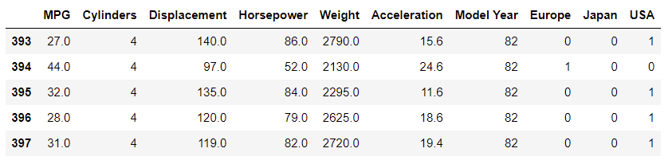

# 回归基础：预测燃油效率

- [回归基础：预测燃油效率](#回归基础预测燃油效率)
  - [简介](#简介)
  - [Auto MPG 数据集](#auto-mpg-数据集)
    - [下载数据](#下载数据)
    - [数据清理](#数据清理)
    - [拆分训练集和测试集](#拆分训练集和测试集)
    - [检查数据](#检查数据)
    - [分离特征和标签](#分离特征和标签)
  - [归一化](#归一化)
    - [归一化层](#归一化层)
  - [线性回归](#线性回归)
    - [单变量线性回归](#单变量线性回归)
  - [参考](#参考)

@author Jiawei Mao
***

## 简介

回归问题的目标是预测连续值的输出，如价格、概率等；而分类问题的目标是从有限类别中调出正确的类别，例如从图片中识别水果种类。

本教程使用经典的 [Auto MPG](https://archive.ics.uci.edu/ml/datasets/auto+mpg) 数据集，演示如何构建模型来预测 1970 年代末到  1980 年代初汽车的燃油效率。为此，需要为模型提供那个时期汽车的许多描述信息，如位移、马力和重量等属性。

该示例使用 Keras API，使用 seaborn 绘图：

```bash
pip install -q seaborn
```

```python
import matplotlib.pyplot as plt
import numpy as np
import pandas as pd
import seaborn as sns

# 使 NumPy 输出更简洁
np.set_printoptions(precision=3, suppress=True)
```

```python
import tensorflow as tf

from tensorflow import keras
from tensorflow.keras import layers

print(tf.__version__)
```

```txt
2.9.1
```

## Auto MPG 数据集

该数据集可以从 [UCI 机器学习库](https://archive.ics.uci.edu/ml/) 下载。

### 下载数据

使用 pandas 下载并导入数据：

```python
url = 'http://archive.ics.uci.edu/ml/machine-learning-databases/auto-mpg/auto-mpg.data'
column_names = ['MPG', 'Cylinders', 'Displacement', 'Horsepower', 'Weight',
                'Acceleration', 'Model Year', 'Origin']

raw_dataset = pd.read_csv(url, names=column_names,
                          na_values='?', comment='\t',
                          sep=' ', skipinitialspace=True)
```

```python
dataset = raw_dataset.copy()
dataset.tail()
```


### 数据清理

该数据集包含一些未知值：

```python
dataset.isna().sum()
```

```txt
MPG             0
Cylinders       0
Displacement    0
Horsepower      6
Weight          0
Acceleration    0
Model Year      0
Origin          0
dtype: int64
```

删除这些行以简化数据：

```python
dataset = dataset.dropna()
```

"Origin" 列是分类值，而不是数字。因此用 `pd.get_dummies` 将该列中的值进行独热编码。

> [!NOTE]
> 可以直接设置 `tf.keras.Model` 来完成该转换，但是超过了本教程的范围。

```python
dataset['Origin'] = dataset['Origin'].map({1: 'USA', 2: 'Europe', 3: 'Japan'})
```

```python
dataset = pd.get_dummies(dataset, columns=['Origin'], prefix='', prefix_sep='')
dataset.tail()
```



### 拆分训练集和测试集

将数据集拆分为训练集和测试集。在最终评估模型时使用测试集。

```python
train_dataset = dataset.sample(frac=0.8, random_state=0)
test_dataset = dataset.drop(train_dataset.index)
```

### 检查数据

查看数据集中几列数据的联合分布。

```python
sns.pairplot(train_dataset[['MPG', 'Cylinders', 'Displacement', 'Weight']], diag_kind='kde')
```


最上面一行表明燃油效率（MPG）与其它所有参数相关。余下图表示其它参数相互关联。

再看看整体的统计数据。注意每个特征值的数值范围差别较大：

```python
train_dataset.describe().transpose()
```


### 分离特征和标签

将目标值（标签）与特征分开。标签是训练模型要预测的值。

```python
train_features = train_dataset.copy()
test_features = test_dataset.copy()

train_labels = train_features.pop('MPG')
test_labels = test_features.pop('MPG')
```

## 归一化

在统计表中，很容易看出每个特征的范围相差很大：

```python
train_dataset.describe().transpose()[['mean', 'std']]
```


将特征归一化很重要，因为特征与模型权重相乘，输出和梯度值受输入值的影响。尽管没有特征归一化模型可能也会收敛，但归一化可以让训练更稳定。

> [!NOTE]
> 没有必要对独特编码进行归一化，这里进行了简化。

### 归一化层

`tf.keras.layers.Normalization` 是向模型添加归一化的简介方法。

- 创建 layer:

```python
normalizer = tf.keras.layers.Normalization(axis=-1)
```

- 调用 `adapt` 匹配数据

```python
normalizer.adapt(np.array(train_features))
```

- 计算均值和偏差

```python
print(normalizer.mean.numpy())
```

```txt
[[   5.478  195.318  104.869 2990.252   15.559   75.898    0.178    0.197
     0.624]]
```

- 调用该 layer，返回的数据将每个特征单独归一化

```python
first = np.array(train_features[:1])

with np.printoptions(precision=2, suppress=True):
    print('First example:', first)
    print()
    print('Normalized:', normalizer(first).numpy())
```

```txt
First example: [[   4.    90.    75.  2125.    14.5   74.     0.     0.     1. ]]

Normalized: [[-0.87 -1.01 -0.79 -1.03 -0.38 -0.52 -0.47 -0.5   0.78]]
```

## 线性回归

在构建深度神经网络模型前，先使用一个或多个变量进行线性回归。

### 单变量线性回归

使用 "Horsepower" 预测 "MPG" 构建单变量线性回归。


## 参考

- https://www.tensorflow.org/tutorials/keras/regression
