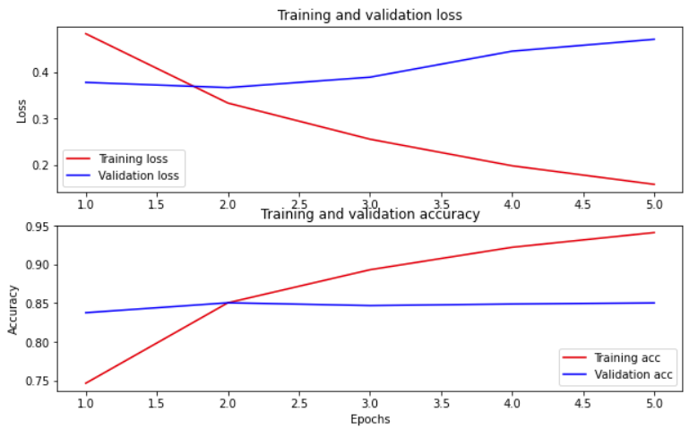

# 用 BERT 做文本分类

- [用 BERT 做文本分类](#用-bert-做文本分类)
  - [简介](#简介)
  - [BERT](#bert)
  - [设置](#设置)
  - [情感分析](#情感分析)
    - [下载 IMDB 数据集](#下载-imdb-数据集)
  - [从 TensorFlow Hub 加载模型](#从-tensorflow-hub-加载模型)
    - [选择要微调的 BERT 模型](#选择要微调的-bert-模型)
  - [预处理模型](#预处理模型)
  - [使用 BERT 模型](#使用-bert-模型)
  - [定义模型](#定义模型)
  - [模型训练](#模型训练)
    - [Loss function](#loss-function)
    - [Optimizer](#optimizer)
    - [加载 BERT 模型进行训练](#加载-bert-模型进行训练)
    - [评估模型](#评估模型)
    - [绘制 accuracy 和 loss 变化趋势图](#绘制-accuracy-和-loss-变化趋势图)
  - [导出模型](#导出模型)
  - [参考](#参考)

Last updated: 2022-08-19, 17:37
@author Jiawei Mao
****

## 简介

本教程包含 fine-tune BERT 模型的完整代码，用来对 IMDB 数据集做情感分析。除了训练模型外，还包括将文本预处理为合适格式。包括：

- 加载 IMDB 数据集
- 从 TensorFlow Hub 加载 BERT 模型
- 结合 BERT 和分类器来构建自己的模型
- 训练自己的模型，微调 BERT
- 保存模型，用来分类句子

## BERT

BERT 和其它基于 Transformer encoder 的架构在 NLP 的各种任务中取得了巨大成功。Encoder 输出的自然语言向量空间表示适合在深度学习模型中使用。BERT 系列模型使用 Transformer encoder 架构，使用 token 前后的所有 token 预测该 token，因此称为 Bidirectional Encoder Representations from Transformers (BERT)。

BERT 模型通常在大量文本语料库上进行预训练，然后针对特定任务进行微调（fine-tune）。

## 设置

安装 tensorflow-text 用于预处理输入：

```powershell
pip install -q -U "tensorflow-text==2.8.*"
```

安装 tf-models-official，因为要使用 AdamW optimizer:

```powershell
pip install -q tf-models-official==2.7.0
```

导入所需包：

```python
import os
import shutil

import tensorflow as tf
import tensorflow_hub as hub
import tensorflow_text as text
from official.nlp import optimization  # to create AdamW optimizer

import matplotlib.pyplot as plt

tf.get_logger().setLevel("ERROR")
```

## 情感分析

下面训练一个情感分析模型，根据评论文本将影评分为*好评*和*差评*。

将使用来自 [Internet Movie Database](https://www.imdb.com/) 包含 50,000 影评的 [Large Movie Review Dataset](https://ai.stanford.edu/~amaas/data/sentiment/)。

### 下载 IMDB 数据集

下载并解压 IMDB 数据集，并查看其目录结构：

```python
url = "https://ai.stanford.edu/~amaas/data/sentiment/aclImdb_v1.tar.gz"

dataset = tf.keras.utils.get_file(
    "aclImdb_v1.tar.gz", url, untar=True, cache_dir=".", cache_subdir=""
)

dataset_dir = os.path.join(os.path.dirname(dataset), "aclImdb")

train_dir = os.path.join(dataset_dir, "train")

# remove unused folders to make it easier to load the data
remove_dir = os.path.join(train_dir, "unsup")
shutil.rmtree(remove_dir)
```

```txt
Downloading data from https://ai.stanford.edu/~amaas/data/sentiment/aclImdb_v1.tar.gz
84131840/84125825 [==============================] - 6s 0us/step
84140032/84125825 [==============================] - 6s 0us/step
```

接下来，使用 `text_dataset_from_directory` 创建 `tf.data.Dataset`。

IMDB 数据集已经划分为训练集和测试集，还缺少验证集。下面使用 `validation_split` 参数从训练集中以 80:20 分割一部分作为验证集。

> **NOTE**: 使用 `validation_split` 和 `subset` 参数时，必须指定 random 种子，或设置 `shuffle=False`，否则训练集和验证集会有重叠。

```python
AUTOTUNE = tf.data.AUTOTUNE
batch_size = 32
seed = 42

raw_train_ds = tf.keras.utils.text_dataset_from_directory(
    'aclImdb/train',
    batch_size=batch_size,
    validation_split=0.2,
    subset='training',
    seed=seed)

class_names = raw_train_ds.class_names
train_ds = raw_train_ds.cache().prefetch(buffer_size=AUTOTUNE)

val_ds = tf.keras.utils.text_dataset_from_directory(
    'aclImdb/train',
    batch_size=batch_size,
    validation_split=0.2,
    subset='validation',
    seed=seed)

val_ds = val_ds.cache().prefetch(buffer_size=AUTOTUNE)

test_ds = tf.keras.utils.text_dataset_from_directory(
    'aclImdb/test',
    batch_size=batch_size)

test_ds = test_ds.cache().prefetch(buffer_size=AUTOTUNE)
```

```txt
Found 25000 files belonging to 2 classes.
Using 20000 files for training.
Found 25000 files belonging to 2 classes.
Using 5000 files for validation.
Found 25000 files belonging to 2 classes.
```

查看评论：

```python
for text_batch, label_batch in train_ds.take(1):
    for i in range(3):
        print(f"Review: {text_batch.numpy()[i]}")
        label = label_batch.numpy()[i]
        print(f"Label : {label} ({class_names[label]})")
```

```txt
Review: b'"Pandemonium" is a horror movie spoof that comes off more stupid than funny. Believe me when I tell you, I love comedies. Especially comedy spoofs. "Airplane", "The Naked Gun" trilogy, "Blazing Saddles", "High Anxiety", and "Spaceballs" are some of my favorite comedies that spoof a particular genre. "Pandemonium" is not up there with those films. Most of the scenes in this movie had me sitting there in stunned silence because the movie wasn\'t all that funny. There are a few laughs in the film, but when you watch a comedy, you expect to laugh a lot more than a few times and that\'s all this film has going for it. Geez, "Scream" had more laughs than this film and that was more of a horror film. How bizarre is that?<br /><br />*1/2 (out of four)'
Label : 0 (neg)
Review: b"David Mamet is a very interesting and a very un-equal director. His first movie 'House of Games' was the one I liked best, and it set a series of films with characters whose perspective of life changes as they get into complicated situations, and so does the perspective of the viewer.<br /><br />So is 'Homicide' which from the title tries to set the mind of the viewer to the usual crime drama. The principal characters are two cops, one Jewish and one Irish who deal with a racially charged area. The murder of an old Jewish shop owner who proves to be an ancient veteran of the Israeli Independence war triggers the Jewish identity in the mind and heart of the Jewish detective.<br /><br />This is were the flaws of the film are the more obvious. The process of awakening is theatrical and hard to believe, the group of Jewish militants is operatic, and the way the detective eventually walks to the final violent confrontation is pathetic. The end of the film itself is Mamet-like smart, but disappoints from a human emotional perspective.<br /><br />Joe Mantegna and William Macy give strong performances, but the flaws of the story are too evident to be easily compensated."
Label : 0 (neg)
Review: b'Great documentary about the lives of NY firefighters during the worst terrorist attack of all time.. That reason alone is why this should be a must see collectors item.. What shocked me was not only the attacks, but the"High Fat Diet" and physical appearance of some of these firefighters. I think a lot of Doctors would agree with me that,in the physical shape they were in, some of these firefighters would NOT of made it to the 79th floor carrying over 60 lbs of gear. Having said that i now have a greater respect for firefighters and i realize becoming a firefighter is a life altering job. The French have a history of making great documentary\'s and that is what this is, a Great Documentary.....'
Label : 1 (pos)
2022-03-29 12:30:15.775528: W tensorflow/core/kernels/data/cache_dataset_ops.cc:768] The calling iterator did not fully read the dataset being cached. In order to avoid unexpected truncation of the dataset, the partially cached contents of the dataset  will be discarded. This can happen if you have an input pipeline similar to `dataset.cache().take(k).repeat()`. You should use `dataset.take(k).cache().repeat()` instead.
```

## 从 TensorFlow Hub 加载模型

在这里，可以选择从 TensorFlow Hub 加载哪个 BERT 模型进行微调。有多种 BERT 模型可供选择：

- 由 BERT 作者发布的 [BERT-Base](https://tfhub.dev/tensorflow/bert_en_uncased_L-12_H-768_A-12/3), [Uncased](https://tfhub.dev/tensorflow/bert_en_uncased_L-12_H-768_A-12/3) 和[其它 7 个](https://tfhub.dev/google/collections/bert/1)模型。
- [Small BERTs](https://tfhub.dev/google/collections/bert/1)具有相同的总体架构，但是 Transformer block 更少或更小，是你能够在速度、大小和质量间进行权衡。
- [ALBERT](https://tfhub.dev/google/collections/albert/1)：4 种不同的 "A Lite BERT"，通过在不同层之间共享参数减少模型尺寸（不减少计算时间）。
- [BERT Experts](https://tfhub.dev/google/collections/experts/bert/1) ：8 个模型 BERT-base 架构模型，但提供了不同的 pre-training 领域，以更紧密地与目标任务一致。
- [Electra](https://tfhub.dev/google/collections/electra/1) 包含三个架构与 BERT 相同的模型（大小不同），但是以类似 GAN 中 Discriminator 的设置进行与训练。
- BERT with Talking-Heads Attention and Gated GELU [[small](https://tfhub.dev/tensorflow/talkheads_ggelu_bert_en_base/1), [large](https://tfhub.dev/tensorflow/talkheads_ggelu_bert_en_large/1)] 对 Transformer 的架构核心进行了两项改进。

在 TensorFlow Hub 这些模型的文档有更详细的信息和参考文献。

建议从小型 BERT 开始（参数较少），它们可以更快地微调。如果需要小型但精度高的模型，ALBERT 可能是个好的选择。如果需要更高的精度，请选择经典 BERT 或最近的改进 BERT，如 Electra, Talking Heads 或 BERT Expert。

除了下面列出的模型，还有[多个版本](https://tfhub.dev/google/collections/transformer_encoders_text/1)的更大的模型，准确性更好，但是它们太大，无法在单个 GPU 上进行微调。

在下面的代码中，通过切换 tfhub.dev URL 可以任意尝试这些模型，这些模型都封装在 TF Hub SavedModels 中。

### 选择要微调的 BERT 模型

```python
bert_model_name = "small_bert/bert_en_uncased_L-4_H-512_A-8"

map_name_to_handle = {
    "bert_en_uncased_L-12_H-768_A-12": "https://tfhub.dev/tensorflow/bert_en_uncased_L-12_H-768_A-12/3",
    "bert_en_cased_L-12_H-768_A-12": "https://tfhub.dev/tensorflow/bert_en_cased_L-12_H-768_A-12/3",
    "bert_multi_cased_L-12_H-768_A-12": "https://tfhub.dev/tensorflow/bert_multi_cased_L-12_H-768_A-12/3",
    "small_bert/bert_en_uncased_L-2_H-128_A-2": "https://tfhub.dev/tensorflow/small_bert/bert_en_uncased_L-2_H-128_A-2/1",
    "small_bert/bert_en_uncased_L-2_H-256_A-4": "https://tfhub.dev/tensorflow/small_bert/bert_en_uncased_L-2_H-256_A-4/1",
    "small_bert/bert_en_uncased_L-2_H-512_A-8": "https://tfhub.dev/tensorflow/small_bert/bert_en_uncased_L-2_H-512_A-8/1",
    "small_bert/bert_en_uncased_L-2_H-768_A-12": "https://tfhub.dev/tensorflow/small_bert/bert_en_uncased_L-2_H-768_A-12/1",
    "small_bert/bert_en_uncased_L-4_H-128_A-2": "https://tfhub.dev/tensorflow/small_bert/bert_en_uncased_L-4_H-128_A-2/1",
    "small_bert/bert_en_uncased_L-4_H-256_A-4": "https://tfhub.dev/tensorflow/small_bert/bert_en_uncased_L-4_H-256_A-4/1",
    "small_bert/bert_en_uncased_L-4_H-512_A-8": "https://tfhub.dev/tensorflow/small_bert/bert_en_uncased_L-4_H-512_A-8/1",
    "small_bert/bert_en_uncased_L-4_H-768_A-12": "https://tfhub.dev/tensorflow/small_bert/bert_en_uncased_L-4_H-768_A-12/1",
    "small_bert/bert_en_uncased_L-6_H-128_A-2": "https://tfhub.dev/tensorflow/small_bert/bert_en_uncased_L-6_H-128_A-2/1",
    "small_bert/bert_en_uncased_L-6_H-256_A-4": "https://tfhub.dev/tensorflow/small_bert/bert_en_uncased_L-6_H-256_A-4/1",
    "small_bert/bert_en_uncased_L-6_H-512_A-8": "https://tfhub.dev/tensorflow/small_bert/bert_en_uncased_L-6_H-512_A-8/1",
    "small_bert/bert_en_uncased_L-6_H-768_A-12": "https://tfhub.dev/tensorflow/small_bert/bert_en_uncased_L-6_H-768_A-12/1",
    "small_bert/bert_en_uncased_L-8_H-128_A-2": "https://tfhub.dev/tensorflow/small_bert/bert_en_uncased_L-8_H-128_A-2/1",
    "small_bert/bert_en_uncased_L-8_H-256_A-4": "https://tfhub.dev/tensorflow/small_bert/bert_en_uncased_L-8_H-256_A-4/1",
    "small_bert/bert_en_uncased_L-8_H-512_A-8": "https://tfhub.dev/tensorflow/small_bert/bert_en_uncased_L-8_H-512_A-8/1",
    "small_bert/bert_en_uncased_L-8_H-768_A-12": "https://tfhub.dev/tensorflow/small_bert/bert_en_uncased_L-8_H-768_A-12/1",
    "small_bert/bert_en_uncased_L-10_H-128_A-2": "https://tfhub.dev/tensorflow/small_bert/bert_en_uncased_L-10_H-128_A-2/1",
    "small_bert/bert_en_uncased_L-10_H-256_A-4": "https://tfhub.dev/tensorflow/small_bert/bert_en_uncased_L-10_H-256_A-4/1",
    "small_bert/bert_en_uncased_L-10_H-512_A-8": "https://tfhub.dev/tensorflow/small_bert/bert_en_uncased_L-10_H-512_A-8/1",
    "small_bert/bert_en_uncased_L-10_H-768_A-12": "https://tfhub.dev/tensorflow/small_bert/bert_en_uncased_L-10_H-768_A-12/1",
    "small_bert/bert_en_uncased_L-12_H-128_A-2": "https://tfhub.dev/tensorflow/small_bert/bert_en_uncased_L-12_H-128_A-2/1",
    "small_bert/bert_en_uncased_L-12_H-256_A-4": "https://tfhub.dev/tensorflow/small_bert/bert_en_uncased_L-12_H-256_A-4/1",
    "small_bert/bert_en_uncased_L-12_H-512_A-8": "https://tfhub.dev/tensorflow/small_bert/bert_en_uncased_L-12_H-512_A-8/1",
    "small_bert/bert_en_uncased_L-12_H-768_A-12": "https://tfhub.dev/tensorflow/small_bert/bert_en_uncased_L-12_H-768_A-12/1",
    "albert_en_base": "https://tfhub.dev/tensorflow/albert_en_base/2",
    "electra_small": "https://tfhub.dev/google/electra_small/2",
    "electra_base": "https://tfhub.dev/google/electra_base/2",
    "experts_pubmed": "https://tfhub.dev/google/experts/bert/pubmed/2",
    "experts_wiki_books": "https://tfhub.dev/google/experts/bert/wiki_books/2",
    "talking-heads_base": "https://tfhub.dev/tensorflow/talkheads_ggelu_bert_en_base/1",
}

map_model_to_preprocess = {
    "bert_en_uncased_L-12_H-768_A-12": "https://tfhub.dev/tensorflow/bert_en_uncased_preprocess/3",
    "bert_en_cased_L-12_H-768_A-12": "https://tfhub.dev/tensorflow/bert_en_cased_preprocess/3",
    "small_bert/bert_en_uncased_L-2_H-128_A-2": "https://tfhub.dev/tensorflow/bert_en_uncased_preprocess/3",
    "small_bert/bert_en_uncased_L-2_H-256_A-4": "https://tfhub.dev/tensorflow/bert_en_uncased_preprocess/3",
    "small_bert/bert_en_uncased_L-2_H-512_A-8": "https://tfhub.dev/tensorflow/bert_en_uncased_preprocess/3",
    "small_bert/bert_en_uncased_L-2_H-768_A-12": "https://tfhub.dev/tensorflow/bert_en_uncased_preprocess/3",
    "small_bert/bert_en_uncased_L-4_H-128_A-2": "https://tfhub.dev/tensorflow/bert_en_uncased_preprocess/3",
    "small_bert/bert_en_uncased_L-4_H-256_A-4": "https://tfhub.dev/tensorflow/bert_en_uncased_preprocess/3",
    "small_bert/bert_en_uncased_L-4_H-512_A-8": "https://tfhub.dev/tensorflow/bert_en_uncased_preprocess/3",
    "small_bert/bert_en_uncased_L-4_H-768_A-12": "https://tfhub.dev/tensorflow/bert_en_uncased_preprocess/3",
    "small_bert/bert_en_uncased_L-6_H-128_A-2": "https://tfhub.dev/tensorflow/bert_en_uncased_preprocess/3",
    "small_bert/bert_en_uncased_L-6_H-256_A-4": "https://tfhub.dev/tensorflow/bert_en_uncased_preprocess/3",
    "small_bert/bert_en_uncased_L-6_H-512_A-8": "https://tfhub.dev/tensorflow/bert_en_uncased_preprocess/3",
    "small_bert/bert_en_uncased_L-6_H-768_A-12": "https://tfhub.dev/tensorflow/bert_en_uncased_preprocess/3",
    "small_bert/bert_en_uncased_L-8_H-128_A-2": "https://tfhub.dev/tensorflow/bert_en_uncased_preprocess/3",
    "small_bert/bert_en_uncased_L-8_H-256_A-4": "https://tfhub.dev/tensorflow/bert_en_uncased_preprocess/3",
    "small_bert/bert_en_uncased_L-8_H-512_A-8": "https://tfhub.dev/tensorflow/bert_en_uncased_preprocess/3",
    "small_bert/bert_en_uncased_L-8_H-768_A-12": "https://tfhub.dev/tensorflow/bert_en_uncased_preprocess/3",
    "small_bert/bert_en_uncased_L-10_H-128_A-2": "https://tfhub.dev/tensorflow/bert_en_uncased_preprocess/3",
    "small_bert/bert_en_uncased_L-10_H-256_A-4": "https://tfhub.dev/tensorflow/bert_en_uncased_preprocess/3",
    "small_bert/bert_en_uncased_L-10_H-512_A-8": "https://tfhub.dev/tensorflow/bert_en_uncased_preprocess/3",
    "small_bert/bert_en_uncased_L-10_H-768_A-12": "https://tfhub.dev/tensorflow/bert_en_uncased_preprocess/3",
    "small_bert/bert_en_uncased_L-12_H-128_A-2": "https://tfhub.dev/tensorflow/bert_en_uncased_preprocess/3",
    "small_bert/bert_en_uncased_L-12_H-256_A-4": "https://tfhub.dev/tensorflow/bert_en_uncased_preprocess/3",
    "small_bert/bert_en_uncased_L-12_H-512_A-8": "https://tfhub.dev/tensorflow/bert_en_uncased_preprocess/3",
    "small_bert/bert_en_uncased_L-12_H-768_A-12": "https://tfhub.dev/tensorflow/bert_en_uncased_preprocess/3",
    "bert_multi_cased_L-12_H-768_A-12": "https://tfhub.dev/tensorflow/bert_multi_cased_preprocess/3",
    "albert_en_base": "https://tfhub.dev/tensorflow/albert_en_preprocess/3",
    "electra_small": "https://tfhub.dev/tensorflow/bert_en_uncased_preprocess/3",
    "electra_base": "https://tfhub.dev/tensorflow/bert_en_uncased_preprocess/3",
    "experts_pubmed": "https://tfhub.dev/tensorflow/bert_en_uncased_preprocess/3",
    "experts_wiki_books": "https://tfhub.dev/tensorflow/bert_en_uncased_preprocess/3",
    "talking-heads_base": "https://tfhub.dev/tensorflow/bert_en_uncased_preprocess/3",
}

tfhub_handle_encoder = map_name_to_handle[bert_model_name]
tfhub_handle_preprocess = map_model_to_preprocess[bert_model_name]

print(f"BERT model selected           : {tfhub_handle_encoder}")
print(f"Preprocess model auto-selected: {tfhub_handle_preprocess}")
```

```txt
BERT model selected           : https://tfhub.dev/tensorflow/small_bert/bert_en_uncased_L-4_H-512_A-8/1
Preprocess model auto-selected: https://tfhub.dev/tensorflow/bert_en_uncased_preprocess/3
```

## 预处理模型

文本在输入到 BERT 之前，要先转换为数字 token 并排列为张量。TF Hub 为上面讨论的每个 BERT 模型提供了一个匹配的预处理模型，这些预处理模型使用 TF.text 库的操作实现转换。不需要在 TF 模型之外运行纯 Python 代码来预处理文本。

预处理模型必须是 BERT 模型文档所引用的模型，可以从上面输出的 URL 查看该模型。对上面列表中的 BERT 模型，将自动选择预处理模型。

> **NOTE**：下面将预处理模型加载到 `hub.KerasLayer` 来构造微调模型。这种从 TF Hub 将 TF2-风格的 SavedModel 加载到 Keras 模型的首选 API。

```python
bert_preprocess_model = hub.KerasLayer(tfhub_handle_preprocess)
```

> 如果没有梯子，无法访问 tfhub.dev，可以使用镜像网址 https://hub.tensorflow.google.cn/ 的模型地址。上面的预处理模型的镜像地址为：https://hub.tensorflow.google.cn/tensorflow/bert_en_uncased_preprocess/3 ，BERT 模型地址：https://hub.tensorflow.google.cn/tensorflow/small_bert/bert_en_uncased_L-4_H-512_A-8/1

在一些文本上从尝试预处理模型，并查看输出：

```python
text_test = ["this is such an amazing movie!"]
text_preprocessed = bert_preprocess_model(text_test)

print(f"Keys       : {list(text_preprocessed.keys())}")
print(f'Shape      : {text_preprocessed["input_word_ids"].shape}')
print(f'Word Ids   : {text_preprocessed["input_word_ids"][0, :12]}')
print(f'Input Mask : {text_preprocessed["input_mask"][0, :12]}')
print(f'Type Ids   : {text_preprocessed["input_type_ids"][0, :12]}')
```

```txt
Keys       : ['input_type_ids', 'input_mask', 'input_word_ids']
Shape      : (1, 128)
Word Ids   : [ 101 2023 2003 2107 2019 6429 3185  999  102    0    0    0]
Input Mask : [1 1 1 1 1 1 1 1 1 0 0 0]
Type Ids   : [0 0 0 0 0 0 0 0 0 0 0 0]
```

可以看到，预处理模型输出 3 个 BERT 模型所需数据 `input_words_id`, `input_mask` 和 `input_type_ids`。

其它要点：

- 输入被截断为 128 tokens。token 数可以自定义，详情可参考 [Solve GLUE tasks using BERT on TPU](https://tensorflow.google.cn/text/tutorials/bert_glue)。
- `input_type_ids` 只有一个值 `0`，因为这是单个句子输入。如果输入多个句子，每个输入对应一个数字。

由于此文本预处理模型是一个 TF 模型，因此可以直接包含在模型中。

## 使用 BERT 模型

将 BERT 放到自己的模型前，让我们看一下其输出。从 TF Hub 加载 BERT 并查看其返回值：

```python
bert_model = hub.KerasLayer(tfhub_handle_encoder)
```

```python
bert_results = bert_model(text_preprocessed)

print(f"Loaded BERT: {tfhub_handle_encoder}")
print(f'Pooled Outputs Shape:{bert_results["pooled_output"].shape}')
print(f'Pooled Outputs Values:{bert_results["pooled_output"][0, :12]}')
print(f'Sequence Outputs Shape:{bert_results["sequence_output"].shape}')
print(f'Sequence Outputs Values:{bert_results["sequence_output"][0, :12]}')
```

```txt
Loaded BERT: https://hub.tensorflow.google.cn/tensorflow/small_bert/bert_en_uncased_L-4_H-512_A-8/1
Pooled Outputs Shape:(1, 512)
Pooled Outputs Values:[ 0.76262885  0.9928098  -0.18611874  0.3667383   0.15233696  0.6550439
  0.9681154  -0.9486271   0.00216158 -0.9877732   0.06842698 -0.9763059 ]
Sequence Outputs Shape:(1, 128, 512)
Sequence Outputs Values:[[-0.28946424  0.3432131   0.33231512 ...  0.21300775  0.7102079
  -0.05771186]
 [-0.28742066  0.31980947 -0.23018566 ...  0.5845506  -0.21329701
   0.7269206 ]
 [-0.66157055  0.68876785 -0.8743298  ...  0.10877252 -0.26173162
   0.47855422]
 ...
 [-0.22561218 -0.28925663 -0.07064369 ...  0.4756602   0.8327713
   0.4002539 ]
 [-0.29824245 -0.27473208 -0.05450494 ...  0.48849747  1.0955359
   0.18163365]
 [-0.44378227  0.0093072   0.07223703 ...  0.17290127  1.1833246
   0.0789796 ]]
```

BERT 模型返回的 map 包含 3 个重要的 keys: `pooled_output`, `sequence_output`, `encoder_outputs`：

- `pooled_output` 代表输入的整个序列，shape 为 `[batch_size, H]`，可以把它看作整个影评的嵌入
- `sequence_output` 表示每个 input token 的 context，shape 为 `[batch_size, seq_length, H]`，可以将其看作影评每个 token 的 contextual embedding。
- `encoder_outputs` 是 `L` 个 Transformer blocks 的中间激活。例如 `outputs["encoder_outputs"][i]` 是 shape 为 `[batch_size, seq_length, 1024]` 的张量，为第 i 个 Transformer block 的输出，其中 $0\le i < L$。该 list 的最后一个值为 `sequence_output`。

对于微调，使用 `pooled_output` 数组就行。

## 定义模型

下面定义一个非常简单的微调模型，包括：预处理模型，选择的 BERT 模型，一个 `Dense` 和一个 `Dropout` layer。

> **NOTE:** 有关 BERT 模型的输入和输出的更多信息，可以参考模型的文档。在这里不需要操心这个，因为预处理模型都弄好了。

```python
def build_classifier_model():
    text_input = tf.keras.layers.Input(shape=(), dtype=tf.string, name="text")
    preprocessing_layer = hub.KerasLayer(tfhub_handle_preprocess, name="preprocessing")
    encoder_inputs = preprocessing_layer(text_input)
    encoder = hub.KerasLayer(tfhub_handle_encoder, trainable=True, name="BERT_encoder")
    outputs = encoder(encoder_inputs)
    net = outputs["pooled_output"]
    net = tf.keras.layers.Dropout(0.1)(net)
    net = tf.keras.layers.Dense(1, activation=None, name="classifier")(net)
    return tf.keras.Model(text_input, net)
```

检查模型输出：

```python
classifier_model = build_classifier_model()
bert_raw_result = classifier_model(tf.constant(text_test))
print(tf.sigmoid(bert_raw_result))
```

```txt
tf.Tensor([[0.6569563]], shape=(1, 1), dtype=float32)
```

因为模型还没训练，输出没有任何意义。

查看模型结构：

```python
tf.keras.utils.plot_model(classifier_model)
```


## 模型训练

现在，已经准备好训练模型所需的所有部分，包括预处理模块、BERT encoder、数据和 classifier。

### Loss function

由于这是一个二元分类问题，并且模型输出一个概率，因此使用 `losses.BinaryCrossentropy` loss function。

```python
loss = tf.keras.losses.BinaryCrossentropy(from_logits=True)
metrics = tf.metrics.BinaryAccuracy()
```

### Optimizer

我们使用 BERT 最初使用的 optimizer "Adaptive Moments" (Adam)。该 optimizer 最小化预测 loss，并通过权重衰减进行正则化，也称为 AdamW。

对学习率 `init_lr`，使用与 BERT 预训练相同的方案：初始学习率线性衰减、在前 10% 的训练步骤加上 linear warm-up 阶段 `num_warmup_steps`。根据 BERT 论文，在微调时，初始学习率要很小（例如 5e-5, 3e-5, 2e-5）。

```python
epochs = 5
steps_per_epoch = tf.data.experimental.cardinality(train_ds).numpy()
num_train_steps = steps_per_epoch * epochs
num_warmup_steps = int(0.1 * num_train_steps)

init_lr = 3e-5
optimizer = optimization.create_optimizer(
    init_lr=init_lr,
    num_train_steps=num_train_steps,
    num_warmup_steps=num_warmup_steps,
    optimizer_type="adamw",
)
```

### 加载 BERT 模型进行训练

使用前面创建的 `classifier_model`，设置 loss, metric 和 optimizer：

```python
classifier_model.compile(optimizer=optimizer, loss=loss, metrics=metrics)
```

> **NOTE**: 训练时间取决于选择的 BERT 模型的复杂性。

```python
print(f"Training model with {tfhub_handle_encoder}")
history = classifier_model.fit(x=train_ds, validation_data=val_ds, epochs=epochs)
```

```txt
Training model with https://hub.tensorflow.google.cn/tensorflow/small_bert/bert_en_uncased_L-4_H-512_A-8/1
Epoch 1/5
625/625 [==============================] - 205s 320ms/step - loss: 0.4827 - binary_accuracy: 0.7466 - val_loss: 0.3776 - val_binary_accuracy: 0.8376
Epoch 2/5
625/625 [==============================] - 197s 316ms/step - loss: 0.3330 - binary_accuracy: 0.8504 - val_loss: 0.3663 - val_binary_accuracy: 0.8504
Epoch 3/5
625/625 [==============================] - 198s 317ms/step - loss: 0.2550 - binary_accuracy: 0.8931 - val_loss: 0.3888 - val_binary_accuracy: 0.8468
Epoch 4/5
625/625 [==============================] - 196s 313ms/step - loss: 0.1976 - binary_accuracy: 0.9220 - val_loss: 0.4449 - val_binary_accuracy: 0.8488
Epoch 5/5
625/625 [==============================] - 196s 314ms/step - loss: 0.1575 - binary_accuracy: 0.9410 - val_loss: 0.4706 - val_binary_accuracy: 0.8502
```

### 评估模型

让我们看看这个模型的性能如何。返回两个值：Loss 和 accuracy。

```python
loss, accuracy = classifier_model.evaluate(test_ds)

print(f"Loss: {loss}")
print(f"Accuracy: {accuracy}")
```

```txt
782/782 [==============================] - 123s 156ms/step - loss: 0.4503 - binary_accuracy: 0.8537
Loss: 0.45028433203697205
Accuracy: 0.8537200093269348
```

### 绘制 accuracy 和 loss 变化趋势图

基于 `model.fit()` 返回的 `History` 对象，可以绘制训练和验证的损失和精度：

```python
history_dict = history.history
print(history_dict.keys())

acc = history_dict["binary_accuracy"]
val_acc = history_dict["val_binary_accuracy"]
loss = history_dict["loss"]
val_loss = history_dict["val_loss"]

epochs = range(1, len(acc) + 1)
fig = plt.figure(figsize=(10, 6))
fig.tight_layout()

plt.subplot(2, 1, 1)
# r is for "solid red line"
plt.plot(epochs, loss, "r", label="Training loss")
# b is for "solid blue line"
plt.plot(epochs, val_loss, "b", label="Validation loss")
plt.title("Training and validation loss")
# plt.xlabel('Epochs')
plt.ylabel("Loss")
plt.legend()

plt.subplot(2, 1, 2)
plt.plot(epochs, acc, "r", label="Training acc")
plt.plot(epochs, val_acc, "b", label="Validation acc")
plt.title("Training and validation accuracy")
plt.xlabel("Epochs")
plt.ylabel("Accuracy")
plt.legend(loc="lower right")
```

```txt
dict_keys(['loss', 'binary_accuracy', 'val_loss', 'val_binary_accuracy'])
<matplotlib.legend.Legend at 0x269cab70580>
```



在图中，红线表示训练的 loss 和 accuracy，蓝线表示验证的 loss 和 accuracy。

## 导出模型

导出微调后的模型，以备后用。

```python
dataset_name = "imdb"
saved_model_path = "./{}_bert".format(dataset_name.replace("/", "_"))

classifier_model.save(saved_model_path, include_optimizer=False)
```

```txt
WARNING:absl:Found untraced functions such as restored_function_body, restored_function_body, restored_function_body, restored_function_body, restored_function_body while saving (showing 5 of 124). These functions will not be directly callable after loading.
```

现在重新加载模型，这样可以与仍然在内存中的模型并排测试。

```python
def print_my_examples(inputs, results):
    result_for_printing = [
        f"input: {inputs[i]:<30} : score: {results[i][0]:.6f}"
        for i in range(len(inputs))
    ]
    print(*result_for_printing, sep="\n")
    print()


examples = [
    "this is such an amazing movie!",  # this is the same sentence tried earlier
    "The movie was great!",
    "The movie was meh.",
    "The movie was okish.",
    "The movie was terrible...",
]

reloaded_results = tf.sigmoid(reloaded_model(tf.constant(examples)))
original_results = tf.sigmoid(classifier_model(tf.constant(examples)))

print("Results from the saved model:")
print_my_examples(examples, reloaded_results)
print("Results from the model in memory:")
print_my_examples(examples, original_results)
```

```txt
Results from the saved model:
input: this is such an amazing movie! : score: 0.999690
input: The movie was great!           : score: 0.996923
input: The movie was meh.             : score: 0.937063
input: The movie was okish.           : score: 0.044588
input: The movie was terrible...      : score: 0.002267

Results from the model in memory:
input: this is such an amazing movie! : score: 0.999690
input: The movie was great!           : score: 0.996923
input: The movie was meh.             : score: 0.937063
input: The movie was okish.           : score: 0.044588
input: The movie was terrible...      : score: 0.002267
```

## 参考

- https://tensorflow.google.cn/text/tutorials/classify_text_with_bert
