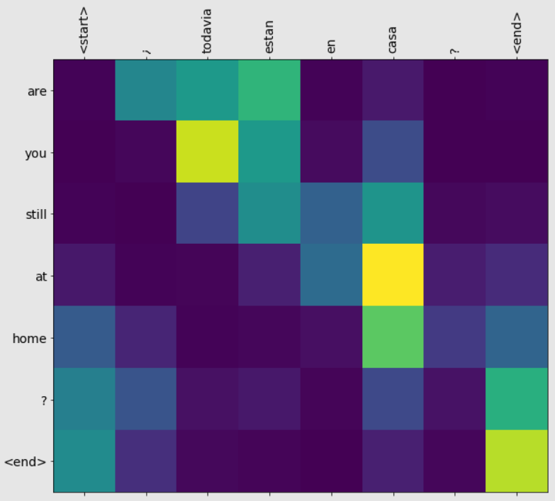
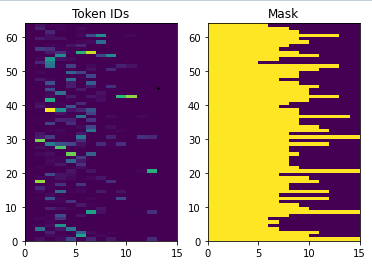
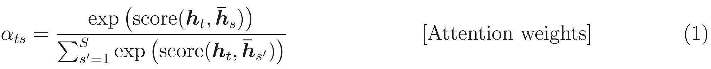

# 基于注意力机制的神经机器翻译

- [基于注意力机制的神经机器翻译](#基于注意力机制的神经机器翻译)
  - [简介](#简介)
  - [设置](#设置)
  - [数据](#数据)
    - [下载并准备数据](#下载并准备数据)
    - [创建 tf.data 数据集](#创建-tfdata-数据集)
    - [文本预处理](#文本预处理)
  - [encoder/decoder 模型](#encoderdecoder-模型)
    - [encoder](#encoder)
    - [attention head](#attention-head)
  - [参考](#参考)

***

## 简介

下面基于论文 [Effective Approaches to Attention-based Neural Machine Translation](https://arxiv.org/abs/1508.04025v5) 训练一个 seq2seq 模型用于西班牙语-英语的翻译。这是一个高级示例，需要如下背景知识：

- [Sequence-to-sequence](https://proceedings.neurips.cc/paper/2014/file/a14ac55a4f27472c5d894ec1c3c743d2-Paper.pdf) 模型
- TensorFlow 基础：
  - [张量基础](https://www.tensorflow.org/guide/tensor)
  - [自定义 Layer 和模型](https://www.tensorflow.org/guide/keras/custom_layers_and_models)

虽然这个架构有点过时，但是对理解 seq2seq 模型和注意力机制很有用。

在本教程训练模型后，可以将西班牙语句子如 "¿todavia estan en casa?" 转换为英文句子 "are you still at home?"。

生成的模型可以导出为 `tf.saved_model`，这样就可以在其它 TensorFlow 环境中使用。

对一个 toy 示例来说，模型的翻译质量是合理的，但是生成的 attention plot 可能更有意思。下图显示输入语句中在翻译时哪一部分获得了模型的 attention：



> [!NOTE]
> 这个示例在单个 P100 GPU 上运行需要大约 10 分钟。

## 设置

```powershell
$pip install "tensorflow-text==2.8.*"
```

```python
import numpy as np

import typing
from typing import Any, Tuple

import tensorflow as tf

import tensorflow_text as tf_text

import matplotlib.pyplot as plt
import matplotlib.ticker as ticker
```

本教程使用了许多底层 API，因此 shape 很容易出错。下面的类用于检查 shape：

```python
class ShapeChecker():
  def __init__(self):
    # Keep a cache of every axis-name seen
    self.shapes = {}

  def __call__(self, tensor, names, broadcast=False):
    if not tf.executing_eagerly():
      return

    if isinstance(names, str):
      names = (names,)

    shape = tf.shape(tensor)
    rank = tf.rank(tensor)

    if rank != len(names):
      raise ValueError(f'Rank mismatch:\n'
                       f'    found {rank}: {shape.numpy()}\n'
                       f'    expected {len(names)}: {names}\n')

    for i, name in enumerate(names):
      if isinstance(name, int):
        old_dim = name
      else:
        old_dim = self.shapes.get(name, None)
      new_dim = shape[i]

      if (broadcast and new_dim == 1):
        continue

      if old_dim is None:
        # If the axis name is new, add its length to the cache.
        self.shapes[name] = new_dim
        continue

      if new_dim != old_dim:
        raise ValueError(f"Shape mismatch for dimension: '{name}'\n"
                         f"    found: {new_dim}\n"
                         f"    expected: {old_dim}\n")
```

## 数据

使用 http://www.manythings.org/anki/ 提供的语言数据集，该数据集包含如下格式的成对的语句，两个句子以制表符 `\t` 分开：

```txt
May I borrow this book? ¿Puedo tomar prestado este libro?
```

他们提供了多种语言的数据集，这里只使用 "英语-西班牙语" 数据集。

### 下载并准备数据

为了方便，我们在谷歌云上托管了该数据集的副本。下载数据集后，采用以下步骤预处理数据：

1. 为每个句子添加 `start` 和 `end` token
2. 清理句子：删除特殊字符
3. 创建单词索引（word -> id 和 id -> word）
4. 将每个句子填充到允许的最大长度

- 下载文件

```python
import pathlib

path_to_zip = tf.keras.utils.get_file(
    'spa-eng.zip', origin='http://storage.googleapis.com/download.tensorflow.org/data/spa-eng.zip',
    extract=True)

path_to_file = pathlib.Path(path_to_zip).parent / 'spa-eng/spa.txt'
```

```txt
Downloading data from http://storage.googleapis.com/download.tensorflow.org/data/spa-eng.zip
2638744/2638744 [==============================] - 2s 1us/step
```

- 定义加载数据函数

```python
def load_data(path):
    text = path.read_text(encoding='utf-8')

    lines = text.splitlines()
    pairs = [line.split('\t') for line in lines]

    inp = [inp for targ, inp in pairs]
    targ = [targ for targ, inp in pairs]

    return targ, inp
```

- 加载数据

将法语句子作为输入，英语作为输出。

```python
targ, inp = load_data(path_to_file)
print(inp[-1])
```

```txt
Si quieres sonar como un hablante nativo, debes estar dispuesto a practicar diciendo la misma frase una y otra vez de la misma manera en que un músico de banjo practica el mismo fraseo una y otra vez hasta que lo puedan tocar correctamente y en el tiempo esperado.
```

```python
print(targ[-1])
```

```txt
If you want to sound like a native speaker, you must be willing to practice saying the same sentence over and over in the same way that banjo players practice the same phrase over and over until they can play it correctly and at the desired tempo.
```

### 创建 tf.data 数据集

- 使用上述的字符串数组创建 `tf.data.Dataset`，打乱数据（shuffle），并创建 batch

```python
BUFFER_SIZE = len(inp)
BATCH_SIZE = 64

dataset = tf.data.Dataset.from_tensor_slices((inp, targ)).shuffle(BUFFER_SIZE)
dataset = dataset.batch(BATCH_SIZE)
```

- 取 1 个 batch 出来查看

```python
for example_input_batch, example_target_batch in dataset.take(1):
    print(example_input_batch[:5]) # 取该 batch 前 5 个数据
    print()
    print(example_target_batch[:5])
    break
```

```txt
tf.Tensor(
[b'\xc3\x89l escribe libretos para TV.'
 b'\xc2\xbfEn tu casa qui\xc3\xa9n lleva los pantalones?'
 b'\xc2\xbfPuede pasarme la sal, por favor?' b'Ella lleva medias.'
 b'Estuve en Par\xc3\xads.'], shape=(5,), dtype=string)

tf.Tensor(
[b'He writes scripts for TV shows.' b'Who wears the pants in your family?'
 b'Could you pass me the salt, please?' b"She's wearing tights."
 b'I have been in Paris.'], shape=(5,), dtype=string)
```

### 文本预处理

本教程的目的之一是构建一个可以导出为 `tf.saved_model` 的模型。为了能导出模型，输入和输出都要转换为 `tf.string` 类型：所有文本预处理都在模型内实现。

**标准化**

该模型处理的是有限词汇的多语言文本，因此，将输入文本标准化很重要。

第一步是 Unicode 标准化，拆分重音字符、用等效 ASCII 替换兼容字符。

`tensorflow_text` 包包含 unicode 标准化操作：

```python
example_text = tf.constant("¿Todavía está en casa?")

print(example_text.numpy())
print(tf_text.normalize_utf8(example_text, "NFKD").numpy())
```

```txt
b'\xc2\xbfTodav\xc3\xada est\xc3\xa1 en casa?'
b'\xc2\xbfTodavi\xcc\x81a esta\xcc\x81 en casa?'
```

Unicode 标准化是文本标准化的第一步：

```python
def tf_lower_and_split_punct(text):
    # Split accented characters.
    text = tf_text.normalize_utf8(text, "NFKD")
    text = tf.strings.lower(text)
    # Keep space, a to z, and select punctuation.
    text = tf.strings.regex_replace(text, "[^ a-z.?!,¿]", "")
    # Add spaces around punctuation.
    text = tf.strings.regex_replace(text, "[.?!,¿]", r" \0 ")
    # Strip whitespace.
    text = tf.strings.strip(text)

    text = tf.strings.join(["[START]", text, "[END]"], separator=" ")
    return text
```

```python
print(example_text.numpy().decode())
print(tf_lower_and_split_punct(example_text).numpy().decode())
```

```txt
¿Todavía está en casa?
[START] ¿ todavia esta en casa ? [END]
```

**文本向量化**

`tf.keras.layers.TextVectorization` layer 负责文本向量化，从文本中提取词汇并将文本序列转换为 token 序列：

```python
max_vocab_size = 5000

input_text_processor = tf.keras.layers.TextVectorization(
    standardize=tf_lower_and_split_punct, max_tokens=max_vocab_size
)
```

`TextVectorization` 和许多 Keras 预处理层包含一个 `adapt` 方法，该方法读取一个 epoch 的训练数据，根据数据初始化 layer。例如，它确定了词汇表：

```python
input_text_processor.adapt(inp)

# Here are the first 10 words from the vocabulary:
input_text_processor.get_vocabulary()[:10]
```

```txt
['', '[UNK]', '[START]', '[END]', '.', 'que', 'de', 'el', 'a', 'no']
```

这是西班牙语的 `TextVectorization` layer，现在为英语构建一个：

```python
output_text_processor = tf.keras.layers.TextVectorization(
    standardize=tf_lower_and_split_punct,
    max_tokens=max_vocab_size
)

output_text_processor.adapt(targ)
output_text_processor.get_vocabulary()[:10]
```

```txt
['', '[UNK]', '[START]', '[END]', '.', 'the', 'i', 'to', 'you', 'tom']
```

`TextVectorization` 将字符串 batch 转换为 token ID batch：

```python
example_tokens = input_text_processor(example_input_batch)
example_tokens[:3, :10]
```

```txt
<tf.Tensor: shape=(3, 10), dtype=int64, numpy=
array([[   2,  180,    6,  141, 1001,   25,  463,    6,  283,   19],
       [   2,   10,  117,   71,   20, 2777,    7,   93,    4,    3],
       [   2,   24,  437,    9,   17, 1516,  130,    5,   39,    4]],
      dtype=int64)>
```

`get_vocabulary` 方法可用来将 token IDs 转换回文本：

```python
input_vocab = np.array(input_text_processor.get_vocabulary())
tokens = input_vocab[example_tokens[0].numpy()]
" ".join(tokens)
```

```txt
'[START] despues de haber encontrado su numero de telefono , el la llamo . [END]'
```

返回的 token IDs 用零填充，可以很容易转换为 mask：

```python
plt.subplot(1, 2, 1)
plt.pcolormesh(example_tokens)
plt.title("Token IDs")

plt.subplot(1, 2, 2)
plt.pcolormesh(example_tokens != 0)
plt.title("Mask")
```

```txt
Text(0.5, 1.0, 'Mask')
```



## encoder/decoder 模型

下图显示 encoder/decoder 模型的大概。在每个时间步，decoder 的输出与输入编码的加权和结合起来预测下一个单词。图表和公式来自 [Luong 的文献](https://arxiv.org/abs/1508.04025v5)。


在深入模型前，先定义一些常量：

```python
embedding_dim = 256
units = 1024
```

### encoder

先构建 encoder，即上图的蓝色部分。

encoder 组成：

1. 接受 token ID 列表输入：来自 `input_text_processor`
2. 查找每个 token 的嵌入向量：使用 `layers.Embedding`
3. 将嵌入向量转换为新的序列：使用 `layers.GRU`
4. 返回：
   - 处理后的序列，将被传递给 attention head
   - internal state，将用来初始化 decoder

```python
class Encoder(tf.keras.layers.Layer):
    def __init__(self, input_vocab_size, embedding_dim, enc_units):
        super(Encoder, self).__init__()
        self.enc_units = enc_units
        self.input_vocab_size = input_vocab_size

        # The embedding layer converts tokens to vectors
        self.embedding = tf.keras.layers.Embedding(self.input_vocab_size, embedding_dim)

        # The GRU rnn layer processes those vectors sequentially.
        self.gru = tf.keras.layers.GRU(
            self.enc_units,
            # Return the sequence and state
            return_sequences=True,
            return_state=True,
            recurrent_initializer="glorot_uniform",
        )

    def call(self, tokens, state=None):
        shape_checker = ShapeChecker()
        shape_checker(tokens, ("batch", "s"))

        # 2. The embedding layer looks up the embedding for each token.
        vectors = self.embedding(tokens)
        shape_checker(vectors, ("batch", "s", "embed_dim"))

        # 3. The GRU processes the embedding sequence.
        #    output shape: (batch, s, enc_units)
        #    state shape: (batch, enc_units)
        output, state = self.gru(vectors, initial_state=state)
        shape_checker(output, ("batch", "s", "enc_units"))
        shape_checker(state, ("batch", "enc_units"))

        # 4. Returns the new sequence and its state.
        return output, state
```

目前为止的结合使用方式：

```python
# Convert the input text to tokens.
example_tokens = input_text_processor(example_input_batch)

# Encode the input sequence.
encoder = Encoder(input_text_processor.vocabulary_size(), embedding_dim, units)
example_enc_output, example_enc_state = encoder(example_tokens)

print(f"Input batch, shape (batch): {example_input_batch.shape}")
print(f"Input batch tokens, shape (batch, s): {example_tokens.shape}")
print(f"Encoder output, shape (batch, s, units): {example_enc_output.shape}")
print(f"Encoder state, shape (batch, units): {example_enc_state.shape}")
```

```txt
Input batch, shape (batch): (64,)
Input batch tokens, shape (batch, s): (64, 15)
Encoder output, shape (batch, s, units): (64, 15, 1024)
Encoder state, shape (batch, units): (64, 1024)
```

encoder 返回其内部状态，以便用来初始化 decoder。

RNN 一般都会返回其内部状态，以便通过多次调用处理序列。

### attention head

decoder 使用 attention 选择性地聚焦于部分输入序列。对每个样本，attention 以向量序列为输入，返回该样本的 'attention' 向量。attention layer 类似于 `layers.GlobalAveragePooling1D`，只是 attention layer 执行的加权平均。

让我们看看其原理：




其中：

- `s` 是 encoder index
- `t` 是 decoder index
- $\alpha _{ts}$ 是 attention weights
- $h_s$ 当前处理的 encoder 输出序列（在 transformer 成为 "key" 和 "value"
- $h_t$

## 参考

- https://www.tensorflow.org/text/tutorials/nmt_with_attention
