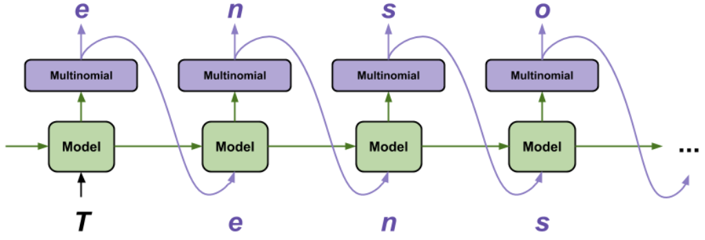

# 使用 RNN 生成文本

- [使用 RNN 生成文本](#使用-rnn-生成文本)
  - [1. 简介](#1-简介)
  - [2. 初始设置](#2-初始设置)
    - [2.1 导入包](#21-导入包)
    - [2.2 下载数据集](#22-下载数据集)
    - [2.3 读取数据](#23-读取数据)
  - [3. 处理文本](#3-处理文本)
    - [3.1 向量化文本](#31-向量化文本)
    - [3.2 预测任务](#32-预测任务)
    - [3.3 创建训练样本和目标值](#33-创建训练样本和目标值)
    - [3.4 创建训练批次](#34-创建训练批次)
  - [4. 构建模型](#4-构建模型)
  - [5. 试用模型](#5-试用模型)
  - [6. 训练模型](#6-训练模型)
    - [6.1 设置 optimizer 和 loss function](#61-设置-optimizer-和-loss-function)
    - [6.2 设置 checkpoints](#62-设置-checkpoints)
    - [6.3 开始训练](#63-开始训练)
  - [7. 生成文本](#7-生成文本)
  - [8. 导出生成器](#8-导出生成器)
  - [9. 高级：自定义训练](#9-高级自定义训练)
  - [10. 参考](#10-参考)

Last updated: 2022-07-20, 17:21
@author Jiawei Mao
****

## 1. 简介

下面演示使用基于字符的 RNN 生成文本。使用 Andrej Karpathy 的博客 [The Unreasonable Effectiveness of Recurrent Neural Networks](http://karpathy.github.io/2015/05/21/rnn-effectiveness/) 中使用的 Shakespeare 的一篇文章作为数据集。给定该数据（"Shakespear"）的一个字符序列，训练模型预测序列中的下一个字符（"e"）。反复调用模型就能生成较长的文本序列。

下面使用 `tf.keras` 实现模型，以下文本是模型训练 30 个 epochs 后使用提示 "Q" 开始获得的输出：

```txt
QUEENE:
I had thought thou hadst a Roman; for the oracle,
Thus by All bids the man against the word,
Which are so weak of care, by old care done;
Your children were in your holy love,
And the precipitation through the bleeding throne.

BISHOP OF ELY:
Marry, and will, my lord, to weep in such a one were prettiest;
Yet now I was adopted heir
Of the world's lamentable day,
To watch the next way with his father with his face?

ESCALUS:
The cause why then we are all resolved more sons.

VOLUMNIA:
O, no, no, no, no, no, no, no, no, no, no, no, no, no, no, no, no, no, no, no, no, it is no sin it should be dead,
And love and pale as any will to that word.

QUEEN ELIZABETH:
But how long have I heard the soul for this world,
And show his hands of life be proved to stand.

PETRUCHIO:
I say he look'd on, if I must be content
To stay him from the fatal of our country's bliss.
His lordship pluck'd from this sentence then for prey,
And then let us twain, being the moon,
were she such a case as fills m
```

上面生成的文本，虽然有些句子语法正确，但是大多数没有意义，即模型没有学习到单词的含义，但是考虑到：

- 模型是基于字符的。模型并不知道如何拼写英文单词，甚至不知道这些单词是文本的基本组成；
- 训练数据集批量较小（每个 100 字符）。

## 2. 初始设置

### 2.1 导入包

```python
import tensorflow as tf

import numpy as np
import os
import time
```

### 2.2 下载数据集

```python
path_to_file = tf.keras.utils.get_file('shakespeare.txt', 
    'https://storage.googleapis.com/download.tensorflow.org/data/shakespeare.txt')
```

```txt
Downloading data from https://storage.googleapis.com/download.tensorflow.org/data/shakespeare.txt
1122304/1115394 [==============================] - 0s 0us/step
1130496/1115394 [==============================] - 0s 0us/step
```

### 2.3 读取数据

首先查看文本：

```python
# Read, then decode for py2 compat.
text = open(path_to_file, 'rb').read().decode(encoding='utf-8')
# 字符数
print(f'Length of text: {len(text)} characters')
```

```txt
Length of text: 1115394 characters
```

查看文本的前 250 个字符：

```python
print(text[:250])
```

```txt
First Citizen:
Before we proceed any further, hear me speak.

All:
Speak, speak.

First Citizen:
You are all resolved rather to die than to famish?

All:
Resolved. resolved.

First Citizen:
First, you know Caius Marcius is chief enemy to the people.
```

文件中字符种类数：

```python
vocab = sorted(set(text))
print(f'{len(vocab)} unique characters')
```

```txt
65 unique characters
```

## 3. 处理文本

### 3.1 向量化文本

在训练前需要将文本转换为数字表示。使用 `tf.keras.layers.StringLookup` 将字符转换为数字 ID。

先将文本拆分为 tokens：

```python
example_texts = ['abcdefg', 'xyz']

chars = tf.strings.unicode_split(example_texts, input_encoding='UTF-8')
chars
```

```txt
<tf.RaggedTensor [[b'a', b'b', b'c', b'd', b'e', b'f', b'g'], [b'x', b'y', b'z']]>
```

然后创建 `tf.keras.layers.StringLookup`：

```python
ids_from_chars = tf.keras.layers.StringLookup(
    vocabulary=list(vocab), mask_token=None)
```

该 layer 负责将 tokens 转换为数字 ID：

```python
ids = ids_from_chars(chars)
ids
```

```txt
<tf.RaggedTensor [[40, 41, 42, 43, 44, 45, 46], [63, 64, 65]]>
```

由于本教程构建模型的目的是生成文本，因此还需要将数字 ID 转换为字符的逆操作。此时可以使用 `tf.keras.layers.StringLookup(..., invert=True)`。

为了保证两个 `StringLookup` 具有相同的词汇表，下面使用 `get_vocabulary()` 获得上面的词汇表：

```python
chars_from_ids = tf.keras.layers.StringLookup(
    vocabulary=ids_from_chars.get_vocabulary(), invert=True, mask_token=None)
```

该 layer 将数字 ID 转换为字符，返回字符类型的 `tf.RaggedTensor`：

```python
chars = chars_from_ids(ids)
chars
```

```txt
<tf.RaggedTensor [[b'a', b'b', b'c', b'd', b'e', b'f', b'g'], [b'x', b'y', b'z']]>
```

用 `tf.strings.reduce_join` 将字符连接为字符串：

```python
tf.strings.reduce_join(chars, axis=-1).numpy()
```

```txt
array([b'abcdefg', b'xyz'], dtype=object)
```

```python
def text_from_ids(ids):
  return tf.strings.reduce_join(chars_from_ids(ids), axis=-1)
```

### 3.2 预测任务

给定一个字符或一串字符，下一个最可能的字符是什么？这就是模型所需执行的任务。该模型的输入是一个字符序列，需要训练该模型来预测下一个时间步的字符是什么。

由于 RNN 维护了一个内部状态，该状态依赖于先前看到的元素，给定当前看到的所有字符，预测下一个字符。

### 3.3 创建训练样本和目标值

下面将文本拆分为样本序列。每个输入序列包含来自文本的 `seq_length` 个字符。

对每个输入序列，对应的目标包含相同长度的文本，只是向右移了一个字符。假设 `seq_length` 为 4，文本为 "Hello"。则输入为 "Hell"，目标序列为 "ello"。

为此，首先使用 `tf.data.Dataset.from_tensor_slices` 函数将文本向量转换为字符索引流。

```python
all_ids = ids_from_chars(tf.strings.unicode_split(text, 'UTF-8'))
all_ids
```

```txt
<tf.Tensor: shape=(1115394,), dtype=int64, numpy=array([19, 48, 57, ..., 46,  9,  1])>
```

```python
ids_dataset = tf.data.Dataset.from_tensor_slices(all_ids)
```

```python
for ids in ids_dataset.take(10):
    print(chars_from_ids(ids).numpy().decode('utf-8'))
```

```txt
F
i
r
s
t
 
C
i
t
i
```

```python
seq_length = 100
```

使用 `batch` 方法可以轻松将这些单个字符转换为指定长度的序列：

```python
sequences = ids_dataset.batch(seq_length + 1, drop_remainder=True)

for seq in sequences.take(1):
    print(chars_from_ids(seq))
```

```txt
tf.Tensor(
[b'F' b'i' b'r' b's' b't' b' ' b'C' b'i' b't' b'i' b'z' b'e' b'n' b':'
 b'\n' b'B' b'e' b'f' b'o' b'r' b'e' b' ' b'w' b'e' b' ' b'p' b'r' b'o'
 b'c' b'e' b'e' b'd' b' ' b'a' b'n' b'y' b' ' b'f' b'u' b'r' b't' b'h'
 b'e' b'r' b',' b' ' b'h' b'e' b'a' b'r' b' ' b'm' b'e' b' ' b's' b'p'
 b'e' b'a' b'k' b'.' b'\n' b'\n' b'A' b'l' b'l' b':' b'\n' b'S' b'p' b'e'
 b'a' b'k' b',' b' ' b's' b'p' b'e' b'a' b'k' b'.' b'\n' b'\n' b'F' b'i'
 b'r' b's' b't' b' ' b'C' b'i' b't' b'i' b'z' b'e' b'n' b':' b'\n' b'Y'
 b'o' b'u' b' '], shape=(101,), dtype=string)
```

将上面的 tokens 连接成字符串，更容易看出效果：

```python
for seq in sequences.take(5):
    print(text_from_ids(seq).numpy())
```

```txt
b'First Citizen:\nBefore we proceed any further, hear me speak.\n\nAll:\nSpeak, speak.\n\nFirst Citizen:\nYou '
b'are all resolved rather to die than to famish?\n\nAll:\nResolved. resolved.\n\nFirst Citizen:\nFirst, you k'
b"now Caius Marcius is chief enemy to the people.\n\nAll:\nWe know't, we know't.\n\nFirst Citizen:\nLet us ki"
b"ll him, and we'll have corn at our own price.\nIs't a verdict?\n\nAll:\nNo more talking on't; let it be d"
b'one: away, away!\n\nSecond Citizen:\nOne word, good citizens.\n\nFirst Citizen:\nWe are accounted poor citi'
```

为了训练，需要生成 `(input, label)` 形式的成对数据，`input` 和 `label` 都是序列。在每个时间步，输入是当前字符，输出 label 是下一个字符。

下面的函数，将输入序列复制并移动 1 位，从而将每个时间步的输入和 label 对齐：

```python
def split_input_target(sequence):
    input_text = sequence[:-1]
    target_text = sequence[1:]
    return input_text, target_text
```

```python
split_input_target(list("Tensorflow"))
```

```txt
(['T', 'e', 'n', 's', 'o', 'r', 'f', 'l', 'o'],
 ['e', 'n', 's', 'o', 'r', 'f', 'l', 'o', 'w'])
```

```python
dataset = sequences.map(split_input_target)
```

```python
for input_example, target_example in dataset.take(1):
    print("Input :", text_from_ids(input_example).numpy())
    print("Target:", text_from_ids(target_example).numpy())
```

```txt
Input : b'First Citizen:\nBefore we proceed any further, hear me speak.\n\nAll:\nSpeak, speak.\n\nFirst Citizen:\nYou'
Target: b'irst Citizen:\nBefore we proceed any further, hear me speak.\n\nAll:\nSpeak, speak.\n\nFirst Citizen:\nYou '
```

### 3.4 创建训练批次

上面已使用 `tf.data` 将文本拆分为序列集合。将数据输入模型之前，还需要将数据打乱，并打包成 batches。

```python
BATCH_SIZE = 64

# Buffer size to shuffle the dataset
# (TF data 设计为处理无限序列的可能
# 因此不会在内存中打乱整个序列，而是维护一个缓冲区，在其中对元素进行洗牌
BUFFER_SIZE = 10000

dataset = (
    dataset
    .shuffle(BUFFER_SIZE)
    .batch(BATCH_SIZE, drop_remainder=True)
    .prefetch(tf.data.experimental.AUTOTUNE))

dataset
```

```txt
<PrefetchDataset element_spec=(TensorSpec(shape=(64, 100), dtype=tf.int64, name=None), TensorSpec(shape=(64, 100), dtype=tf.int64, name=None))>
```

## 4. 构建模型

下面通过扩展 `keras.Model` 类定义模型。

该模型包含三层：

- `tf.keras.layers.Embedding`：输入层。可训练的查找表，用于将字符 ID 映射到维度为 `embedding_dim` 的向量；
- `tf.keras.layers.GRU`：一种 RNN，大小为 `units=rnn_units`，这里也可以使用 LSTM。
- `tf.keras.layers.Dense`：输出层，大小为 `vocab_size`。它为词汇表的每个字符输出一个 logit。

```python
# 以字符表示的词汇表长度
vocab_size = len(vocab)

# 嵌入维度
embedding_dim = 256

# RNN 单元数
rnn_units = 1024
```

```python
class MyModel(tf.keras.Model):
    def __init__(self, vocab_size, embedding_dim, rnn_units):
        super().__init__(self)
        self.embedding = tf.keras.layers.Embedding(vocab_size, embedding_dim)
        self.gru = tf.keras.layers.GRU(rnn_units,
                                       return_sequences=True,
                                       return_state=True)
        self.dense = tf.keras.layers.Dense(vocab_size)

    def call(self, inputs, states=None, return_state=False, training=False):
        x = inputs
        x = self.embedding(x, training=training)
        if states is None:
            states = self.gru.get_initial_state(x)
        x, states = self.gru(x, initial_state=states, training=training)
        x = self.dense(x, training=training)

        if return_state:
            return x, states
        else:
            return x
```

```python
model = MyModel(
    vocab_size=vocab_size,
    embedding_dim=embedding_dim,
    rnn_units=rnn_units)
```

对每个字符，模型查找嵌入，将嵌入输入 GRU 运行一个时间步，再输入 Dense 层生成 logits 来预测下一个字符：


> 😊:这里也可以使用 `keras.Sequential` 模型。为了稍后能生成文本，需要管理 RNN 内部状态。提前包含状态的输入和输出选项比稍后重整模型要简单得多。

## 5. 试用模型

运行模型，看看它的行为是否符合预期。

首先检查输出 shape：

```python
for input_example_batch, target_example_batch in dataset.take(1):
    example_batch_predictions = model(input_example_batch)
    print(example_batch_predictions.shape, "# (batch_size, sequence_length, vocab_size)")
```

```txt
(64, 100, 66) # (batch_size, sequence_length, vocab_size)
```

在上例中，输出序列长度为 100，但模型可以处理任意长度的输入：

```python
model.summary()
```

```txt
Model: "my_model"
_________________________________________________________________
 Layer (type)                Output Shape              Param #   
=================================================================
 embedding (Embedding)       multiple                  16896     
                                                                 
 gru (GRU)                   multiple                  3938304   
                                                                 
 dense (Dense)               multiple                  67650     
                                                                 
=================================================================
Total params: 4,022,850
Trainable params: 4,022,850
Non-trainable params: 0
_________________________________________________________________
```

为了从模型获得实际的预测值，需要从输出分布中采样，以获得实际字符索引。该分布由在词汇表上的 logit 定义。

> 从输出分布中取样很重要，因为直接用 argmax 取值很容易使模型陷入循环。

试一下这批数据的第一个样本：

```python
sampled_indices = tf.random.categorical(example_batch_predictions[0], num_samples=1)
sampled_indices = tf.squeeze(sampled_indices, axis=-1).numpy()
```

在每个时间步提供了下一个字符的预测索引值：

```python
sampled_indices
```

```txt
array([29, 23, 11, 14, 42, 27, 56, 29, 14,  6,  9, 65, 22, 15, 34, 64, 44,
       41, 11, 51, 10, 44, 42, 56, 13, 50,  1, 33, 45, 23, 28, 43, 12, 62,
       45, 60, 43, 62, 38, 19, 50, 35, 19, 14, 60, 56, 10, 64, 39, 56,  2,
       51, 63, 42, 39, 64, 43, 20, 20, 17, 40, 15, 52, 46,  7, 25, 34, 43,
       11, 11, 31, 34, 38, 44, 22, 49, 23,  4, 27,  0, 31, 39,  5,  9, 43,
       58, 33, 30, 49,  6, 63,  5, 50,  4,  6, 14, 62,  3,  7, 35])
```

解码，查看这个未经训练的模型预测的文本：

```python
print("Input:\n", text_from_ids(input_example_batch[0]).numpy())
print()
print("Next Char Predictions:\n", text_from_ids(sampled_indices).numpy())
```

```txt
Input:
 b" us,\nAnd tell 's a tale.\n\nMAMILLIUS:\nMerry or sad shall't be?\n\nHERMIONE:\nAs merry as you will.\n\nMAMI"

Next Char Predictions:
 b"qqsMO[UNK]DDuL!zsSVw:'Gl3KSybJ,;?Z[UNK]TbGF\nMV NvYpUDNLO,lOmm3Sqrpqm?CpDEn[UNK]au[UNK]k,uP?3Fv\nHYfvssTkU'qJqxv[UNK]f'Uvj"
```

## 6. 训练模型

此时，要解决的问题可以视为一个标准的分类问题。给定前面的 RNN 状态和当前时间步的输入，预测下一个字符的类别。

### 6.1 设置 optimizer 和 loss function

标准 `tf.keras.losses.sparse_categorical_crossentropy` 损失函数适合该情况，它应用于预测的最后一个维度。

由于模型返回 logit，所以要添加 `from_logits` 标签：

```python
loss = tf.losses.SparseCategoricalCrossentropy(from_logits=True)
```

```python
example_batch_mean_loss = loss(target_example_batch, example_batch_predictions)
print("Prediction shape: ", example_batch_predictions.shape, " # (batch_size, sequence_length, vocab_size)")
print("Mean loss:        ", example_batch_mean_loss)
```

```txt
Prediction shape:  (64, 100, 66)  # (batch_size, sequence_length, vocab_size)
Mean loss:         tf.Tensor(4.1895466, shape=(), dtype=float32)
```

刚初始化的模型输出 logit 接近随机分布。为了证实这一点，可以检查平均损失的指数应该接近词汇表的大小。更高的损失均值意味着模型确定其答案是错误的，说明没初始化好：

```python
tf.exp(example_batch_mean_loss).numpy()
```

```txt
65.99286
```

使用 `tf.keras.Model.compile` 配置训练参数。使用 `tf.keras.optimizers.Adam` 和上面的损失函数：

```python
model.compile(optimizer='adam', loss=loss)
```

### 6.2 设置 checkpoints

使用 `tf.keras.callbacks.ModelCheckpoint` 在训练期间保存检查点：

```python
# checkpoints 保存目录
checkpoint_dir = './training_checkpoints'
# checkpoint 文件名
checkpoint_prefix = os.path.join(checkpoint_dir, "ckpt_{epoch}")

checkpoint_callback = tf.keras.callbacks.ModelCheckpoint(
    filepath=checkpoint_prefix,
    save_weights_only=True)
```

### 6.3 开始训练

为了能在较短的时间训练完，这里只使用 10 个 epochs。

```python
EPOCHS = 20
```

```python
history = model.fit(dataset, epochs=EPOCHS, callbacks=[checkpoint_callback])
```

```txt
Epoch 1/20
172/172 [==============================] - 11s 49ms/step - loss: 2.7276
Epoch 2/20
172/172 [==============================] - 9s 49ms/step - loss: 1.9853
Epoch 3/20
172/172 [==============================] - 9s 49ms/step - loss: 1.7084
Epoch 4/20
172/172 [==============================] - 9s 49ms/step - loss: 1.5496
Epoch 5/20
172/172 [==============================] - 9s 49ms/step - loss: 1.4513
Epoch 6/20
172/172 [==============================] - 9s 50ms/step - loss: 1.3830
Epoch 7/20
172/172 [==============================] - 9s 50ms/step - loss: 1.3311
Epoch 8/20
172/172 [==============================] - 9s 50ms/step - loss: 1.2864
Epoch 9/20
172/172 [==============================] - 9s 50ms/step - loss: 1.2466
Epoch 10/20
172/172 [==============================] - 9s 50ms/step - loss: 1.2074
Epoch 11/20
172/172 [==============================] - 9s 50ms/step - loss: 1.1679
Epoch 12/20
172/172 [==============================] - 9s 50ms/step - loss: 1.1264
Epoch 13/20
172/172 [==============================] - 9s 51ms/step - loss: 1.0839
Epoch 14/20
172/172 [==============================] - 9s 51ms/step - loss: 1.0383
Epoch 15/20
172/172 [==============================] - 9s 51ms/step - loss: 0.9894
Epoch 16/20
172/172 [==============================] - 9s 50ms/step - loss: 0.9389
Epoch 17/20
172/172 [==============================] - 9s 51ms/step - loss: 0.8877
Epoch 18/20
172/172 [==============================] - 9s 51ms/step - loss: 0.8347
Epoch 19/20
172/172 [==============================] - 10s 51ms/step - loss: 0.7840
Epoch 20/20
172/172 [==============================] - 9s 51ms/step - loss: 0.7356
```

## 7. 生成文本

使用该模型生成文本的最简单方法是在循环中运行，并在执行时跟踪模型内部状态。



每次调用模型，传入一个文本和内部状态，模型返回下一个字符的预测及新状态，将预测和状态传回模型继续生成文本。

以下是单步预测：

```python
class OneStep(tf.keras.Model):
    def __init__(self, model, chars_from_ids, ids_from_chars, temperature=1.0):
        super().__init__()
        self.temperature = temperature
        self.model = model
        self.chars_from_ids = chars_from_ids
        self.ids_from_chars = ids_from_chars

        # Create a mask to prevent "[UNK]" from being generated.
        skip_ids = self.ids_from_chars(['[UNK]'])[:, None]
        sparse_mask = tf.SparseTensor(
            # Put a -inf at each bad index.
            values=[-float('inf')] * len(skip_ids),
            indices=skip_ids,
            # Match the shape to the vocabulary
            dense_shape=[len(ids_from_chars.get_vocabulary())])
        self.prediction_mask = tf.sparse.to_dense(sparse_mask)

    @tf.function
    def generate_one_step(self, inputs, states=None):
        # Convert strings to token IDs.
        input_chars = tf.strings.unicode_split(inputs, 'UTF-8')
        input_ids = self.ids_from_chars(input_chars).to_tensor()

        # Run the model.
        # predicted_logits.shape is [batch, char, next_char_logits]
        predicted_logits, states = self.model(inputs=input_ids, states=states,
                                              return_state=True)
        # Only use the last prediction.
        predicted_logits = predicted_logits[:, -1, :]
        predicted_logits = predicted_logits / self.temperature
        # Apply the prediction mask: prevent "[UNK]" from being generated.
        predicted_logits = predicted_logits + self.prediction_mask

        # Sample the output logits to generate token IDs.
        predicted_ids = tf.random.categorical(predicted_logits, num_samples=1)
        predicted_ids = tf.squeeze(predicted_ids, axis=-1)

        # Convert from token ids to characters
        predicted_chars = self.chars_from_ids(predicted_ids)

        # Return the characters and model state.
        return predicted_chars, states
```

```python
one_step_model = OneStep(model, chars_from_ids, ids_from_chars)
```

在循环中运行以生成文本，查看生成的文本，可以看到模型直到何时大写、生成段落以及模仿莎士比亚式的写作词汇。由于训练的 epochs 较少，它还没学会形成连贯的句子：

```python
start = time.time()
states = None
next_char = tf.constant(['ROMEO:'])
result = [next_char]

for n in range(1000):
    next_char, states = one_step_model.generate_one_step(next_char, states=states)
    result.append(next_char)

result = tf.strings.join(result)
end = time.time()
print(result[0].numpy().decode('utf-8'), '\n\n' + '_' * 80)
print('\nRun time:', end - start)
```

```txt
ROMEO:
Let's to Clarence! a cotcher,
Ne'er through your youth'd sweet use yept.

GREGORY:
I hold thee coward: Grumio, perisome,
This small sheque have water'd indeed is danger, and I
do erjat for thee to behold this sport
hainston in himself, as thou art day too doers it,
Should yet with such sweet give I stray; let's stay to lay
The angly cowds for maids, some liberty.

TYBALT:
Peace, sir! 'I, sir.

GRUMIO:
Why, she's done with him!

First Lord:
Peace! come, weakness comes to your walls,
Ruch news be possessing now with two hours;
Whiles, noble lord of fortune enemies
Will some old coke in spite with me.
An officer of it, an oyself not tears:
O, what myseet pleasure we hence as if
He whom by deed is dead; and then, O grieves me
swear for grieving
And laments that Marcius shall
Your knees are coming into A fun
tremble and talk of faults upon his stoney?
Ancogio, wine, within their helses of thy gross
Are more behilled him to come;
For who is careful note?

LUCIO:
Let's be gone. King Richard  

________________________________________________________________________________

Run time: 3.747878074645996
```

改善输出的最简单方法是延长训练时间，如 `EPOCHS=30`。

可以尝试使用其它的字符串开始启动，尝试再添加一层 RNN 以提高模型的准确性，或者调整 temperature 参数以生成更多或更少的随机预测。

如果希望模型更快地生成文本，最简单的方法是批量生成文本。下面使用相同的参数，但一次生成 5 个输出：

```python
start = time.time()
states = None
next_char = tf.constant(['ROMEO:', 'ROMEO:', 'ROMEO:', 'ROMEO:', 'ROMEO:'])
result = [next_char]

for n in range(1000):
    next_char, states = one_step_model.generate_one_step(next_char, states=states)
    result.append(next_char)

result = tf.strings.join(result)
end = time.time()
print(result, '\n\n' + '_' * 80)
print('\nRun time:', end - start)
```

```txt
tf.Tensor(
[b"ROMEO:\nNoble Scopeon.\n\nDUKE VINCENTIO:\nLong levy me, let them go.\n\nFirst Servingman:\nLet it be full as little load,\nAnd neither violence carried him ripest,\nThat woe down their swelling griefs:\nWho is't that strewbsh! very welcome to yee,\nMy death is mute on seek.\n\nAUFIDIUS:\nGo in the command.\n\nLADY ANNE:\nNo, not a young modning: girls our company\nTo move my scope with no less acreher with'd;\nWith maids shore branght there delights,\nOr, if thou canst up dwicks.\n\nFirst Son:\nIf I may believe you are gone to Friar Paul,\nTo come to 't. But you are well for Kate no quarrel.\n\nGLOUCESTER:\nI pity, I will make him where alack. I had.\n\nCOMINIUS:\nThese babes article that are equalty comfort?\nWith you a hugh a caitiff wretched purpose,\nwhoring colour with the hour It and\nYour bound upon his. Are you all your son,\nTo see it in your promise. What is't,\nOr lest not that Enward his deliver's blood,\nTo see your minds shall free there.\n\nBUCKINGHAM:\nThou hast that playen you with said Some-back graze;\nA cartag"
 b"ROMEO:\nYea.\n\nLord:\nHence, o' the maiding: our voices I have disclamed.\nNow, my Lord Hadwing Romeo not any thing?\nTherefore depart,\nWho is as charital voice, encommanders,\nAnd make my prison recompense by the world\nYou make the case more voices. This life England,\nToo due eyes to his bastarding. Dir himself\nWhich ever soon means, to make the people,\nBut with upon her joins of life\nAs thou do meet the senate have done,\nRather than we shall have heards' loss that news.\n\nPRISCESET:\nFrom your night!\nFor you, my lord, shall I new an evil,\nI am the stary of 'em!'\nAnd, knowing I maintained with him? You\ncan, till help the more change plucks his heed of fated,\nAn old man great man to assemble,\nThat I do die in badding them;\nYet hener my father, might with saintly all.\n\nPETRUCHIO:\nVery well;\nIndeed, my lord, will go wake this intender\nAs please to empty horse; my soul's love confound agat\nEnforce your good presence strike it to\nCoven'd with the stroke of wall, to diving thou\nArt tullers'd, and give yo"
 b"ROMEO:\nO, 'tis an imploshery; but I, were I\nA second palace a city curged\nIn honour foes! Our prince!\n\nMessenger:\nApollo's pared,s--hou canst give her thorn!\nThe odds repeal the one should teld thee here.\n\nOfficer:\n\nHASTINGS:\nBut my father, Madian and lo, nor night.\nTell Veran Padia affold to him.\n\nKING EDWARD IV:\nClarence's son,\nGood Kate; near to this king?\n\nAUTOLYCUS:\nA so on hid enforce of that are go.\n\nHENRY BOLINGBROKE:\nHow long continue cannot abide it\nTo lay the completion of alms, and lawful bragging\nUnder your bearing with yours. Now look'd parting lay\non thee to using mile home; where no waits in France,\nWhereto please this hard haply may not, sweit dight in Rome.\nThou wast'st over-one forth haste my mind it sweat;\nAnd after men, if you were\na broken faith, being so; still well?\n\nDUKE VINCENTIO:\nYou speak how you coward! O doing od them?\n\nRUTLAND:\nO Dakenes, I do lose thy heir;\nThere is a sort corrupted with Lady, late of me,\nAnd in but were impruments like the room:\nYea, like Her"
 b"ROMEO:\nWhat is the matter?\n\nMENENIUS:\nYou charge you, and for them up.\n\nDUKE VINCENTIO:\nNay, then 'pood the world.\n\nAUFIDIUS:\nOnly pluck to your woo-bad--\nThose children I assued the rogue of my curse!\nWhat! what an Edward's,\nHer and York, then to you and his heir\nAs else to Ravels and seen to become, let it good;\nMore periloveth he did see she with him;\nWhose deadly shadow eyes did need to heavy;\nMerry when deputy else this sport to door; as cut\nAs chaster thinks it, Pompey; cambish, to behold him\nHe'll have said you all so soonest.\n\nROMEO:\nI am thou art not only for a necessary\nbends thee where to bump with pumple to our hold\nNay drew; that which you have discredited: me\nMonercusey and his nest down tradish of a\nbutcheriest wave, i' faith from hence;\nCan this bright land-washey's highness to accomplish,\nOur person: let my complot in Warwick?\nHenceforward, hist, and proceedings be afforts;\nYour spite, that, in that same biligence,\nWill win my wager better vessel, when\nYou have pass'd here i"
 b"ROMEO:\nYet give thee more, mistrust, and cannot speak?\n\nMENENIUS:\nPeace, peace!\nHere is a curse that for some hour i' the sanctuful day,\nThat mortal heir with solessing trice:\nThrough in lite already, yet here it present\nThy beauty, then to Burgundy things that see\nOut of his state, what come from thee most ingent,\nCan cleard my father come from her, all this land and the rest,\nFor the angland shapes with sels abody to death,\nEngland in the devils, thought to behold\nhis even.\n\nNurse:\nMendenly, my might bears me to my truth,\nWhich made thy birth a ten, alike,\nPersuit us not this Romeo will do't?\n\nMENENIUS:\nThey are glad was Scanfait befancish;\nThere is a slave; and let him approve her instruct her.\n\nYURL CISTER:\nHe says she's marriage.\n\nANGELO:\nWhen we are graced me in my chopen of\none skill's new the rest o'er by his house.\nHere come your honour, will I make with still stim.\n\nPost:\nHe may at Laurence' dead time, Richard, how they know\nThat's no bitter cloud reverend roof-boon.\n\nLADY GREY:\nWh"], shape=(5,), dtype=string) 

________________________________________________________________________________

Run time: 3.880802869796753
```

## 8. 导出生成器

保存上面的单步模型，从而在其它地方使用：

```python
tf.saved_model.save(one_step_model, 'one_step')
one_step_reloaded = tf.saved_model.load('one_step')
```

```txt
WARNING:tensorflow:Skipping full serialization of Keras layer <__main__.OneStep object at 0x0000018BE322ACD0>, because it is not built.
WARNING:absl:Found untraced functions such as gru_cell_layer_call_fn, gru_cell_layer_call_and_return_conditional_losses while saving (showing 2 of 2). These functions will not be directly callable after loading.
INFO:tensorflow:Assets written to: one_step\assets
INFO:tensorflow:Assets written to: one_step\assets
```

```python
states = None
next_char = tf.constant(['ROMEO:'])
result = [next_char]

for n in range(100):
    next_char, states = one_step_reloaded.generate_one_step(next_char, states=states)
    result.append(next_char)

print(tf.strings.join(result)[0].numpy().decode("utf-8"))
```

```txt
ROMEO:
Why, what were you fie?

ROMEO:
Stay, no less
Than what is dasging with the secret negls
give my as
```

## 9. 高级：自定义训练

上面的训练过程很简单，但是自定义性较差。它使用 teacher-forcing 阻止错误预测反馈给模型，所以模型无法学会从错误中恢复。

现在已经知道如何手动运行模型，接下来实现训练循环。

自定义训练循环最重要的是训练步长函数。

使用 `tf.GradientTape` 记录梯度。基本步骤：

1. 在 `tf.GradientTape` 下执行模型并计算损失
2. 使用优化器计算并更新模型

```python
class CustomTraining(MyModel):
    @tf.function
    def train_step(self, inputs):
        inputs, labels = inputs
        with tf.GradientTape() as tape:
            predictions = self(inputs, training=True)
            loss = self.loss(labels, predictions)
        grads = tape.gradient(loss, model.trainable_variables)
        self.optimizer.apply_gradients(zip(grads, model.trainable_variables))

        return {'loss': loss}
```

上面遵循 Keras 的 `train_step` 管理实现 `train_step` 方法。这是可选的，但是实现它可以修改训练步骤，依然使用 keras 的 `Model.compile` 和 `Model.fit` 方法。

```python
model = CustomTraining(
    vocab_size=len(ids_from_chars.get_vocabulary()),
    embedding_dim=embedding_dim,
    rnn_units=rnn_units)
```

```python
model.compile(optimizer=tf.keras.optimizers.Adam(),
              loss=tf.keras.losses.SparseCategoricalCrossentropy(from_logits=True))
```

```python
model.fit(dataset, epochs=1)
```

```txt
172/172 [==============================] - 12s 49ms/step - loss: 2.7215
<keras.callbacks.History at 0x18c1e711a30>
```

如果需要更多的控制，还可以自己编写完整的训练循环：

```python
EPOCHS = 10

mean = tf.metrics.Mean()

for epoch in range(EPOCHS):
    start = time.time()

    mean.reset_states()
    for (batch_n, (inp, target)) in enumerate(dataset):
        logs = model.train_step([inp, target])
        mean.update_state(logs['loss'])

        if batch_n % 50 == 0:
            template = f"Epoch {epoch + 1} Batch {batch_n} Loss {logs['loss']:.4f}"
            print(template)

    # saving (checkpoint) the model every 5 epochs
    if (epoch + 1) % 5 == 0:
        model.save_weights(checkpoint_prefix.format(epoch=epoch))

    print()
    print(f'Epoch {epoch + 1} Loss: {mean.result().numpy():.4f}')
    print(f'Time taken for 1 epoch {time.time() - start:.2f} sec')
    print("_" * 80)

model.save_weights(checkpoint_prefix.format(epoch=epoch))
```

```txt
Epoch 1 Batch 0 Loss 2.1871
Epoch 1 Batch 50 Loss 2.0298
Epoch 1 Batch 100 Loss 1.9539
Epoch 1 Batch 150 Loss 1.8652

Epoch 1 Loss: 1.9856
Time taken for 1 epoch 10.03 sec
________________________________________________________________________________
Epoch 2 Batch 0 Loss 1.8214
Epoch 2 Batch 50 Loss 1.7291
Epoch 2 Batch 100 Loss 1.6715
Epoch 2 Batch 150 Loss 1.6228

Epoch 2 Loss: 1.7065
Time taken for 1 epoch 9.01 sec
________________________________________________________________________________
Epoch 3 Batch 0 Loss 1.5961
Epoch 3 Batch 50 Loss 1.5937
Epoch 3 Batch 100 Loss 1.5324
Epoch 3 Batch 150 Loss 1.5287

Epoch 3 Loss: 1.5474
Time taken for 1 epoch 9.00 sec
________________________________________________________________________________
Epoch 4 Batch 0 Loss 1.4994
Epoch 4 Batch 50 Loss 1.4740
Epoch 4 Batch 100 Loss 1.4043
Epoch 4 Batch 150 Loss 1.3923

Epoch 4 Loss: 1.4493
Time taken for 1 epoch 8.99 sec
________________________________________________________________________________
Epoch 5 Batch 0 Loss 1.3709
Epoch 5 Batch 50 Loss 1.3757
Epoch 5 Batch 100 Loss 1.3649
Epoch 5 Batch 150 Loss 1.3584

Epoch 5 Loss: 1.3814
Time taken for 1 epoch 9.24 sec
________________________________________________________________________________
Epoch 6 Batch 0 Loss 1.3096
Epoch 6 Batch 50 Loss 1.3219
Epoch 6 Batch 100 Loss 1.3488
Epoch 6 Batch 150 Loss 1.3284

Epoch 6 Loss: 1.3301
Time taken for 1 epoch 9.14 sec
________________________________________________________________________________
Epoch 7 Batch 0 Loss 1.2754
Epoch 7 Batch 50 Loss 1.3036
Epoch 7 Batch 100 Loss 1.3005
Epoch 7 Batch 150 Loss 1.2610

Epoch 7 Loss: 1.2859
Time taken for 1 epoch 9.14 sec
________________________________________________________________________________
Epoch 8 Batch 0 Loss 1.2182
Epoch 8 Batch 50 Loss 1.2486
Epoch 8 Batch 100 Loss 1.2142
Epoch 8 Batch 150 Loss 1.2231

Epoch 8 Loss: 1.2451
Time taken for 1 epoch 9.11 sec
________________________________________________________________________________
Epoch 9 Batch 0 Loss 1.2097
Epoch 9 Batch 50 Loss 1.1847
Epoch 9 Batch 100 Loss 1.1935
Epoch 9 Batch 150 Loss 1.1912

Epoch 9 Loss: 1.2056
Time taken for 1 epoch 9.15 sec
________________________________________________________________________________
Epoch 10 Batch 0 Loss 1.1643
Epoch 10 Batch 50 Loss 1.1833
Epoch 10 Batch 100 Loss 1.1651
Epoch 10 Batch 150 Loss 1.1732

Epoch 10 Loss: 1.1661
Time taken for 1 epoch 9.29 sec
________________________________________________________________________________
```

## 10. 参考

- https://www.tensorflow.org/text/tutorials/text_generation
