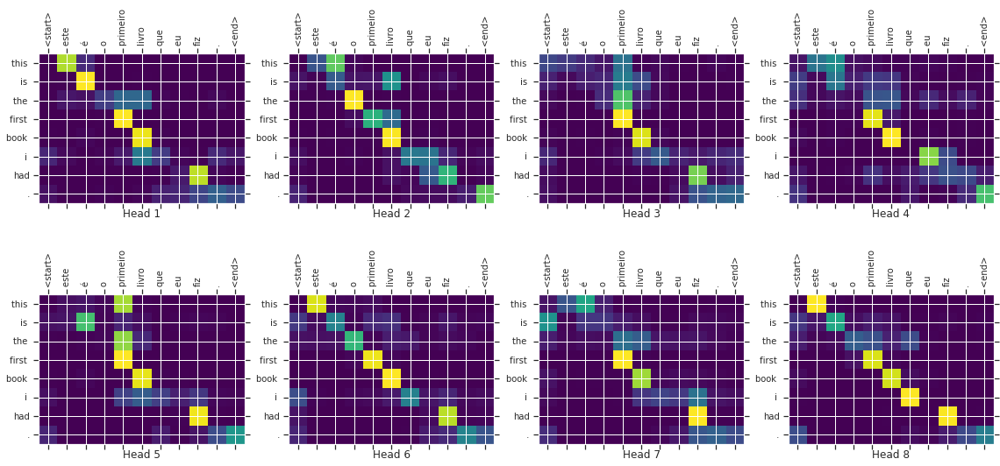

# Transformer

- [Transformer](#transformer)
  - [简介](#简介)
  - [设置](#设置)
  - [下载数据集](#下载数据集)
  - [文本标记化和去标记化](#文本标记化和去标记化)
  - [设置输入管线](#设置输入管线)
  - [位置编码](#位置编码)
  - [Masking](#masking)
  - [Scaled dot product attention](#scaled-dot-product-attention)
  - [参考](#参考)

***

## 简介

本教程训练一个 Transformer 模型，用来翻译[葡萄牙语-英语](https://www.tensorflow.org/datasets/catalog/ted_hrlr_translate#ted_hrlr_translatept_to_en)数据集。演示如何使用 TensorFlow 低级 API 和 Keras 函数从头开始构建 Transformer 模型。如果使用 [tf.keras.layers.MultiHeadAttention](https://www.tensorflow.org/api_docs/python/tf/keras/layers/MultiHeadAttention) 之类的内置 API，则实现起来更简单。

Transformer 模型的核心思想是 self-attention，即关注输入序列不同位置以计算该序列表示（representation）的能力。Transformer 创建 self-attention layers 堆栈，在下面会分布讲解。

Transformer 模型使用 self-attention layers 处理可变大小输入，而不是经典的 RNN 或 CNN。这种通用架构有许多优点：

- 不假设数据之间的时间/空间关系，是处理一组对象的理想选择
- layer 输出可以并行计算，而不像 RNN 的串行计算
- 距离很远的元素可以直接影响彼此的输出，而无需经过许多 RNN 时间步或卷积层，可以参考 [Scene Memory Transformer](https://arxiv.org/pdf/1903.03878.pdf)
- 可以学习远程依赖，这在许多序列任务中都是挑战。

该架构的缺点有：

- 对时间序列，时间步的输出是从整个历史中计算，而不仅仅是输入和当前 hidden-state，这可能比较低效；
- 如果输入确实具有时间/空间关系，如文本，则必须添加位置编码，否则模型只能看到 bag of words

根据本教程训练模型后，能够将葡萄牙语翻译为英语。



## 设置

- 导入包

```python
import logging
import time

import numpy as np
import matplotlib.pyplot as plt

import tensorflow_datasets as tfds
import tensorflow as tf

import tensorflow_text
```

- 设置日志

```python
logging.getLogger("tensorflow").setLevel(logging.ERROR)  # suppress warnings
```

## 下载数据集

使用 Tensorflow dataset 加载来自 [TED 演讲开放翻译项目](https://www.ted.com/participate/translate)的[葡萄牙语-英语](https://github.com/neulab/word-embeddings-for-nmt)翻译数据集。

该数据集包含大约 50000 训练样本，1100 验证样本和 2000 测试样本。

```python
examples, metadata = tfds.load(
    "ted_hrlr_translate/pt_to_en", with_info=True, as_supervised=True
)
train_examples, val_examples = examples["train"], examples["validation"]
```

返回的 `tf.data.Dataset` 包含成对的文本样本：

```python
# 取 3 个样本，查看葡萄牙语和英语
for pt_examples, en_examples in train_examples.batch(3).take(1):
    for pt in pt_examples.numpy():
        print(pt.decode("utf-8"))

    print()

    for en in en_examples.numpy():
        print(en.decode("utf-8"))
```

```txt
e quando melhoramos a procura , tiramos a única vantagem da impressão , que é a serendipidade .
mas e se estes fatores fossem ativos ?
mas eles não tinham a curiosidade de me testar .

and when you improve searchability , you actually take away the one advantage of print , which is serendipity .
but what if it were active ?
but they did n't test for curiosity .
```

## 文本标记化和去标记化

不能直接使用文本训练模型，需要先将文本转换为数字表示。通常先将文本转换为 token ID 序列，然后将 token ID 用作嵌入的输入。

在 [Subword tokenizer 教程](https://www.tensorflow.org/text/guide/subwords_tokenizer) 中演示了一种流行实现：构建针对该数据集优化的 subword tokenizer ([text.BertTokenizer](https://www.tensorflow.org/text/api_docs/python/text/BertTokenizer))，并导出为 [saved_model](https://www.tensorflow.org/guide/saved_model)。

下载、解压并导入 `saved_model`：

```python
model_name = "ted_hrlr_translate_pt_en_converter"
tf.keras.utils.get_file(
    f"{model_name}.zip",
    f"https://storage.googleapis.com/download.tensorflow.org/models/{model_name}.zip",
    cache_dir=".",
    cache_subdir="",
    extract=True,
)
```

```txt
Downloading data from https://storage.googleapis.com/download.tensorflow.org/models/ted_hrlr_translate_pt_en_converter.zip
184801/184801 [==============================] - 0s 0us/step
'.\\ted_hrlr_translate_pt_en_converter.zip'
```

```python
tokenizers = tf.saved_model.load(model_name)
```

这个 `tf.saved_model` 包含两个 text tokenizers，一个用于英语，一个用于葡萄牙语。两个包含相同的方法：

```python
[item for item in dir(tokenizers.en) if not item.startswith("_")]
```

```txt
['detokenize',
 'get_reserved_tokens',
 'get_vocab_path',
 'get_vocab_size',
 'lookup',
 'tokenize',
 'tokenizer',
 'vocab']
```

`tokenize` 方法将字符串 batch 转换为 token IDs 的 padded-batch。该方法在 tokenizing 之前拆分标点符号、转换为小写，并执行 unicode 规范化。因为输入数据已经标准化了，因此这里看不到该标准化过程。

```python
for en in en_examples.numpy():
    print(en.decode("utf-8"))
```

```txt
and when you improve searchability , you actually take away the one advantage of print , which is serendipity .
but what if it were active ?
but they did n't test for curiosity .
```

```python
encoded = tokenizers.en.tokenize(en_examples)

for row in encoded.to_list():
    print(row)
```

```txt
[2, 72, 117, 79, 1259, 1491, 2362, 13, 79, 150, 184, 311, 71, 103, 2308, 74, 2679, 13, 148, 80, 55, 4840, 1434, 2423, 540, 15, 3]
[2, 87, 90, 107, 76, 129, 1852, 30, 3]
[2, 87, 83, 149, 50, 9, 56, 664, 85, 2512, 15, 3]
```

`detokenize` 方法将 token IDs 转换回可读文本：

```python
round_trip = tokenizers.en.detokenize(encoded)
for line in round_trip.numpy():
    print(line.decode("utf-8"))
```

```txt
and when you improve searchability , you actually take away the one advantage of print , which is serendipity .
but what if it were active ?
but they did n ' t test for curiosity .
```

底层的 `lookup` 方法将 token-ID 转换为 token text：

```python
tokens = tokenizers.en.lookup(encoded)
tokens
```

```txt
<tf.RaggedTensor [[b'[START]', b'and', b'when', b'you', b'improve', b'search', b'##ability',
  b',', b'you', b'actually', b'take', b'away', b'the', b'one', b'advantage',
  b'of', b'print', b',', b'which', b'is', b's', b'##ere', b'##nd', b'##ip',
  b'##ity', b'.', b'[END]']                                                 ,
 [b'[START]', b'but', b'what', b'if', b'it', b'were', b'active', b'?',
  b'[END]']                                                           ,
 [b'[START]', b'but', b'they', b'did', b'n', b"'", b't', b'test', b'for',
  b'curiosity', b'.', b'[END]']                                          ]>
```

在这里，可以看到 tokenizer 的 "subword" 的一面。单词 "searchability" 被分解为了 "search ##ability"，单词 "serendipity" 被分解为 "s ##ere ##nd ##ip ##ity"。

现在，花一分钟了解数据集中每个样本的 token 分布：

```python
lengths = []

for pt_examples, en_examples in train_examples.batch(1024):
    pt_tokens = tokenizers.en.tokenize(pt_examples)
    lengths.append(pt_tokens.row_lengths())

    en_tokens = tokenizers.en.tokenize(en_examples)
    lengths.append(en_tokens.row_lengths())
    print(".", end="", flush=True)
```

```txt
...................................................
```

```python
all_lengths = np.concatenate(lengths)

plt.hist(all_lengths, np.linspace(0, 500, 101))
plt.ylim(plt.ylim())
max_length = max(all_lengths)
plt.plot([max_length, max_length], plt.ylim())
plt.title(f"Max tokens per example: {max_length}")
```


```python
MAX_TOKENS = 128
```

## 设置输入管线

先定义一些函数来转换为数据集，为构建训练集的输入管线做准备。

删除比 `MAX_TOKENS` 更长的样本：

```python
def filter_max_tokens(pt, en):
    num_tokens = tf.maximum(tf.shape(pt)[1], tf.shape(en)[1])
    return num_tokens < MAX_TOKENS
```

对原始文本 batch 进行 tokenize 的函数：

```python
def tokenize_pairs(pt, en):
    pt = tokenizers.pt.tokenize(pt)
    # Convert from ragged to dense, padding with zeros.
    pt = pt.to_tensor()

    en = tokenizers.en.tokenize(en)
    # Convert from ragged to dense, padding with zeros.
    en = en.to_tensor()
    return pt, en
```

下面定义一个简单的输入管线，用来处理、shuffle 和 batch 数据：

```python
BUFFER_SIZE = 20000
BATCH_SIZE = 64
```

```python
def make_batches(ds):
    return (
        ds.cache()
        .shuffle(BUFFER_SIZE)
        .batch(BATCH_SIZE)
        .map(tokenize_pairs, num_parallel_calls=tf.data.AUTOTUNE)
        .filter(filter_max_tokens)
        .prefetch(tf.data.AUTOTUNE)
    )


train_batches = make_batches(train_examples)
val_batches = make_batches(val_examples)
```

## 位置编码

attention layer 将其输入视为一组向量，没有顺序。该模型也不包含任何循环层或卷积层。因此添加位置编码，为模型提供句子中 token 的相对位置信息。

位置编码向量添加到嵌入向量。嵌入以 d 维空间表示 token，含义相似的 token 彼此更接近。但是嵌入没有编码句子中 token 的相对位置。因此，在添加位置编码后，在 d 维空间中，句子中含义相似位置相近的 token 挨着更近。

计算位置编码的公式如下：

$$PE_{(pos,2i)}=sin(\frac{pos}{10000^{2i/d_{model}}})$$

$$PE_{(pos,2i+1)}=cos(\frac{pos}{10000^{2i/d_{model}}})$$

```python
def get_angles(pos, i, d_model):
    angle_rates = 1 / np.power(10000, (2 * (i // 2)) / np.float32(d_model))
    return pos * angle_rates
```

```python
def positional_encoding(position, d_model):
    angle_rads = get_angles(
        np.arange(position)[:, np.newaxis], np.arange(d_model)[np.newaxis, :], d_model
    )

    # apply sin to even indices in the array; 2i
    angle_rads[:, 0::2] = np.sin(angle_rads[:, 0::2])

    # apply cos to odd indices in the array; 2i+1
    angle_rads[:, 1::2] = np.cos(angle_rads[:, 1::2])

    pos_encoding = angle_rads[np.newaxis, ...]

    return tf.cast(pos_encoding, dtype=tf.float32)
```

```python
n, d = 2048, 512
pos_encoding = positional_encoding(n, d)
print(pos_encoding.shape)
pos_encoding = pos_encoding[0]

# Juggle the dimensions for the plot
pos_encoding = tf.reshape(pos_encoding, (n, d // 2, 2))
pos_encoding = tf.transpose(pos_encoding, (2, 1, 0))
pos_encoding = tf.reshape(pos_encoding, (d, n))

plt.pcolormesh(pos_encoding, cmap="RdBu")
plt.ylabel("Depth")
plt.xlabel("Position")
plt.colorbar()
plt.show()
```

```txt
(1, 2048, 512)
```


## Masking

屏蔽序列中的所有的 pad tokens，确保模型不会将 padding 作为输入。mask 指示 pad 值 `0` 的位置：为 pad 值的位置输出 `1`，否则输出 `0`。

```python
def create_padding_mask(seq):
    seq = tf.cast(tf.math.equal(seq, 0), tf.float32)

    # add extra dimensions to add the padding
    # to the attention logits.
    return seq[:, tf.newaxis, tf.newaxis, :]  # (batch_size, 1, 1, seq_len)
```

```python
x = tf.constant([[7, 6, 0, 0, 1], [1, 2, 3, 0, 0], [0, 0, 0, 4, 5]])
create_padding_mask(x)
```

```txt
<tf.Tensor: shape=(3, 1, 1, 5), dtype=float32, numpy=
array([[[[0., 0., 1., 1., 0.]]],


       [[[0., 0., 0., 1., 1.]]],


       [[[1., 1., 1., 0., 0.]]]], dtype=float32)>
```

look-ahead mask 用来屏蔽序列中的 future tokens。换句话说，该 mask 指示不应该使用哪些条目。

这意味着，要预测第三个 token，只能使用第一个和第二个 token。类似的，要预测第四个 token，则只能使用第 1，2，3 个 token，以此类推。

```python
def create_look_ahead_mask(size):
    mask = 1 - tf.linalg.band_part(tf.ones((size, size)), -1, 0)
    return mask  # (seq_len, seq_len)
```

```python
x = tf.random.uniform((1, 3))
temp = create_look_ahead_mask(x.shape[1])
temp
```

```txt
<tf.Tensor: shape=(3, 3), dtype=float32, numpy=
array([[0., 1., 1.],
       [0., 0., 1.],
       [0., 0., 0.]], dtype=float32)>
```

> **Note**:该 mask 指示那些条目不参加。然而，Keras 中实现的 `MultiHeadAttention` layer 采用的反向 mask，其中 1 使参加的 token，应忽略 0。如果使用 [tf.keras.layers.MultiHeadAttention](https://www.tensorflow.org/api_docs/python/tf/keras/layers/MultiHeadAttention) 而不是本教程下面实现的 MultiHeadAttention，则使用下面注释掉的方法生成 mask。这里需要安装 **pip install tensorflow-probability** 并导入 **import tensorflow_probability as tfp**。

```python
# def create_look_ahead_mask(size):
#     n = int(size * (size+1) / 2)
#     mask = tfp.math.fill_triangular(tf.ones((n,), dtype=tf.int32), upper=False)
```

## Scaled dot product attention


Transformer 使用的 attention 函数包含三个输入：Q (query), K (key), V (value)。计算 attention 权重的公式：

$$Attention(Q,K,V)=softmax_k(\frac{QK^T}{\sqrt{d_k}})V$$

dot-product attention 使用 depth 的平方根来缩放。这样做是因为对较大的 depth 值，dot product 会变得很大，使 softmax 到较小的梯度，从而难以训练。

例如，假设 `Q` 和 `K` 

## 参考

- https://www.tensorflow.org/text/tutorials/transformer
- https://tensorflow.google.cn/text/tutorials/transformer
