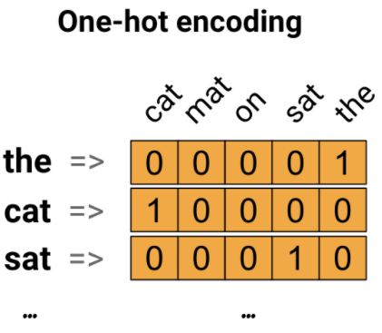

# 词嵌入（word embeddings）

2021-12-29, 17:35
@author Jiawei Mao
***

## 简介

下面介绍词嵌入。包括使用一个简单的 Keras 模型训练自己的词嵌入用于情感分类任务，并在 Embedding Projector 可视化。如下图所示：


## 以数字表示文本

机器学习模型以向量（数组）作为输入。在处理文本时，首先就需要将文本转换为数字。下面我们介绍实现这一目标的三种策略。

### one-hot encodings

首先想到的，可能就是独热编码（one-hot）。考虑如下一句话 "The cat sat on the mat"。这个句子的词汇（vocabulary，即 unique 单词）为 (cat, mat, on, sat, the)。为了表示这些单词，可以创建一个长度等于词汇表的零向量，然后将单词对应的位置设置为 1。如下图所示：



要将句子转换为向量，可以将该句子的所有单词的 one-hot 向量串在一起。

> 要点：one-hot 编码效率很低，one-hot 向量是稀疏的（即一个 1，其它都是 0）。如果词汇表长度为 10,000，那每个单词的 one-hot 编码 99.99% 的值都是 0.

### 每个单词一个编号

第二种方法是对每个单词进行编号，例如，将 1 分配给 "cat"，2 分配给 "mat" 等等。这样就可以将 "The cat sat on the mat" 编码为一个稠密 vector [5, 1, 4, 3, 5, 2]。这个方法比较有效，获得的向量不再是稀疏向量，所有元素都包含值。

然而，这个方法有两个缺点：

- 整数编码是任意的，不能捕获单词之间的关系；
- 对模型来说，整数编码很难获得好模型。例如，一个线性分类器，为每个 feature 学习一个 weight，由于两个单词及它们的编码没有任何相似度可言，这种 feature-weight 的组合没有任何意义。

### Word embeddings

词嵌入（word embeddings）为我们提供了一种使用高效、密集表示单词的方法，在这种表示中，相似的单词具有相似的编码。最重要的是，你不需要手动指定这种编码。嵌入（embedding）是一个浮点数向量，向量的长度是一个可指定参数。Embedding 的值不是手动指定，而是可训练的参数。对小型数据集，词嵌入的尺寸通常只有 8 维，对大型数据集则可以达到 1024 维。高维嵌入可以捕获单词之间的细粒度关系，但需要更多的数据来学习。


上图是一个词嵌入图示。每个单词由一个 4 维浮点数向量表示。嵌入也可以当作查询表，在学习这些权重之后，可以通过查找表中对应的密集向量来对每个单词进行编码。

## 配置

```python
import io
import os
import re
import shutil
import string
import tensorflow as tf

from tensorflow.keras import Sequential
from tensorflow.keras.layers import Dense, Embedding, GlobalAveragePooling1D
from tensorflow.keras.layers import TextVectorization
```

### 下载 IMDb 数据集

下面使用 IMDB 数据集进行演示，使用该数据集训练一个情感分类模型，并在此过程中从头学习词嵌入。对加载数据集的更多信息，可以参考[载入文本教程](../tutorials/load_data/load_text.md)。

使用 Keras 文件工具下载数据集，并查看目录：

```python
url = "https://ai.stanford.edu/~amaas/data/sentiment/aclImdb_v1.tar.gz"
dataset = tf.keras.utils.get_file(
    "aclImdb_v1.tar.gz", url, untar=True, cache_dir=".", cache_subdir=""
)
dataset_dir = os.path.join(os.path.dirname(dataset), 'aclImdb')
os.listdir(dataset_dir)
```

```sh
Downloading data from https://ai.stanford.edu/~amaas/data/sentiment/aclImdb_v1.tar.gz
84131840/84125825 [==============================] - 37s 0us/step
84140032/84125825 [==============================] - 37s 0us/step
['imdb.vocab', 'imdbEr.txt', 'README', 'test', 'train']
```

查看一下 `train/` 目录。该目录包含 `pos` 和 `neg` 子目录，分别包含电影评论的好评和差评。下面将使用者两个文件夹中的评论来训练一个二元分类模型。

```python
train_dir = os.path.join(dataset_dir, 'train')
os.listdir(train_dir)
```

```sh
['labeledBow.feat',
 'neg',
 'pos',
 'unsup',
 'unsupBow.feat',
 'urls_neg.txt',
 'urls_pos.txt',
 'urls_unsup.txt']
```

`train` 目录下还有其他文件夹，在创建训练集前删除 `unsup` 目录：

```python
remove_dir = os.path.join(train_dir, 'unsup')
shutil.rmtree(remove_dir)
```

接下来，使用 `tf.keras.utils.text_dataseet_from_directory` 创建 `tf.data.Dataset`。

使用 `train` 目录创建训练集和验证集，其中 20% 用于验证：

```python
batch_size = 1024
seed = 123
train_ds = tf.keras.utils.text_dataset_from_directory(
    "aclImdb/train",
    batch_size=batch_size,
    validation_split=0.2,
    subset="training",
    seed=seed,
)
val_ds = tf.keras.utils.text_dataset_from_directory(
    "aclImdb/train",
    batch_size=batch_size,
    validation_split=0.2,
    subset="validation",
    seed=seed,
)
```

```sh
Found 25000 files belonging to 2 classes.
Using 20000 files for training.
Found 25000 files belonging to 2 classes.
Using 5000 files for validation.
```


## 参考

- https://www.tensorflow.org/text/guide/word_embeddings
