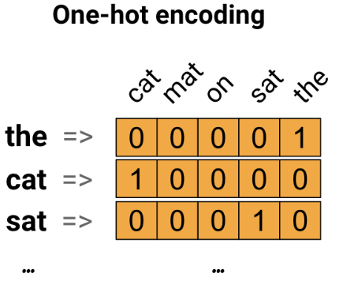

# 词嵌入（word embeddings）

Last updated: 2022-08-09, 13:43
@author Jiawei Mao
******

## 1. 简介

下面介绍词嵌入，使用一个简单的 Keras 模型训练词嵌入用于情感分类任务，并在嵌入投影（Embedding Projector）中可视化嵌入效果。效果如下：


## 2. 用数字表示文本

机器学习模型以数字向量作为输入，因此在处理文本时，首先要将文本转换为数字。下面介绍实现这一目标的三种策略。

### 2.1 独热编码

独热编码（one-hot）是最直观的方法。如句子 "The cat sat on the mat"，其词汇（vocabulary，即 unique 单词）为 (cat, mat, on, sat, the)。创建一个长度与词汇表相同的零向量表示这些单词，然后将单词对应的位置设为 1。如图所示：

<p align="center">
  
</p>

编码好单词，对句子只需将其单词的 one-hot 向量串在一起，就转换成了向量。

> **要点**：one-hot 编码效率低，其编码向量是稀疏的（一个 1，其它都是 0）。如果词汇表长度为 10,000，那每个单词的 one-hot 编码 99.99% 的值都是 0.

### 2.2 一个单词一个数字

第二种方法是给每个单词分配一个数字。对句子 "The cat sat on the mat"，可以将 1 分配给 "cat"，2 分配给 "mat" 等等，然后就可以将其编码为一个密集向量 [5, 1, 4, 3, 5, 2]。该方法比较高效，获得的向量不再稀疏，所有元素非零。

然而，这个方法有两个缺点：

- 整数编码是任意的，不能捕获单词之间的关系；
- 对模型来说，整数编码很难获得好模型。例如，一个线性分类器，为每个特征学习一个权重，但是单词的相似度与它们的编码之间没有任何关系，这种 feature-weight 的组合没有任何意义。

### 2.3 词嵌入

词嵌入（word embeddings）是一种有效且推荐的方式。该方法使用密集向量表示单词，而且相似的单词具有相似的编码。最重要的是，不需要手动指定编码。嵌入（embedding）是一个浮点类型的密集向量，向量长度是一个可设置参数。Embedding 值不是手动指定，而是训练获得。对小型数据集，词嵌入的尺寸通常只需要 8 维，对大型数据集则可达 1024 维。高维嵌入可以捕获单词之间的细粒度关系，但需要更多的学习数据。


上图是一个词嵌入示意图。每个单词由一个 4 维浮点数向量表示。可以将嵌入当作查询表来理解，在学习这些权重之后，通过查找表中对应的密集向量就能对每个单词进行编码。

## 3. 配置

导入包：

```python
import io
import os
import re
import shutil
import string
import tensorflow as tf

from tensorflow.keras import Sequential
from tensorflow.keras.layers import Dense, Embedding, GlobalAveragePooling1D
from tensorflow.keras.layers import TextVectorization
```

### 3.1 下载 IMDb 数据集

下面使用 IMDB 数据集训练一个情感分类模型，并在此过程中从头学习词嵌入。对如何加载数据集可以参考[加载文本教程](../tutorials/load_data/load_text.md)。

- 使用 Keras 工具下载数据集，并查看目录结构

```python
url = "https://ai.stanford.edu/~amaas/data/sentiment/aclImdb_v1.tar.gz"

dataset = tf.keras.utils.get_file("aclImdb_v1.tar.gz", url,
                                  untar=True, cache_dir='.',
                                  cache_subdir='')

dataset_dir = os.path.join(os.path.dirname(dataset), 'aclImdb')
os.listdir(dataset_dir)
```

```txt
Downloading data from https://ai.stanford.edu/~amaas/data/sentiment/aclImdb_v1.tar.gz
84125825/84125825 [==============================] - 17s 0us/step
['imdb.vocab', 'imdbEr.txt', 'README', 'test', 'train']
```

`train/` 目录包含 `pos` 和 `neg` 子目录，分别包含电影的好评和差评。下面使用这两个文件夹中的评论来训练一个二元分类模型。

- 首先，查看 `train/` 目录内容

```python
train_dir = os.path.join(dataset_dir, 'train')
os.listdir(train_dir)
```

```txt
['labeledBow.feat',
 'neg',
 'pos',
 'unsup',
 'unsupBow.feat',
 'urls_neg.txt',
 'urls_pos.txt',
 'urls_unsup.txt']
```

- 在创建训练集前删除 `train` 目录中的 `unsup` 目录

`train` 目录下只需要 `pos/` 和 `neg/` 两个目录，删除 `unsup/` 目录。

```python
remove_dir = os.path.join(train_dir, 'unsup')
shutil.rmtree(remove_dir)
```

然后使用 [tf.keras.utils.text_dataset_from_directory](https://www.tensorflow.org/api_docs/python/tf/keras/utils/text_dataset_from_directory) 创建 [tf.data.Dataset](https://www.tensorflow.org/api_docs/python/tf/data/Dataset)。

- 使用 `train` 目录创建训练集和验证集，其中 20% 用于验证：

```python
batch_size = 1024
seed = 123
# 创建训练集和验证集，只有 `subset` 参数不同
train_ds = tf.keras.utils.text_dataset_from_directory(
    'aclImdb/train', batch_size=batch_size, validation_split=0.2,
    subset='training', seed=seed)
val_ds = tf.keras.utils.text_dataset_from_directory(
    'aclImdb/train', batch_size=batch_size, validation_split=0.2,
    subset='validation', seed=seed)
```

```txt
Found 25000 files belonging to 2 classes.
Using 20000 files for training.
Found 25000 files belonging to 2 classes.
Using 5000 files for validation.
```

- 查看训练集中的影评和标签（`1: positive, 0: negative`）

```python
for text_batch, label_batch in train_ds.take(1): # 取第 1 个 batch
  for i in range(5): # 取该 batch 前 5 个样本
    print(label_batch[i].numpy(), text_batch.numpy()[i])
```

```txt
0 b"Oh My God! Please, for the love of all that is holy, Do Not Watch This Movie! It it 82 minutes of my life I will never get back. Sure, I could have stopped watching half way through. But I thought it might get better. It Didn't. Anyone who actually enjoyed this movie is one seriously sick and twisted individual. No wonder us Australians/New Zealanders have a terrible reputation when it comes to making movies. Everything about this movie is horrible, from the acting to the editing. I don't even normally write reviews on here, but in this case I'll make an exception. I only wish someone had of warned me before I hired this catastrophe"
1 b'This movie is SOOOO funny!!! The acting is WONDERFUL, the Ramones are sexy, the jokes are subtle, and the plot is just what every high schooler dreams of doing to his/her school. I absolutely loved the soundtrack as well as the carefully placed cynicism. If you like monty python, You will love this film. This movie is a tad bit "grease"esk (without all the annoying songs). The songs that are sung are likable; you might even find yourself singing these songs once the movie is through. This musical ranks number two in musicals to me (second next to the blues brothers). But please, do not think of it as a musical per say; seeing as how the songs are so likable, it is hard to tell a carefully choreographed scene is taking place. I think of this movie as more of a comedy with undertones of romance. You will be reminded of what it was like to be a rebellious teenager; needless to say, you will be reminiscing of your old high school days after seeing this film. Highly recommended for both the family (since it is a very youthful but also for adults since there are many jokes that are funnier with age and experience.'
0 b"Alex D. Linz replaces Macaulay Culkin as the central figure in the third movie in the Home Alone empire. Four industrial spies acquire a missile guidance system computer chip and smuggle it through an airport inside a remote controlled toy car. Because of baggage confusion, grouchy Mrs. Hess (Marian Seldes) gets the car. She gives it to her neighbor, Alex (Linz), just before the spies turn up. The spies rent a house in order to burglarize each house in the neighborhood until they locate the car. Home alone with the chicken pox, Alex calls 911 each time he spots a theft in progress, but the spies always manage to elude the police while Alex is accused of making prank calls. The spies finally turn their attentions toward Alex, unaware that he has rigged devices to cleverly booby-trap his entire house. Home Alone 3 wasn't horrible, but probably shouldn't have been made, you can't just replace Macauley Culkin, Joe Pesci, or Daniel Stern. Home Alone 3 had some funny parts, but I don't like when characters are changed in a movie series, view at own risk."
0 b"There's a good movie lurking here, but this isn't it. The basic idea is good: to explore the moral issues that would face a group of young survivors of the apocalypse. But the logic is so muddled that it's impossible to get involved.<br /><br />For example, our four heroes are (understandably) paranoid about catching the mysterious airborne contagion that's wiped out virtually all of mankind. Yet they wear surgical masks some times, not others. Some times they're fanatical about wiping down with bleach any area touched by an infected person. Other times, they seem completely unconcerned.<br /><br />Worse, after apparently surviving some weeks or months in this new kill-or-be-killed world, these people constantly behave like total newbs. They don't bother accumulating proper equipment, or food. They're forever running out of fuel in the middle of nowhere. They don't take elementary precautions when meeting strangers. And after wading through the rotting corpses of the entire human race, they're as squeamish as sheltered debutantes. You have to constantly wonder how they could have survived this long... and even if they did, why anyone would want to make a movie about them.<br /><br />So when these dweebs stop to agonize over the moral dimensions of their actions, it's impossible to take their soul-searching seriously. Their actions would first have to make some kind of minimal sense.<br /><br />On top of all this, we must contend with the dubious acting abilities of Chris Pine. His portrayal of an arrogant young James T Kirk might have seemed shrewd, when viewed in isolation. But in Carriers he plays on exactly that same note: arrogant and boneheaded. It's impossible not to suspect that this constitutes his entire dramatic range.<br /><br />On the positive side, the film *looks* excellent. It's got an over-sharp, saturated look that really suits the southwestern US locale. But that can't save the truly feeble writing nor the paper-thin (and annoying) characters. Even if you're a fan of the end-of-the-world genre, you should save yourself the agony of watching Carriers."
0 b'I saw this movie at an actual movie theater (probably the $2.00 one) with my cousin and uncle. We were around 11 and 12, I guess, and really into scary movies. I remember being so excited to see it because my cool uncle let us pick the movie (and we probably never got to do that again!) and sooo disappointed afterwards!! Just boring and not scary. The only redeeming thing I can remember was Corky Pigeon from Silver Spoons, and that wasn\'t all that great, just someone I recognized. I\'ve seen bad movies before and this one has always stuck out in my mind as the worst. This was from what I can recall, one of the most boring, non-scary, waste of our collective $6, and a waste of film. I have read some of the reviews that say it is worth a watch and I say, "Too each his own", but I wouldn\'t even bother. Not even so bad it\'s good.'
```

### 3.2 数据集性能配置

在加载数据集时，应该使用下面这两个方法以避免 I/O 阻塞：

- `.cache()` 将从磁盘加载的数据保存到内存。以确保在训练模型时数据集不会成为瓶颈。如果数据集太大而无法放入内存，使用该方法可以创建高性能的磁盘缓存，这比读取许多小文件更有效。
- `.prefetch()` 在训练时同时执行数据预处理和模型训练。

在 [数据性能指南](https://www.tensorflow.org/guide/data_performance) 可以了解更多性能相关问题。

```python
AUTOTUNE = tf.data.AUTOTUNE

train_ds = train_ds.cache().prefetch(buffer_size=AUTOTUNE)
val_ds = val_ds.cache().prefetch(buffer_size=AUTOTUNE)
```

## 4. 使用 Embedding layer

在 Keras 中使用单词嵌入很容易，参考 [Embedding](https://www.tensorflow.org/api_docs/python/tf/keras/layers/Embedding) layer。

可以将 `Embedding` 理解为一个查找表，从整数索引（代表特定单词）映射到密集向量（它们的嵌入）。嵌入的维数（或宽度）可以设置，通过反复试验确定合适的嵌入维度。

- 将 1000 个单词的词汇嵌入到 5 维向量

```python
embedding_layer = tf.keras.layers.Embedding(1000, 5)
```

在创建嵌入层时，嵌入的权重随机初始化；在训练期间，嵌入权重通过反向传播逐步调整；训练后，所学的单词嵌入大致编码单词之间的相似性（因为它们只是针对你的特定问题和特定数据集学习，不具有普适性）。

- 如果将一个整数传递给嵌入层，整数被嵌入表格中的向量替换，获得密集向量输出

每个整数转换为 1 个 5 维向量。

```python
result = embedding_layer(tf.constant([1, 2, 3]))
result.numpy()
```

```txt
array([[ 0.04670345,  0.01376003, -0.04175159,  0.04715754, -0.04501879],
       [ 0.0095225 ,  0.01944787, -0.04617701, -0.04758601,  0.02779684],
       [ 0.03853666, -0.02533547,  0.04825408,  0.00515146,  0.00839883]],
      dtype=float32)
```

对文本或序列，嵌入层接受 shape 为 `(samples, sequence_length)` 的 2D 整数张量输入，每个样本对应一个整数序列。

嵌入层可以嵌入可变长度的序列。例如，可以向上面的嵌入层输入 shape 为 `(32, 10)` (32 条长度为 10 的序列) 的批量数据，也可以输入 shape 为 `(64, 15)`（64 条长度为 15 的序列）的批量数据。

返回的张量比输入多一个轴，嵌入向量沿最后一个轴对齐。例如，传入 `(2, 3)` 批量输入，输出 `(2, 3, N)`，N 指嵌入维度。

```python
result = embedding_layer(tf.constant([[0, 1, 2], [3, 4, 5]]))
result.shape
```

```txt
TensorShape([2, 3, 5])
```

当给定一批输入序列，嵌入层返回一个 shape 为 `(samples, sequence_length, embedding_dimensionality)` 的 3D 浮点数张量。

对变长序列，可以将其转换为固定长度的表示形式，转换方法有多种，可以在传递给 `Dense` 层前使用 RNN，Attention 或池化层。本文使用池化层，因为它最简单。

## 5. 文本预处理

接下来定义情感分类模型所需数据集的预处理步骤。用 `TextVectorization` layer 向量化影评，在 [文本分类教程](https://www.tensorflow.org/tutorials/keras/text_classification) 中可以了解更多关于该 layer 的信息。

```python
# 自定义标准化函数去掉 HTML 的 '<br />' 标签
def custom_standardization(input_data):
  lowercase = tf.strings.lower(input_data)
  stripped_html = tf.strings.regex_replace(lowercase, '<br />', ' ')
  return tf.strings.regex_replace(stripped_html,
                                  '[%s]' % re.escape(string.punctuation), '')


# 词汇表大小和序列长度
vocab_size = 10000
sequence_length = 100

# 使用 TextVectorization layer 将字符串归一化、拆分并映射到整数。
# 注意，该 layer 使用上面自定义的标准化函数
# 设置 maximum_sequence length，因为样本长度不一
vectorize_layer = TextVectorization(
    standardize=custom_standardization,
    max_tokens=vocab_size,
    output_mode='int',
    output_sequence_length=sequence_length)

# 创建一个纯文本数据集（没有标签），调用 `adapt` 来构建词汇表
text_ds = train_ds.map(lambda x, y: x)
vectorize_layer.adapt(text_ds)
```

## 6. 创建分类模型

使用 [Keras 串联 API](https://www.tensorflow.org/guide/keras/sequential_model) 定义情感分类模型。对本例，这是一个 "Continuous bag of words" (CBOW) 风格模型：

- [TextVectorization](https://www.tensorflow.org/api_docs/python/tf/keras/layers/TextVectorizationn) layer 将字符串转换为词汇表索引。前面已经将 `vectorize_layer` 初始化为 `TextVectorization`，并对数据集 `text_ds` 调用 `adapt` 构建其词汇表。现在 `vectorize_layer` 可以作为端到端分类模型的第一层，将转换后的字符串输入到嵌入层。
- [Embedding](https://www.tensorflow.org/api_docs/python/tf/keras/layers/Embedding) 接收整数编码词汇表，为每个单词查找嵌入向量。这些嵌入向量是训练过程中学习所得。该向量向输出数组添加了一个维度，输出 shape 为 `(batch, sequence, embedding)`。
- [GlobalAveragePooling1D](https://www.tensorflow.org/api_docs/python/tf/keras/layers/GlobalAveragePooling1D) layer 对序列维度进行平均，使每个样本返回一个固定长度的向量。这是处理变长输入最简单的方式。
- 将定长向量输入全连接层 `Dense(16)`。
- 最后一层也是全连接层 `Dense(1)`。

> **CAUTION:** 该模型没有使用屏蔽，填充的 0 也用作了输入，填充长度可能影响输出。要解决该问题，可以参考 [Keras 中的屏蔽和填充](https://www.tensorflow.org/guide/keras/masking_and_padding)

```python
embedding_dim = 16

model = Sequential([
    vectorize_layer,
    Embedding(vocab_size, embedding_dim, name="embedding"),
    GlobalAveragePooling1D(),
    Dense(16, activation='relu'),
    Dense(1)
])
```

## 7. 编译和训练模型

下面使用 [TensorBoard](https://www.tensorflow.org/tensorboard) 可视化损失值和精度。

- 首先创建 [tf.keras.callbacks.TensorBoard](https://www.tensorflow.org/api_docs/python/tf/keras/callbacks/TensorBoard)

```python
tensorboard_callback = tf.keras.callbacks.TensorBoard(log_dir="logs")
```

- 使用 `Adam` 优化器和 `BinaryCrossentropy` 损失函数编译和训练模型

```python
model.compile(optimizer='adam',
              loss=tf.keras.losses.BinaryCrossentropy(from_logits=True),
              metrics=['accuracy'])
```

```python
model.fit(
    train_ds,
    validation_data=val_ds,
    epochs=15,
    callbacks=[tensorboard_callback])
```

```txt
Epoch 1/15
20/20 [==============================] - 6s 145ms/step - loss: 0.6925 - accuracy: 0.5028 - val_loss: 0.6911 - val_accuracy: 0.4886
Epoch 2/15
20/20 [==============================] - 1s 68ms/step - loss: 0.6891 - accuracy: 0.5028 - val_loss: 0.6864 - val_accuracy: 0.4886
Epoch 3/15
20/20 [==============================] - 1s 68ms/step - loss: 0.6824 - accuracy: 0.5028 - val_loss: 0.6775 - val_accuracy: 0.4886
Epoch 4/15
20/20 [==============================] - 1s 69ms/step - loss: 0.6708 - accuracy: 0.5028 - val_loss: 0.6636 - val_accuracy: 0.4886
Epoch 5/15
20/20 [==============================] - 1s 65ms/step - loss: 0.6534 - accuracy: 0.5028 - val_loss: 0.6445 - val_accuracy: 0.4886
Epoch 6/15
20/20 [==============================] - 1s 67ms/step - loss: 0.6304 - accuracy: 0.5139 - val_loss: 0.6210 - val_accuracy: 0.5246
Epoch 7/15
20/20 [==============================] - 1s 67ms/step - loss: 0.6026 - accuracy: 0.5802 - val_loss: 0.5942 - val_accuracy: 0.5924
Epoch 8/15
20/20 [==============================] - 1s 67ms/step - loss: 0.5716 - accuracy: 0.6514 - val_loss: 0.5661 - val_accuracy: 0.6454
Epoch 9/15
20/20 [==============================] - 1s 68ms/step - loss: 0.5392 - accuracy: 0.7075 - val_loss: 0.5385 - val_accuracy: 0.6890
Epoch 10/15
20/20 [==============================] - 1s 69ms/step - loss: 0.5074 - accuracy: 0.7463 - val_loss: 0.5127 - val_accuracy: 0.7214
Epoch 11/15
20/20 [==============================] - 1s 69ms/step - loss: 0.4775 - accuracy: 0.7718 - val_loss: 0.4897 - val_accuracy: 0.7392
Epoch 12/15
20/20 [==============================] - 1s 67ms/step - loss: 0.4502 - accuracy: 0.7927 - val_loss: 0.4699 - val_accuracy: 0.7534
Epoch 13/15
20/20 [==============================] - 1s 70ms/step - loss: 0.4258 - accuracy: 0.8082 - val_loss: 0.4530 - val_accuracy: 0.7638
Epoch 14/15
20/20 [==============================] - 1s 68ms/step - loss: 0.4040 - accuracy: 0.8220 - val_loss: 0.4387 - val_accuracy: 0.7724
Epoch 15/15
20/20 [==============================] - 1s 68ms/step - loss: 0.3844 - accuracy: 0.8330 - val_loss: 0.4265 - val_accuracy: 0.7818
<keras.callbacks.History at 0x7fe7d7996e50>
```

可以看到，模型的验证精度达到 78% （模型有点过拟合，训练精度高于验证精度）。

- 查看模型信息

```python
model.summary()
```

```txt
Model: "sequential"
_________________________________________________________________
 Layer (type)                Output Shape              Param #   
=================================================================
 text_vectorization (TextVec  (None, 100)              0         
 torization)                                                     
                                                                 
 embedding (Embedding)       (None, 100, 16)           160000    
                                                                 
 global_average_pooling1d (G  (None, 16)               0         
 lobalAveragePooling1D)                                          
                                                                 
 dense (Dense)               (None, 16)                272       
                                                                 
 dense_1 (Dense)             (None, 1)                 17        
                                                                 
=================================================================
Total params: 160,289
Trainable params: 160,289
Non-trainable params: 0
_________________________________________________________________
```

在 TensorBoard 中可视化模型指标：

```python
#docs_infra: no_execute
%load_ext tensorboard
%tensorboard --logdir logs
```


## 8. 导出训练后的词嵌入

接下来，导出训练学到的单词嵌入。嵌入是嵌入层的权重值，权重矩阵的 shape 为 `(vocab_size, embedding_dimension)`。

使用 `get_layer()` 和 `get_weights()` 从模型获得权重，使用 `get_vocabulary()` 获得词汇表：

```python
weights = model.get_layer('embedding').get_weights()[0]
vocab = vectorize_layer.get_vocabulary()
```

将权重写入文件。[Embedding Projector](http://projector.tensorflow.org/) 需要上传两个 tsv 格式文件：

- 向量文件（包含嵌入）
- 元数据文件（包含单词）

```python
out_v = io.open('vectors.tsv', 'w', encoding='utf-8')
out_m = io.open('metadata.tsv', 'w', encoding='utf-8')

for index, word in enumerate(vocab):
  if index == 0:
    continue  # skip 0, it's padding.
  vec = weights[index]
  out_v.write('\t'.join([str(x) for x in vec]) + "\n")
  out_m.write(word + "\n")
out_v.close()
out_m.close()
```

如果是在 Colaboratory 中运行本教程，可以使用下面的代码下载两个文件：

```python
try:
  from google.colab import files
  files.download('vectors.tsv')
  files.download('metadata.tsv')
except Exception:
  pass
```

'vectors.tsv' 文件开头 5 行，对应前 5 个单词的嵌入：

```tsv
0.04065986	0.100723065	0.06056451	-0.059427008	0.07663649	0.042697355	0.058160838	0.017131992	-0.018665409	0.09947625	-0.0035463562	0.07999096	-0.1436144	-0.025929803	0.19912368	0.025415527
-0.09263974	0.07471297	0.047949057	0.040956642	-0.009975908	0.14560856	0.05277538	0.12670656	0.14424591	0.023100154	0.1429825	0.06694812	-0.103587694	-0.012706612	0.1397964	0.0066082394
-0.20399927	-0.14248618	-0.14839451	0.16809013	-0.18753776	0.19731823	-0.20205101	0.25182042	0.19482343	-0.13033384	0.2583557	-0.1124653	0.08187194	-0.22660135	-0.10675982	0.16511185
-0.027336754	0.0792245	0.08981071	0.04224662	-0.0656534	0.07678107	-0.009383221	0.16778083	0.12875304	0.04594813	0.14804038	0.01037557	-0.114977725	-0.081490986	0.121245496	0.06325269
-0.11727905	-0.021510717	0.044695143	0.042093344	-0.09356802	0.1246801	-0.06510575	0.1586124	0.12764238	-0.030427378	0.14612791	-0.07562827	-0.07938057	-0.10100888	0.05636135	0.099811114
```

'metadata.tsv 前 5 行，为前 5 个单词：

```tsv
[UNK]
the
and
a
of
```

## 9. 可视化嵌入

打开 [Embedding Projector](http://projector.tensorflow.org/) 页面：

- 点击 "Load"
- 上传上面保存的两个文件

这样就可以看到训练后的嵌入。可以在其中搜索单词查看它们最近的邻居。例如，搜索 "beautiful"，可能会在附近看到 "wonderful"。

## 10. 下一步

本教程展示了如何在一个小数据集上从头开始训练和可视化单词嵌入。

- 使用 Word2Vec 算法训练单词嵌入，可以查看 [Word2Vec](https://www.tensorflow.org/tutorials/text/word2vec) 教程。
- 要了解高级文本处理，可以阅读 [Transformer 模型](https://www.tensorflow.org/text/tutorials/transformer)。

## 11. 参考

- https://www.tensorflow.org/text/guide/word_embeddings
