# 卷积神经网络

- [卷积神经网络](#卷积神经网络)
  - [全连接网络](#全连接网络)
  - [卷积](#卷积)
  - [感受野](#感受野)
  - [全零填充](#全零填充)
  - [TF 描述卷积计算层](#tf-描述卷积计算层)
  - [Batch Normalization](#batch-normalization)
  - [池化 (Pooling)](#池化-pooling)
  - [舍弃（Dropout）](#舍弃dropout)
  - [卷积神经网络简介](#卷积神经网络简介)
  - [cifar10 数据集](#cifar10-数据集)
  - [卷积神经网络搭建示例](#卷积神经网络搭建示例)
  - [经典卷积网络](#经典卷积网络)
    - [LeNet](#lenet)
    - [AlexNet](#alexnet)
    - [VGGNet](#vggnet)
    - [InceptionNet](#inceptionnet)
    - [ResNet](#resnet)
    - [经典卷积网络总结](#经典卷积网络总结)
  - [参考](#参考)

Last updated: 2022-10-27, 13:52
****

## 全连接网络

全连接NN：每个神经元与前后相邻层的每一个神经元都有连接关系，输入是特征，输出为预测的结果。


全连接 NN 对识别和预测效果都很好。

实际项目中的图片多是高分辨率的彩色图。使得输入全连接网络的输入特征过多，随着隐藏层层数的增加，网络规模过大，**待优化参数过多，很容易使模型过拟合**。

为了减少待训练参数，在实际应用时，会先对原始图片进行特征提取，再把提取到的特征送到全连接网络。


## 卷积

卷积计算可认为是一种有效提取图像特征的方法。

一般会用一个正方形的卷积核，按指定步长，在输入特征图上滑动，遍历输入特征图中的每个像素点。每一个步长，卷积核会与输入特征图出现重合区域，重合区域对应元素相乘、求和再加上偏置项得到输出特征的一个像素点。

输入特征图的深度（channel数），决定了当前层卷积核的深度；

当前层卷积核的个数，决定了当前层输出特征图的深度。


卷积计算：

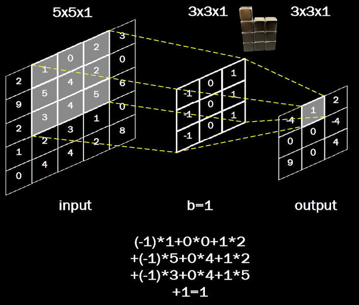

三通道计算：


动图演示：


## 感受野

感受野（Receptive Field）：卷积神经网络各输出特征图中的每个像素点，在原始输入图片上映射区域的大小。

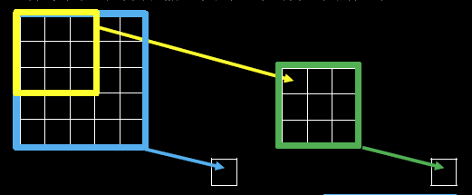

黄色和绿色，感受野为 3，蓝色感受野为 5.

两层 3x3 和一层 5x5 的卷积核，感受野都是 5，可以根据两者的计算量和训练参数量来判断：

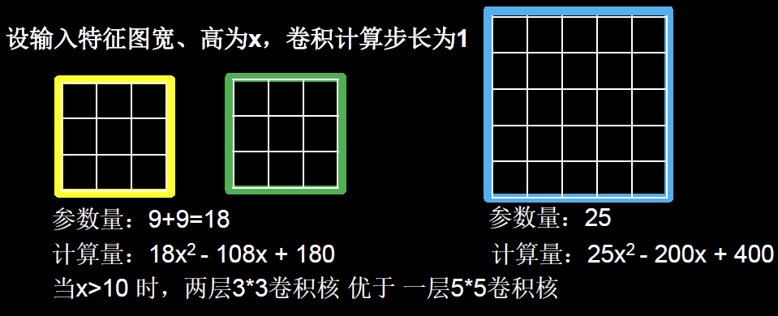

所以现在的神经网络在卷积计算中，通常用 2 层 `3*3` 卷积核替代 1 层 `5*5` 卷积核。

## 全零填充

全零填充可以用来保持输入特征图的尺寸不变。在输入特征图的周围填充0，


卷积输出特征图维度的计算：


TF描述全零填充用参数padding=‘SAME’或padding=‘VALID’表示


## TF 描述卷积计算层

```python
tf.keras.layers.Conv2D (
    filters= 卷积核个数, 
    kernel_size= 卷积核尺寸, # 正方形写核长整数，或（核高h，核宽w）
    strides= 滑动步长, #横纵向相同写步长整数，或(纵向步长h，横向步长w)，默认1
    padding= “same” or “valid”, #使用全零填充是“same”，不使用是“valid”（默认）
    activation= “ relu” or “ sigmoid ” or “ tanh ” or “ softmax”等, #如有BN此处不写
    input_shape= (高, 宽, 通道数) #输入特征图维度，可省略
)
```

例如：

```python
model = tf.keras.models.Sequential([
    Conv2D(6, 5, padding='valid', activation='sigmoid'),
    MaxPool2D(2, 2),
    Conv2D(6, (5, 5), padding='valid', activation='sigmoid'),
    MaxPool2D(2, (2, 2)),
    # 推荐下面这个关键字参数形式，更加清晰明确
    Conv2D(filters=6, kernel_size=(5, 5),padding='valid', activation='sigmoid'),
    MaxPool2D(pool_size=(2, 2), strides=2),
    Flatten(),
    Dense(10, activation='softmax')
])
```

## Batch Normalization

神经网络对 0 附近的值更敏感，但是随着网络层数的增加，特征数据会出现偏离 0 均值的情况。标准化可以使数据符合以 0 为均值，1 为标准差的标准正态分布。

标准化：使数据符合0均值，1为标准差的分布。

批标准化：对一小批数据（batch），做标准化处理。

BN 常用在卷积操作和激活操作之间。

批标准化后，第k个卷积核的输出特征图（feature map）中第i个像素点：

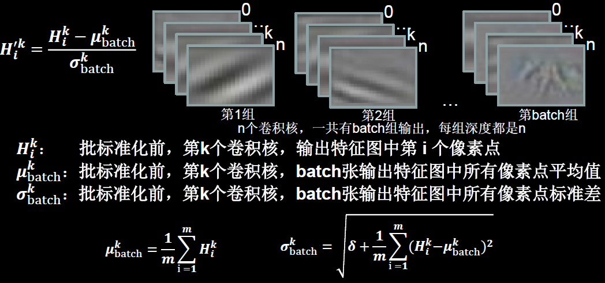

BN 操作将原本偏移的数据重新拉回到 0 均值。使进入激活函数的数据分布在激活函数线性区。使得输入数据的微小变化，更明显的体现到激活函数的输出，提升了激活函数对输入数据的区分力。

但是这种简单的特征数据标准化，使特征数据完全满足标准正态分布，集中在激活函数中心的线性区域，使激活函数丧失了非线性特性。因此在 BN 操作中为每个卷积核引入了两个可训练参数，缩放因子和偏移因子，它们会与其它待训练参数一同被训练优化，使标准正态分布后的特征数据通过缩放因子和偏移因子优化了特征数据分布的宽窄和偏移量，保证了网络的非线性表达能力，

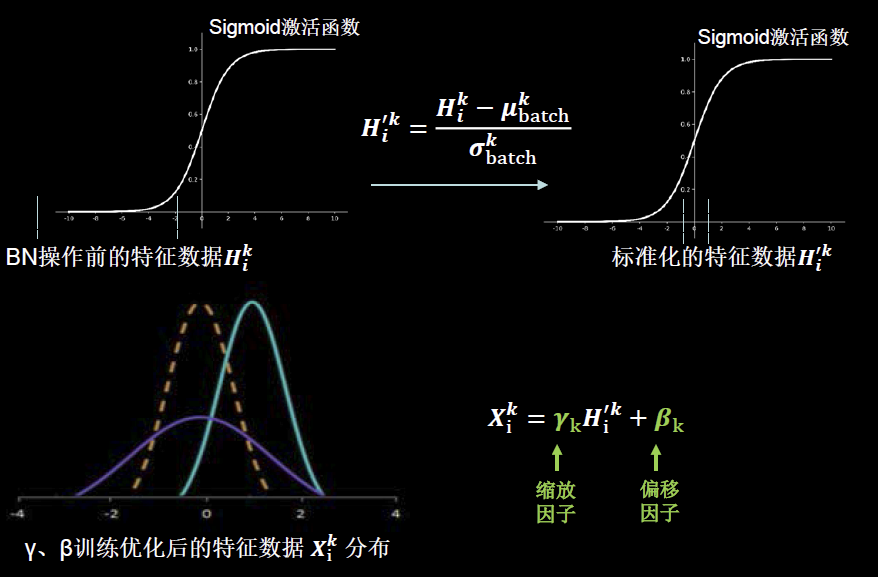

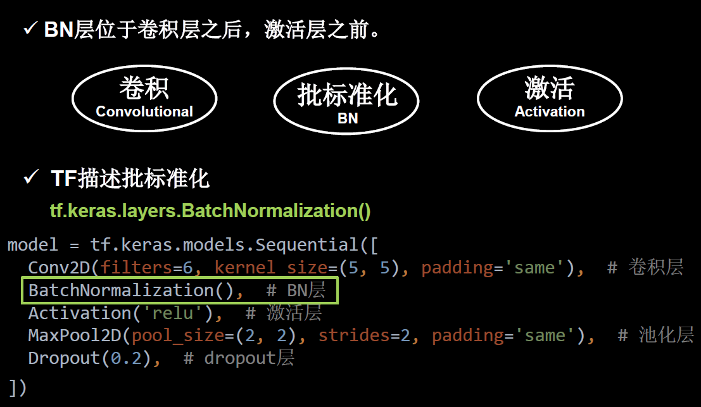

## 池化 (Pooling)

池化用于减少特征数据量。

最大值池化可提取图片纹理，均值池化可保留背景特征。


TF 实现：

```python
tf.keras.layers.MaxPool2D(
    pool_size=池化核尺寸，#正方形写核长整数，或（核高h，核宽w）
    strides=池化步长，#步长整数，或(纵向步长h，横向步长w)，默认为pool_size
    padding=‘valid’or‘same’#使用全零填充是“same”，不使用是“valid”（默认）
)

tf.keras.layers.AveragePooling2D(
    pool_size=池化核尺寸，#正方形写核长整数，或（核高h，核宽w）
    strides=池化步长，#步长整数，或(纵向步长h，横向步长w)，默认为pool_size
    padding=‘valid’or‘same’#使用全零填充是“same”，不使用是“valid”（默认）
)
```

```python
model = tf.keras.models.Sequential([
    Conv2D(filters=6, kernel_size=(5, 5), padding='same'), # 卷积层
    BatchNormalization(), # BN层
    Activation('relu'), # 激活层
    MaxPool2D(pool_size=(2, 2), strides=2, padding='same'), # 池化层
    Dropout(0.2), # dropout层
])
```

## 舍弃（Dropout）

在神经网络训练时，将一部分神经元按照一定概率从神经网络中暂时舍弃。在使用神经网络时，再把被舍弃的神经元恢复链接。

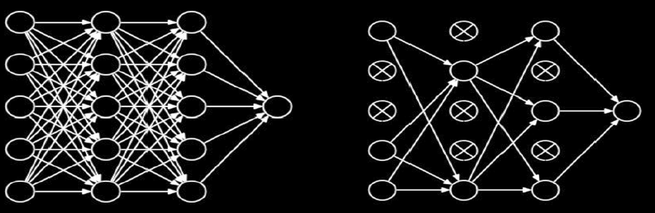

```python
tf.keras.layers.Dropout(舍弃的概率)
```

```python
model = tf.keras.models.Sequential([
    Conv2D(filters=6, kernel_size=(5, 5), padding='same'), # 卷积层
    BatchNormalization(), # BN层
    Activation('relu'), # 激活层
    MaxPool2D(pool_size=(2, 2), strides=2, padding='same'), # 池化层
    Dropout(0.2), # dropout层，随机舍弃 20% 的神经元
])
```

## 卷积神经网络简介

**卷积神经网络**：借助卷积核提取特征后，送入全连接网络。

卷积神经网络的主要模块：


**卷积是什么？** 卷积就是特征提取器，就是CBAPD

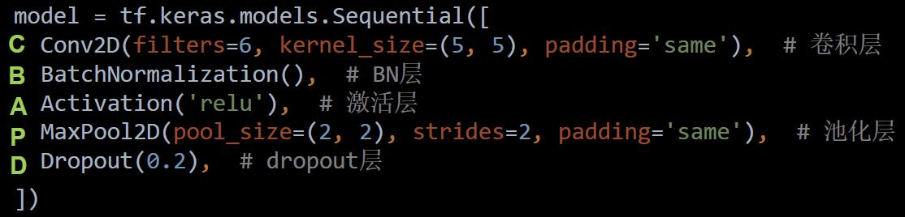

这是编写卷积神经网络的八股套路。

## cifar10 数据集

Cifar10 数据集：

- 提供5万张 32*32 像素点的十分类彩色图片和标签，用于训练。
- 提供1万张32*32 像素点的十分类彩色图片和标签，用于测试。

10 个分类：

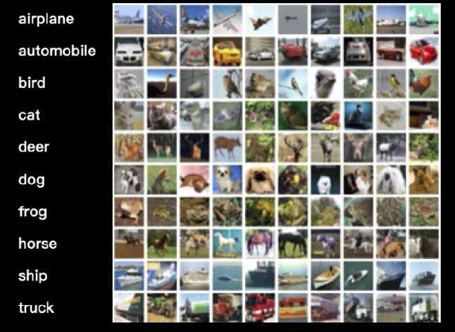

导入cifar10数据集：

```python
cifar10 = tf.keras.datasets.cifar10
(x_train, y_train),(x_test, y_test) = cifar10.load_data()
```

可视化数据：

```python
import tensorflow as tf
from matplotlib import pyplot as plt
import numpy as np

np.set_printoptions(threshold=np.inf)

cifar10 = tf.keras.datasets.cifar10
(x_train, y_train), (x_test, y_test) = cifar10.load_data()

# 可视化训练集输入特征的第一个元素
plt.imshow(x_train[0])  # 绘制图片
plt.show()

# 打印出训练集输入特征的第一个元素
print("x_train[0]:\n", x_train[0])
# 打印出训练集标签的第一个元素
print("y_train[0]:\n", y_train[0])

# 打印出整个训练集输入特征形状
print("x_train.shape:\n", x_train.shape)
# 打印出整个训练集标签的形状
print("y_train.shape:\n", y_train.shape)
# 打印出整个测试集输入特征的形状
print("x_test.shape:\n", x_test.shape)
# 打印出整个测试集标签的形状
print("y_test.shape:\n", y_test.shape)
```

## 卷积神经网络搭建示例

用卷积神经网络训练 Cifar10 数据集，搭建一个一层卷积、两层全连接的网络。


代码实现：

```python
import tensorflow as tf
import os
import numpy as np
from matplotlib import pyplot as plt
from tensorflow.keras.layers import Conv2D, BatchNormalization, Activation, MaxPool2D, Dropout, Flatten, Dense
from tensorflow.keras import Model

np.set_printoptions(threshold=np.inf)

cifar10 = tf.keras.datasets.cifar10
(x_train, y_train), (x_test, y_test) = cifar10.load_data()
x_train, x_test = x_train / 255.0, x_test / 255.0


class Baseline(Model):

    def __init__(self):
        super(Baseline, self).__init__()
        self.c1 = Conv2D(filters=6, kernel_size=(5, 5), padding='same')  # 卷积层
        self.b1 = BatchNormalization()  # BN层
        self.a1 = Activation('relu')  # 激活层
        self.p1 = MaxPool2D(pool_size=(2, 2), strides=2, padding='same')  # 池化层
        self.d1 = Dropout(0.2)  # dropout层

        self.flatten = Flatten()
        self.f1 = Dense(128, activation='relu')
        self.d2 = Dropout(0.2)
        self.f2 = Dense(10, activation='softmax')

    def call(self, x):
        x = self.c1(x)
        x = self.b1(x)
        x = self.a1(x)
        x = self.p1(x)
        x = self.d1(x)

        x = self.flatten(x)
        x = self.f1(x)
        x = self.d2(x)
        y = self.f2(x)
        return y


model = Baseline()

model.compile(optimizer='adam',
              loss=tf.keras.losses.SparseCategoricalCrossentropy(from_logits=False),
              metrics=['sparse_categorical_accuracy'])

checkpoint_save_path = "./checkpoint/Baseline.ckpt"
if os.path.exists(checkpoint_save_path + '.index'):
    print('-------------load the model-----------------')
    model.load_weights(checkpoint_save_path)

cp_callback = tf.keras.callbacks.ModelCheckpoint(filepath=checkpoint_save_path,
                                                 save_weights_only=True,
                                                 save_best_only=True)

history = model.fit(x_train,
                    y_train,
                    batch_size=32,
                    epochs=5,
                    validation_data=(x_test, y_test),
                    validation_freq=1,
                    callbacks=[cp_callback])
model.summary()

# print(model.trainable_variables)
file = open('./weights.txt', 'w')
for v in model.trainable_variables:
    file.write(str(v.name) + '\n')
    file.write(str(v.shape) + '\n')
    file.write(str(v.numpy()) + '\n')
file.close()

###############################################    show   ###############################################

# 显示训练集和验证集的acc和loss曲线
acc = history.history['sparse_categorical_accuracy']
val_acc = history.history['val_sparse_categorical_accuracy']
loss = history.history['loss']
val_loss = history.history['val_loss']

plt.subplot(1, 2, 1)
plt.plot(acc, label='Training Accuracy')
plt.plot(val_acc, label='Validation Accuracy')
plt.title('Training and Validation Accuracy')
plt.legend()

plt.subplot(1, 2, 2)
plt.plot(loss, label='Training Loss')
plt.plot(val_loss, label='Validation Loss')
plt.title('Training and Validation Loss')
plt.legend()
plt.show()
```

## 经典卷积网络


### LeNet

LeNet^[Yann Lecun, Leon Bottou, Y. Bengio, Patrick Haffner. Gradient-Based Learning Applied to Document Recognition. Proceedings of the IEEE, 1998.] 由 Yann LeCun 于1998年提出，卷积网络开篇之作。

通过共享卷积核减少了网络参数。


在统计卷积神经网络层数时，一般只统计卷积计算层和全连接计算层。其它操作可以认为是卷积计算层的附属。

LeNet 一共有 5 层网络。LeNet 时代还没有 BN 和 Dropout，所以 CBAPD 中没有这两层。


完整实现：

```python
import tensorflow as tf
import os
import numpy as np
from matplotlib import pyplot as plt
from tensorflow.keras.layers import Conv2D, BatchNormalization, Activation, MaxPool2D, Dropout, Flatten, Dense
from tensorflow.keras import Model

np.set_printoptions(threshold=np.inf)

cifar10 = tf.keras.datasets.cifar10
(x_train, y_train), (x_test, y_test) = cifar10.load_data()
x_train, x_test = x_train / 255.0, x_test / 255.0


class LeNet5(Model):

    def __init__(self):
        super(LeNet5, self).__init__()
        self.c1 = Conv2D(filters=6, kernel_size=(5, 5), activation='sigmoid')
        self.p1 = MaxPool2D(pool_size=(2, 2), strides=2)

        self.c2 = Conv2D(filters=16, kernel_size=(5, 5), activation='sigmoid')
        self.p2 = MaxPool2D(pool_size=(2, 2), strides=2)

        self.flatten = Flatten()
        self.f1 = Dense(120, activation='sigmoid')
        self.f2 = Dense(84, activation='sigmoid')
        self.f3 = Dense(10, activation='softmax')

    def call(self, x):
        x = self.c1(x)
        x = self.p1(x)

        x = self.c2(x)
        x = self.p2(x)

        x = self.flatten(x)
        x = self.f1(x)
        x = self.f2(x)
        y = self.f3(x)
        return y


model = LeNet5()

model.compile(optimizer='adam',
              loss=tf.keras.losses.SparseCategoricalCrossentropy(from_logits=False),
              metrics=['sparse_categorical_accuracy'])

checkpoint_save_path = "./checkpoint/LeNet5.ckpt"
if os.path.exists(checkpoint_save_path + '.index'):
    print('-------------load the model-----------------')
    model.load_weights(checkpoint_save_path)

cp_callback = tf.keras.callbacks.ModelCheckpoint(filepath=checkpoint_save_path,
                                                 save_weights_only=True,
                                                 save_best_only=True)

history = model.fit(x_train,
                    y_train,
                    batch_size=32,
                    epochs=5,
                    validation_data=(x_test, y_test),
                    validation_freq=1,
                    callbacks=[cp_callback])
model.summary()

# print(model.trainable_variables)
file = open('./weights.txt', 'w')
for v in model.trainable_variables:
    file.write(str(v.name) + '\n')
    file.write(str(v.shape) + '\n')
    file.write(str(v.numpy()) + '\n')
file.close()

###############################################    show   ###############################################

# 显示训练集和验证集的acc和loss曲线
acc = history.history['sparse_categorical_accuracy']
val_acc = history.history['val_sparse_categorical_accuracy']
loss = history.history['loss']
val_loss = history.history['val_loss']

plt.subplot(1, 2, 1)
plt.plot(acc, label='Training Accuracy')
plt.plot(val_acc, label='Validation Accuracy')
plt.title('Training and Validation Accuracy')
plt.legend()

plt.subplot(1, 2, 2)
plt.plot(loss, label='Training Loss')
plt.plot(val_loss, label='Validation Loss')
plt.title('Training and Validation Loss')
plt.legend()
plt.show()
```

### AlexNet

AlexNet^[Alex Krizhevsky, Ilya Sutskever, Geoffrey E. Hinton. ImageNet Classification with Deep Convolutional Neural Networks. In NIPS, 2012.] 网络诞生于2012年，是 Hinton 的代表作之一，当年ImageNet竞赛的冠军，Top5错误率为 16.4% 。

AlexNet

- 使用 relu 激活函数，提升了训练速度。
- 使用 Dropout 缓解了过拟合

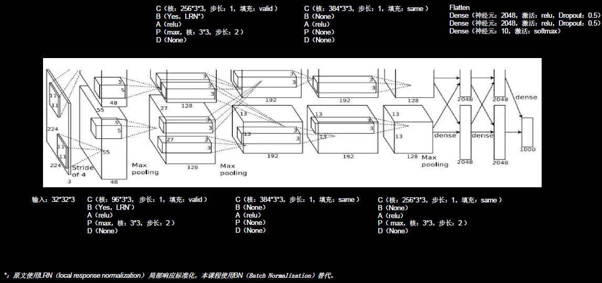

LRN 操作今年使用很少，它的功能与批标准化相似，所以这里选择主流的 BN 操作实现特征标准化。

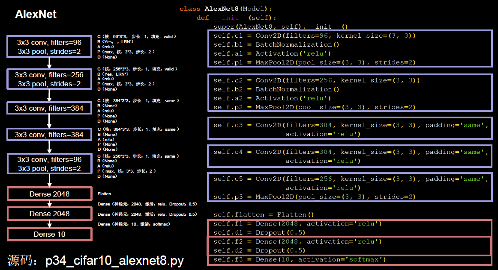

```python
import tensorflow as tf
import os
import numpy as np
from matplotlib import pyplot as plt
from tensorflow.keras.layers import Conv2D, BatchNormalization, Activation, MaxPool2D, Dropout, Flatten, Dense
from tensorflow.keras import Model

np.set_printoptions(threshold=np.inf)

cifar10 = tf.keras.datasets.cifar10
(x_train, y_train), (x_test, y_test) = cifar10.load_data()
x_train, x_test = x_train / 255.0, x_test / 255.0


class AlexNet8(Model):

    def __init__(self):
        super(AlexNet8, self).__init__()
        self.c1 = Conv2D(filters=96, kernel_size=(3, 3))
        self.b1 = BatchNormalization()
        self.a1 = Activation('relu')
        self.p1 = MaxPool2D(pool_size=(3, 3), strides=2)

        self.c2 = Conv2D(filters=256, kernel_size=(3, 3))
        self.b2 = BatchNormalization()
        self.a2 = Activation('relu')
        self.p2 = MaxPool2D(pool_size=(3, 3), strides=2)

        self.c3 = Conv2D(filters=384, kernel_size=(3, 3), padding='same', activation='relu')

        self.c4 = Conv2D(filters=384, kernel_size=(3, 3), padding='same', activation='relu')

        self.c5 = Conv2D(filters=256, kernel_size=(3, 3), padding='same', activation='relu')
        self.p3 = MaxPool2D(pool_size=(3, 3), strides=2)

        self.flatten = Flatten()
        self.f1 = Dense(2048, activation='relu')
        self.d1 = Dropout(0.5)
        self.f2 = Dense(2048, activation='relu')
        self.d2 = Dropout(0.5)
        self.f3 = Dense(10, activation='softmax')

    def call(self, x):
        x = self.c1(x)
        x = self.b1(x)
        x = self.a1(x)
        x = self.p1(x)

        x = self.c2(x)
        x = self.b2(x)
        x = self.a2(x)
        x = self.p2(x)

        x = self.c3(x)

        x = self.c4(x)

        x = self.c5(x)
        x = self.p3(x)

        x = self.flatten(x)
        x = self.f1(x)
        x = self.d1(x)
        x = self.f2(x)
        x = self.d2(x)
        y = self.f3(x)
        return y


model = AlexNet8()

model.compile(optimizer='adam',
              loss=tf.keras.losses.SparseCategoricalCrossentropy(from_logits=False),
              metrics=['sparse_categorical_accuracy'])

checkpoint_save_path = "./checkpoint/AlexNet8.ckpt"
if os.path.exists(checkpoint_save_path + '.index'):
    print('-------------load the model-----------------')
    model.load_weights(checkpoint_save_path)

cp_callback = tf.keras.callbacks.ModelCheckpoint(filepath=checkpoint_save_path,
                                                 save_weights_only=True,
                                                 save_best_only=True)

history = model.fit(x_train,
                    y_train,
                    batch_size=32,
                    epochs=5,
                    validation_data=(x_test, y_test),
                    validation_freq=1,
                    callbacks=[cp_callback])
model.summary()

# print(model.trainable_variables)
file = open('./weights.txt', 'w')
for v in model.trainable_variables:
    file.write(str(v.name) + '\n')
    file.write(str(v.shape) + '\n')
    file.write(str(v.numpy()) + '\n')
file.close()

###############################################    show   ###############################################

# 显示训练集和验证集的acc和loss曲线
acc = history.history['sparse_categorical_accuracy']
val_acc = history.history['val_sparse_categorical_accuracy']
loss = history.history['loss']
val_loss = history.history['val_loss']

plt.subplot(1, 2, 1)
plt.plot(acc, label='Training Accuracy')
plt.plot(val_acc, label='Validation Accuracy')
plt.title('Training and Validation Accuracy')
plt.legend()

plt.subplot(1, 2, 2)
plt.plot(loss, label='Training Loss')
plt.plot(val_loss, label='Validation Loss')
plt.title('Training and Validation Loss')
plt.legend()
plt.show()
```

### VGGNet

VGGNet^[K. Simonyan, A. Zisserman. Very Deep Convolutional Networks for Large-Scale Image Recognition.In ICLR, 2015.] 诞生于2014年，当年ImageNet竞赛的亚军，Top5错误率减小到7.3%

VGGNet 使用小尺寸卷积核，在减少参数的同时，提高了识别准确率。

VGGNet 的网络结构规整，非常适合硬件加速。

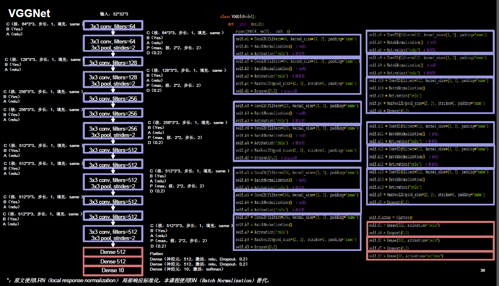

代码实现：

```python
import tensorflow as tf
import os
import numpy as np
from matplotlib import pyplot as plt
from tensorflow.keras.layers import Conv2D, BatchNormalization, Activation, MaxPool2D, Dropout, Flatten, Dense
from tensorflow.keras import Model

np.set_printoptions(threshold=np.inf)

cifar10 = tf.keras.datasets.cifar10
(x_train, y_train), (x_test, y_test) = cifar10.load_data()
x_train, x_test = x_train / 255.0, x_test / 255.0


class VGG16(Model):

    def __init__(self):
        super(VGG16, self).__init__()
        self.c1 = Conv2D(filters=64, kernel_size=(3, 3), padding='same')  # 卷积层1
        self.b1 = BatchNormalization()  # BN层1
        self.a1 = Activation('relu')  # 激活层1
        self.c2 = Conv2D(
            filters=64,
            kernel_size=(3, 3),
            padding='same',
        )
        self.b2 = BatchNormalization()  # BN层1
        self.a2 = Activation('relu')  # 激活层1
        self.p1 = MaxPool2D(pool_size=(2, 2), strides=2, padding='same')
        self.d1 = Dropout(0.2)  # dropout层

        self.c3 = Conv2D(filters=128, kernel_size=(3, 3), padding='same')
        self.b3 = BatchNormalization()  # BN层1
        self.a3 = Activation('relu')  # 激活层1
        self.c4 = Conv2D(filters=128, kernel_size=(3, 3), padding='same')
        self.b4 = BatchNormalization()  # BN层1
        self.a4 = Activation('relu')  # 激活层1
        self.p2 = MaxPool2D(pool_size=(2, 2), strides=2, padding='same')
        self.d2 = Dropout(0.2)  # dropout层

        self.c5 = Conv2D(filters=256, kernel_size=(3, 3), padding='same')
        self.b5 = BatchNormalization()  # BN层1
        self.a5 = Activation('relu')  # 激活层1
        self.c6 = Conv2D(filters=256, kernel_size=(3, 3), padding='same')
        self.b6 = BatchNormalization()  # BN层1
        self.a6 = Activation('relu')  # 激活层1
        self.c7 = Conv2D(filters=256, kernel_size=(3, 3), padding='same')
        self.b7 = BatchNormalization()
        self.a7 = Activation('relu')
        self.p3 = MaxPool2D(pool_size=(2, 2), strides=2, padding='same')
        self.d3 = Dropout(0.2)

        self.c8 = Conv2D(filters=512, kernel_size=(3, 3), padding='same')
        self.b8 = BatchNormalization()  # BN层1
        self.a8 = Activation('relu')  # 激活层1
        self.c9 = Conv2D(filters=512, kernel_size=(3, 3), padding='same')
        self.b9 = BatchNormalization()  # BN层1
        self.a9 = Activation('relu')  # 激活层1
        self.c10 = Conv2D(filters=512, kernel_size=(3, 3), padding='same')
        self.b10 = BatchNormalization()
        self.a10 = Activation('relu')
        self.p4 = MaxPool2D(pool_size=(2, 2), strides=2, padding='same')
        self.d4 = Dropout(0.2)

        self.c11 = Conv2D(filters=512, kernel_size=(3, 3), padding='same')
        self.b11 = BatchNormalization()  # BN层1
        self.a11 = Activation('relu')  # 激活层1
        self.c12 = Conv2D(filters=512, kernel_size=(3, 3), padding='same')
        self.b12 = BatchNormalization()  # BN层1
        self.a12 = Activation('relu')  # 激活层1
        self.c13 = Conv2D(filters=512, kernel_size=(3, 3), padding='same')
        self.b13 = BatchNormalization()
        self.a13 = Activation('relu')
        self.p5 = MaxPool2D(pool_size=(2, 2), strides=2, padding='same')
        self.d5 = Dropout(0.2)

        self.flatten = Flatten()
        self.f1 = Dense(512, activation='relu')
        self.d6 = Dropout(0.2)
        self.f2 = Dense(512, activation='relu')
        self.d7 = Dropout(0.2)
        self.f3 = Dense(10, activation='softmax')

    def call(self, x):
        x = self.c1(x)
        x = self.b1(x)
        x = self.a1(x)
        x = self.c2(x)
        x = self.b2(x)
        x = self.a2(x)
        x = self.p1(x)
        x = self.d1(x)

        x = self.c3(x)
        x = self.b3(x)
        x = self.a3(x)
        x = self.c4(x)
        x = self.b4(x)
        x = self.a4(x)
        x = self.p2(x)
        x = self.d2(x)

        x = self.c5(x)
        x = self.b5(x)
        x = self.a5(x)
        x = self.c6(x)
        x = self.b6(x)
        x = self.a6(x)
        x = self.c7(x)
        x = self.b7(x)
        x = self.a7(x)
        x = self.p3(x)
        x = self.d3(x)

        x = self.c8(x)
        x = self.b8(x)
        x = self.a8(x)
        x = self.c9(x)
        x = self.b9(x)
        x = self.a9(x)
        x = self.c10(x)
        x = self.b10(x)
        x = self.a10(x)
        x = self.p4(x)
        x = self.d4(x)

        x = self.c11(x)
        x = self.b11(x)
        x = self.a11(x)
        x = self.c12(x)
        x = self.b12(x)
        x = self.a12(x)
        x = self.c13(x)
        x = self.b13(x)
        x = self.a13(x)
        x = self.p5(x)
        x = self.d5(x)

        x = self.flatten(x)
        x = self.f1(x)
        x = self.d6(x)
        x = self.f2(x)
        x = self.d7(x)
        y = self.f3(x)
        return y


model = VGG16()

model.compile(optimizer='adam',
              loss=tf.keras.losses.SparseCategoricalCrossentropy(from_logits=False),
              metrics=['sparse_categorical_accuracy'])

checkpoint_save_path = "./checkpoint/VGG16.ckpt"
if os.path.exists(checkpoint_save_path + '.index'):
    print('-------------load the model-----------------')
    model.load_weights(checkpoint_save_path)

cp_callback = tf.keras.callbacks.ModelCheckpoint(filepath=checkpoint_save_path,
                                                 save_weights_only=True,
                                                 save_best_only=True)

history = model.fit(x_train,
                    y_train,
                    batch_size=32,
                    epochs=5,
                    validation_data=(x_test, y_test),
                    validation_freq=1,
                    callbacks=[cp_callback])
model.summary()

# print(model.trainable_variables)
file = open('./weights.txt', 'w')
for v in model.trainable_variables:
    file.write(str(v.name) + '\n')
    file.write(str(v.shape) + '\n')
    file.write(str(v.numpy()) + '\n')
file.close()

###############################################    show   ###############################################

# 显示训练集和验证集的acc和loss曲线
acc = history.history['sparse_categorical_accuracy']
val_acc = history.history['val_sparse_categorical_accuracy']
loss = history.history['loss']
val_loss = history.history['val_loss']

plt.subplot(1, 2, 1)
plt.plot(acc, label='Training Accuracy')
plt.plot(val_acc, label='Validation Accuracy')
plt.title('Training and Validation Accuracy')
plt.legend()

plt.subplot(1, 2, 2)
plt.plot(loss, label='Training Loss')
plt.plot(val_loss, label='Validation Loss')
plt.title('Training and Validation Loss')
plt.legend()
plt.show()
```

设计这个网络时，卷积核的个数从 64 到 128，256，512，逐渐增加，因为越靠后，特征图尺寸越小，通过增加卷积核的个数，增加了特征图深度，保持了信息的承载能力。

### InceptionNet

InceptionNet^[Szegedy C, Liu W, Jia Y, et al. Going Deeper with Convolutions. In CVPR, 2015.] 诞生于2014年，当年 ImageNet 竞赛冠军，Top5错误率为6.67%。

InceptionNet 引入了 Inception 结构，在同一层网络内使用不同尺寸的卷积核，提升了模型感知力，使用了批标准化，缓解了梯度消失。

InceptionNet 的核心是它的基本单元 Inception 结构块。

无论是 GoogLeNet，也就是 Inception v1，还是 InceptionNet 的后续版本，如 v2, v3, v4，都是基于 Inception 结构块搭建的网络。

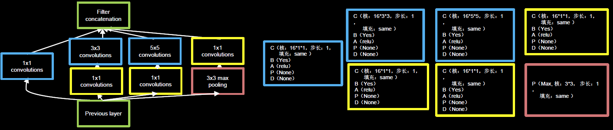

Inception 结构块在同一层网络中使用了多个尺寸的卷积核，可以提取不同尺寸的特征，通过 `1*1` 卷积核，作用到输入特征图的每个像素点，通过设定少于输入特征图深度的 `1*1` 卷积核个数，减少了输出特征图深度，起到了降维作用，减少了参数量和计算量。 

Inception 结构块包含 4 个分支：

- `1*1` 卷积核输出到卷积连接器
- 经过 `1*1` 卷积核配合 `3*3` 卷积核输出到卷积连接器
- 经过 `1*1` 卷积核配合 `5*5` 卷积核输出到卷积连接器
- 经过 `3*3` 最大池化核配合 `1*1` 卷积核输出到卷积连接器

送到卷积连接器的特征数据尺寸相同，卷积连接器会把收到的这 4 路特征数据按深度方向拼接，形成 Inception 结构块的输出。

由于 Inception 结构块中的卷积操作均采用了 CBA 结构，先卷积，再 BN，再采用 relu 激活函数，所以将其定义成一个新的 ConvBNRelu:

```python
class ConvBNRelu(Model):

    def __init__(self, ch, kernelsz=3, strides=1, padding='same'):
        super(ConvBNRelu, self).__init__()
        self.model = tf.keras.models.Sequential(
            [Conv2D(ch, kernelsz, strides=strides, padding=padding),
             BatchNormalization(),
             Activation('relu')])

    def call(self, x):
        x = self.model(
            x, training=False
        )  #在training=False时，BN通过整个训练集计算均值、方差去做批归一化，training=True时，通过当前batch的均值、方差去做批归一化。推理时 training=False效果好
        return x
```

Inception 结构块实现：

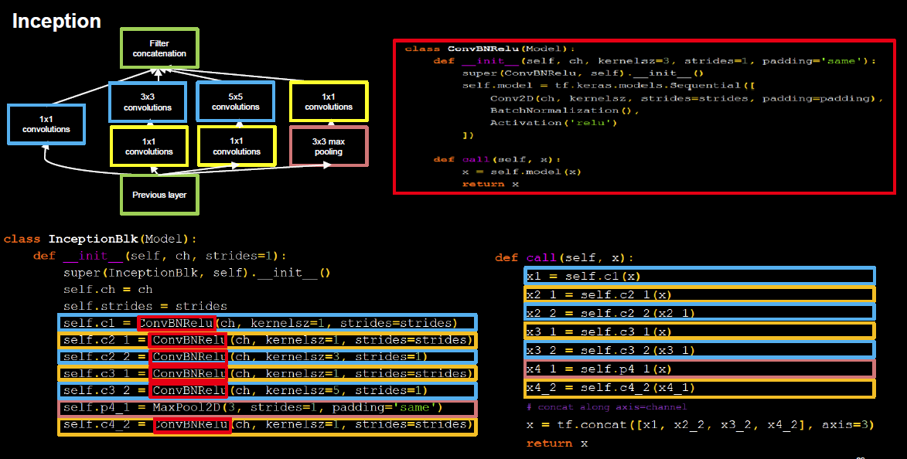

有了 Inception 结构块后，就可以搭建一个精简版本的 InceptionNet：

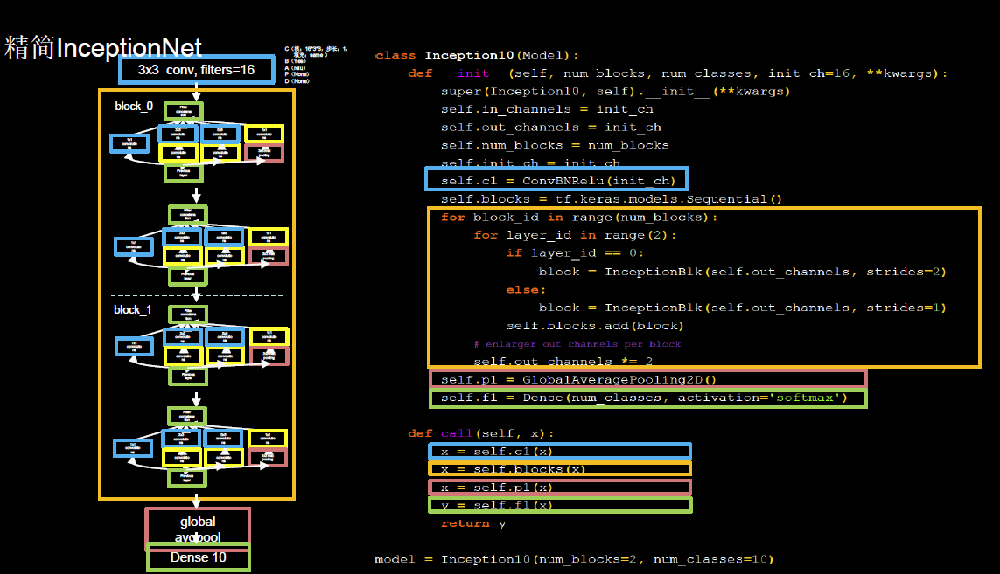

4 个 Inception 结构块顺序相连，每 2 个 Inception 结构快组成一个 block，每个 block 中的第一个 Inception 结构块卷积步长 2，第二个 Inception 结构块卷积步长 1，这使得第一个 Inception 结构块输出特征图尺寸减半，因此，我们把输出特征图深度加深，尽可能保证特征抽取中信息的承载量一致。

block_0 设置的通道数为 16，经过 4 个分支，输出深度 `4*16=64`，后面给通道数加倍了，所以 block_1 通道数是 block_0 通道数的两倍，为 32，同样经过 4 个分支，输出深度 `4*32=128`，这 128 个通道的数据会被送入平均池化，送入 10 分类的全连接

```python
import tensorflow as tf
import os
import numpy as np
from matplotlib import pyplot as plt
from tensorflow.keras.layers import Conv2D, BatchNormalization, Activation, MaxPool2D, Dropout, Flatten, Dense, \
    GlobalAveragePooling2D
from tensorflow.keras import Model

np.set_printoptions(threshold=np.inf)

cifar10 = tf.keras.datasets.cifar10
(x_train, y_train), (x_test, y_test) = cifar10.load_data()
x_train, x_test = x_train / 255.0, x_test / 255.0


class ConvBNRelu(Model):

    def __init__(self, ch, kernelsz=3, strides=1, padding='same'):
        super(ConvBNRelu, self).__init__()
        self.model = tf.keras.models.Sequential(
            [Conv2D(ch, kernelsz, strides=strides, padding=padding),
             BatchNormalization(),
             Activation('relu')])

    def call(self, x):
        x = self.model(
            x, training=False
        )  #在training=False时，BN通过整个训练集计算均值、方差去做批归一化，training=True时，通过当前batch的均值、方差去做批归一化。推理时 training=False效果好
        return x


class InceptionBlk(Model):

    def __init__(self, ch, strides=1):
        super(InceptionBlk, self).__init__()
        self.ch = ch
        self.strides = strides
        self.c1 = ConvBNRelu(ch, kernelsz=1, strides=strides)
        self.c2_1 = ConvBNRelu(ch, kernelsz=1, strides=strides)
        self.c2_2 = ConvBNRelu(ch, kernelsz=3, strides=1)
        self.c3_1 = ConvBNRelu(ch, kernelsz=1, strides=strides)
        self.c3_2 = ConvBNRelu(ch, kernelsz=5, strides=1)
        self.p4_1 = MaxPool2D(3, strides=1, padding='same')
        self.c4_2 = ConvBNRelu(ch, kernelsz=1, strides=strides)

    def call(self, x):
        x1 = self.c1(x)
        x2_1 = self.c2_1(x)
        x2_2 = self.c2_2(x2_1)
        x3_1 = self.c3_1(x)
        x3_2 = self.c3_2(x3_1)
        x4_1 = self.p4_1(x)
        x4_2 = self.c4_2(x4_1)
        # concat along axis=channel
        x = tf.concat([x1, x2_2, x3_2, x4_2], axis=3)
        return x


class Inception10(Model):

    def __init__(self, num_blocks, num_classes, init_ch=16, **kwargs):
        super(Inception10, self).__init__(**kwargs)
        self.in_channels = init_ch
        self.out_channels = init_ch
        self.num_blocks = num_blocks
        self.init_ch = init_ch
        self.c1 = ConvBNRelu(init_ch)
        self.blocks = tf.keras.models.Sequential()
        for block_id in range(num_blocks):
            for layer_id in range(2):
                if layer_id == 0:
                    block = InceptionBlk(self.out_channels, strides=2)
                else:
                    block = InceptionBlk(self.out_channels, strides=1)
                self.blocks.add(block)
            # enlarger out_channels per block
            self.out_channels *= 2
        self.p1 = GlobalAveragePooling2D()
        self.f1 = Dense(num_classes, activation='softmax')

    def call(self, x):
        x = self.c1(x)
        x = self.blocks(x)
        x = self.p1(x)
        y = self.f1(x)
        return y


model = Inception10(num_blocks=2, num_classes=10)

model.compile(optimizer='adam',
              loss=tf.keras.losses.SparseCategoricalCrossentropy(from_logits=False),
              metrics=['sparse_categorical_accuracy'])

checkpoint_save_path = "./checkpoint/Inception10.ckpt"
if os.path.exists(checkpoint_save_path + '.index'):
    print('-------------load the model-----------------')
    model.load_weights(checkpoint_save_path)

cp_callback = tf.keras.callbacks.ModelCheckpoint(filepath=checkpoint_save_path,
                                                 save_weights_only=True,
                                                 save_best_only=True)

history = model.fit(x_train,
                    y_train,
                    batch_size=32,
                    epochs=5,
                    validation_data=(x_test, y_test),
                    validation_freq=1,
                    callbacks=[cp_callback])
model.summary()

# print(model.trainable_variables)
file = open('./weights.txt', 'w')
for v in model.trainable_variables:
    file.write(str(v.name) + '\n')
    file.write(str(v.shape) + '\n')
    file.write(str(v.numpy()) + '\n')
file.close()

###############################################    show   ###############################################

# 显示训练集和验证集的acc和loss曲线
acc = history.history['sparse_categorical_accuracy']
val_acc = history.history['val_sparse_categorical_accuracy']
loss = history.history['loss']
val_loss = history.history['val_loss']

plt.subplot(1, 2, 1)
plt.plot(acc, label='Training Accuracy')
plt.plot(val_acc, label='Validation Accuracy')
plt.title('Training and Validation Accuracy')
plt.legend()

plt.subplot(1, 2, 2)
plt.plot(loss, label='Training Loss')
plt.plot(val_loss, label='Validation Loss')
plt.title('Training and Validation Loss')
plt.legend()
plt.show()
```

由于 InceptionNet 规模较大，所以 batch_size 可以大一些，如 1024，一次喂入神经网络的数据量多一些，以充分发挥显卡的性能，提高训练速度。也可以根据电脑性能，调调节 batch_size，一般让显卡达到 70-80% 的负荷比较合理。

### ResNet

ResNet^[Kaiming He, Xiangyu Zhang, Shaoqing Ren. Deep Residual Learning for Image Recognition. In CPVR,2016.] 诞生于2015年，当年ImageNet竞赛冠军，Top5错误率为3.57%。

ResNet 提出了层间残差跳连，引入了前方信息，缓解梯度消失，使神经网络层数增加成为可能，我们纵览刚刚见过的 4 个卷积网络层数，

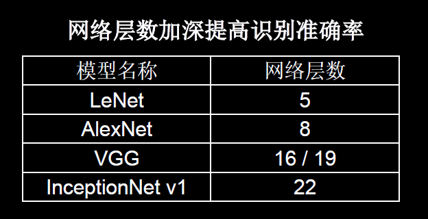

可见人们在探索卷积实现特征提取的道路上，通过加深网络层数，取得了越来越好的效果。

ResNet 的作者何凯明在 cifar10 数据集上做了个实验，他发现 56 层卷积网络的错误率要高于 20 层卷积网络的错误率：


他认为单纯堆叠神经网络层数，会使神经网络模型退化，以至于后面的特征丢失了前面特征的原本模样，于是他用了一根跳连线，将前边的特征直接接到了后边，使输出 H(x) 包含了堆叠卷积的非线性输出 F(x) 和跳过卷积直接连接过来的恒等映射 x，让它们的对应 元素相加：


这一操作有效缓解了神经网络模型堆叠导致的退化，使得神经网络可以向着更深层级发展。

ResNet 块中有两种情况，一种是用实线表示，指两层堆叠卷积没有改变特征图的维度，即它们特征图的个数、高、宽和深度都相同；用虚线表示的两层堆叠卷积，改变了特征图的维度，需要借助 `1*1` 的卷积来调整 x 的维度，使 W(x) 与 F(x) 的维度一致：

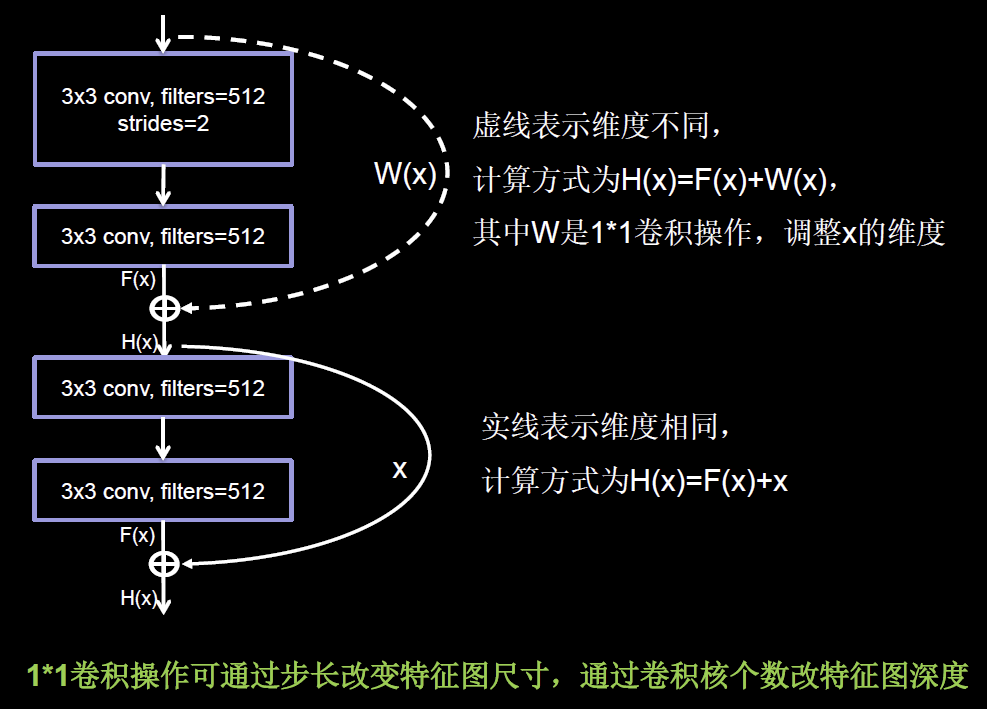

ResNet 块有两种形式，一种在堆叠卷积前后维度相同，另一种在堆叠卷积前后维度不同：

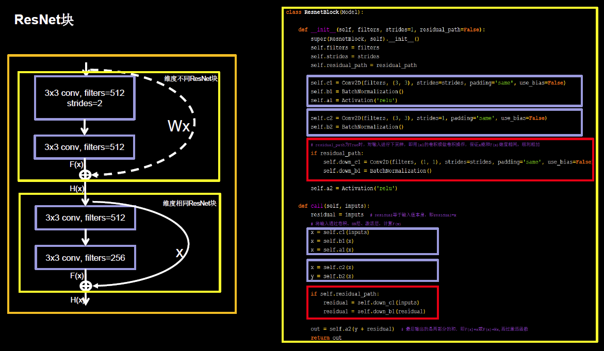

这里，`residual_path` 表示是否调整输入特征图的尺寸或深度，将堆叠卷积输出特征 y 和 if 语句计算出的 residual 相加，如果堆叠前后维度相同，不执行红色块中的代码，直接将堆叠卷积输出特征 y  和输入特征图 inputs 相加。

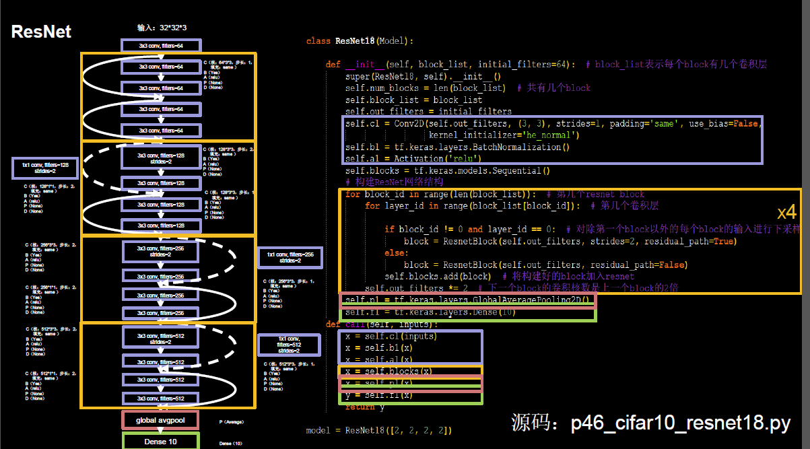

左图是 ResNet18 用 CBAPD 表示的结构，

完整代码实现：

```python
import tensorflow as tf
import os
import numpy as np
from matplotlib import pyplot as plt
from tensorflow.keras.layers import Conv2D, BatchNormalization, Activation, MaxPool2D, Dropout, Flatten, Dense
from tensorflow.keras import Model

np.set_printoptions(threshold=np.inf)

cifar10 = tf.keras.datasets.cifar10
(x_train, y_train), (x_test, y_test) = cifar10.load_data()
x_train, x_test = x_train / 255.0, x_test / 255.0


class ResnetBlock(Model):

    def __init__(self, filters, strides=1, residual_path=False):
        super(ResnetBlock, self).__init__()
        self.filters = filters
        self.strides = strides
        self.residual_path = residual_path

        self.c1 = Conv2D(filters, (3, 3), strides=strides, padding='same', use_bias=False)
        self.b1 = BatchNormalization()
        self.a1 = Activation('relu')

        self.c2 = Conv2D(filters, (3, 3), strides=1, padding='same', use_bias=False)
        self.b2 = BatchNormalization()

        # residual_path为True时，对输入进行下采样，即用1x1的卷积核做卷积操作，保证x能和F(x)维度相同，顺利相加
        if residual_path:
            self.down_c1 = Conv2D(filters, (1, 1), strides=strides, padding='same', use_bias=False)
            self.down_b1 = BatchNormalization()

        self.a2 = Activation('relu')

    def call(self, inputs):
        residual = inputs  # residual等于输入值本身，即residual=x
        # 将输入通过卷积、BN层、激活层，计算F(x)
        x = self.c1(inputs)
        x = self.b1(x)
        x = self.a1(x)

        x = self.c2(x)
        y = self.b2(x)

        if self.residual_path:
            residual = self.down_c1(inputs)
            residual = self.down_b1(residual)

        out = self.a2(y + residual)  # 最后输出的是两部分的和，即F(x)+x或F(x)+Wx,再过激活函数
        return out


class ResNet18(Model):

    def __init__(self, block_list, initial_filters=64):  # block_list表示每个block有几个卷积层
        super(ResNet18, self).__init__()
        self.num_blocks = len(block_list)  # 共有几个block
        self.block_list = block_list
        self.out_filters = initial_filters
        self.c1 = Conv2D(self.out_filters, (3, 3), strides=1, padding='same', use_bias=False)
        self.b1 = BatchNormalization()
        self.a1 = Activation('relu')
        self.blocks = tf.keras.models.Sequential()
        # 构建ResNet网络结构
        for block_id in range(len(block_list)):  # 第几个resnet block
            for layer_id in range(block_list[block_id]):  # 第几个卷积层

                if block_id != 0 and layer_id == 0:  # 对除第一个block以外的每个block的输入进行下采样
                    block = ResnetBlock(self.out_filters, strides=2, residual_path=True)
                else:
                    block = ResnetBlock(self.out_filters, residual_path=False)
                self.blocks.add(block)  # 将构建好的block加入resnet
            self.out_filters *= 2  # 下一个block的卷积核数是上一个block的2倍
        self.p1 = tf.keras.layers.GlobalAveragePooling2D()
        self.f1 = tf.keras.layers.Dense(10, activation='softmax', kernel_regularizer=tf.keras.regularizers.l2())

    def call(self, inputs):
        x = self.c1(inputs)
        x = self.b1(x)
        x = self.a1(x)
        x = self.blocks(x)
        x = self.p1(x)
        y = self.f1(x)
        return y


model = ResNet18([2, 2, 2, 2])

model.compile(optimizer='adam',
              loss=tf.keras.losses.SparseCategoricalCrossentropy(from_logits=False),
              metrics=['sparse_categorical_accuracy'])

checkpoint_save_path = "./checkpoint/ResNet18.ckpt"
if os.path.exists(checkpoint_save_path + '.index'):
    print('-------------load the model-----------------')
    model.load_weights(checkpoint_save_path)

cp_callback = tf.keras.callbacks.ModelCheckpoint(filepath=checkpoint_save_path,
                                                 save_weights_only=True,
                                                 save_best_only=True)

history = model.fit(x_train, y_train, batch_size=32, epochs=5, validation_data=(x_test, y_test), validation_freq=1,
                    callbacks=[cp_callback])
model.summary()

# print(model.trainable_variables)
file = open('./weights.txt', 'w')
for v in model.trainable_variables:
    file.write(str(v.name) + '\n')
    file.write(str(v.shape) + '\n')
    file.write(str(v.numpy()) + '\n')
file.close()

###############################################    show   ###############################################

# 显示训练集和验证集的acc和loss曲线
acc = history.history['sparse_categorical_accuracy']
val_acc = history.history['val_sparse_categorical_accuracy']
loss = history.history['loss']
val_loss = history.history['val_loss']

plt.subplot(1, 2, 1)
plt.plot(acc, label='Training Accuracy')
plt.plot(val_acc, label='Validation Accuracy')
plt.title('Training and Validation Accuracy')
plt.legend()

plt.subplot(1, 2, 2)
plt.plot(loss, label='Training Loss')
plt.plot(val_loss, label='Validation Loss')
plt.title('Training and Validation Loss')
plt.legend()
plt.show()
```

为了加速模型收敛，可以把 batch_size 增加到 128.

### 经典卷积网络总结


## 参考

- https://mlnotebook.github.io/post/CNN1/
