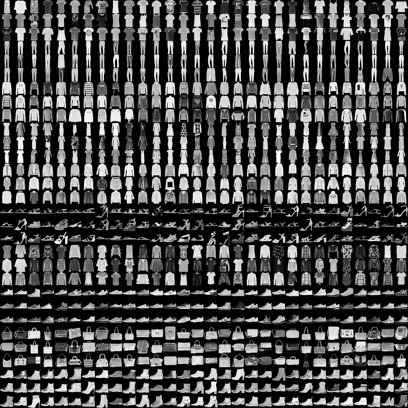
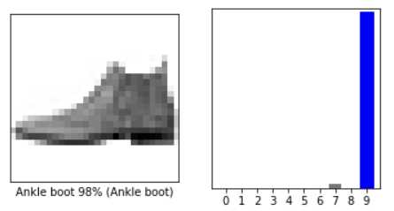
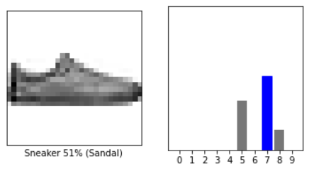
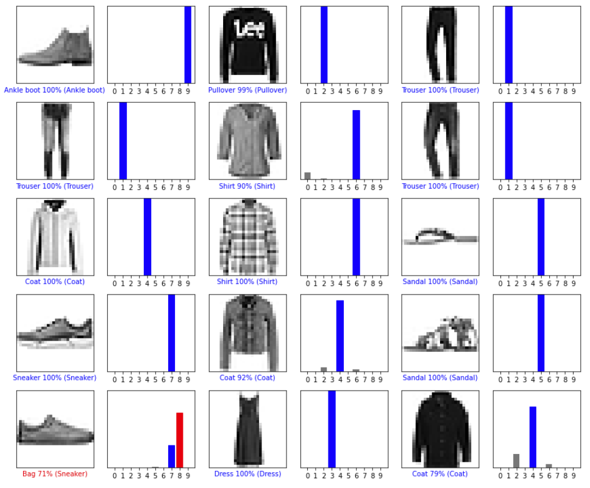

# 分类基础：服装图像分类

- [分类基础：服装图像分类](#分类基础服装图像分类)
  - [简介](#简介)
  - [导入 Fashion MNIST 数据集](#导入-fashion-mnist-数据集)
  - [数据特点](#数据特点)
  - [数据预处理](#数据预处理)
  - [构建模型](#构建模型)
    - [配置网络层](#配置网络层)
    - [编译模型](#编译模型)
  - [训练模型](#训练模型)
    - [导入数据](#导入数据)
    - [评估准确性](#评估准确性)
    - [预测](#预测)
    - [验证预测结果](#验证预测结果)
  - [使用模型](#使用模型)
  - [参考](#参考)

2021-12-30, 16:00
@author Jiawei Mao
***

## 简介

下面训练神经网络模型对衣服的图像进行分类，包括运动鞋（sneaker）和衬衫（shirt）等。如果部分细节无法理解也没关系，主要是为了建立对 TensorFlow 的完整流程的感性认识。

这个模型使用 `tf.keras` API 构建。

```python
# TensorFlow and tf.keras
import tensorflow as tf

# Helper libraries
import numpy as np
import matplotlib.pyplot as plt

print(tf.__version__)
```

```sh
2.7.0
```

## 导入 Fashion MNIST 数据集

Fashion MNIST 数据集包含 10 个类别共 70,000 张灰度图片，均为低分辨率（28*28 pixels）的衣服，如下图所示：



Fashion MNIST 旨在替代经典的 MNIST 数据集，MNIST 经常被用作计算机视觉机器学习程序中的 "Hello, World"。该数据集包含手写数字（0, 1, 2,...,9）图像，格式与 Fashion MNIST 一样。

对 Fashion MNIST 数据集进行分类比 MNIST 更难一点。这两个数据集都相对较小，适合用来验证算法，是测试和调试代码很好的起点。使用 60,000 张图像训练模型，10,000 张图片评估模型。TensorFlow 内嵌有 Fashion MNIST 数据集，可以直接加载：

```python
fashion_mnist = tf.keras.datasets.fashion_mnist

(train_images, train_labels), (test_images, test_labels) = fashion_mnist.load_data()
```

```sh
Downloading data from https://storage.googleapis.com/tensorflow/tf-keras-datasets/train-labels-idx1-ubyte.gz
32768/29515 [=================================] - 0s 0us/step
Downloading data from https://storage.googleapis.com/tensorflow/tf-keras-datasets/train-images-idx3-ubyte.gz
26427392/26421880 [==============================] - 0s 0us/step
Downloading data from https://storage.googleapis.com/tensorflow/tf-keras-datasets/t10k-labels-idx1-ubyte.gz
8192/5148 [===============================================] - 0s 0us/step
Downloading data from https://storage.googleapis.com/tensorflow/tf-keras-datasets/t10k-images-idx3-ubyte.gz
4423680/4422102 [==============================] - 0s 0us/step
```

载入数据集返回 4 个 NumPy 数组：

- `train_images` 和 `train_labels` 数组为训练集
- `test_images` 和 `test_labels` 数组为测试集

图像均为 28x28 NumPy 数组，像素值范围 [0,255]。标签为整数数组，值从 0 到 9。标签和类别的对应关系如下：

|标签|类别|
|---|---|
|0|T-shirt/top|
|1|Trouser|
|2|Pullover|
|3|Dress|
|4|Coat|
|5|Sandal|
|6|Shirt|
|7|Sneaker|
|8|Bag|
|9|Ankle boot|

每个图像映射到一个类别。由于数据集中不包含类名，所以我们先将类别名称存储起来，方便后续绘制图像：

```python
class_names = ['T-shirt/top', 'Trouser', 'Pullover', 'Dress', 'Coat',
               'Sandal', 'Shirt', 'Sneaker', 'Bag', 'Ankle boot']
```

## 数据特点

在训练模型之前，我们先熟悉一下数据集的格式：

```python
>>> train_images.shape
(60000, 28, 28)
```

训练集包含 60,000 张图像，每张图像为 28x28 像素。

同样，训练集包含 60,000 个标签：

```python
>>> len(train_labels)
60000
```

每个标签都是 0 到 9 之间的整数：

```python
>>> train_labels
array([9, 0, 0, ..., 3, 0, 5], dtype=uint8)
```

测试集包含 10,000 张图像，每个图像也是 28x28 像素：

```python
>>> test_images.shape
(10000, 28, 28)
```

测试集包含 10,000 个标签：

```python
>>> len(test_labels)
10000
```

## 数据预处理

在训练模型前要对数据预处理。图像的像素值在 0 到 255 之间，下面显示第一张训练图像：

```python
plt.figure()
plt.imshow(train_images[0])
plt.colorbar()
plt.grid(False)
plt.show()
```


将这些像素值输入到神经网络模型之前，需要将其缩放到 0 到 1 之间。为此，将像素值除以 255。训练集和测试集以同样的方式处理：

```python
train_images = train_images / 255.0

test_images = test_images / 255.0
```

为了验证数据格式是否正确，以及是否可以用来构建和训练网络，我们显示训练集的前 25 个图像，并在图像下显示类别：

```python
plt.figure(figsize=(10,10))
for i in range(25):
    plt.subplot(5,5,i+1)
    plt.xticks([])
    plt.yticks([])
    plt.grid(False)
    plt.imshow(train_images[i], cmap=plt.cm.binary)
    plt.xlabel(class_names[train_labels[i]])
plt.show()
```


## 构建模型

构建神经网络模型：配置好模型的每一层，然后编译模型。

### 配置网络层

神经网络的基本单元是网络层（layer）。layer 从输入到它们的数据中提取表示（representation），并期望这些表示对当前问题是有意义的。

大多数神经网络都是将简单的 layer 连在一起。而大多数 layer，如 `tf.keras.layers.Dense` 带有需要在训练过程学习的参数。

```python
model = tf.keras.Sequential([
    tf.keras.layers.Flatten(input_shape=(28, 28)),
    tf.keras.layers.Dense(128, activation='relu'),
    tf.keras.layers.Dense(10)
])
```

网络的第一层 `tf.keras.layers.Flatten` 将图像的格式从二维数组（$28*28$）转换为一维数组（$28*28=784$）。可以将 `Flatten` 的功能想象为将图像的像素一行行的拿下来连成一行。这个 layer 没有需要学习的参数，单纯用于格式化数据。

格式化数据后，下面是两个 `tf.keras.layers.Dense` 层，即全连接层。第一个 `Dense` 层包含 128 个节点（或神经元），第二个 `Dense` 层返回长度为 10 的 logits 数组，每个节点包含一个与图像所属类别相关的打分值。

### 编译模型

在训练模型之前，还需要进行一些设置。在编译步骤执行如下配置：

- [损失函数（loss function）](../../api/tf.keras/losses/tf.keras.losses.md)，用于衡量训练过程中模型的准确程度。通过最小化该函数的值引导模型往正确的方向演化；
- [优化器（optimizer）](../../api/tf.keras/optimizers/tf.keras.optimizers.md)，模型根据数据和损失函数进行更新的方式；
- [评价指标（metrics）](../../api/tf.keras/metrics/tf.keras.metrics.md)，用来监控训练和测试步骤的评价指标。例如，下面使用 `accuracy`，即正确分类图片的比例作为评价指标。

```python
model.compile(optimizer='adam',
              loss=tf.keras.losses.SparseCategoricalCrossentropy(from_logits=True),
              metrics=['accuracy'])
```

## 训练模型

按如下步骤训练神经网络模型：

1. 将训练数据导入模型。在本例中，训练数据在 `train_images` 和 `train_labels` 数组中；
2. 模型学习将图像和标签的关联起来；
3. 让模型预测一个测试集，在本例中为 `test_images` 数组；
4. 验证预测结果是否和标签 `test_labels` 匹配。

### 导入数据

使用 `model.fit` 方法开始训练：

```python
model.fit(train_images, train_labels, epochs=10)
```

```sh
Epoch 1/10
1875/1875 [==============================] - 5s 2ms/step - loss: 0.4971 - accuracy: 0.8241
Epoch 2/10
1875/1875 [==============================] - 4s 2ms/step - loss: 0.3739 - accuracy: 0.8651
Epoch 3/10
1875/1875 [==============================] - 4s 2ms/step - loss: 0.3365 - accuracy: 0.8776
Epoch 4/10
1875/1875 [==============================] - 4s 2ms/step - loss: 0.3151 - accuracy: 0.8834
Epoch 5/10
1875/1875 [==============================] - 4s 2ms/step - loss: 0.2935 - accuracy: 0.8926
Epoch 6/10
1875/1875 [==============================] - 4s 2ms/step - loss: 0.2811 - accuracy: 0.8957
Epoch 7/10
1875/1875 [==============================] - 4s 2ms/step - loss: 0.2687 - accuracy: 0.8996
Epoch 8/10
1875/1875 [==============================] - 4s 2ms/step - loss: 0.2576 - accuracy: 0.9033
Epoch 9/10
1875/1875 [==============================] - 4s 2ms/step - loss: 0.2472 - accuracy: 0.9068
Epoch 10/10
1875/1875 [==============================] - 4s 2ms/step - loss: 0.2388 - accuracy: 0.9096
<keras.callbacks.History at 0x1e23909a7f0>
```

在训练过程中会输出损失值和评价指标。该模型对训练集的准确率约为 0.91，即 91 %。

### 评估准确性

接下来，测试模型在测试集上的表现：

```python
test_loss, test_acc = model.evaluate(test_images,  test_labels, verbose=2)

print('\nTest accuracy:', test_acc)
```

```sh
313/313 - 1s - loss: 0.3315 - accuracy: 0.8858 - 563ms/epoch - 2ms/step

Test accuracy: 0.8858000040054321
```

结果表面，模型在测试集上的精度略低于在训练集上的精度。这种训练集和测试集之间的精度差异代表出现**过拟合**（overfitting）。当机器学习模型在新的、之前未见过的输入上表现不如在训练集上的好，就是发生了过拟合。过拟合模型“记住”了训练集上的噪音，从而对模型在新数据上的性能产生负面影响。

### 预测

训练好模型之后，可以使用它对新的图像进行预测。对模型的线性输出 logits 添加 `softmax` 层，可以将 logits 转换为易于理解的概率值：

```python
probability_model = tf.keras.Sequential([model, 
                                         tf.keras.layers.Softmax()])
```

```python
predictions = probability_model.predict(test_images)
```

在这里，模型预测了测试集中每个图像的标签。让我们先看看第一个预测值：

```python
predictions[0]
```

```sh
array([3.3191598e-06, 2.0171269e-10, 1.8867622e-07, 8.0915434e-09,
       1.2027064e-07, 9.6310949e-04, 3.2703508e-06, 2.1011639e-02,
       1.4048818e-06, 9.7801697e-01], dtype=float32)
```

单个预测结果是由 10 个数字组成的数组，每个数字代表了图像属于该类别的概率。可以查看哪个标签对应的概率值最大：

```python
np.argmax(predictions[0])
```

```sh
9
```

因此，模型认为这个图像是一个 ankle boot，即 `class_names[9]`。检查其标签发现该分类是正确的：

```python
test_labels[0]
```

```sh
9
```

下面我们绘图查看 10 类分别预测的准确率：

```python
def plot_image(i, predictions_array, true_label, img):
  true_label, img = true_label[i], img[i]
  plt.grid(False)
  plt.xticks([])
  plt.yticks([])

  plt.imshow(img, cmap=plt.cm.binary)

  predicted_label = np.argmax(predictions_array)
  if predicted_label == true_label:
    color = 'blue'
  else:
    color = 'red'

  plt.xlabel("{} {:2.0f}% ({})".format(class_names[predicted_label],
                                100*np.max(predictions_array),
                                class_names[true_label]),
                                color=color)

def plot_value_array(i, predictions_array, true_label):
  true_label = true_label[i]
  plt.grid(False)
  plt.xticks(range(10))
  plt.yticks([])
  thisplot = plt.bar(range(10), predictions_array, color="#777777")
  plt.ylim([0, 1])
  predicted_label = np.argmax(predictions_array)

  thisplot[predicted_label].set_color('red')
  thisplot[true_label].set_color('blue')
```

### 验证预测结果

模型训练之后，可以使用它对图像进行预测。

先看对第一张图像的预测。正确的预测标签用蓝色表示，错误的用红色表示。数值给出正确预测的比例。

```python
i = 0
plt.figure(figsize=(6,3))
plt.subplot(1,2,1)
plot_image(i, predictions[i], test_labels, test_images)
plt.subplot(1,2,2)
plot_value_array(i, predictions[i],  test_labels)
plt.show()
```



```python
i = 12
plt.figure(figsize=(6,3))
plt.subplot(1,2,1)
plot_image(i, predictions[i], test_labels, test_images)
plt.subplot(1,2,2)
plot_value_array(i, predictions[i],  test_labels)
plt.show()
```



下面绘制多张图片及预测值。可以发现，即使预测的概率值很高，也可能是错的。

```python
# Plot the first X test images, their predicted labels, and the true labels.
# Color correct predictions in blue and incorrect predictions in red.
num_rows = 5
num_cols = 3
num_images = num_rows*num_cols
plt.figure(figsize=(2*2*num_cols, 2*num_rows))
for i in range(num_images):
  plt.subplot(num_rows, 2*num_cols, 2*i+1)
  plot_image(i, predictions[i], test_labels, test_images)
  plt.subplot(num_rows, 2*num_cols, 2*i+2)
  plot_value_array(i, predictions[i], test_labels)
plt.tight_layout()
plt.show()
```



## 使用模型

最后，使用模型预测单个图片。

```python
# Grab an image from the test dataset.
img = test_images[1]

print(img.shape)
```

```sh
(28, 28)
```

`tf.keras` 模型对批量样本的预测进行了优化。因此，即使只预测一张图像，也要将它添加到 list 中：

```python
# Add the image to a batch where it's the only member.
img = (np.expand_dims(img,0))

print(img.shape)
```

```sh
(1, 28, 28)
```

然后预测图像的标签：

```python
predictions_single = probability_model.predict(img)

print(predictions_single)
```

```sh
[[8.8914348e-05 1.3264636e-13 9.9108773e-01 1.2658383e-10 8.1463791e-03
  1.6905785e-08 6.7695131e-04 2.7492119e-17 5.1699739e-10 7.1339325e-17]]
```

```python
plot_value_array(1, predictions_single[0], test_labels)
_ = plt.xticks(range(10), class_names, rotation=45)
plt.show()
```


`tf.keras.Model.predict` 返回 list of list，即每个图像对应一个 list。抓取预测值：

```python
np.argmax(predictions_single[0])
```

```sh
2
```

和预期结果一致。

## 参考

- https://www.tensorflow.org/tutorials/keras/classification
