# 时间序列预测

- [时间序列预测](#时间序列预测)
  - [简介](#简介)
  - [配置](#配置)
  - [weather 数据集](#weather-数据集)
    - [检查并清理](#检查并清理)
    - [特征工程](#特征工程)
    - [split 数据](#split-数据)
    - [数据标准化](#数据标准化)
  - [Data windowing](#data-windowing)
    - [Indexes and offsets](#indexes-and-offsets)
    - [Split](#split)
    - [Plot](#plot)
    - [创建 tf.data.Dataset](#创建-tfdatadataset)
  - [单步模型](#单步模型)
    - [基准](#基准)
    - [Linear 模型](#linear-模型)
    - [Dense](#dense)
    - [多步 dense](#多步-dense)
  - [参考](#参考)

***

## 简介

下面介绍如何使用 TensorFlow 进行时间序列预测。构建不同风格的模型，包括 CNN 和 RNN。

包括两个部分：

- 预测单个时间步
  - 单个特征
  - 所有特征
- 预测多个时间步
  - **single shot**: 一次预测所有值
  - 自回归（autoregressive）：一次预测一个，并将输出反馈给模型

## 配置

```python
import os
import datetime

import IPython
import IPython.display
import matplotlib as mpl
import matplotlib.pyplot as plt
import numpy as np
import pandas as pd
import seaborn as sns
import tensorflow as tf

mpl.rcParams['figure.figsize'] = (8, 6)
mpl.rcParams['axes.grid'] = False
```

## weather 数据集

本教程使用马普生物地球化学研究所记录的[天气时间序列数据集](https://www.bgc-jena.mpg.de/wetter/)。

该数据集包含 14 个不同的特征，如气温、大气压和湿度等。该数据从 2003 年开始，每 10 分钟收集一次。为了提高效率，我们只用 2009 年到 2016 年的数据。

```python
zip_path = tf.keras.utils.get_file(
    origin='https://storage.googleapis.com/tensorflow/tf-keras-datasets/jena_climate_2009_2016.csv.zip',
    fname='jena_climate_2009_2016.csv.zip',
    extract=True)
csv_path, _ = os.path.splitext(zip_path)
```

本教程只处理每小时预测，因此先从 10 分钟间隔的数据下采样到 1 小时间隔：

```python
df = pd.read_csv(csv_path)
# Slice [start:stop:step], starting from index 5 take every 6th record.
df = df[5::6]

date_time = pd.to_datetime(df.pop('Date Time'), format='%d.%m.%Y %H:%M:%S')
```

查看数据：

```python
df.head()
```


下面是部分特征随时间的变化：

```python
plot_cols = ['T (degC)', 'p (mbar)', 'rho (g/m**3)']
plot_features = df[plot_cols]
plot_features.index = date_time
_ = plot_features.plot(subplots=True)

plot_features = df[plot_cols][:480]
plot_features.index = date_time[:480]
_ = plot_features.plot(subplots=True)
```

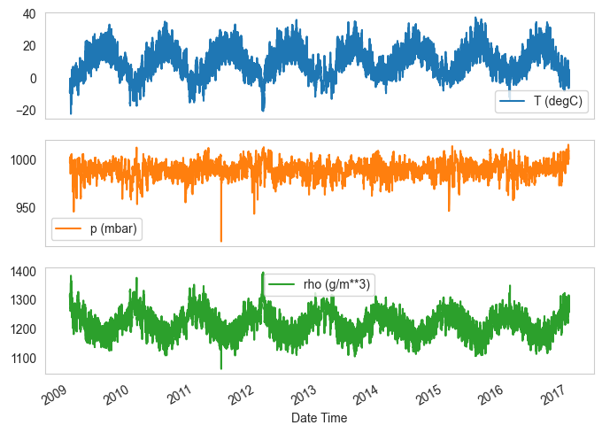

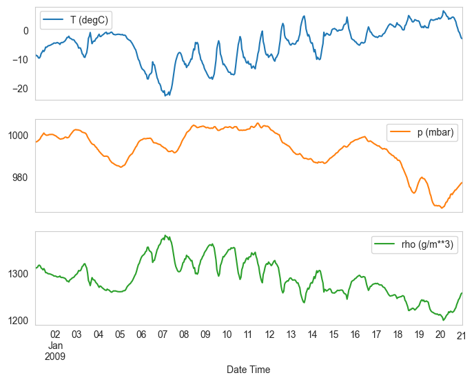

### 检查并清理

查看数据的统计信息：

```python
df.describe().transpose()
```

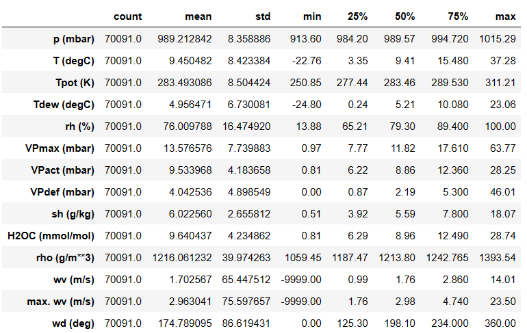

**Wind velocity**

可以看到风速（`wv (m/s)`）和最大风速（`max. wv (m/s)`） 的 `min` 这一列，`-9999` 很可能是错的。

已有一个单独的风向列，因此风速应该不小于零（`>=0`）。将其替换为零：

```python
wv = df['wv (m/s)']
bad_wv = wv == -9999.0
wv[bad_wv] = 0.0

max_wv = df['max. wv (m/s)']
bad_max_wv = max_wv == -9999.0
max_wv[bad_max_wv] = 0.0

# The above inplace edits are reflected in the DataFrame.
df['wv (m/s)'].min()
```

```txt
0.0
```

### 特征工程

在构建模型前，详细了解数据并保证数据格式的正确，这一点非常重要。

**Wind**

数据的最后一列 `wd (deg)` 给出风向。然而角度不是模型的良好输入：360° 和 0° 本质是一样的。

wind 数据的分布如下：

```python
plt.hist2d(df['wd (deg)'], df['wv (m/s)'], bins=(50, 50), vmax=400)
plt.colorbar()
plt.xlabel('Wind Direction [deg]')
plt.ylabel('Wind Velocity [m/s]')
```

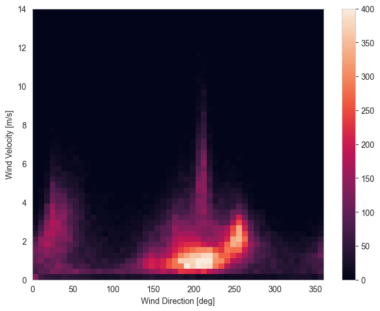

将风向和风速转换为向量，更利于模型理解：

```python
wv = df.pop('wv (m/s)')
max_wv = df.pop('max. wv (m/s)')

# 转换为弧度
wd_rad = df.pop('wd (deg)') * np.pi / 180

# Calculate the wind x and y components.
df['Wx'] = wv * np.cos(wd_rad)
df['Wy'] = wv * np.sin(wd_rad)

# Calculate the max wind x and y components.
df['max Wx'] = max_wv * np.cos(wd_rad)
df['max Wy'] = max_wv * np.sin(wd_rad)
```

风向量的分布，模型理解起来要简单很多：

```python
plt.hist2d(df['Wx'], df['Wy'], bins=(50, 50), vmax=400)
plt.colorbar()
plt.xlabel('Wind X [m/s]')
plt.ylabel('Wind Y [m/s]')
ax = plt.gca()
ax.axis('tight')
```

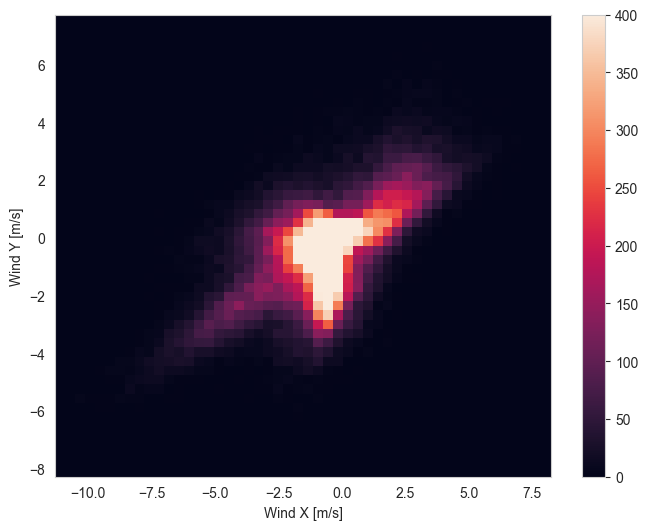

**Time**

类似地，"Date Time" 列也非常重要，但不是这种字符串形式。首先将其转换为秒：

```python
timestamp_s = date_time.map(pd.Timestamp.timestamp)
```

和风向一样，以秒为单位的时间也不利于模型训练。天气数据具有明确的日和年周期性。有很多方法可以处理周期性问题。

可以使用 sine 和 cosine 转换来处理时间信号：

```python
day = 24 * 60 * 60
year = (365.2425) * day

df['Day sin'] = np.sin(timestamp_s * (2 * np.pi / day))
df['Day cos'] = np.cos(timestamp_s * (2 * np.pi / day))
df['Year sin'] = np.sin(timestamp_s * (2 * np.pi / year))
df['Year cos'] = np.cos(timestamp_s * (2 * np.pi / year))
```

```python
plt.plot(np.array(df['Day sin'])[:25])
plt.plot(np.array(df['Day cos'])[:25])
plt.xlabel('Time [h]')
plt.title('Time of day signal')
```


这使得模型获得了最重要的频率特征。等于提前知道了哪些频率是重要的。

如果没有这些信息，可以通过[快速傅里叶变换](https://en.wikipedia.org/wiki/Fast_Fourier_transform)提取特征来确定哪些频率是重要的。

为了验证该假设，下面是温度随时间的变化。可以看到  `1/year` 和 `1/day` 明显的峰值：

```python
fft = tf.signal.rfft(df['T (degC)'])
f_per_dataset = np.arange(0, len(fft))

n_samples_h = len(df['T (degC)'])
hours_per_year = 24 * 365.2524
years_per_dataset = n_samples_h / (hours_per_year)

f_per_year = f_per_dataset / years_per_dataset
plt.step(f_per_year, np.abs(fft))
plt.xscale('log')
plt.ylim(0, 400000)
plt.xlim([0.1, max(plt.xlim())])
plt.xticks([1, 365.2524], labels=['1/Year', '1/day'])
_ = plt.xlabel('Frequency (log scale)')
```

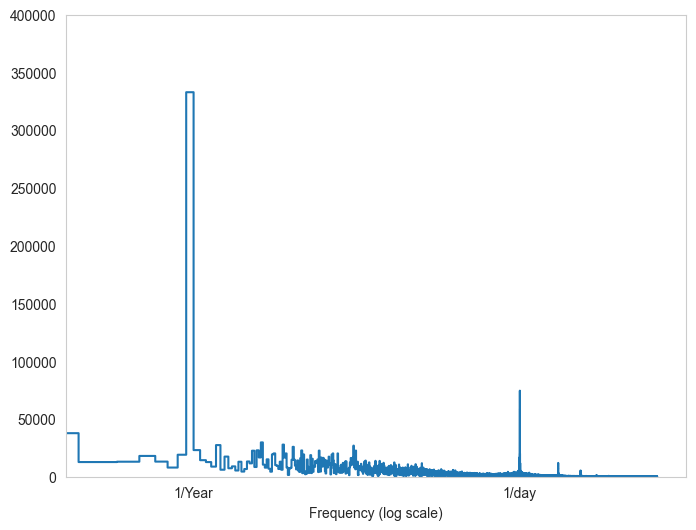

### split 数据

按比例 `(70%, 20%, 10%)` 拆分数据得到训练、验证和测试集。注意，数据在拆分之前没有随机 shuffle。因为：

1. 确保仍然可以将数据分隔成连续样本窗口；
2. 确保验证、测试集更真实，即使用模型训练之后的数据进行评估。

```python
column_indices = {name: i for i, name in enumerate(df.columns)}

n = len(df)
train_df = df[0:int(n * 0.7)]
val_df = df[int(n * 0.7):int(n * 0.9)]
test_df = df[int(n * 0.9):]

num_features = df.shape[1]
```

### 数据标准化

在训练神经网络前缩放特征非常重要。标准化（Normalization）是一种常用的缩放方法：减去均值，然后除以每个特征的标准差。

均值和标准差仅使用训练数据计算，以免泄露验证集和测试集数据。

另外，还有种说法，模型在训练时不应该访问训练集中未来的值，应该使用移动平均来实现这种标准化更好。当然，这不是本教程的重点，因此直接使用简单的标准化：

```python
train_mean = train_df.mean()
train_std = train_df.std()

train_df = (train_df - train_mean) / train_std
val_df = (val_df - train_mean) / train_std
test_df = (test_df - train_mean) / train_std
```

再来看看特征分布。有些特征有长尾巴，但没有像 -9999 这样明显的错误：

```python
df_std = (df - train_mean) / train_std
df_std = df_std.melt(var_name='Column', value_name='Normalized')
plt.figure(figsize=(12, 6))
ax = sns.violinplot(x='Column', y='Normalized', data=df_std)
_ = ax.set_xticklabels(df.keys(), rotation=90)
```


## Data windowing

组合连续样本，生成序列数据。输入窗口的主要特征有：

- input 和 label 窗口的宽度（时间步数）
- input 和 label 之间的时间偏差（offset）
- input 和 label 包含哪些特征

本教程会搭建多个模型，包括 Linear, DNN, CNN 和 RNN 模型，并使用它们执行：

- 单输出和多输出预测
- 单时间步和多时间步预测

下面介绍实现数据 window，可在所有模型使用。

根据任务和模型类型，可能需要生成各种不同的数据窗口。例如：

1. 使用 24 小时的历史信息预测 24 小时后结果，可以按如下方式定义窗口

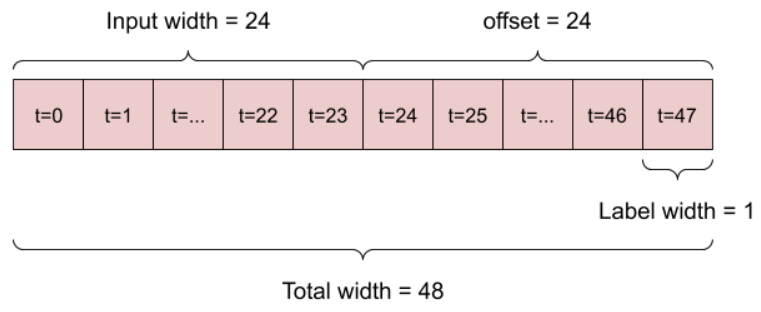

2. 使用 6 小时的历史信息预测 1 小时后的结果：

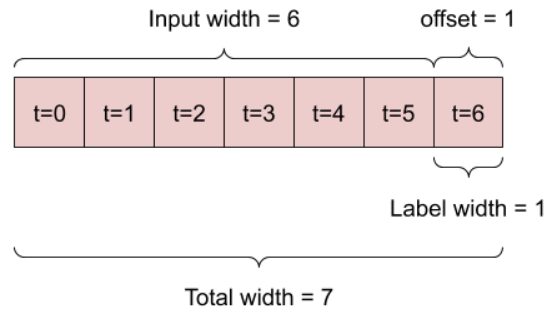

下面定义一个 `WindowGenerator` 类，执行：

1. 处理上图所示的索引和 offset；
2. 生成 `(features, labels)` 对；
3. 绘制 window 内容；
4. 使用 `tf.data.Dataset` 为训练集、验证集和测试集生成 batch 数据

### Indexes and offsets

创建 `WindowGenerator` 类，在 `__init__` 中包括输入和标签的索引逻辑。

```python
class WindowGenerator():
    def __init__(self, input_width, label_width, shift,
                 train_df=train_df, val_df=val_df, test_df=test_df,
                 label_columns=None):
        # Store the raw data.
        self.train_df = train_df
        self.val_df = val_df
        self.test_df = test_df

        # Work out the label column indices.
        self.label_columns = label_columns
        if label_columns is not None:
            self.label_columns_indices = {name: i for i, name in
                                          enumerate(label_columns)}
        self.column_indices = {name: i for i, name in
                               enumerate(train_df.columns)}

        # Work out the window parameters.
        self.input_width = input_width
        self.label_width = label_width
        self.shift = shift

        self.total_window_size = input_width + shift

        self.input_slice = slice(0, input_width)
        self.input_indices = np.arange(self.total_window_size)[self.input_slice]

        self.label_start = self.total_window_size - self.label_width
        self.labels_slice = slice(self.label_start, None)
        self.label_indices = np.arange(self.total_window_size)[self.labels_slice]

    def __repr__(self):
        return '\n'.join([
            f'Total window size: {self.total_window_size}',
            f'Input indices: {self.input_indices}',
            f'Label indices: {self.label_indices}',
            f'Label column name(s): {self.label_columns}'])
```

创建上图的第一个窗口：

```python
w1 = WindowGenerator(input_width=24, label_width=1, shift=24,
                     label_columns=['T (degC)'])
w1
```

```txt
Total window size: 48
Input indices: [ 0  1  2  3  4  5  6  7  8  9 10 11 12 13 14 15 16 17 18 19 20 21 22 23]
Label indices: [47]
Label column name(s): ['T (degC)']
```

创建上图的第二个窗口：

```python
w2 = WindowGenerator(input_width=6, label_width=1, shift=1,
                     label_columns=['T (degC)'])
w2
```

```txt
Total window size: 7
Input indices: [0 1 2 3 4 5]
Label indices: [6]
Label column name(s): ['T (degC)']
```

### Split

给定连续输入，`split_window` 将其转换为 input 和 label。

以 `w2` 拆分为例：


`split_window` 还会处理 `label_columns`，从而可用于单输出和多输出：

```python
def split_window(self, features):
    inputs = features[:, self.input_slice, :]
    labels = features[:, self.labels_slice, :]
    if self.label_columns is not None:
        labels = tf.stack(
            [labels[:, :, self.column_indices[name]] for name in self.label_columns],
            axis=-1)

    # Slicing doesn't preserve static shape information, so set the shapes
    # manually. This way the `tf.data.Datasets` are easier to inspect.
    inputs.set_shape([None, self.input_width, None])
    labels.set_shape([None, self.label_width, None])

    return inputs, labels

WindowGenerator.split_window = split_window
```

演示：

```python
# Stack three slices, the length of the total window.
example_window = tf.stack([np.array(train_df[:w2.total_window_size]),
                           np.array(train_df[100:100 + w2.total_window_size]),
                           np.array(train_df[200:200 + w2.total_window_size])])

example_inputs, example_labels = w2.split_window(example_window)

print('All shapes are: (batch, time, features)')
print(f'Window shape: {example_window.shape}')
print(f'Inputs shape: {example_inputs.shape}')
print(f'Labels shape: {example_labels.shape}')
```

```txt
All shapes are: (batch, time, features)
Window shape: (3, 7, 19)
Inputs shape: (3, 6, 19)
Labels shape: (3, 1, 1)
```

TF 中的数据一般打包为数组，最外层是 batch 维度，中间是 time 或 space (width, height)维度，最里面是 feature 维度。

上面的代码 batch 为 3，包含 7 个时间步，每个时间步 19 个特征。将其拆分为 6 个时间步的 19 特征输入，和 1 个时间步的 1 特征标签。因为 `WindowGenerator`  使用 `label_columns=['T (degC)']` 初始化，所以标签只有一个 feature。

### Plot

可视化拆分窗口：

```python
w2.example = example_inputs, example_labels
```

```python
def plot(self, model=None, plot_col='T (degC)', max_subplots=3):
    inputs, labels = self.example
    plt.figure(figsize=(12, 8))
    plot_col_index = self.column_indices[plot_col]
    max_n = min(max_subplots, len(inputs))
    for n in range(max_n):
        plt.subplot(max_n, 1, n + 1)
        plt.ylabel(f'{plot_col} [normed]')
        plt.plot(self.input_indices, inputs[n, :, plot_col_index],
                 label='Inputs', marker='.', zorder=-10)

        if self.label_columns:
            label_col_index = self.label_columns_indices.get(plot_col, None)
        else:
            label_col_index = plot_col_index

        if label_col_index is None:
            continue

        plt.scatter(self.label_indices, labels[n, :, label_col_index],
                    edgecolors='k', label='Labels', c='#2ca02c', s=64)
        if model is not None:
            predictions = model(inputs)
            plt.scatter(self.label_indices, predictions[n, :, label_col_index],
                        marker='X', edgecolors='k', label='Predictions',
                        c='#ff7f0e', s=64)

        if n == 0:
            plt.legend()

    plt.xlabel('Time [h]')

WindowGenerator.plot = plot
```

根据时间对齐 input, label 和 prediction 并可视化：

```python
w2.plot()
```


也可以绘制其它列，不是示例窗口 `w2` 的标签只有 `T (degC)` 列。

```python
w2.plot(plot_col='p (mbar)')
```

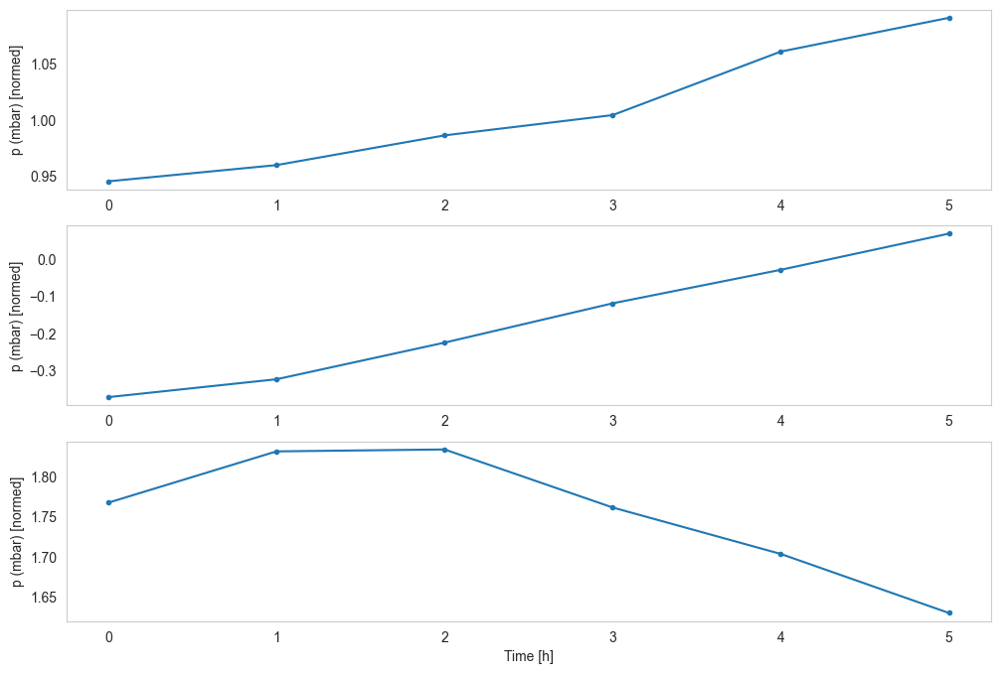

### 创建 tf.data.Dataset

最后，`make_dataset` 方法使用 `tf.keras.utils.timeseries_dataset_from_array` 函数将时间序列 `DataFrame` 转换为 `tf.data.Dataset` `(input_window, label_window)`：

```python
def make_dataset(self, data):
    data = np.array(data, dtype=np.float32)
    ds = tf.keras.utils.timeseries_dataset_from_array(
        data=data,
        targets=None,
        sequence_length=self.total_window_size,
        sequence_stride=1,
        shuffle=True,
        batch_size=32, )

    ds = ds.map(self.split_window)
    return ds


WindowGenerator.make_dataset = make_dataset
```

`WindowGenerator` 对象持有训练集、验证集和测试集。

使用 `make_dataset` 方法定义这些数据集。

```python
@property
def train(self):
    return self.make_dataset(self.train_df)

@property
def val(self):
    return self.make_dataset(self.val_df)

@property
def test(self):
    return self.make_dataset(self.test_df)

@property
def example(self):
    """Get and cache an example batch of `inputs, labels` for plotting."""
    result = getattr(self, '_example', None)
    if result is None:
        # No example batch was found, so get one from the `.train` dataset
        result = next(iter(self.train))
        # And cache it for next time
        self._example = result
    return result

WindowGenerator.train = train
WindowGenerator.val = val
WindowGenerator.test = test
WindowGenerator.example = example
```

现在 `WindowGenerator` 对象提供 `tf.data.Dataset`，从而可以轻松得迭代数据。

`Dataset.element_spec` 属性提供数据集元素的结构、数据类型和 shape。

```python
# Each element is an (inputs, label) pair.
w2.train.element_spec
```

```txt
(TensorSpec(shape=(None, 6, 19), dtype=tf.float32, name=None),
 TensorSpec(shape=(None, 1, 1), dtype=tf.float32, name=None))
```

迭代 `Dataset` 生成 batch 数据：

```python
for example_inputs, example_labels in w2.train.take(1):
    print(f'Inputs shape (batch, time, features): {example_inputs.shape}')
    print(f'Labels shape (batch, time, features): {example_labels.shape}')
```

```txt
Inputs shape (batch, time, features): (32, 6, 19)
Labels shape (batch, time, features): (32, 1, 1)
```

## 单步模型

对这类数据的最简单模型是根据当前条件预测单个特征值。

下面建立模型预测未来 1 小时的 `T (degC)` 值。

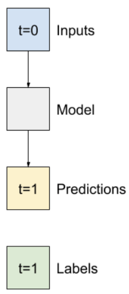

使用 `WindowGenerator` 生成这些数据对 `(input, label)`：

```python
single_step_window = WindowGenerator(
    input_width=1, label_width=1, shift=1,
    label_columns=['T (degC)'])
single_step_window
```

```txt
Total window size: 2
Input indices: [0]
Label indices: [1]
Label column name(s): ['T (degC)']
```

使用 `window` 可以轻松访问数据集：

```python
for example_inputs, example_labels in single_step_window.train.take(1):
    print(f'Inputs shape (batch, time, features): {example_inputs.shape}')
    print(f'Labels shape (batch, time, features): {example_labels.shape}')
```


```txt
Inputs shape (batch, time, features): (32, 1, 19)
Labels shape (batch, time, features): (32, 1, 1)
```

### 基准

在建模前，最好有一个性能基准。

第一个任务是根据当前值的所有特征预测未来 1 小时的温度。当前值包括当前温度。

之间将当前温度作为预测值，将该模型预测基准。因为温度变化缓慢，这是一个合理的基准。


```python
class Baseline(tf.keras.Model):
    def __init__(self, label_index=None):
        super().__init__()
        self.label_index = label_index

    def call(self, inputs):
        if self.label_index is None:
            return inputs
        result = inputs[:, :, self.label_index]
        return result[:, :, tf.newaxis]
```

实例化并评估该模型：

```python
baseline = Baseline(label_index=column_indices['T (degC)'])

baseline.compile(loss=tf.keras.losses.MeanSquaredError(),
                 metrics=[tf.keras.metrics.MeanAbsoluteError()])

val_performance = {}
performance = {}
val_performance['Baseline'] = baseline.evaluate(single_step_window.val)
performance['Baseline'] = baseline.evaluate(single_step_window.test, verbose=0)
```

```txt
439/439 [==============================] - 2s 3ms/step - loss: 0.0128 - mean_absolute_error: 0.0785
```

上面输出的性能指标不是很直观。

`WindowGenerator` 有一个 plot 方法，但只对单个样本。

因此，创建一个更宽的 `WindowGenerator`，一次生成 24 小时连续输入和标签。新的 `wide_window` 不改变模型的操作方式。这里，`time` 轴的作用类似于 `batch`：每个预测相互独立，时间步之间没有交叉。

```python
wide_window = WindowGenerator(
    input_width=24, label_width=24, shift=1,
    label_columns=['T (degC)'])

wide_window
```

```txt
Total window size: 25
Input indices: [ 0  1  2  3  4  5  6  7  8  9 10 11 12 13 14 15 16 17 18 19 20 21 22 23]
Label indices: [ 1  2  3  4  5  6  7  8  9 10 11 12 13 14 15 16 17 18 19 20 21 22 23 24]
Label column name(s): ['T (degC)']
```

该扩展 window 可以直接传入 `baseline` 模型，因为 `baseline` 只是将输入转发到输出，而输入和标签的时间步相同：

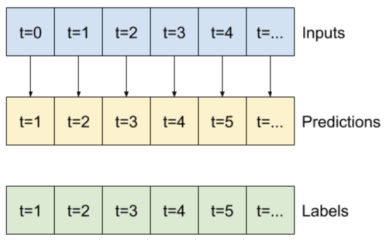

```python
print('Input shape:', wide_window.example[0].shape)
print('Output shape:', baseline(wide_window.example[0]).shape)
```

```txt
Input shape: (32, 24, 19)
Output shape: (32, 24, 1)
```

绘制 `baseline` 模型的预测，起始就是标签向右移动了 1h：

```python
wide_window.plot(baseline)
```


上图是单步模型对 3 个样本 24 小时运行结果：

- 蓝色 `Inputs` 线显示每个时间步的输入温度。该模型接受所有特征，但该图仅显示温度；
- 绿色 `Labels` 点显示标签值。该点显示在预测时间步，而不是输入时间步，所以标签的范围相对输入右移了 1 位；
- 橘色 `Predictions` 显示预测值。如果模型预测完美，预测结果将直接落在 `Labels` 上。

### Linear 模型

对该任务的最简单的模型是在输入和输出之间插入线性变换。此时，指定时间步的输出仅取决于该时间步：


不带 `activation` 的 `tf.keras.layers.Dense` 就是线性模型。该 layer 只是将数据的最后一维从 `(batch, time, inputs)` 转换为 `(batch, time, units)`，其应用独立于 `batch` 和 `time` 轴：

```python
linear = tf.keras.Sequential([
    tf.keras.layers.Dense(units=1)
])
```

```python
print('Input shape:', single_step_window.example[0].shape)
print('Output shape:', linear(single_step_window.example[0]).shape)
```

```txt
Input shape: (32, 1, 19)
Output shape: (32, 1, 1)
```

本教程会训练许多模型，因此将训练过程打包为一个函数：

```python
MAX_EPOCHS = 20

def compile_and_fit(model, window, patience=2):
    early_stopping = tf.keras.callbacks.EarlyStopping(monitor='val_loss',
                                                      patience=patience,
                                                      mode='min')

    model.compile(loss=tf.keras.losses.MeanSquaredError(),
                  optimizer=tf.keras.optimizers.Adam(),
                  metrics=[tf.keras.metrics.MeanAbsoluteError()])

    history = model.fit(window.train, epochs=MAX_EPOCHS,
                        validation_data=window.val,
                        callbacks=[early_stopping])
    return history
```

训练模型，评估性能：

```python
history = compile_and_fit(linear, single_step_window)

val_performance['Linear'] = linear.evaluate(single_step_window.val)
performance['Linear'] = linear.evaluate(single_step_window.test, verbose=0)
```

和 `baseline` 模型一样，linear 模型可以在 wide 窗口的 batch 中调用。


```python
print('Input shape:', wide_window.example[0].shape)
print('Output shape:', baseline(wide_window.example[0]).shape)
```

```txt
Input shape: (32, 24, 19)
Output shape: (32, 24, 1)
```

下面是在 `wide_window` 上的示例预测图，大多情况比 `baseline` 好，但少数情况结果更差：

```python
wide_window.plot(linear)
```

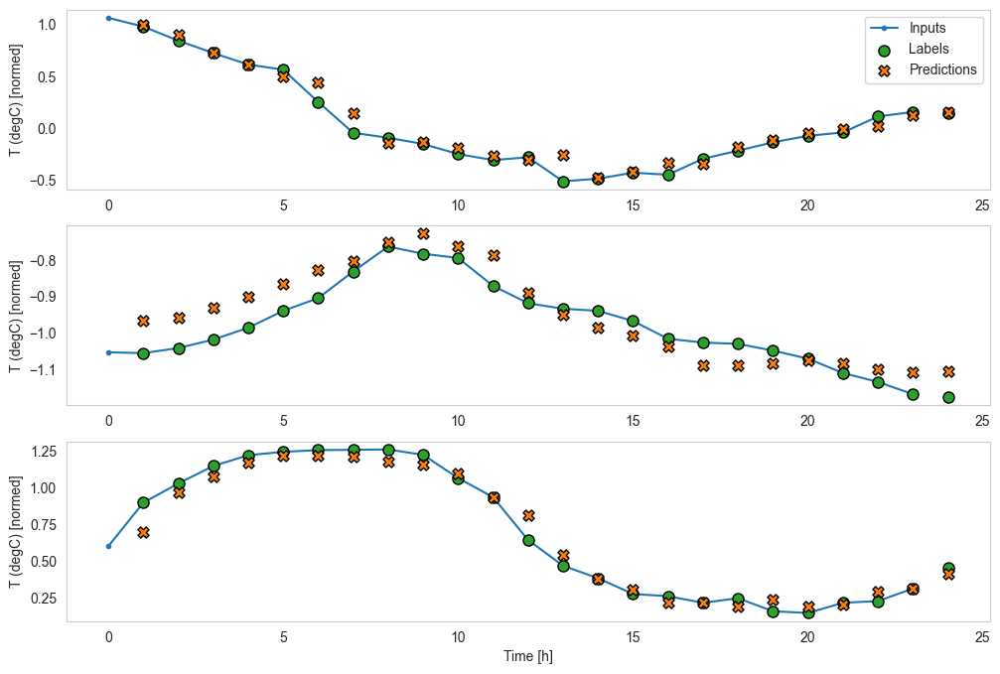

linear 模型的一个优点是解释起来简单。可以提取 layer 的权重并可视化权重和输入：

```python
plt.bar(x=range(len(train_df.columns)),
        height=linear.layers[0].kernel[:, 0].numpy())
axis = plt.gca()
axis.set_xticks(range(len(train_df.columns)))
_ = axis.set_xticklabels(train_df.columns, rotation=90)
```

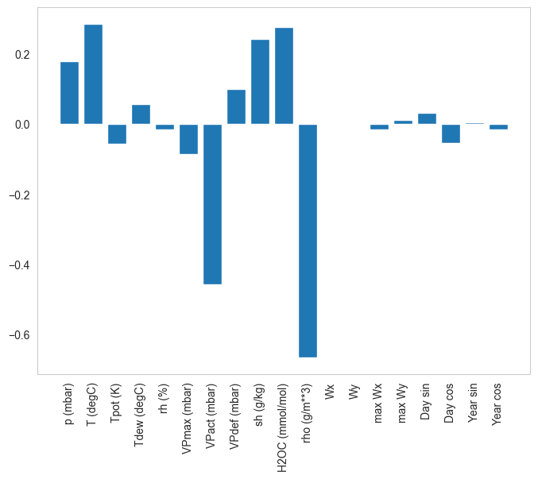

有时，模型甚至没有对输入 `T (degC)` 施加最大权重，这是随机初始化的风险之一。

### Dense

在继续应该多个时间步长的模型前，继续看看单步输入模型性能能到什么程度。

这是一个类似 `linear` 模型，这是在输入和输出之间堆叠了多个 `Dense` 层：

```python
dense = tf.keras.Sequential([
    tf.keras.layers.Dense(units=64, activation='relu'),
    tf.keras.layers.Dense(units=64, activation='relu'),
    tf.keras.layers.Dense(units=1)
])

history = compile_and_fit(dense, single_step_window)

val_performance['Dense'] = dense.evaluate(single_step_window.val)
performance['Dense'] = dense.evaluate(single_step_window.test, verbose=0)
```

```txt
Epoch 1/20
1534/1534 [==============================] - 11s 7ms/step - loss: 0.0147 - mean_absolute_error: 0.0801 - val_loss: 0.0086 - val_mean_absolute_error: 0.0681
Epoch 2/20
1534/1534 [==============================] - 10s 6ms/step - loss: 0.0079 - mean_absolute_error: 0.0645 - val_loss: 0.0076 - val_mean_absolute_error: 0.0638
Epoch 3/20
1534/1534 [==============================] - 10s 6ms/step - loss: 0.0075 - mean_absolute_error: 0.0623 - val_loss: 0.0074 - val_mean_absolute_error: 0.0621
Epoch 4/20
1534/1534 [==============================] - 9s 6ms/step - loss: 0.0073 - mean_absolute_error: 0.0613 - val_loss: 0.0071 - val_mean_absolute_error: 0.0606
Epoch 5/20
1534/1534 [==============================] - 9s 6ms/step - loss: 0.0071 - mean_absolute_error: 0.0603 - val_loss: 0.0072 - val_mean_absolute_error: 0.0606
Epoch 6/20
1534/1534 [==============================] - 9s 6ms/step - loss: 0.0070 - mean_absolute_error: 0.0594 - val_loss: 0.0068 - val_mean_absolute_error: 0.0587
Epoch 7/20
1534/1534 [==============================] - 9s 6ms/step - loss: 0.0068 - mean_absolute_error: 0.0587 - val_loss: 0.0071 - val_mean_absolute_error: 0.0606
Epoch 8/20
1534/1534 [==============================] - 9s 6ms/step - loss: 0.0068 - mean_absolute_error: 0.0584 - val_loss: 0.0069 - val_mean_absolute_error: 0.0595
439/439 [==============================] - 1s 3ms/step - loss: 0.0069 - mean_absolute_error: 0.0595
```

### 多步 dense

使用多个时间步进行预测：

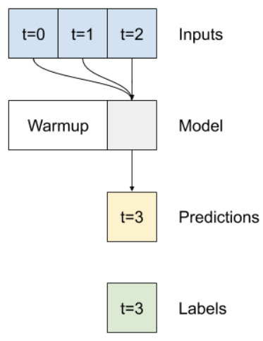

使用 `WindowGenerator` 生成 3h 输入和 1h 标签数据。注意，`shift` 是两个 window 

## 参考

- https://www.tensorflow.org/tutorials/structured_data/time_series
