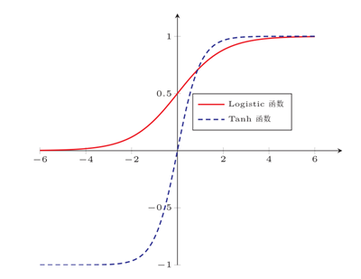

# 激活函数

- [激活函数](#激活函数)
  - [简介](#简介)
  - [输出层激活函数](#输出层激活函数)
    - [softmax](#softmax)
  - [阶跃函数](#阶跃函数)
  - [Sigmoid 函数](#sigmoid-函数)
    - [Logistic 函数](#logistic-函数)
    - [Tanh 函数](#tanh-函数)
    - [Hard-Logistic 和 Hard-Tanh](#hard-logistic-和-hard-tanh)
  - [ReLU](#relu)
  - [参考](#参考)

2021-05-26, 15:47
@Jiawei Mao
***

## 简介

激活函数在神经元中非常重要，为了增强网络的表示能力和学习能力，激活函数需要具备以下几点性质：

1. 连续并可导（允许少数点不可导）的**非线性函数**。可导的激活函数可以直接利用数值优化的方法来学习网络参数。
2. 激活函数及其导函数要尽可能简单，有利于提高网络计算效率。
3. 激活函数的导函数的值要在一个合适的区间内，否则会影响训练的效率和稳定性。

激活函数将输入信号的总和转换为输出信号。

感知机和神经网络的主要差别就在于**激活函数**。

## 输出层激活函数

输出层所用的激活函数，要根据求解问题的性质决定。一般地：

- 回归问题可以用恒等函数；
- 二元分类问题可以使用 sigmoid 函数；
- 多元分类问题可以使用 softmax 函数。

### softmax

分类问题中使用的 softmax 函数可以用下面的式子表示：

$$
y_k=\frac{exp(a_k)}{\sum_{i=1}^n exp(a_i)} \tag{1}
$$

式子（1）表示假设输出层有 n 个神经元，计算第 k 个神经元的输出 $y_k$。softmax 函数的分子是输入信号 $a_k$ 的指数函数，分母是所有输入信号的指数函数的和。

由于指数计算所得值容易非常大，超出计算机表示范围会出现溢出问题，式子（1）可以进行如下改进：

$$
\begin{aligned}
y_k &= \frac{exp(a_k)}{\sum_{i=1}^n exp(a_i)}\\
&= \frac{Cexp(a_k)}{C\sum_{i=1}^n exp(a_i)}\\
&=\frac{exp(a_k+logC)}{\sum_{i=1}^n exp(a_i+logC)}\\
&=\frac{exp(a_k+C')}{\sum_{i=1}^n exp(a_i+C')}
\end{aligned}
\tag{2}
$$

式子（2）说明，在进行 softmax 指数运算时，加上或减去某个常数并不会改变运算的结果。这里的 C' 可以使用任何值，但是为了防止溢出，一般会使用信号中的最大值。

softmax 函数 Python 实现：

```py
def softmax(x):
    if x.ndim == 2:
        x = x.T
        x = x - np.max(x, axis=0)
        y = np.exp(x) / np.sum(np.exp(x), axis=0)
        return y.T

    x = x - np.max(x)  # 溢出对策
    return np.exp(x) / np.sum(np.exp(x))
```

softmax 函数特征：

- softmax 函数的输出值在 0.0 到 1.0 之间；
- softmax 函数输出值的总和是 1，该性质使我们可以把 softmax 函数的输出解释为 “概率”。

一般而言，神经网络只把输出值最大的神经元所对应的类别作为识别结果。并且，即便使用 softmax 函数，输出值最大的神经元的位置也不会变。因此，神经网络在进行分类时，输出层的 softmax 函数可以省略。

在实际问题种，由于指数函数的运算量较大，因此输出层的 softmax 函数一般会省略。

## 阶跃函数

$$
h(x)=\begin{cases}
    0 \quad(x \le 0) \\
    1 \quad(x > 0)
\end{cases}
\tag{2}
$$

阶跃函数可以看作一个特殊的激活函数，根据输入是否达到阈值，输出 0 或者 1，**感知机**使用该激活函数。

Python 实现：

```py
def step_function(x):
    if x > 0:
        return 1
    else:
        return 0
```

## Sigmoid 函数

Sigmoid 型函数指一类 S 型曲线函数，为两端饱和函数。常用的 Sigmoid 型函数有 Logistic 函数和 Tanh 函数。

> 对函数 f(x)，若 $x\rightarrow -\infty$ 时，其导数 $f'(x) \rightarrow 0$，则称为**左饱和**。若 $x\rightarrow +\infty$时，其导数 $f'(x) \rightarrow 0$，则称其为**右饱和**。当同时满足左、右饱和时，就称为**两端饱和**。



相对阶跃函数，Sigmoid 函数有两个重要特征；

1. sigmoid 函数是一条平滑的曲线，其平滑性对神经网络的学习具有重要意义；
2. 相对阶跃函数只能返回 0 和 1，sigmoid 函数可以返回指定范围内的任意实数。

### Logistic 函数

Logistic 函数定义如下：

$$
\sigma (x)= \frac{1}{1+e^{-x}} \tag{3}
$$

特征：

- 当输入值在 0 附近时，Sigmoid 型函数近似为线性函数
- 当输入值靠近两端时，对输入进行抑制，输入越小，越接近0；输入越大，越接近 1

Logistic 函数的性质使得对应神经元具有以下特征：

- 输出可以直接看作概率分布，使得神经网络可以很好地和统计学习模型结合；
- 可以看作一个软性门（soft gate），用来控制其它 神经元信输出信息的数量。

Python 实现：

```py
import numpy as np

def sigmoid(x):
    return 1 / (1 + np.exp(-x))
```

### Tanh 函数

Tanh 也是一种 Sigmoid 函数，其定义为：

$$
tanh(x)=\frac{exp(x)-exp(-x)}{exp(x)+exp(-x)} \tag{4}
$$

Tanh 函数可以看作放大并平移的 Logistic 函数，其值域为 (-1,1)。

Tanh 函数的树池是零中心化的（zero-centered），而 Logistic 函数的输出恒大于 0.非零中心化的输出会使得最后一层神经元的输入发生偏置转移（bias shift），并进一步使得梯度下降的收敛速度变慢。

### Hard-Logistic 和 Hard-Tanh

Logistic 函数和 Tanh 函数都是 Sigmoid 型函数，具有饱和性，但是计算开销较大。由于这两个函数都是在中间（0附近）近似线性，两端饱和，因此可以通过分段函数来近似。

以 Logistic 函数 $\sigma(x)$ 为例，其导数 $\sigma'(x)=\sigma(x)(1-\sigma(x))$。Logistic 函数在 0 附近的一阶泰勒展开为：

## ReLU

ReLU（Rectified Linear Unit, 修正线性单元）是目前深度神经网络中最常使用的激活函数。其定义为：

$$
\begin{aligned}
\sigma(x)&=\begin{cases}
x \quad (x>0)\\
0 \quad (x \le 0)
\end{cases}\\
&=max(0,x)
\end{aligned}
\tag{5}
$$


Python 实现：

```py
def relu(x):
    return np.maximum(0, x)
```

## 参考

- 深度学习入门：基于 Python 的理论与实现，斋藤康毅
