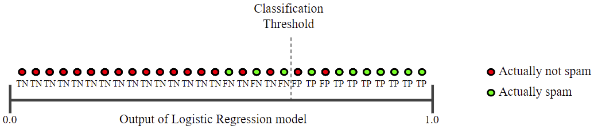
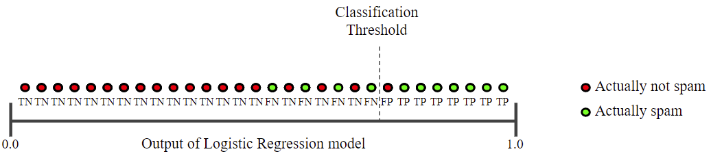
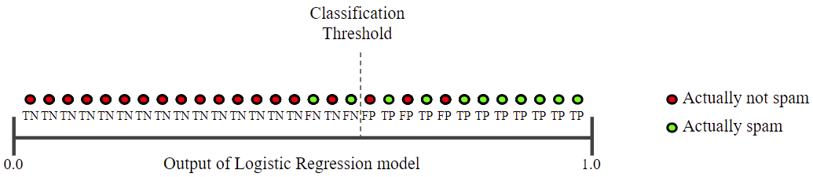
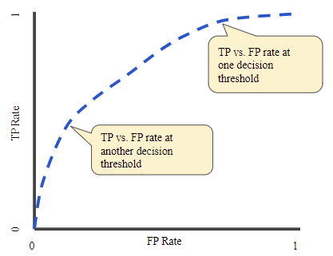
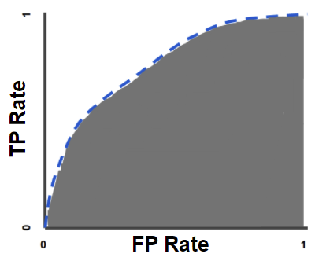
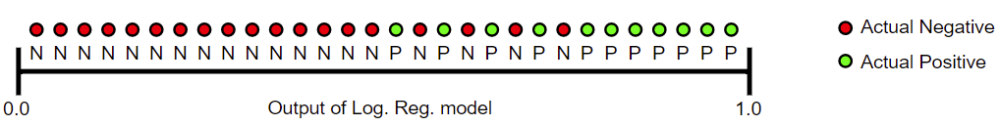

# 性能度量

- [性能度量](#性能度量)
  - [混淆矩阵（Confusion matrix）](#混淆矩阵confusion-matrix)
  - [阈值（Threshold）](#阈值threshold)
  - [True Positive 和 False Positive](#true-positive-和-false-positive)
  - [准确度（Accuracy）](#准确度accuracy)
  - [精度（Precision）](#精度precision)
  - [召回率（Recall）](#召回率recall)
  - [精度和召回率](#精度和召回率)
  - [ROC 曲线和 AUC](#roc-曲线和-auc)
    - [ROC 曲线](#roc-曲线)
    - [AUC](#auc)
  - [分类：预测偏差](#分类预测偏差)
  - [参考](#参考)

***

## 混淆矩阵（Confusion matrix）

混淆矩阵（confusion matrix）展示**分类模型**所做正确和不正确预测的数量的 $N\times N$ 表格。例如，下面是一个二分类模型的混淆矩阵：

||Tumor (预测)|Non-Tumor (预测)|
|---|---|---|
|Tumor (真实)|18 (TP)|1 (FN)|
|Non-Tumor (真实)|6 (FP)|452 (TN)|

上述混淆矩阵说明：

- 19 个肿瘤样本，模型正确分类了 18 个，错误分类了 1 个；
- 458 个非肿瘤样本，模型正确分类了 452 个，错误分类了 6 个。

对**多分类问题**，混淆矩阵有注意识别错误的模式。例如，下面是一个鸢尾花三分类模型的混淆矩阵 (Virginica, Versicolor 和 Setosa)，当样本实际为 Virginica，从混淆矩阵可以看出模型更容易将其错误分类为 Versicolor 而不是 Setosa：

||Setosa (预测)|Versicolor (预测)|Virginica (预测)|
|---|---|---|---|
|Setosa (真实)|88|12|0|
|Versicolor (真实)|6|141|7|
|Virginica (真实)|2|27|109|

混淆矩阵包含用来计算各种性能指标的信息，包括准确率和召回率。

## 阈值（Threshold）

逻辑回归返回一个概率，可以直接使用返回的概率，例如，用户点击此广告的概率为 0.00023，也可以将概率转换为分类，比如，此电子邮件是垃圾邮件。

例如邮件分类的逻辑回归模型，对特定电子邮件返回概率 0.9995，说明该邮件很可能是垃圾邮件。相反，另一封邮件的预测打分为 0.0003，表明该电子邮件很可能不是垃圾邮件。那么，如果预测打分为 0.6 呢？为了将逻辑回归预测值转换为分类，必须定义一个**分类阈值**（classification）或**决策阈值** (decision threshold)。高于该阈值为垃圾邮件，低于该阈值为非垃圾邮件。阈值的定义依赖于问题，需要优化。

> **NOTE:** 逻辑回归阈值的优化（tune）不同于学习率等超参数的 tune。选择决策阈值一方面是评估犯错后的代价有多大，例如，错误地将非垃圾邮件标记为垃圾邮件不可取，虽然将垃圾邮件标记为非垃圾邮件也不好，但是代价更低。

## True Positive 和 False Positive

下面定义评估分类模型度量的基础。垃圾邮件分类为例，假定：

- 垃圾邮件为**正类**（positive class）
- 非垃圾邮件为**负类**（negative class）

可以用一个 $2\times 2$ 混淆矩阵总结模型预测的 4 种可能结果：

||垃圾邮件 (预测)|非垃圾邮件 (预测)|
|---|---|---|
|垃圾邮件 (真实)|真阳（True Positive, TP）|假阴（False Negative, FN）|
|非垃圾邮件 (真实)|假阳（False Positive, FP）|真阴（True Negative, TN）|

- 真阳（true positive）是模型正确预测的 positive 样本；即预测是垃圾邮件，实际是垃圾邮件；
- 真阴（true negative）是模型正确预测的 negative 样本；即预测不是垃圾邮件，实际不是垃圾邮件；
- 假阳（false positive）是模型错误地将样本预测为 positive (实际为 negative)；即预测是垃圾邮件，实际不是垃圾邮件；
- 假阴（false negative）是模型错误地将样本预测为 negative (实际为 positive)。即预测不是垃圾邮件，实际是垃圾邮件。

## 准确度（Accuracy）

**准确度**（Accuracy）是评估分类模型的一个指标，表示**模型正确分类的比例**。定义如下：

$$准确度=\frac{正确分类数}{总预测数}$$

对二元分类，准确度可以按如下方式定义：

$$准确度=\frac{TP+TN}{TP+TN+FP+FN}$$

分子 $TP+TN$ 就是正确分类数，分母 $TP+TN+FP+FN$ 就是总的预测数。

假设有一个将肿瘤分为恶性（positive）和良性（negative）的模型：

||恶性 (真实)|良性 (真实)|
|---|---|---|
|恶性 (预测)|真阳（True Positive, TP）：  - 真实：恶性 - 预测：恶性  - TP 数：1|假阳（False Positive, FP）：  - 真实：良性 - 预测：恶性 - FP 数：1|
|良性 (预测)|假阴（False Negative, FN）： - 真实：恶性 - 预测：良性 - FN 数：8|真阴（True Negative, TN）： - 实际：良性 - 预测：良性 - TN 数：90|

$$准确度=\frac{TP+TN}{TP+TN+FP+FN}=\frac{1+90}{1+90+1+8}=0.91$$

准确度为 0.91，即 100 个预测样本中有 91 个预测正确，91% 的准确度看着还可以。

继续分析，100 个肿瘤样本，其中 91 个为良性肿瘤（90 TN + 1 FP），9 个恶性肿瘤（1 TP + 8 FN）。91 个良性肿瘤模型正确识别出 90 个；然而 9 个恶性肿瘤模型只识别出 1 个，这就很不对了。

所以，虽然 91% 的准确度咋一看还不错，但对任何样本都预测为良性也能达到 91% 的准确度。换句话说，该模型并不比一个没有任何预测能力的模型好。

对类别不平衡的数据集，positive 和 negative 样本数相差很大，准确度并不是一个很好评估模型的指标。

## 精度（Precision）

精度表示预测为 positive 的样本中，预测正确的比例。定义如下：

$$精度（Precision）=\frac{TP}{TP+FP}$$

> **NOTE:** 如果模型预测结果没有 FP，则精度为 1.0

依然以肿瘤为例：

||恶性 (真实)|良性 (真实)|
|---|---|---|
|恶性 (预测)|True Positive (TP): 1|False Positive (FP): 1|
|良性 (预测)|False Negative (FN): 8|True Negative (TN): 90|

$$精度（Precision）=\frac{TP}{TP+FP}=\frac{1}{1+1}=0.5$$

**模型的精度为 0.5，换句话说，当它预测某个肿瘤是恶性的，其正确率为 50%**。

## 召回率（Recall）

召回率表示真实 positive 样本中，被正确分类的比例。定义：

$$召回率（Recall）=\frac{TP}{TP+FN}$$

> **NOTE:** 如果模型没有产生 FN 结果，召回率为 1.0

示例：

||恶性 (真实)|良性 (真实)|
|---|---|---|
|恶性 (预测)|True Positive (TP): 1|False Positive (FP): 1|
|良性 (预测)|False Negative (FN): 8|True Negative (TN): 90|

$$召回率（Recall）=\frac{TP}{TP+FN}=\frac{1}{1+8}=0.11$$

模型的召回率为 0.11，即它**正确识别了所有恶性肿瘤的 11%**。

## 精度和召回率

要充分评估一个模型的有效性，精度和召回率都要检查。然而这两个指标经常难以同时提高。提高精度往往会降低召回率，反之亦然。以电子邮件分类模型为例：

根据上图计算精度和召回率：

||垃圾邮件 (真实)|非垃圾邮件 (真实)|
|---|---|---|
|垃圾邮件 (预测)|True Positive (TP): 8|False Positive (FP): 2|
|非垃圾邮件 (预测)|False Negative (FN): 3|True Negative (TN): 17|

**精度**表示预测为垃圾邮件的样本中，预测正确的比例：

$$精度（Precision）=\frac{TP}{TP+FP}=\frac{8}{8+2}=0.8$$

**召回率**表示真实垃圾邮件样本中，预测正确的比例：

$$召回率（Recall）=\frac{TP}{TP+FN}=\frac{8}{8+3}=0.73$$

- 下图是增加分类阈值的效果：

增加分类阈值，导致 FP 减少，FN 增加。结果就是精度增加，召回率减少：

||垃圾邮件 (真实)|非垃圾邮件 (真实)|
|---|---|---|
|垃圾邮件 (预测)|True Positive (TP): 7|False Positive (FP): 1|
|非垃圾邮件 (预测)|False Negative (FN): 4|True Negative (TN): 18|

$$精度（Precision）=\frac{TP}{TP+FP}=\frac{7}{7+1}=0.88$$

$$召回率（Recall）=\frac{TP}{TP+FN}=\frac{7}{7+4}=0.64$$

显然，提高分类阈值，使得精度提高，召回率降低。

- 下图是降低分类阈值的效果

||垃圾邮件 (真实)|非垃圾邮件 (真实)|
|---|---|---|
|垃圾邮件 (预测)|True Positive (TP): 9|False Positive (FP): 3|
|非垃圾邮件 (预测)|False Negative (FN): 2|True Negative (TN): 16|

$$精度（Precision）=\frac{TP}{TP+FP}=\frac{9}{9+3}=0.75$$

$$召回率（Recall）=\frac{TP}{TP+FN}=\frac{9}{9+2}=0.82$$

显然，降低分类阈值，使得精度精度，召回率提高。

## ROC 曲线和 AUC

### ROC 曲线

ROC 曲线（受试者工作特征）显示分类模型在所有分类阈值的性能。该曲线绘制两个参数：

- 纵轴：真阳性率（True Positive Rate, TPR）
- 横轴：假阳性率（False Positive Rate, FPR）

真阳性率 TPR 定义等同召回率，即：

$$TPR=\frac{TP}{TP+FN}$$

假阳性率 FPR 定义：

$$FPR=\frac{FP}{FP+TN}$$

ROC 曲线图显示不同分类阈值下的 TPR 和 FPR。降低分类阈值会将更多样本划分为 positive，从而提高 FP 和 TP。下图是典型的 ROC 曲线：

要计算 ROC 曲线，可以用不同的分类阈值多次评估分类模型，但这样效率很低。基于排序算法的 AUC 更高效。

### AUC

AUC（Area under the ROC Curve）表示 ROC 曲线下的面积。

AUC 提供了所有可能分类阈值下的性能总度量，可以解释为模型预测一个随机 positive 样本的概率比随机 negative 样本高的概率。例如，下面将样本按照 logistic 回归预测打分从左到右升序排列：

AUC 表示随机 positive 样本 (绿)在随机 negative 样本（红）右侧的概率。

AUC 范围从 0 到 1，预测 100% 错误的模型 AUC 为 0.0；预测 100% 正确的模型 AUC 为 1.0.

AUC 的优点：

- AUC 是 scale-invariant。它基于预测排序的好坏，而不是绝对值；
- AUC 是 classification-threshold-invariant。AUC 评估模型预测性能不受分类阈值影响。

然后，这两个优点也带来了缺点，从而限制 AUC 在某些情况的应用：

- Scale-invariance 有时不可取。比如，需要准确的概率输出，而 AUC 没有提供相关信息；
- Classification-threshold invariance 有时不可取。当 FN 和 FP 的代价相差很大时，最小化其中一种的分类错误直观重要。比如，在垃圾邮件检测中，可能优先考虑最小化 FP（即使导致 FN 显著增加也可以）。AUC 对这类优化没有作用。

## 分类：预测偏差

逻辑回归预测应该是不偏不倚的，即：

$$预测均值 \approx 样本均值$$

**预测偏差**（prediction bias）衡量这两个均值的距离：

$$预测偏差=预测均值-数据集标签均值$$

> **NOTE:** 预测偏差（bias）与模型中的 bias 是两个不同的量。

显著的非零预测偏差说明模型中存在错误，因为模型错误估计了 positive 样本出现的频率。

例如，假设我们知道平均有 1% 垃圾电子邮件。如果我们对给定邮件一无所知，则预测它为垃圾邮件的概率应该是 1%。同样，一个好的垃圾邮件模型应该预测平均 1% 的电子邮件是垃圾邮件，即平均每封邮件为垃圾邮件的概率为 1%。此时，如果模型预测平均 20% 的邮件为垃圾邮件，就说明模型存在预测偏差。

预测偏差的可能原因：

- 特征集不完整
- 噪音数据
- 训练样本有 bias
- 正则化太强

你可能会试图通过对模型进行后处理来纠正预测偏差，即添加一个校准层来调整模型输出。例如，如果模型有 +3% bias，你可以添加一个校准层对平均预测降低 3% 。然而，增加校准层并不好：

- 治标不治本
- 模型太脆弱，必须随时更新

## 参考

- https://developers.google.com/machine-learning/crash-course/classification/video-lecture
- https://developers.google.com/machine-learning/glossary