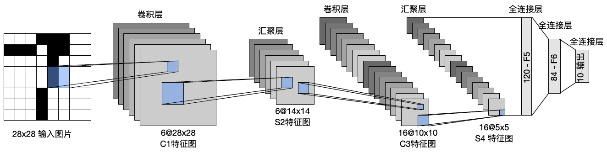
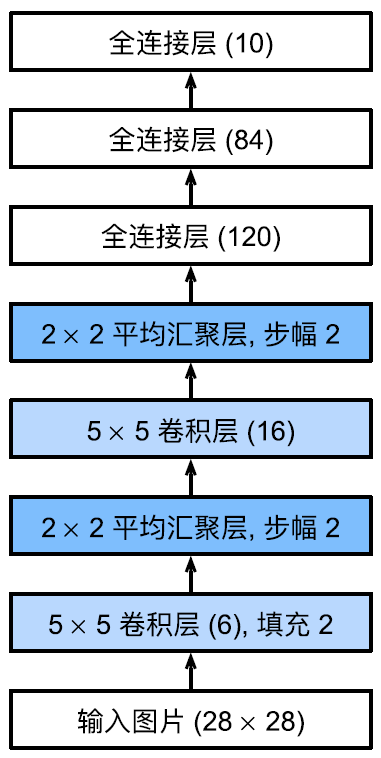
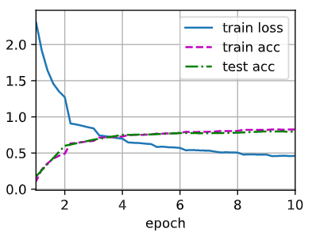

# LeNet

- [LeNet](#lenet)
  - [简介](#简介)
  - [PyTorch 实现](#pytorch-实现)
  - [参考](#参考)

***

## 简介

LeNet 由 Yann LeCun 于 1989 年提出，卷积网络开篇之作，用来识别图像中的手写数字。

LeNet 被广泛用于自动取款机（ATM）中，帮助识别处理支票数字。时至今日，一些自动取款机仍在运行 Yann LuCun 和他的同事 Leon Bottou 在上世纪 90 年代写的代码。

总结：

- LeNet 是早期成功的神经网络
- 先使用卷积层来学习图片空间信息
- 然后使用全连接层来转换到类别空间
- 特点：通过共享卷积核减少了网络参数

总体来说，LeNet (LeNet-5) 由两部分组成：

- 卷积编码器：由两个卷积层组成；
- 全连接层：由三个全连接层组成。

如下图所示：



> LeNet 数据流，输入是手写数字，输出为 10 种可能结果的概率。

每个卷积块包括：卷积层、sigmoid 激活函数和平均池化。

说明：

1. 输入：32x32 图片
2. 5x5 卷积（输出 6@28x28）+ sigmoid + stride=1
3. 2x2 池化（输出 6@14x14）stride=2
4. 5x5 卷积（输出 16@10x10）+ sigmoid + stride=1
5. 2x2 池化（输出 16@5x5）stride=2
6. 全连接：120+sigmoid
7. 全连接：84+sigmoid
8. 全连接：10+sigmoid

> **NOTE** 虽然 ReLU 和最大池化更有效，但它们在 20 世纪 90 年代还没出现。

## PyTorch 实现

```python
import torch
from torch import nn

net = nn.Sequential(
    nn.Conv2d(1, 6, kernel_size=5, padding=2), nn.Sigmoid(),
    nn.AvgPool2d(kernel_size=2, stride=2),
    nn.Conv2d(6, 16, kernel_size=5), nn.Sigmoid(),
    nn.AvgPool2d(kernel_size=2, stride=2),
    nn.Flatten(),
    nn.Linear(16 * 5 * 5, 120), nn.Sigmoid(),
    nn.Linear(120, 84), nn.Sigmoid(),
    nn.Linear(84, 10)
)
```

除了去掉了最后一层的高斯激活，这个网络与最初的 LeNet-5 一致。

下面将一个 28x28 的单通道（黑白）图像通过 LeNet。结构如下：



打印模型：

```python
X = torch.rand(size=(1, 1, 28, 28), dtype=torch.float32)
for layer in net:
    X = layer(X)
    print(layer.__class__.__name__,'output shape: \t',X.shape)
```

```txt
Conv2d output shape: 	 torch.Size([1, 6, 28, 28])
Sigmoid output shape: 	 torch.Size([1, 6, 28, 28])
AvgPool2d output shape: 	 torch.Size([1, 6, 14, 14])
Conv2d output shape: 	 torch.Size([1, 16, 10, 10])
Sigmoid output shape: 	 torch.Size([1, 16, 10, 10])
AvgPool2d output shape: 	 torch.Size([1, 16, 5, 5])
Flatten output shape: 	 torch.Size([1, 400])
Linear output shape: 	 torch.Size([1, 120])
Sigmoid output shape: 	 torch.Size([1, 120])
Linear output shape: 	 torch.Size([1, 84])
Sigmoid output shape: 	 torch.Size([1, 84])
Linear output shape: 	 torch.Size([1, 10])
```

第一个卷积层使用了 2 像素的 padding，来补偿 5x5 卷积核导致的特征减少。可以看到，尺寸不断变小，通道不断变多，通道可以看做提取出来的模式信息。

LeNet 在 Fashion-MNIST 数据集上的表现：

```python
import torchvision
from torchvision import transforms
from torch.utils import data

batch_size = 256
mnist_train = torchvision.datasets.FashionMNIST(
    root="../data", train=True, transform=transforms.ToTensor(), download=True)
mnist_test = torchvision.datasets.FashionMNIST(
    root="../data", train=False, transform=transforms.ToTensor(), download=True)

train_iter = data.DataLoader(mnist_train, batch_size, shuffle=True,
    num_workers=4)
test_iter = data.DataLoader(mnist_test, batch_size, shuffle=False,
    num_workers=4)
```

由于计算量较大，所以要使用 GPU，在模型使用 GPU 前将其复制到显存：

```python
def evaluate_accuracy_gpu(net, data_iter, device=None):  #@save
    """使用GPU计算模型在数据集上的精度"""
    if isinstance(net, nn.Module):
        net.eval()  # 设置为评估模式
        if not device:
            # 取第一个 net 的 device
            device = next(iter(net.parameters())).device 
    # 正确预测的数量，总预测的数量
    metric = d2l.Accumulator(2)
    with torch.no_grad():
        for X, y in data_iter:
            if isinstance(X, list):
                # BERT微调所需的（之后将介绍）
                # 如果是 list，就每个都挪到 device
                X = [x.to(device) for x in X]
            else:
                X = X.to(device)
            y = y.to(device)
            metric.add(d2l.accuracy(net(X), y), y.numel())
    return metric[0] / metric[1]
```

在进行正向和反向传播之前，还需要将每一小批量数据移动到指定设备（如 GPU）。为了使用 GPU，训练函数也需要修改一下：

```python
def train_ch6(net, train_iter, test_iter, num_epochs, lr, device):
    """用GPU训练模型"""
    def init_weights(m):
        # 初始化权重
        if type(m) == nn.Linear or type(m) == nn.Conv2d:
            nn.init.xavier_uniform_(m.weight)

    net.apply(init_weights)
    print('training on', device)
    net.to(device)
    optimizer = torch.optim.SGD(net.parameters(), lr=lr)
    loss = nn.CrossEntropyLoss()
    # 动画效果，不影响训练
    animator = d2l.Animator(xlabel='epoch', xlim=[1, num_epochs],
        legend=['train loss', 'train acc', 'test acc'])
    timer, num_batches = d2l.Timer(), len(train_iter)
    for epoch in range(num_epochs):
        # 训练损失之和，训练准确率之和，样本数
        metric = d2l.Accumulator(3)
        net.train()
        for i, (X, y) in enumerate(train_iter):
            timer.start()
            optimizer.zero_grad()
            X, y = X.to(device), y.to(device)
            y_hat = net(X)
            l = loss(y_hat, y)
            l.backward()
            optimizer.step()
            with torch.no_grad():
                metric.add(l * X.shape[0], d2l.accuracy(y_hat, y), X.shape[0])
            timer.stop()
            train_l = metric[0] / metric[2]
            train_acc = metric[1] / metric[2]
            if (i + 1) % (num_batches // 5) == 0 or i == num_batches - 1:
                animator.add(epoch + (i + 1) / num_batches,
                    (train_l, train_acc, None))
        test_acc = evaluate_accuracy_gpu(net, test_iter)
        animator.add(epoch + 1, (None, None, test_acc))
    print(f'loss {train_l:.3f}, train acc {train_acc:.3f}, '
          f'test acc {test_acc:.3f}')
    print(f'{metric[2] * num_epochs / timer.sum():.1f} examples/sec '
          f'on {str(device)}')
```

```txt
loss 0.461, train acc 0.826, test acc 0.795
10959.7 examples/sec on cpu
```



## 参考

- Yann Lecun, Leon Bottou, Y. Bengio, Patrick Haffner. Gradient-Based Learning Applied to Document Recognition. Proceedings of the IEEE, 1998.
- 《动手学深度学习》 Aston Zhang, Mu Li, Zachary C. Lipton, Alexander J. Smola
