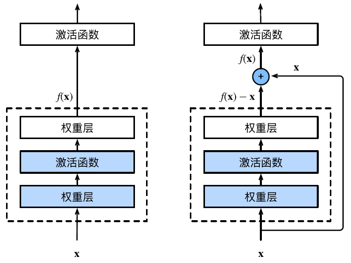
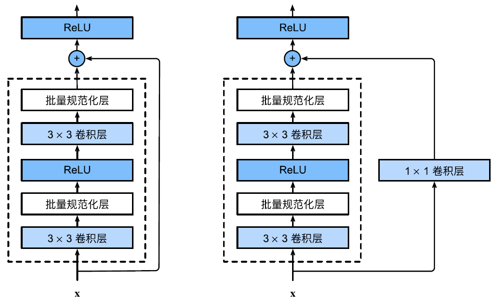
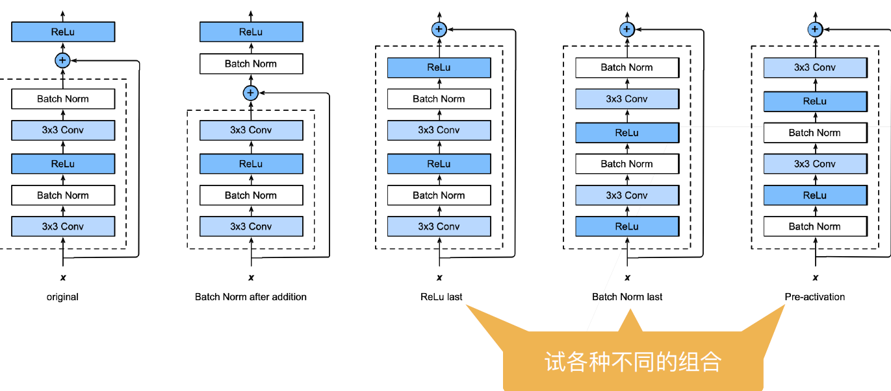

# ResNet

- [ResNet](#resnet)
  - [简介](#简介)
    - [残差块](#残差块)
    - [ResNet 块细节](#resnet-块细节)
    - [不同的残差块](#不同的残差块)
  - [参考](#参考)

***

## 简介

假设在卷积神经网络只想了解一个神经网络，那么一定是 ResNet (残差网络)。

ResNet 在 2015 年由微软实验室提出，斩获当年 ImageNet 竞赛中分类任务第一名，目标检测第一名。获得 COCO 数据集中目标检测第一名，图像分割第一名。

ResNet 结构的亮点：

- 超深的网络结构（突破 1000 层）
- 提出 residual 模块
- 使用 BN 加速训练

### 残差块

串联一个层改变函数类，我们希望能扩大函数类。残差块引入快速通道得到：

$$f(x)=x+g(x)$$

如下图所示：

> 正常块（左图）和残差块（右图）

这个模型最大优点是，就算学到的 $g(x)$ 啥都不干，至少得到 $x$。

### ResNet 块细节

> 包含以及不包含 1x1 卷积层的残差块

### 不同的残差块

## 参考

- https://github.com/WZMIAOMIAO/deep-learning-for-image-processing
- https://zh-v2.d2l.ai/chapter_convolutional-modern/resnet.html
