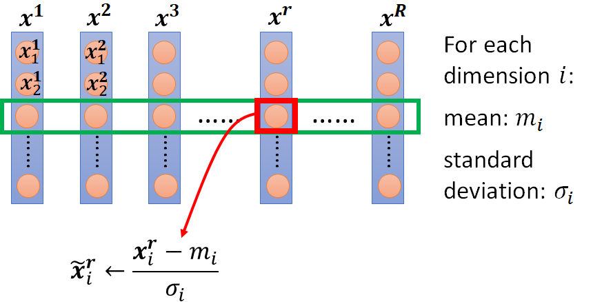
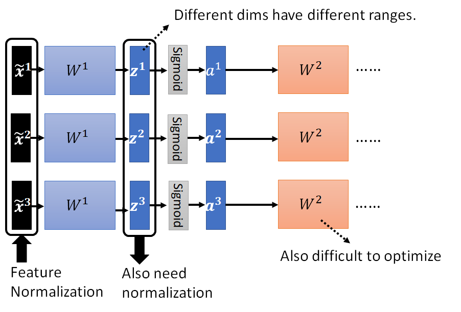
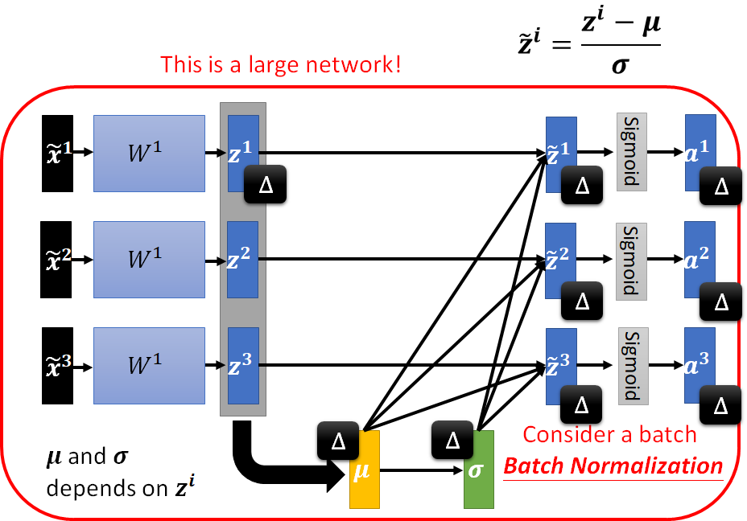
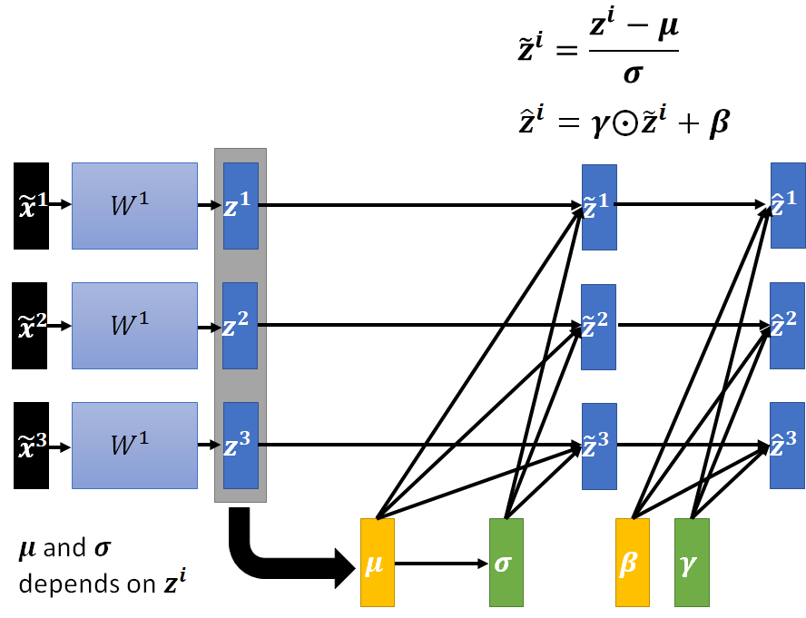
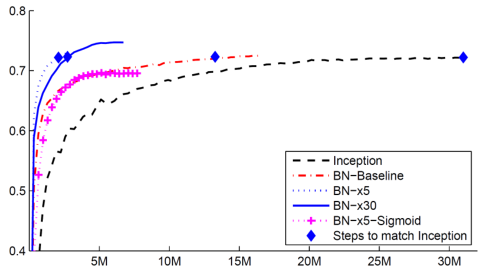

# 特征标准化

- [特征标准化](#特征标准化)
  - [输入标准化](#输入标准化)
  - [深度学习](#深度学习)
  - [Batch Normalization](#batch-normalization)
    - [Testing](#testing)
    - [效果](#效果)
  - [Normalization 技术](#normalization-技术)

***

## 输入标准化

> 这里 $x^1$ 到 $x^R$ 表示样本，$m_i$ 表示第 i 个 feature 的均值。

对所有特征标准化之后，所有维度的均值为 0，标准差为 1.

特征标准化，通常使梯度下降收敛更快。

## 深度学习

对神经网络来说，中间层的输出也可能需要标准化，否则对应的权重也难以训练：

对 `z` (激活函数前)或 `a` (激活函数后)进行 normalization，效果差不多。

对 `Sigmoid` 激活函数，建议对 `z` 进行 normalization。

## Batch Normalization

在训练时，一般每次输入一个 Batch 的数据，在 network 中间，每次也只处理一个 Batch，此时对数据 Normalization，就称为 Batch Normalization。

Batch Normalization 的主要问题是，Batch 必须够大，才能计算均值和标准差。

再进一步：

其中 $\gamma$ 是初始值为 1.0 的可学习参数，$\beta$ 是初始值为 0.0 的可学习参数。

### Testing

在测试或者推理的时候，数据不足以组成一个 Batch 怎么办？

在具体实现中，如 PyTorch，在训练时会计算移动平均值：

$$\overline{\mu}\leftarrow p\overline{\mu}+(1-p)\mu^t$$

`p` 是一个超参数，PyTorch 中默认为 0.1.

在推理的时候，就不需要计算 Batch 的均值和标准差，直接使用训练时得到的移动平均值和标准差。

### 效果

> Original paper: https://arxiv.org/abs/1502.03167
> Sigmoid 激活函数一般比较难训练，加上 BN 后，也可以训练起来（BN-x5-Sigmoid）。
> 将学习率调大（BN-x5）训练速度显著提高。

BN 可以显著加快收敛速度。

## Normalization 技术

|Normalization|参考|
|---|---|
|Batch Renormalization|https://arxiv.org/abs/1702.03275
Layer Normalization|https://arxiv.org/abs/1607.06450
Instance Normalization|https://arxiv.org/abs/1607.08022
Group Normalization|https://arxiv.org/abs/1803.08494
Weight Normalization|https://arxiv.org/abs/1602.07868
Spectrum Normalization|https://arxiv.org/abs/1705.10941
