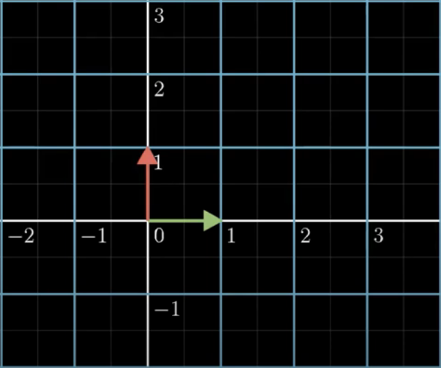
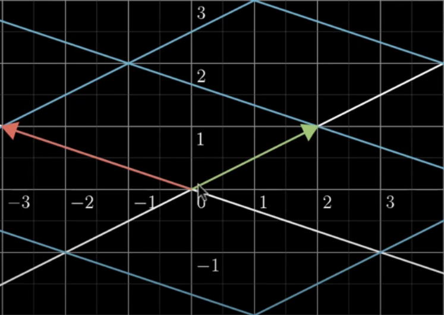
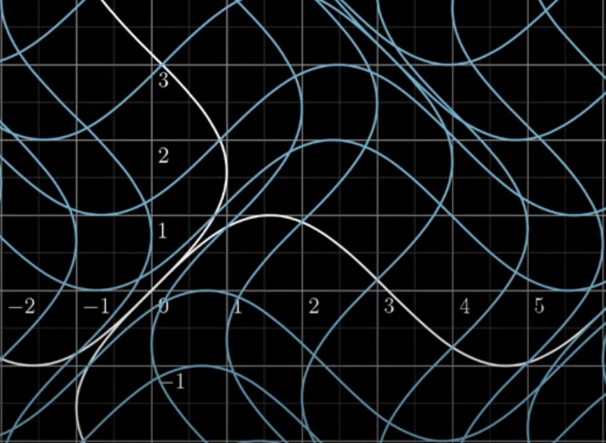
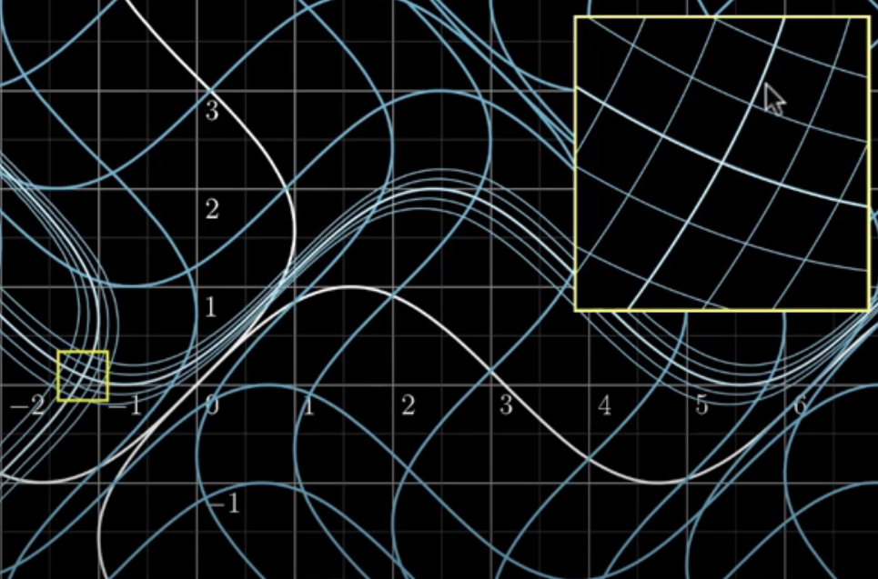
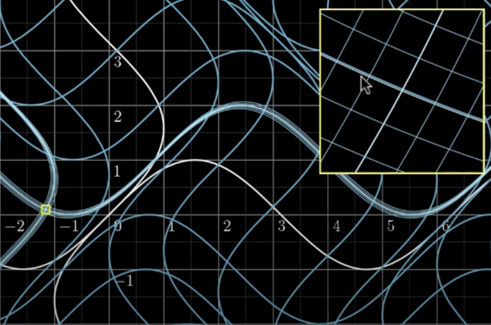
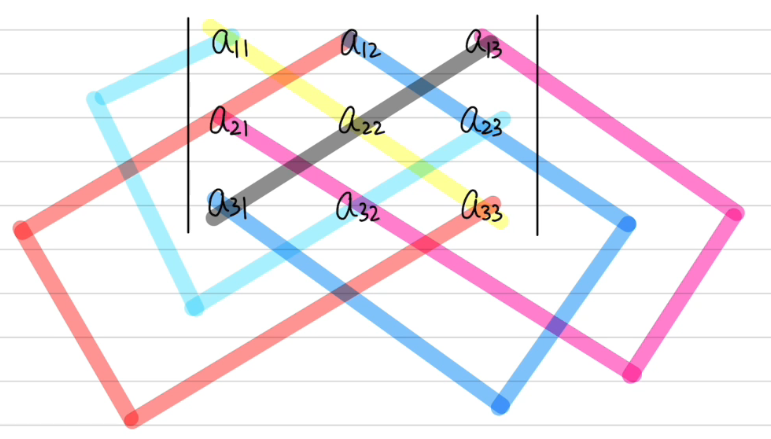

# 雅可比矩阵

## 简介

理解雅可比矩阵（Jacobian）的核心：将矩阵理解为空间变换。例如，对二维空间的点 $(x,y)$，应用矩阵变换：

$$
\begin{bmatrix}
    2 & -3\\
     1 & 1
\end{bmatrix}\begin{bmatrix}
    x\\
    y
\end{bmatrix}=\begin{bmatrix}
    2x+(-3)y\\
    1x+1y
\end{bmatrix}
$$

变换前：

变换后：

可以发现：变换后，所有网格线依然等距且平行。这就是以几何方式看待线性变换的方式。

- 红色和绿色是基向量，变换前为 $\begin{bmatrix}
    1\\
    0
    \end{bmatrix}$ 和 $\begin{bmatrix}
    0\\
    1
    \end{bmatrix}$
- 变换后分别为 $\begin{bmatrix}
    2\\
    1
    \end{bmatrix}$ 和 $\begin{bmatrix}
    -3\\
    1
    \end{bmatrix}$，和变换向量相同

线性变换需要满足的条件：

- 平行线保持平行
- 平行线依然等距
- 原点固定不变

$$
L(a\vec{V})=aL(\vec{V})
$$

$$
L(\vec{v}+\vec{w})=L(\vec{v})+L(\vec{w})
$$

变换后网格保持等距且平行，是线性变换的图示证明。

- 在 1D 空间中，只是将面积换成了长度缩放
- 在 2D 空间中，行列式代表面积的缩放因子

## 多元函数的局部线性

例如，假设有函数：
$$
f(\begin{bmatrix}
    x\\
    y
\end{bmatrix})=\begin{bmatrix}
    x+\sin(y)\\
    y+\sin(x)
\end{bmatrix}
$$

变换后的形状：

显然，这不是线性变换。所有的线不是直线，也不在等距平行。

从单个点看该变换，例如：
$$
f(\begin{bmatrix}
    \pi/2\\
    0
\end{bmatrix})=\begin{bmatrix}
    \pi/2+\sin(0)\\
    0+\sin(\pi/2)
\end{bmatrix}=\begin{bmatrix}
    \pi/2\\
    1
\end{bmatrix}
$$

虽然这不是线性变换，但是它具有一个重要性质：**局部线性**。

局部放大后，很接近线性变换。增大方法倍数，效果更明显（右上角是左侧点的放大视图）：

## Jacobian 矩阵

上面介绍了非线性函数 $\begin{bmatrix}
    x+\sin(y)\\
    y+\sin(x)
\end{bmatrix}$，将局部放大后，可以看到该函数的局部线性性质。

当用矩阵表示线性变化，矩阵的第一个列向量对应第一个基向量的转换，第二个列向量对应第二个基向量的转换。令：
$$
f_1(x,y)=x+\sin(y)
$$

$$
f_2(x,y)=y+\sin(x)
$$

所谓的 **Jacobian 矩阵**，就是这两个函数对 $x$ 和 $y$ 的偏导，表示 $x$ 和 $y$ 的微小变化对变换后空间的影响：
$$
\begin{bmatrix}
    \partial f_1/\partial x & \partial f_1/\partial y\\
    \partial f_2/\partial x & \partial f_2/\partial y
\end{bmatrix}
$$

## 计算 Jacobian 矩阵

对函数：
$$
\begin{bmatrix}
    x+\sin(y)\\
    y+\sin(x)
\end{bmatrix}
$$

以及数据点 $(-2,1)$，其 Jacobian 矩阵：

$$
\begin{bmatrix}
    \partial f_1/\partial x & \partial f_1/\partial y\\
    \partial f_2/\partial x & \partial f_2/\partial y
\end{bmatrix}=\begin{bmatrix}
    1 & \cos(y)\\
    \cos(x) &  1
\end{bmatrix}=\begin{bmatrix}
    1 & \cos(1)\\
    \cos(-2) & 1\\
\end{bmatrix}\approx\begin{bmatrix}
    1 & 0.54\\
    -0.42 & 1
\end{bmatrix}
$$

在 $(-2,1)$ 局部空间，变换后，原基向量 $\begin{bmatrix}
1\\
0
\end{bmatrix}$ 变为 $1-0.52y$，而 $\begin{bmatrix}
    0\\
    1
    \end{bmatrix}$ 变为 $0.54x+y$。

该思想适用于任何函数形式。

## 行列式

行列式是为了求解线性方程组出现的。

### 二阶行列式

对一个二元一次方程组：
$$
a_{11}x_1+a_{12}x_2=b1\\
a_{21}x_1+a_{22}x_2=b2\\
$$
如果存在唯一解，那么通过高斯消元法可以得到：
$$
x_1=\frac{b_1a_{22}-a_{12}b_2}{a_{11}a_{22}-a_{12}a_{21}}\\
x_2=\frac{b_2a_{11}-a_{21}b_1}{a_{11}a_{22}-a_{12}a_{21}}
$$

对二元方程组，引入系数矩阵：

$$
\begin{bmatrix}
    a_{11} & a_{12}\\
    a_{21} & a_{22}
\end{bmatrix}
$$

可以发现，解的分母就是矩阵主对角线乘积减去副对角线乘积。将其定义为**行列式**：

$$
D=\lvert\begin{matrix}
    a_{11} & a_{12}\\
    a_{21} & a_{22}
\end{matrix} \rvert=a_{11}a_{22}-a_{12}a_{21}
$$

其中，$a_{ij}$ 称为元素，$i=1,2$, $j=1,2$, $i$ 表示 row 编号，$j$ 表示 column 编号。这样就得到二元方程组解的分母部分。

求解，$x_1$，将 $x_1$ 的参数替换为右侧 $b$ 构成行列式：

$$
D_1=\begin{matrix}
    b_1 & a_{12}\\
    b_2 & a_{22}
\end{matrix}
$$

同理，求解 $x_2$，将 $x_2$ 的参数替换为右侧 $b$ 构成行列式：

$$
D_2=\begin{matrix}
    a_{11} & b_1\\
    a_{21} & b_2
\end{matrix}
$$

得到解为：

$$
x_1=\frac{D_1}{D}=\frac{\begin{matrix}
    b_1 & a_{12}\\
    b_2 & a_{22}
\end{matrix}}{\begin{matrix}
    a_{11} & a_{12}\\
    a_{21} & a_{22}
\end{matrix}}=\frac{b_1a_{22}-b_2a_{12}}{a_{11}a_{22}-a_{12}a_{21}}
$$

$$
x_2=\frac{D_2}{D}=\frac{\begin{matrix}
    a_{11} & b_{1}\\
    a_{21} & b_{2}
\end{matrix}}{\begin{matrix}
    a_{11} & a_{12}\\
    a_{21} & a_{22}
\end{matrix}}=\frac{b_2a_{11}-b_1a_{21}}{a_{11}a_{22}-a_{12}a_{21}}
$$

### 三阶行列式

对三元一次方程组：
$$
a_{11}x_1+a_{12}x_2+a_{13}x_3=b_1\\
a_{21}x_1+a_{22}x_2+a_{23}x_3=b_2\\
a_{31}x_1+a_{32}x_2+a_{33}x_3=b_3
$$
同样可以根据高斯消元法得到解：
$$
x_1=\frac{b_1a_{22}a_{33}-b_1a_{32}a_{23}-b_2a_{12}a_{33}+b_2a_{32}a_{13}+b_3a_{12}a_{23}-b_3a_{22}a_{13}}{a_{11}a_{22}a_{33}-a_{11}a_{32}a_{23}-a_{21}a_{12}a_{33}+a_{21}a_{32}a_{13}+a_{31}a_{12}a_{23}-a_{31}a_{22}a_{13}}\\
x_2=\frac{a_{11}b_2a_{33}-a_{11}b_3a_{23}-a_{21}b_1a_{33}+a_{21}b_{3}a_{13}+a_{31}b_1a_{23}-a_{31}b_2a_{13}}{a_{11}a_{22}a_{33}-a_{11}a_{32}a_{23}-a_{21}a_{12}a_{33}+a_{21}a_{32}a_{13}+a_{31}a_{12}a_{23}-a_{31}a_{22}a_{13}}\\
x_3=\frac{a_{11}a_{21}b_3-a_{11}a_{32}b_2-a_{21}a_{12}b_3+a_{21}a_{32}b_1+a_{31}a_{12}b_2-a_{31}a_{22}b_1}{a_{11}a_{22}a_{33}-a_{11}a_{32}a_{23}-a_{21}a_{12}a_{33}+a_{21}a_{32}a_{13}+a_{31}a_{12}a_{23}-a_{31}a_{22}a_{13}}
$$

很复杂，用行列式可以极大简化。

行列式计算：

$$
D=a_{11}a_{22}a_{33}+a_{12}a_{23}a_{31}+a_{13}a_{21}a_{32}-a_{13}a_{22}a_{31}+a_{23}a_{32}a_{11}-a_{33}a_{12}a_{21}
$$

> [!WARNING]
>
> 对角线法则只适用于二阶和三阶行列式。

示例：求解三阶行列式 $\begin{vmatrix}
    2 & 1 & 2\\
    -4 & 3 & 1\\
    2 & 3 & 5
\end{vmatrix}$

$$
\begin{aligned}
原式&=2\times 3\times 5+1\times 1 \times 2+ 2\times (-4)\times 3-2\times 3 \times 2-1\times(-4)\times 5-2\times 1\times3\\
&=10
\end{aligned}
$$

### 全排列

由自然数 1, 2, ..., n 组成的一个有序数组，称为这 $n$ 个元素的全排列，$n$ 个不同元素的所有排列的种类数，用 $P_n$ 表示。

例如，由 1, 2, 3 三个数字排列，排列数为 $P_3=3!=6$。

在 $n$ 阶排列所形成的所有数组中，若某一数组的元素按照从小到大的顺序排列，则称其为**标准排列**。

例如，$1,2,3,4$ 为**标准排列**，而 $1,3,2,4$ 为非标准排列。

**逆序数**

若在 $n$ 个 元素的任意排列中，当某一对元素的先后次序与标准次序不同，则称这一对元素构成 1 个**逆序**。某一排列中逆序总数，称为该排列的**逆序数**，记为 $\tau(i_1, i_2,\cdots,i_n)$。

逆序数为奇数的排列称为**奇排列**；逆序数为偶数的排列称为**偶排列**。

定理：$n$ 阶排列中，奇排列与偶排列各占 $\frac{n!}{2}$。

例如，计算排列 $2413$ 的逆序数（从左到右，从小到大）：

- 2: 2->1 为逆序
- 4: 4->1 逆序，4->3 逆序
- 1: 
- 3:

因此，$\tau(2413)=3$。同理，$\tau(312)=2$，$\tau(n(n-1)\cdots 321)=(n-1)+(n-2)\cdots +1=\frac{n(n-1)}{2}$。

**对换**

在排列中，将任意两个元素交换位置，其余位置不动，称为**对换**。将相邻两个元素对换，称为**相邻对换**。

定理 1：一个排列中，任意两个元素对换，排列改变奇偶性。

定理 2：任一排列都可以经过对换转换为标准排列，且奇排列转换成标准排列的对换次数为奇数；偶排列转换成标准排列的对换此时为偶数。

### n 阶行列式

$n$ 阶行列式由 $n^2$ 个元素 $a_{ij}$ ($i,j=1,2,\cdots,n$) 排成 $n$ 行 $n$ 列，记为 $D$：
$$
D=\begin{vmatrix}
a_{11} & a_{12} & \cdots & a_{1n}\\
a_{21} & a_{22} & \cdots & a_{2n}\\
\cdots & \cdots & \cdots & \cdots \\
a_{n1} & a_{n2} & \cdots & a_{nn}\\
\end{vmatrix}=\sum_{j_1j_2\cdots j_n}(-1)^{\tau (j_1j_2\cdots j_n)}a_{1j_1}a_{2j_2}\cdots a_{nj_n}
$$

该行列式由 $n!$ 项的加和组成，每一项都是 $n$ 个元素的乘积（这 $n$ 个元素必须来自不同行、不同列），把 $n$ 个元素

## 雅可比行列式

## 参考

- https://www.khanacademy.org/math/multivariable-calculus
- https://www.bilibili.com/video/BV1UB4y1b7ac/
- https://www.bilibili.com/video/BV1Xt4y1j7fR