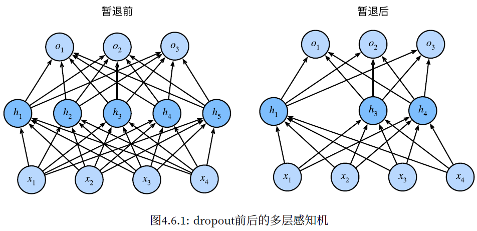
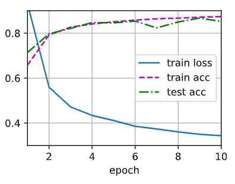

# Dropout

- [Dropout](#dropout)
  - [简介](#简介)
  - [Dropout 使用](#dropout-使用)
  - [PyTorch 从零实现](#pytorch-从零实现)
    - [定义模型来测试](#定义模型来测试)
  - [PyTorch 简洁实现](#pytorch-简洁实现)
  - [QA](#qa)
  - [参考](#参考)

Last updated: 2022-12-14, 17:37
****

## 简介

一个好的模型需要对输入数据的扰动鲁棒：

- 使用有噪音的数据等价于 Tikhonov 正则
- 丢弃法：在层之间加入噪音

**无偏差的加入噪音**

对 $\mathbf{x}$ 加入噪音得到 $\mathbf{x'}$，希望：

$$E[\mathbf{x'}]=\mathbf{x}$$

即加入噪音值，但不改变期望值。

**丢弃法**

丢弃法对每个元素进行如下扰动：

$$
x_i' = \begin{cases}
    0 &\text{概率 p} \\
    \frac{x_i}{1-p} &\text{其它情况}
\end{cases}
$$

即以 `p` 概率将元素变为 0，将剩下元素变大（因为 `1-p` 小于 1）。

这样就能保证期望值不变。

## Dropout 使用

通常将 Dropout 用在隐藏全连接层的输出上：



$$h=\sigma(W_1x+b_1)$$

$$h'=dropout(h)$$

$$o=W_2h'+b_2$$

$$y=softmax(o)$$

> Dropout 是正则项，正则项只在训练中使用。即，在推理中不使用 dropout。

总而言之：

- Dropout 将一些输出项随机置 0 来控制模型复杂度
- 常用在多层感知机的隐藏层输出上
- dropout 概率是控制模型复杂度的超参数

概率 `p` 一般取 0.5，0.9 或 0.1。

## PyTorch 从零实现

实现单层的 dropout 实现，从均匀分布 $U[0,1]$ 抽样，样本数与这层神经网络的维度一致。然后保留对应样本大于 $p$ 的节点，把剩下的丢弃。

下面实现 dropout_layer 函数，以 dropout 的概率丢弃输入张量 `X` 中的元素：

```python
import torch

def dropout_layer(X, dropout):
    assert 0 <= dropout <= 1
    # 此时丢弃所有元素
    if dropout == 1:
        return torch.zeros_like(X)
    # 此时保留所有元素
    if dropout == 0:
        return X
    # 从均匀分布抽样，如果 > dropout，就是 1，否则就是 0
    mask = (torch.rand(X.shape) > dropout).float()
    # 从乘法比从其中选值要快，所以这么实现
    return mask * X / (1.0 - dropout)
```

测试 `dropout_layer` 函数：

```python
X= torch.arange(16, dtype = torch.float32).reshape((2, 8))
print(X)
print(dropout_layer(X, 0.)) # p=0, X 没有变化
print(dropout_layer(X, 0.5)) # 50% 的概率元素变为 0
print(dropout_layer(X, 1.)) # X 所有元素变为 0
```

```txt
tensor([[ 0.,  1.,  2.,  3.,  4.,  5.,  6.,  7.],
        [ 8.,  9., 10., 11., 12., 13., 14., 15.]])
tensor([[ 0.,  1.,  2.,  3.,  4.,  5.,  6.,  7.],
        [ 8.,  9., 10., 11., 12., 13., 14., 15.]])
tensor([[ 0.,  0.,  0.,  6.,  8., 10.,  0., 14.],
        [16.,  0.,  0., 22.,  0.,  0.,  0.,  0.]])
tensor([[0., 0., 0., 0., 0., 0., 0., 0.],
        [0., 0., 0., 0., 0., 0., 0., 0.]])
```

### 定义模型来测试

针对 FashionMNIST 数据集，定义一个具有两个隐藏层的多层感知机，每个隐藏层包含 256 个单元：

```python
num_inputs, num_outputs, num_hiddens1, num_hiddens2 = 784, 10, 256, 256
dropout1, dropout2 = 0.2, 0.5

class Net(nn.Module):
    # 关键是多了一个 `is_training` 参数，以判断是否应用 dropout
    def __init__(self, num_inputs, num_outputs, num_hiddens1, num_hiddens2,
                 is_training=True):
        super(Net, self).__init__()
        self.num_inputs = num_inputs
        self.training = is_training
        self.lin1 = nn.Linear(num_inputs, num_hiddens1)
        self.lin2 = nn.Linear(num_hiddens1, num_hiddens2)
        self.lin3 = nn.Linear(num_hiddens2, num_outputs)
        self.relu = nn.ReLU()

    def forward(self, X):
        # 第一次隐藏层的输出
        H1 = self.relu(self.lin1(X.reshape((-1, self.num_inputs))))
        # 只在训练时使用 dropout
        if self.training == True:
            # 在第一个全连接层之后添加一个dropout层
            H1 = dropout_layer(H1, dropout1)
        H2 = self.relu(self.lin2(H1))
        if self.training == True:
            # 在第二个全连接层之后添加一个dropout层
            H2 = dropout_layer(H2, dropout2)
        out = self.lin3(H2)
        return out


net = Net(num_inputs, num_outputs, num_hiddens1, num_hiddens2)
```

训练和测试：

```python
from d2l import torch as d2l

num_epochs, lr, batch_size = 10, 0.5, 256
loss = nn.CrossEntropyLoss(reduction='none')
train_iter, test_iter = d2l.load_data_fashion_mnist(batch_size)
trainer = torch.optim.SGD(net.parameters(), lr=lr)
d2l.train_ch3(net, train_iter, test_iter, loss, num_epochs, trainer)
```



## PyTorch 简洁实现

```python
net = nn.Sequential(nn.Flatten(),
                    nn.Linear(784, 256),
                    nn.ReLU(),
                    # 在第一个全连接层之后添加一个dropout层
                    nn.Dropout(dropout1),
                    nn.Linear(256, 256),
                    nn.ReLU(),
                    # 在第二个全连接层之后添加一个dropout层
                    nn.Dropout(dropout2),
                    nn.Linear(256, 10))


def init_weights(m):
    if type(m) == nn.Linear:
        nn.init.normal_(m.weight, std=0.01)


net.apply(init_weights);
```

## QA

- dropout 随机置零，对应的梯度也变为零
- dropout 只在全连接层使用
- dropout 调起来很方便，一般就取 0.1，0.5，0.9 三个值。
- dropout 可能让收敛变慢，但是因为不改变期望，所以一般不增大 lr

## 参考

- 《动手学深度学习》Aston Zhang, Mu Li, Zachary C. Lipton, Alexander J. Smola
