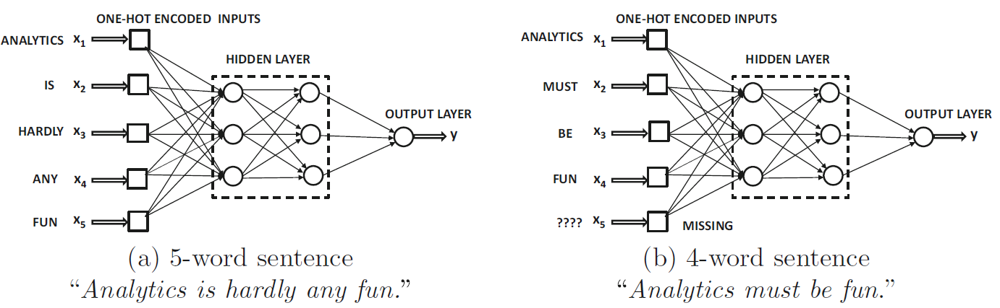
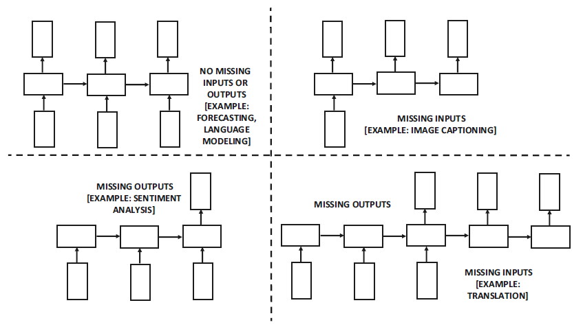

# 循环神经网络

- [循环神经网络](#循环神经网络)
  - [简介](#简介)
  - [RNN 的表达能力](#rnn-的表达能力)
  - [RNN 的结构](#rnn-的结构)
  - [标准 RNN 存在的问题](#标准-rnn-存在的问题)
  - [参考](#参考)

2022-01-11, 10:33
***

## 简介

前缀神经网络（FNN）和卷积神经网络（CNN）是为多维数据设计，在这些数据中，属性在很大程度上是相互独立的。然而，现实中很多数据，如时间序列、文本和生物序列数据包含顺序依赖关系。例如：

- 在时间序列数据集中，连续时间戳上的值彼此相关。如果将这些时间戳的值作为独立特征使用，就会丢失它们之间的关联信息。
- 虽然文本经常被处理成词袋（bag of words），如果考虑词序，往往能获得更好的结果。此时最重要的是能够考虑顺序的模型，文本是循环神经网络（RNN）最常见的用例。
- 生物数据通常包含序列，其中的符号可能是氨基酸或碱基。

序列中的单个值可以是实数或符号。实数序列也称为时间序列（time-series）。这两类数据 RNN 都可以处理，在实际应用中，符号值更常见，下面主要关注符号数据，特别是文本数据。下面默认 RNN 的输入是文本片段（text segment），其中序列的单值符号和词典的单词标识符对应。

许多处理序列（如文本）的应用程序将序列处理为词袋（bag of words），这种方法的优点是简单，对于特定文本效果很好；缺点是忽略了单词的顺序，对语义解释要求较高，或者 text segment 相对较小的应用中，这种方法效果较差。词袋模型对简单的分类任务效果很好，对于复杂任务，如情感分析、机器翻译或信息提取等，则无能为力。

对上述问题，一个可能的解决方案是不使用词袋，而是为序列中的每个位置创建一个输入。例如，假设使用 FNN 对句子进行情感分析，句子中的每个位置对应一个输入，情感分类可以设为好评和差评。此时面临的第一个问题是，不同的句子长度不同，如果使用包含 5 个独热编码的字输入神经网络（下图 a），超过 5 个单词的句子就无法输出；少于 5 个单词的句子则会有输入空缺（下图 b）。在某些情况，如 Web 日志序列，输入序列的长度可能达到数十万。更重要的是，词序的微小变化会导致语义上的不同，因此，以某种方式在网络架构中直接编码单词排序的信息更合适。并且，随着序列长度的增加，这种方法的参数量不能太多，RNN 在这方面做得很好。

在 RNN 中，序列中的位置也称为时间戳（time-stamp）或时间步（time-step），网络包含的层数是可变的，每一层都有对应于该时间戳的单个输入。因此，根据输入在序列中的位置可以直接与下游隐藏层交互。所有层使用的相同的参数，这样每个时间戳的建模是相似的，参数的数量也是固定的。换句话说，在时间维度上使用相同的分层架构，所以该网络被称为循环（recurrent）。

循环神经网络其实也是基于时间分层概念的具有特定结构的前馈网络，因此它可以接受一个输入序列并生成一个输出序列。每个时间层可以接受一个输入数据点，并可选地生成多维输出。这种模型对于序列-序列的学习特别有用，比如机器翻译或预测序列中的下一个元素。例如：

1. 输入为一个单词序列，输出是相同的序列，但是向后移动 1 位，这样就可以在给定的点上预测下一个单词。这是一个经典的语言模型，在该模型上，我们根据单词的顺序来预测下一个单词。语言模型在文本挖掘和信息检索中有着广泛的应用；
2. 在实值时间序列中，学习下一个元素的问题相当于自回归分析。相对传统的时间序列模型，RNN 可以学习更复杂的模型；
3. 输入为一种语言的句子，输出是另一种语言的句子。对该问题，我们可以连接两个 RNN 来学习两种语言之间的翻译模型。甚至可以将一个 RNN 与另一种网络（如 CNN）连接起来，以学习图像标题。
4. 输入为序列，输出为分类概率向量。这种方法对以句子为中心的分类应用（如情感分析）非常有用。

## RNN 的表达能力

RNN 被认为是**图灵完备**的（Turing complete）。所谓图灵完备，是指只要有足够的数据和计算资源，RNN 就可以模拟任何算法。

RNN 的图灵完备性并不实用，因为部分架构和任务所需的数据量和算力是不现实的。此外，在训练 RNN 还存在一些问题，如梯度消失和梯度爆炸问题。这些问题随着序列的长度增加而增加，一些更稳定的变体，如 LSTM 和 GRU，只能在一定限度内解决该问题。

## RNN 的结构

下图 a 是最简单的循环神经网络。这里的一个关键点是其中的自循环，该循环的存在使得输入序列的每个单词后都会更新隐藏状态。

将循环按照事件顺序展开就是图 b，它看起来和前馈网络差不多，不同时间层共享权重矩阵。下图为数据流动过程：

每个时间戳都有一个输入、输出和隐藏单元。在实践中，任意时间戳可以没有输入和输出，如下图所示：

没有输入还是输出，取决于应用类型。例如，在时间序列预测应用中，可能需要在每个时间戳都有输出，以便预测时间序列的下一个值；在序列分类应用中，可能只需要序列末尾与其类相对应的一个输出标签。

经典 RNN 的数学表示：

$$\overline{h}_t=tanh(W_{xh}\overline{x}_t+W_{hh}\overline{h}_{t-1})$$

$$\overline{t}_t=W_{hy}\overline{h}_t$$

## 标准 RNN 存在的问题

RNN 参数学习有很大挑战，一个关键问题是梯度消失和梯度爆炸。该问题在深层网络中十分普遍。解决梯度问题的方法如下：

RNN 的许多变体也是为解决梯度问题而设计的，如长短期记忆网络（LSTM）和门控循环单元（GRU）。RNN 及其变体已经被用于各种应用，如序列到序列学习、图像标题、机器翻译和情感分析等。

## 参考

- 《Neural Networks and Deep Learning: A Textbook》，Charu C. Aggarwal
- https://www.simplilearn.com/tutorials/deep-learning-tutorial/rnn
