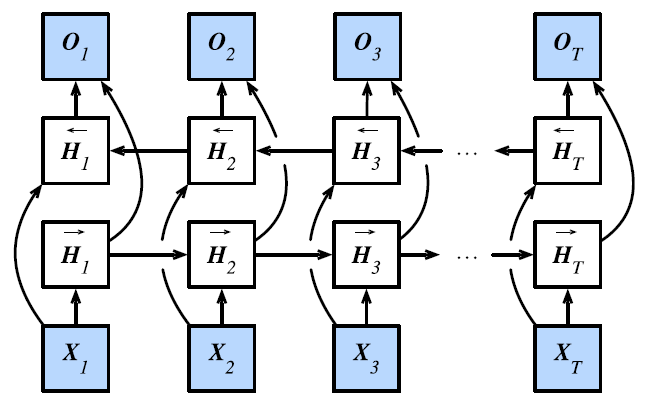

# 双向 RNN

- [双向 RNN](#双向-rnn)
  - [简介](#简介)
  - [定义](#定义)
  - [总结](#总结)
  - [TensorFlow 实现](#tensorflow-实现)

2022-01-10, 16:12
***

## 简介

如下图所示



双向 RNN 有两个 RNN 隐藏层：

- 一个前向 RNN
- 一个反向 RNN

合并两个隐状态得到输出。

## 定义

对于任意时间步 $t$，给定一个小批量的输入数据 $X_t \isin \Reals^{n\times d}$（样本数：n，每个示例中的输入数：$d$），并且令隐藏层激活函数为 $\phi$。在双向架构中，我们设该时间步的前向和反向隐状态分别为 $\overleftrightarrow{H}_t \isin \Reals^{n\times h}$ 和 $\overleftarrow{H}_t \isin \Reals^{n\times h}$，其中 $h$ 是隐藏单元的数目。前向和反向隐状态的更新如下：

$$\overrightarrow{H}_t=\phi(X_tW_{xh}^{(f)}+\overrightarrow{H}_{t-1}W_{hh}^{(f)}+b_h^{(f)})$$

$$\overleftarrow{H}_t=\phi(X_tW_{xh}^{(b)}+\overleftarrow{H}_{t-1}W_{hh}^{(b)}+b_h^{(b)})$$

其中，$W_{xh}^{(f)}\isin \Reals^{d\times h}, W_{hh}^{(f)}\isin \Reals^{h\times h}, W_{xh}^{(b)}\isin \Reals^{d\times h}, W_{hh}^{(b)}\isin \Reals^{h\times h}$ 为权重，$b_h^{(f)}\isin \Reals^{1\times h}, b_h^{(b)}\isin \Reals^{1\times h}$ 为偏置参数。

接下来，将前向隐状态 $\overrightarrow{H}_t$和反向隐状态 $\overleftarrow{H}_t$ 连接起来，获得需要送入输出层的隐状态 $H_t \isin \Reals^{n\times 2h}$。

$$H_t=[\overrightarrow{H}_t, \overleftarrow{H}_t]$$

在具有多个隐藏层的深度双向神经网络中，该信息作为输入传递到下一个双向层。最后，输出层计算得到的输出位 $O_t\isin \Reals^{n\times q}$ （q 是输出单元的数目）：

$$O_t =H_tW_{hq}+b_q$$

这里，权重矩阵 $W_{hq}\isin \Reals^{2h\times q}$ 和偏置 $b_q\isin \Reals^{1\times q}$ 是输出层的模型参数。事实上，这两个方向可以拥有不同数量的隐藏单元。

## 总结

双向 RNN 通过反向更新的隐藏层来利用反向时间信息。

双向 RNN 一般用来对序列抽取特征、填空，而不是预测未来。

## TensorFlow 实现

TensorFlow 2.0 通过一个双向包装层提供对双向 RNN 的支持，以 LSTM 为例：

```python
self.lstm = tf.keras.layers.Bidirectional(
    tf.keras.layers.LSTM(10, return_sequences=True, input_shape=(5, 10))
)
```
