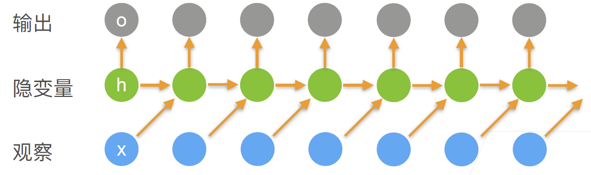

# 深度循环神经网络

- [深度循环神经网络](#深度循环神经网络)
  - [结构](#结构)
  - [总结](#总结)

## 结构

RNN 只有一个隐藏变量：

$$h_t=\phi(W_{hh}h_{t-1}+W_{hx}X_{t-1}+b_h)$$

输出：

$$o_t=W_{ho}h_t+b_o$$

要把 RNN 变深，获得更多的非线性，只需叠加更多的隐藏层：

我们可以将深度架构中的函数依赖关系形式化，假设时间步 $t$ 有一个小批量的输入数据 $X_t\isin \Reals^{n\times d}$（样本数：n，每个样本中的输入数：d）。同时，将 $l^{th}$隐藏层（$l=1,...,L$）的隐状态设为 $H_t^{(l)}\isin \Reals^{n\times h}$ （隐藏单元数：h），输出层变量设为 $O_t \isin \Reals^{n\times q}$（输出数：q）。设置

## 总结

深度循环神经网络使用更多隐藏层来获得更多的非线性性。

NLP 很容易找工作，处理文本的需求远远大于处理图片的需求。
