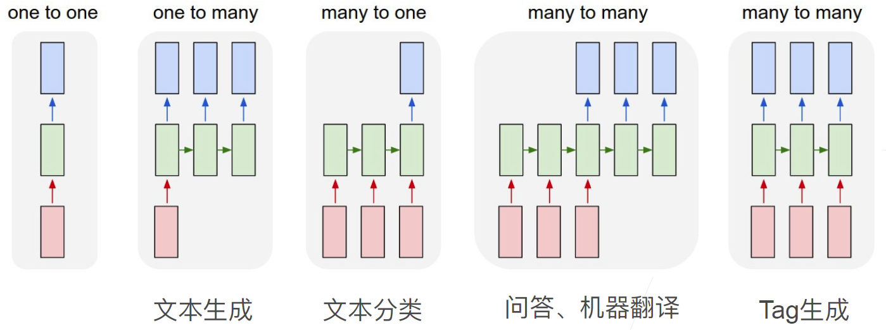
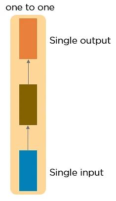
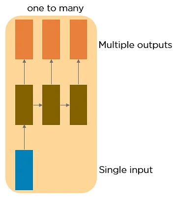
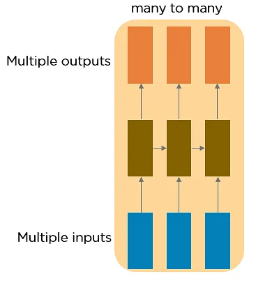

# RNN 拓扑结构

- [RNN 拓扑结构](#rnn-拓扑结构)
  - [简介](#简介)
  - [one-to-one](#one-to-one)
  - [one-to-many](#one-to-many)
  - [many-to-one](#many-to-one)
  - [many-to-many](#many-to-many)

2022-01-10, 17:51
***

## 简介

下图是 5 种不同的拓扑结构：

红色的输入，绿色的为隐藏层，蓝色为输出层。

## one-to-one

这种只有一个输入和一个输出的神经网络被称为 Vanilla 神经网络，用于一般的机器学习任务。

## one-to-many

1 个输入，多个输出。例如从图像生成文本标记（image caption），这样的网络将图像作为输入，代表性的文本序列作为图像标签。

## many-to-one

输入序列，输出 1 个。一般用在文本分类，如情感分析。

## many-to-many

输出序列，输出序列。机器翻译是典型例子。

many-to-many 有两种形式的应用。其中一种是广为人知的 seq2seq 模型。

刷 pretrain 模型，弄的很大。

用 transformer 用应用比较合适。

tracking，跟踪对象，很成熟了，一般不需要 RNN。
