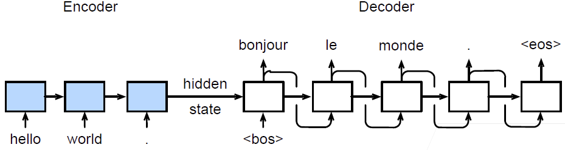
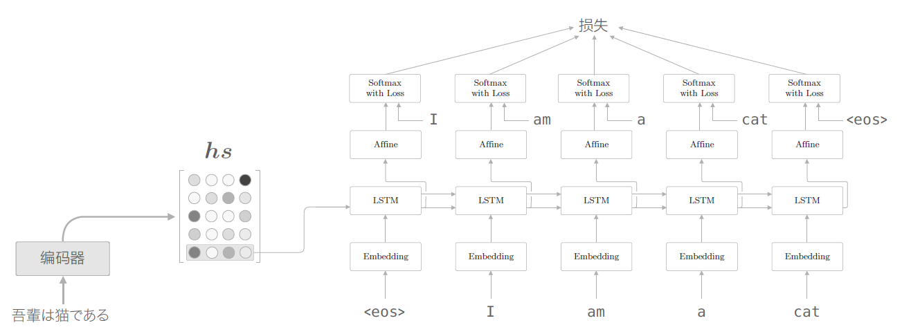

# seq2seq

2022-02-11, 15:57
***

## 简介

机器翻译中的输入序列和输出序列都是长度可变的。为了解决这类问题，就有了 encoder-decoder 架构。seq2seq 使用两个循环神经网络的编码器和解码器，将其应用于序列到序列（sequence to sequence, seq2seq）类的学习任务。

按照编码器-解码器架构的设计原则，RNN 编码器使用长度可变的序列作为输入，将其转换为固定形状的隐状态。换言之，输入序列的信息被编码到 RNN 编码器的隐状态中。为了逐个生成输出序列的词元，使用一个单独的 RNN 解码器根据已看到（或生成）的词元和输入序列的编码信息预测下一个词元。下图演示如何在机器翻译中使用两个 RNN 进行序列到序列的学习：

上图中的 `"<eos>"` 表示序列结束（end of the sequence），一旦生成该词元，模型就可以停止预测。在 RNN decoder 的初始化时间步有两个特殊设计：

1. `"<bos>"` 标识序列开始；
2. 使用 RNN encoder 的最终 hidden state 初始化 decoder 的 hidden state。

编码器是一个 RNN，读取输入句子，可以是双向，即双向 RNN 经常用在 encoder 中。

解码器使用另外一个RNN来输出。

## 改进

### 解码器改进 1

上面的 seq2seq 解码器只用了编码器的 LSTM 层的最后的隐状态。如下图所示：

如果使用 `hs`（所有隐状态），则只需提取最后一行，再将其传递给解码器。下面我们改进解码器，以便能够使用全部 `hs`。

## 参考

- https://zh.d2l.ai/chapter_recurrent-modern/seq2seq.html
