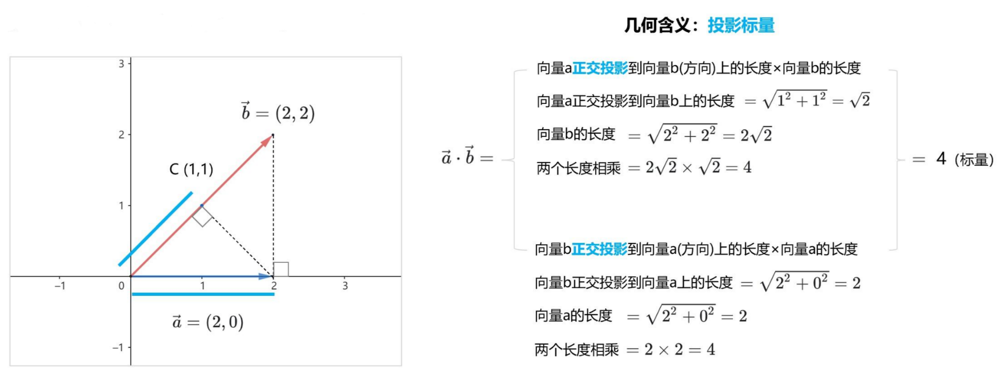
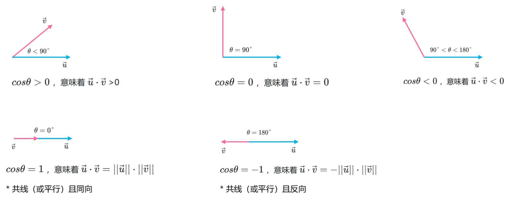

# 向量和矩阵

## 向量操作

### 点积

向量点积（dot product），又称为点乘，数量积。得到一个标量。

**要求：**

- 两个向量长度相同。

**计算方法一：**

$$
\vec{u}\cdot \vec{v}=\lVert\vec{u}\rVert\times\lVert\vec{v}\rVert\times\cos\theta
$$

> [!NOTE]
>
> 在几何中，$\vec{u}$ 和 $\vec{v}$ 放在一起形成的夹角为 $\theta$。

**计算方法二：**

$$
\vec{u}=(u_1, u_2,\cdots, u_n)\\
\vec{v}=(v_1,v_2,\cdots,v_n) \\
\vec{u}\cdot \vec{v}=u_1v_1+u_2v_2+\cdots+u_nv_n
$$

方式二使用更多。

**点积运算性质**

- $\vec{u}\cdot\vec{u}=\lVert\vec{u}\rVert^2$
- 交换律：$\vec{u}\cdot\vec{v}=\vec{v}\cdot\vec{u}$
- 分配率：$\vec{a}\cdot(\vec{u}+\vec{v})=\vec{a}\cdot\vec{u}+\vec{a}\cdot\vec{v}$
- 常数外提：$(m\vec{u})\cdot(n\vec{v})=mn(\vec{u}\vec{v})$, $m,n\in R$

**几何含义**

**向量夹角**

### 向量积

向量积 (vector product)，又称为叉乘（cross product）。结果为**向量**。

$$
\mathbf{a}\times\mathbf{b}=\mathbf{c}
$$

叉乘运算只定义在三维空间，其方向遵守右手法则。

$$
\mathbf{a}=a_1\bf{i}+a_2\bf{j}+a_3\bf{k} \\
\mathbf{b}=b_1\bf{i}+b_2\bf{j}+b_3\bf{k}
$$

利用行列式来理解：

$$
\begin{aligned}
    \mathbf{a}\times\mathbf{b}&=\begin{vmatrix}
        i & j & k\\
        a_1 & a_2 & a_3\\
        b_1 & b_2 & b_3\\
    \end{vmatrix}\\
    &=(a_2b_3i+a_3b_1j+a_1b_2k)-(a_3b_2i+a_1b_3j+a_2b_1k)
\end{aligned}
$$

**要求：**

- 

## 矩阵操作

