# 图像增广

- [图像增广](#图像增广)
  - [简介](#简介)
  - [数据增强种类](#数据增强种类)
  - [PyTorch 代码实现](#pytorch-代码实现)
    - [左右翻转](#左右翻转)
    - [上下翻转](#上下翻转)
    - [裁剪](#裁剪)
    - [随机图像亮度](#随机图像亮度)
    - [随机图像色调](#随机图像色调)
    - [随机多种颜色属性](#随机多种颜色属性)
    - [结合多种增强方法](#结合多种增强方法)
  - [使用图像增广训练 CIFAR10](#使用图像增广训练-cifar10)
  - [QA](#qa)
  - [参考](#参考)

Last updated: 2022-12-15, 13:29
****

## 简介

有一家做智能售货机的公司，发现他们的演示机器在现场效果很差，因为现场：

- 不同的色温
- 桌面的灯光反射不一样

他们连夜现场收集了数据，训练了一个新的模型，同时买了一块桌布。

**数据增强**对一个已有数据集，进行一系列的随机变换，增加数据的多样性：

- 在语音里面加入各种不同的背景噪音
- 改变图片的颜色和形状

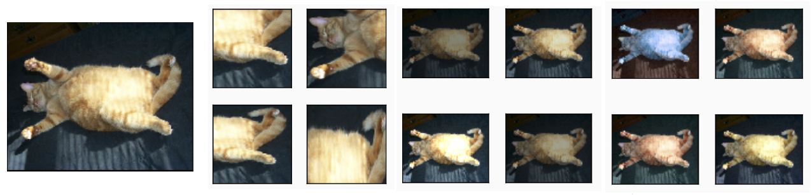

增强数据一般是在训练时**在线生成**的：

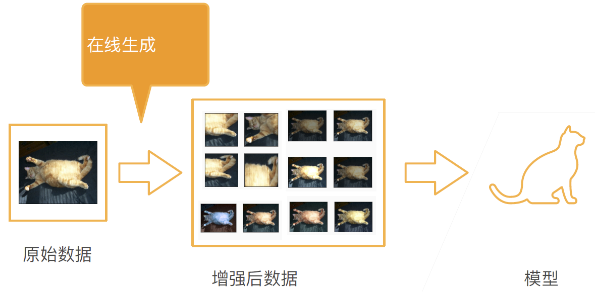

## 数据增强种类

**翻转**

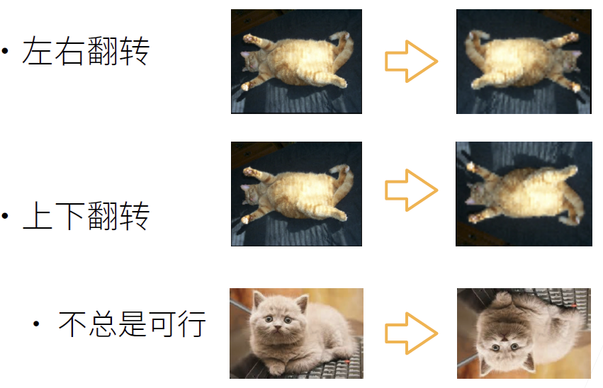

**切割**

从图片上切割一块，然后变形到固定形状：

- 随机高宽比，如 3/4, 4/3
- 随机大小，如 5%, 100%
- 随机位置

**颜色**

改变色调，饱和度，明亮度。

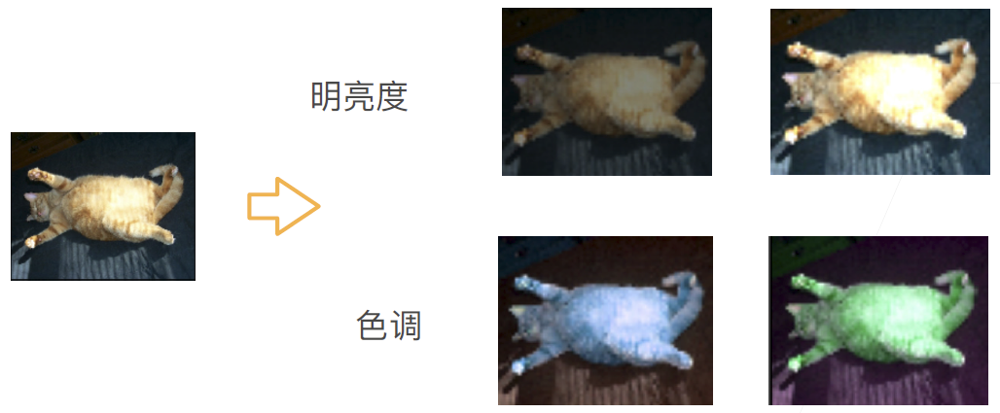

图片增强的方法有很多，[imgaug](https://github.com/aleju/imgaug) Python 库提供了几十种方法。

总结：

- 数据增强通过变形数据来获得多样性，从而使得模型泛化性更好
- 常见图片增强包括翻转、切割和变色

## PyTorch 代码实现

下面使用 400x500 的猫的图片为例：

```python
import torch
import torchvision
from torch import nn
from d2l import torch as d2l

d2l.set_figsize()
img = d2l.Image.open('../img/cat1.jpg')
d2l.plt.imshow(img)
```


大多数图像增广方法都具有一定的随机性。为了便于观察图像增广的效果，我们下面定义辅助函数`apply`。

此函数在输入图像`img`上多次运行图像增广方法`aug`并显示所有结果。

```python
def apply(img, aug, num_rows=2, num_cols=4, scale=1.5):
    Y = [aug(img) for _ in range(num_rows * num_cols)]
    d2l.show_images(Y, num_rows, num_cols, scale=scale)
```

### 左右翻转

左右翻转图像通常不会改变对象的类别。接下来使用 `transforms` 模块来创建 `RandomFlipLeftRight` 实例，这样就有 50% 的⼏率使图像向左或向右翻转。

```python
apply(img, torchvision.transforms.RandomHorizontalFlip())
```

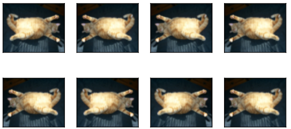

### 上下翻转

上下翻转图像不如左右图像翻转那样常⽤。但是，⾄少对于这个示例图像，上下翻转不影响识别。接下来，创建⼀个 `RandomFlipTopBottom` 实例，使图像各有50%的⼏率向上或向下翻转。

```python
apply(img, torchvision.transforms.RandomVerticalFlip())
```

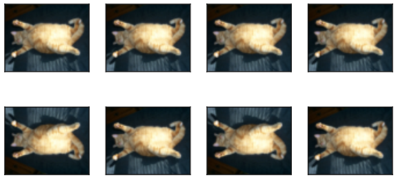

### 裁剪

下面随机裁剪一个面积为原始面积 10% 到 100% 区域，该区域的宽高比从 0.5~2 之间随机取值。然后，区域的宽度和高度被缩放到 200 像素。

下面 $a$和$b$之间的随机数指的是在区间$[a, b]$中通过均匀采样获得的连续值。

```python
shape_aug = torchvision.transforms.RandomResizedCrop(
    (200, 200), scale=(0.1, 1), ratio=(0.5, 2))
apply(img, shape_aug)
```

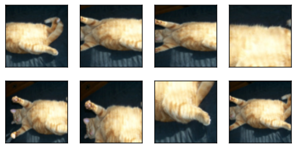

### 随机图像亮度

```python
apply(img, torchvision.transforms.ColorJitter(
    brightness=0.5, contrast=0, saturation=0, hue=0))
```

`brightness=0.5` 表示随机增加或降低 50%。

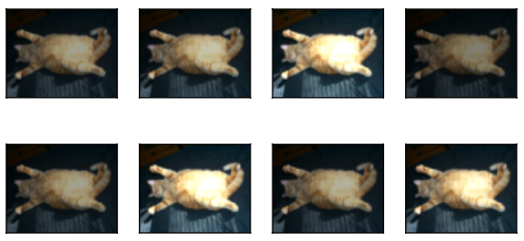

### 随机图像色调

```python
apply(img, torchvision.transforms.ColorJitter(
    brightness=0, contrast=0, saturation=0, hue=0.5))
```

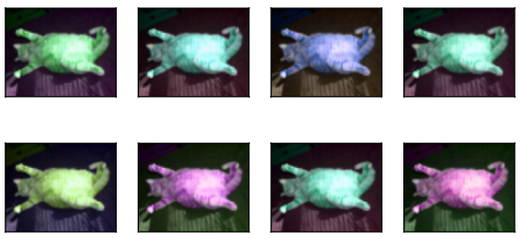

### 随机多种颜色属性

```python
color_aug = torchvision.transforms.ColorJitter(
    brightness=0.5, contrast=0.5, saturation=0.5, hue=0.5)
apply(img, color_aug)
```

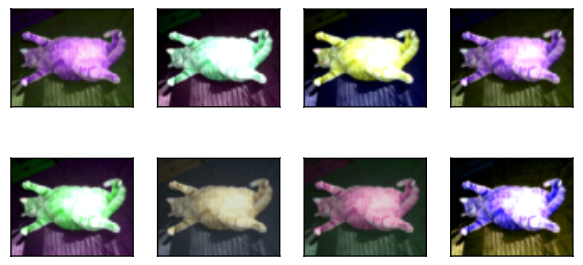

### 结合多种增强方法

在实践中，一般将结合多种图像增⼴⽅法。⽐如，可以通过 `Compose` 综合上⾯定义的不同的图像增⼴⽅法，并将它们应⽤到每个图像。

```python
augs = torchvision.transforms.Compose([
    torchvision.transforms.RandomHorizontalFlip(),
    color_aug,
    shape_aug
])
apply(img, augs)
```

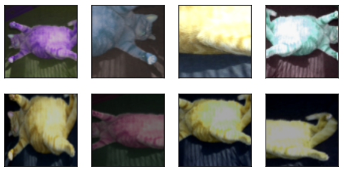

## 使用图像增广训练 CIFAR10

这里使⽤ CIFAR-10 数据集，⽽不是常⽤的 Fashion-MNIST 数据集。这是因为Fashion-MNIST 数据集中对象的位置和⼤⼩已被规范化，⽽CIFAR-10数据集中对象的颜⾊和⼤⼩差异更明显。CIFAR-10数据集中的前32个训练图像如下所⽰。

```python
all_images = torchvision.datasets.CIFAR10(train=True, root="../data",
                                          download=True)
d2l.show_images([all_images[i][0] for i in range(32)], 4, 8, scale=0.8);
```

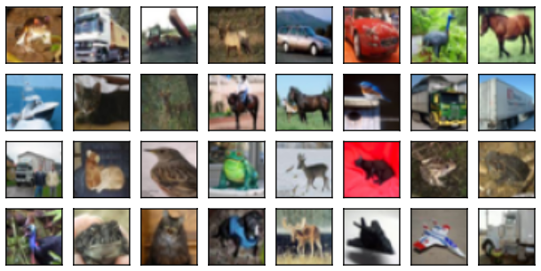

为了在预测过程中得到确切的结果，通常只对训练样本进行图像增广。

在这里，只使用最简单的随机左右翻转。此外，使用 `ToTensor` 讲图像转换为张量，即 shape 为 `(批量大小, 通道, 高度, 宽度)` 的 32 位浮点数，取值范围 0~1。图片增广最后一般都跟一个 `ToTensor`。

```python
# 因为图片太小，就 32x32 图片，没有 resize 必要
# 而且图片已经放在正中间，更没有 reisze 必要
# 因为训练集和测试集颜色上变化不大，所以也没有添加颜色转变 
train_augs = torchvision.transforms.Compose([
    torchvision.transforms.RandomHorizontalFlip(),
    torchvision.transforms.ToTensor()])

# 对测试样本，不进行增广
test_augs = torchvision.transforms.Compose([
    torchvision.transforms.ToTensor()])
```

定义一个辅助函数，便于读取图像和应用图像增广：

```python
def load_cifar10(is_train, augs, batch_size):
    dataset = torchvision.datasets.CIFAR10(root="../data", train=is_train,
        transform=augs, download=True)
    dataloader = torch.utils.data.DataLoader(dataset, batch_size=batch_size,
        shuffle=is_train, num_workers=4)
    return dataloader
```

图片增强，推荐 `num_workers` 设置大一点，因为图片增广对计算量要求挺高。

开始训练：

```python
def train_batch_ch13(net, X, y, loss, trainer, devices):
    """用多GPU进行小批量训练"""
    if isinstance(X, list):
        # 微调BERT中所需（稍后讨论）
        # 如果是 list，逐个拷贝到 list
        X = [x.to(devices[0]) for x in X]
    else:
        X = X.to(devices[0])
    y = y.to(devices[0])
    net.train()
    trainer.zero_grad()
    pred = net(X)
    l = loss(pred, y)
    l.sum().backward()
    trainer.step()
    train_loss_sum = l.sum()
    train_acc_sum = d2l.accuracy(pred, y)
    return train_loss_sum, train_acc_sum
```

```python
def train_ch13(net, train_iter, test_iter, loss, trainer, num_epochs,
               devices=d2l.try_all_gpus()):
    """用多GPU进行模型训练"""
    timer, num_batches = d2l.Timer(), len(train_iter)
    animator = d2l.Animator(xlabel='epoch', xlim=[1, num_epochs], ylim=[0, 1],
        legend=['train loss', 'train acc', 'test acc'])
    net = nn.DataParallel(net, device_ids=devices).to(devices[0])
    for epoch in range(num_epochs):
        # 4个维度：储存训练损失，训练准确度，实例数，特点数
        metric = d2l.Accumulator(4)
        for i, (features, labels) in enumerate(train_iter):
            timer.start()
            l, acc = train_batch_ch13(
                net, features, labels, loss, trainer, devices)
            metric.add(l, acc, labels.shape[0], labels.numel())
            timer.stop()
            if (i + 1) % (num_batches // 5) == 0 or i == num_batches - 1:
                animator.add(epoch + (i + 1) / num_batches,
                    (metric[0] / metric[2], metric[1] / metric[3],
                     None))
        test_acc = d2l.evaluate_accuracy_gpu(net, test_iter)
        animator.add(epoch + 1, (None, None, test_acc))
    print(f'loss {metric[0] / metric[2]:.3f}, train acc '
          f'{metric[1] / metric[3]:.3f}, test acc {test_acc:.3f}')
    print(f'{metric[2] * num_epochs / timer.sum():.1f} examples/sec on '
          f'{str(devices)}')
```

然后定义 `train_with_data_aug` 函数，使用图像增广来训练模型。该函数获取所有 GPU，并使用 Adam 作为优化算法，将图像增广应用于训练集，最后调用刚刚定义的用于训练和评估模型的 `train_ch13` 函数。

```python
batch_size, devices, net = 256, d2l.try_all_gpus(), d2l.resnet18(10, 3)

def init_weights(m):
    if type(m) in [nn.Linear, nn.Conv2d]:
        nn.init.xavier_uniform_(m.weight)

net.apply(init_weights)

def train_with_data_aug(train_augs, test_augs, net, lr=0.001):
    train_iter = load_cifar10(True, train_augs, batch_size)
    test_iter = load_cifar10(False, test_augs, batch_size)
    loss = nn.CrossEntropyLoss(reduction="none")
    trainer = torch.optim.Adam(net.parameters(), lr=lr)
    train_ch13(net, train_iter, test_iter, loss, trainer, 10, devices)
```

- 基于随机左右翻转的图像增广来训练模型

```python
train_with_data_aug(train_augs, test_augs, net)
```

当应用较大的图像增广，会出现测试精度比训练精度高的情况。

CIFAR10 精度要到 95% 以上，至少要跑 200 个 epochs。

## QA

- 图像增⼴基于现有的训练数据⽣成随机图像，来提⾼模型的泛化能⼒。
- 为了在预测过程中得到确切的结果，通常只对训练样本进⾏图像增⼴，⽽在预测过程中不使⽤带随机操作的图像增⼴。
- 深度学习框架提供了许多不同的图像增⼴⽅法，这些⽅法可以被同时应⽤。
- 极度偏斜数据
- mix-up 对提高识别准确率效果很好。


## 参考

- https://zh.d2l.ai/chapter_computer-vision/image-augmentation.html
