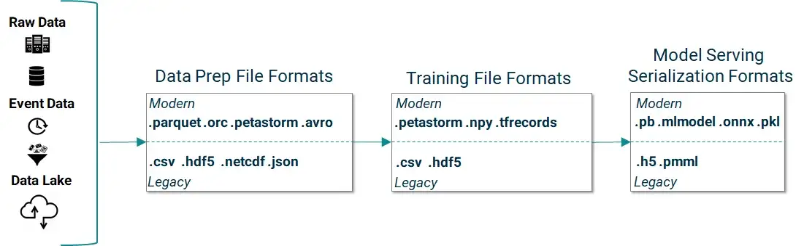
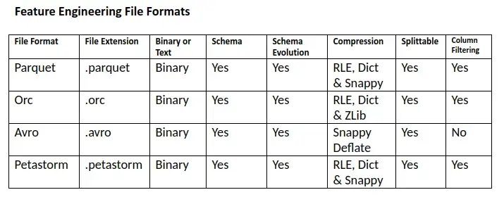
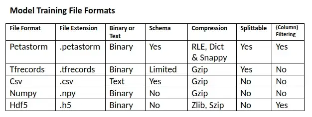
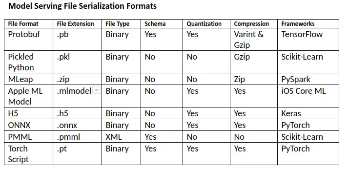

# 数据格式

## 文件格式

|格式|说明|
|---|---|
|CSV|最常用的数据格式|
|Pickle|用于序列化和反序列化Python对象结构|
|MessagePack|类似于json，但是更小更块|
|HDF5|一种常见的跨平台数据储存文件|
|Feather|一个快速、轻量级的存储框架|
|Parquet|Apache Hadoop的列式存储格式|

- **Sqlite3**

Sqlite3 是一个可嵌入的 SQL 引擎，如果不使用任何索引，sqlite 也是一种存储格式。

petastorm 文件格式由 Uber 开发，用于在 HDFS 上存储自动假设的 PB 级数据。

文件格式：columnar, tabular, nested, array-based, hierarchical。

Columnar 文件格式用于分布式文件系统（HDFS，HopsFS）和对象存储（S3, GCS, ADL），可以并行读取不同文件。

- 文件格式：parquet, orc, petastorm
- 特征工程：PySpark, Beam, Flink
- 训练：petastorm 包含 TensorFlow 和 PyTorch 的 native reader

## 框架

**PySpark**

- 文件格式：csv, parquet, orc, json, avro, petastrom
- 数据源：HDFSF, S3，本地文件系统
- 模型文件：zip(MLeap)

**Pandas/Scikit-Learn**

- 文件格式：csv, npy, parquet, h5, json, xlsx
- 数据源：本地文件系统，HDFS，S3
- 模型文件：pkl

**TensorFlow/Keras**

- 文件格式：csv, npy, tfrecords, petastorm
- 数据源：HDFS，S3
- 模型文件：pb

**PyTorch**

- 文件格式：csv, npy, petastorm
- 模型文件：pt

