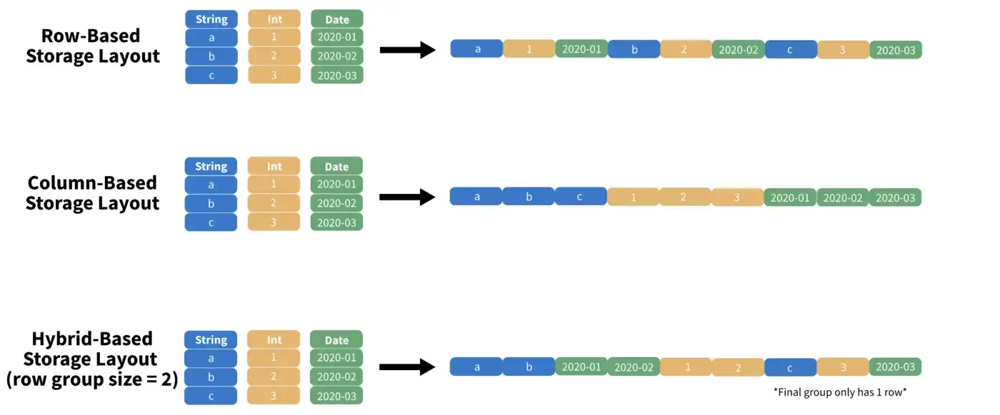
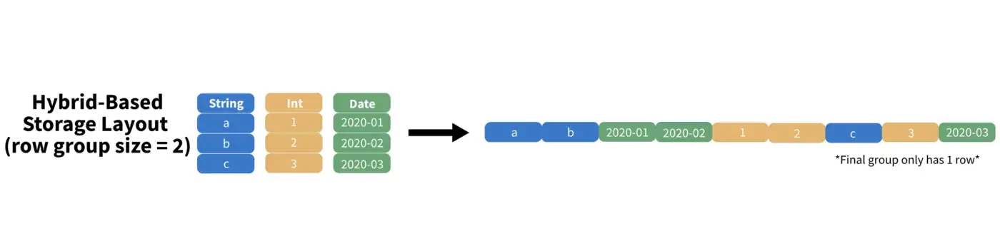
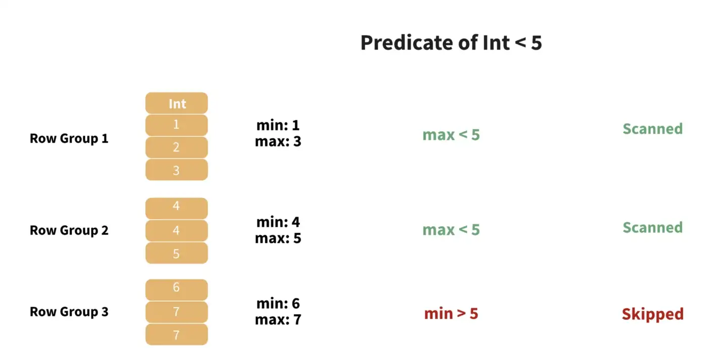
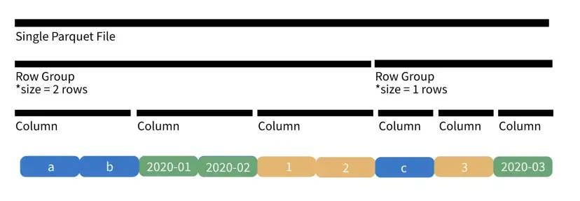
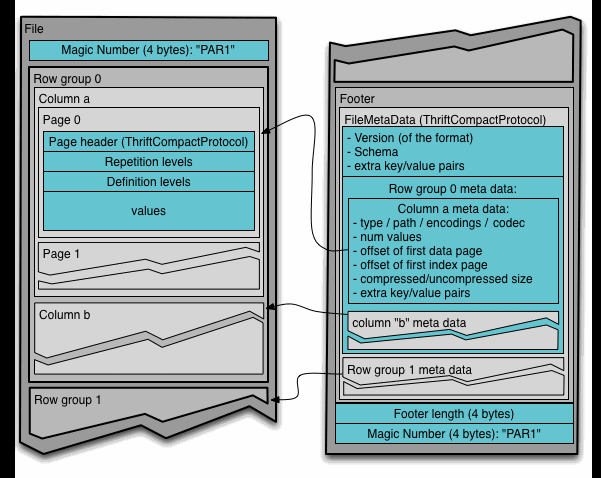
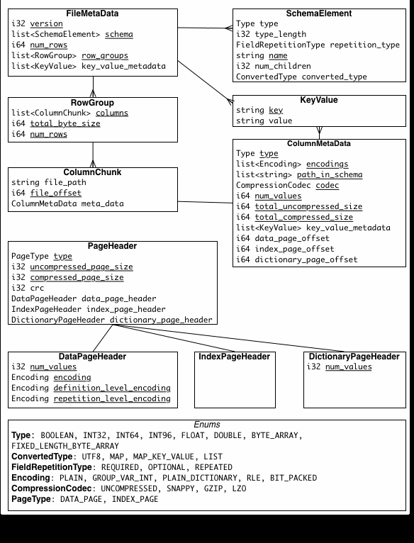

# Apache Parquet 简介

- [Apache Parquet 简介](#apache-parquet-简介)
  - [概述](#概述)
    - [列存储和行存储](#列存储和行存储)
    - [Parquet metadata](#parquet-metadata)
    - [Parquet 文件结构](#parquet-文件结构)
  - [优化](#优化)
    - [重复值](#重复值)
    - [非常大的值](#非常大的值)
    - [复杂过滤器](#复杂过滤器)
  - [概念](#概念)
  - [文件格式](#文件格式)
    - [配置](#配置)
  - [Metadata](#metadata)
  - [参考](#参考)

Last updated: 2022-12-08, 11:25
****

## 概述

Apache Parquet 是 Hadoop 生态系统中基于 column 的存储格式，支持嵌套，可以在任意数据处理框架、数据模型或编程语言中使用，是一个开源文件格式。

### 列存储和行存储

数据存储，我们一般关注两点：

- **读取速度**：从二进制文件中读取和解码相关信息的速度
- **文件大小**：文件占据的磁盘空间

相对 CSV 文件，parquet 占用空间更少（CSV 的20%），读写速度更快（30x）。

parquet 效率更高的其中一个原因，是存储方式的不同。将一个二维表格存储起来，主要布局有三种：

1. **Row-based**：按行顺序存储（CSV）
2. **Column-based**：按列顺序存储（ORC）
3. **Hybrid-based**：按顺序存储分块列（Parquet）

如下图所示：



实践证明，混合布局效率更高，因为它同时支持投影（projection）和谓词（predicate）。

**投影**（projection）是选择列操作，可以看作 SQL 中的 `SELECT` 语句。在基于列的布局中读取表格的第一列，只需要读取二进制文件中的前 `n` 个索引，十分高效。

**谓词**（predicate）指按条件选择行的操作，可以看作 SQL 中的 `WHERE` 语句。基于行的布局对谓词支持较好，例如，如果我们需要根据条件，如 `Int >= 2` 选择行，只需按 `Int` 对表格降序排列，满足条件的行都是表格前面。

在以上两种情况，我们都希望尽可能少地遍历文件。而且，数据分析要对行或列进行子集操作，混合布局模式对这两种操作都有相对较好的支持。

> 虽然 parquet 通常被说成按列存储，但准确地说，它是采用的混合布局模式，按顺序存储分块列。

### Parquet metadata

为了实现数据的快速提取，Parquet 利用 metadata 准确定位数据。



如图所示，其行组（row group）大小为 2，即每个 column 块，存储两行，依次存储第一列的 2 行，第二列的 2 行...，所有列存储完后，转到第一个 row group。上图的表格只有三行，所以第二个 row group，只有 1 行。

现在假设 row group 大小为 100,000 而不是 2，如果要找到 `Int` 列为特定值的 row，那么最坏的情况是要扫描表格的每一行。



Parquet 存储每个 row group 的 `max` 和 `min` 值，这样就允许跳过整个 row group，从而解决了该问题。另外，Parquet 通常在单个目录中写入多个 `.parquet` 文件，因此可以查看整个文件的 column metadata 确定是否跳过该文件。

通过包括额外的元数据，我们可以跳过大块的数据，从而大大提高查询速度。

### Parquet 文件结构

如前所述，Parquet 单次写入可能输出多个 `.parquet` 文件，对于较小的数据集这是个问题，可以在写入前对数据重新分区；但是对大型数据集，将数据划分到多个文件可以显著提高性能。

总的来说，parquet 按如下结构组织数据：

`Root > Parquet Files > Row Groups > Columns > Data Page`

- **Root** 指文件根目录，其中包含多个 **.parquet** 文件
- 每个 parquet 文件包含一个数据分区，对应多个 **row groups**
- 每个 rwo group 包含多个 **columns**
- 最后，每个 column 包含多个 **data page**，data page 包含原始数据和相关的元数据

下图是单个 `.parquet` 文件的示意图：



## 优化

自 2013 年问世以来，parquet 已经添加了大量优化。底层结构和上述格式基本没有变化，但是添加了许多特性以提高特定类型数据的性能。

### 重复值

解决方案：[Run-Length Encoding (RLE)](https://en.wikipedia.org/wiki/Run-length_encoding)

假设有一个包含 10,000,000 个值，但全部为 `0`。要存储这些信息，只需要两个数字：`0` 和重复次数 `10,000,000`。

RLE 原理就是如此，当发现许多顺序重复值，parquet 将这些信息编码为与值和计数对应的元组，从而节省存储空间。

### 非常大的值

解决方案：基于 [Bit-Packing](https://parquet.apache.org/docs/file-format/data-pages/encodings/#a-namerlearun-length-encoding--bit-packing-hybrid-rle--3) 的 [Dictionary Encoding](https://stackoverflow.com/questions/64600548/when-should-i-use-dictionary-encoding-in-parquet)

例如，假设我们有一个包含国家名称的 column，有些国家名称特别长，如 “The Democratic Republic of Congo”，则需要一个至少能保存 32 个字符的字符串 column。

Dictionary encoding 将 column 中的值替换为整数，并将映射存储在 data page 的元数据中。保存到磁盘上时，编码值以 bit-packed 打包存储，占用尽可能少的空间，当读取数据时，仍然可以将列转换回原始值。

### 复杂过滤器

解决方案：[Projection and Predicate Pushdown](https://stackoverflow.com/questions/58235076/what-is-the-difference-between-predicate-pushdown-and-projection-pushdown/58235274#58235274)

在 spark 中，可以通过 projection 和 predicate 避免将整个表格载入内存。因为 spark 是延迟操作，即在实际查询数据前不执行，所以可以尽可能少的将数据载入内存。

> Note: predicate 对行取子集，projection 对列去子集。

## 概念

- **Row group**

数据的 row 逻辑划分。

## 文件格式

文件示例：

```parquet
4-byte magic number "PAR1"
<Column 1 Chunk 1 + Column Metadata>
<Column 2 Chunk 1 + Column Metadata>
...
<Column N Chunk 1 + Column Metadata>
<Column 1 Chunk 2 + Column Metadata>
<Column 2 Chunk 2 + Column Metadata>
...
<Column N Chunk 2 + Column Metadata>
...
<Column 1 Chunk M + Column Metadata>
<Column 2 Chunk M + Column Metadata>
...
<Column N Chunk M + Column Metadata>
File Metadata
4-byte length in bytes of file metadata
4-byte magic number "PAR1"
```

上例中，有 N 个 columns, M 个 row group。

文件元数据（metadata）包含所有 column 元数据的开始位置。元数据在数据之后写入。

读者应该先读文件元数据，找到感兴趣的 column chunk，然后按顺序读取 column chunks。




### 配置

- **Row Group Size**

Row group size 越大，

## Metadata

有三种类型的 metadata：

- file metadata
- column (chunk) metadata
- page header metadata

所有 thrift 结构都使用 `TCompactProtocol` 序列化。



## 参考

- https://parquet.apache.org/docs/
- https://towardsdatascience.com/demystifying-the-parquet-file-format-13adb0206705
