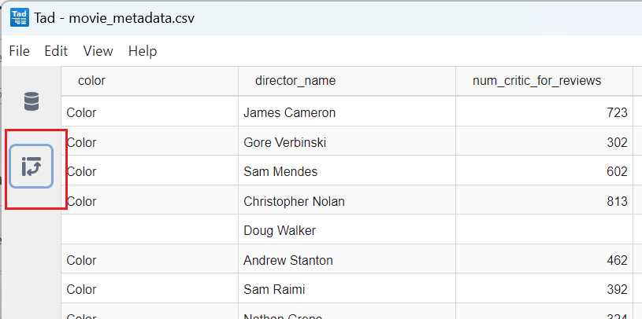

# Tad

## 简介

tad 是一个用于查看和分析表格数据的程序。

Tad 支持的文件格式：CSV, Parquet, SQLite 和 DuckDb 数据库文件。Tab 内部使用 DuckDb，DuckDb 是一个快速、可嵌入的数据库引擎，针对分析查询进行了优化。

Tad 的核心是一个 React UI 组件，实现了分层数据透视表格，支持透视、过滤、聚合、排序、column 选择、column 排序和基本 column 格式化操作。Tad 将存储和分析委托给 SQL 数据库，并生成 SQL query 来执行 UI 中指定的所有分析操作。

可以从命令启动 Tad:

```sh
$ tad MetObjects.csv
```

这将打开一个窗口，显示 CSV 文件的完整内容。

Tad 使用 SlickGrid 渲染 data-grid。这使得 Tad 支持整个文件的线性滚动，即使是包含数百万行的大型数据集。

打开文件后，Tad 自动将数据导入 in-memory DuckDb 数据库，并以表格显示数据。点击左侧的数据透视图标，可以看到 Tad 的设置界面：




## 参考

- https://github.com/antonycourtney/tad