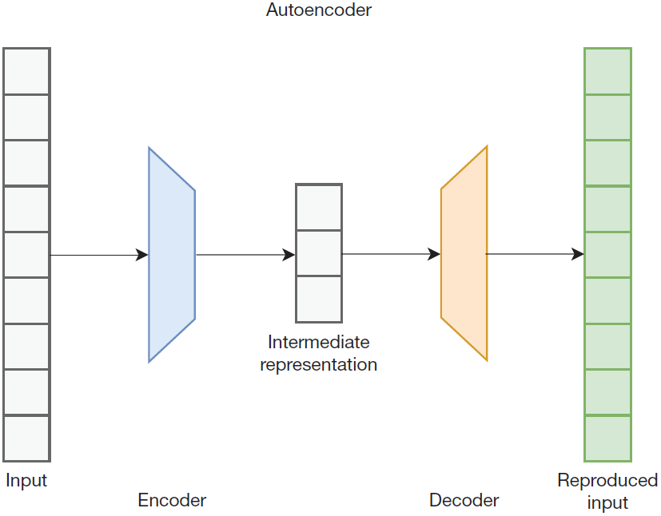
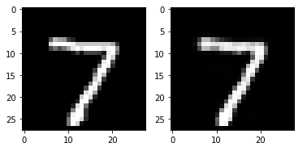
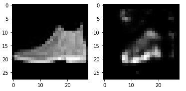
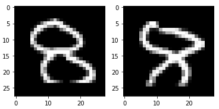

# autoencoder

2022-02-24, 12:40
***

## 简介

autoencoder 是一种特殊的 encoder-decoder 结构，其输入和输出相同，即 autoencoder 的目标是实现恒等函数（identity function）。如下图所示：



autoencoder 包含一个 encoder 和一个 decoder，encoder 将输入数据转换为中间表示，decoder 将中间表示重新生成输入数据。

encoder 和 decoder 的具体结构取决于应用和数据类型。例如，对于文本数据，encoder 和 decoder 可能是基于 RNN 或 transoformer 的结构，而对于其它类型的数据，可能是全连接神经网络或卷积网络。

那么，我们为什么需要 autoencoder？autoencoder 的一个关键属性使其非常有用。如上图所示，中间表示的维度通常低于输入数据，即中间表示更为紧凑，可以将其看作输入数据的压缩版本。encoder 压缩数据，decoder 再解压缩。但是，autoencoder 的存在不是为了取代 gzip, jpeg 等压缩算法，大多数情况下，是为了直接使用中间表示。

> autoencoder 输出和输入相同的值，它首先将输入编码成更紧凑的中间表示，这种中间表示可进一步用作其它分析。

## 应用

### 降维

我们首先来看如何用 autoencoder 确定两个不同的句子是否传达类似的信息。中间表示可以作为句子向量，相似的句子在向量空间中距离更近。换句话说，如果我们训练了一个 encoder-decoder 网络来完成翻译任务，我们可以单独使用 encoder 部分生成句子的向量。

不过为翻译网络准备训练数据成本可能很高，因为每个训练样本要准备两种不同的语言。可以通过把翻译网络训练成一个自动编码器来解决这个问题。简单地训练 sequence-to-sequence 模型，将一种语言翻译成同一种语言。由于中间表示比输入和输出更窄，模型被迫训练成一个信息量更高的中间表示。

值得说明的是，word2vec 算法和 autoencoder 类似。在 word2vec 中，我们对单词的 one-hot 表示执行编码步骤，将它的维度降低到中间表示的维度，然后执行解码步骤，不过该步骤不是为了预测单词本身，而是它周围的单词。

### 离群值检测

autoencoder 可用于离群值检测（outlier detection）。假设我们训练了一个 autoencoder，输入和输出都是英语。如果我们将任意一个英语句子输入网络，我们希望输出与输入相似。具体来说，我们希望损失函数的值很小，因为训练模型的目标就是最小化损失函数。

假设我们使用相同的网络，但输入一个法语句子。经过英语训练的 autoencoder 不太可能擅长重现法语，因此，法语句子的损失值会比任意一个英语句子大。即，损失值大的数据比 autoencoder 训练时的数据不同，换句话说，损失值大意味着当前输入数据是离群值（outlier）。

离群值检测可用于信用卡交易数据。每个信用卡交易都包含许多特征，如金额、时间、供应商和位置等。我们可以将所有这些特征组成一个特征向量，并将其作为一个自动编码器的输入，训练 autoencoder 使其输出相同的特征向量。如果我们向网络呈现一个非典型的事物，它就不能很好地在其输出上复制向量。即，损失值较高，表明这可能是一个异常事务，应该标记为可疑的事务。

### 其它方面

autoencoder 对未标记数据的编码，意味着 autoencoder 可以找到数据中的潜在模式，使其成为潜在的非监督学习算法，比如，将内部表示向量提供给聚类算法，聚类算法将向量进行分组，将相似的向量放在同一个 cluster。

autoencoder 的另一个重要应用是用作降维技术，即新的较窄的表示仍然保持较宽表示的属性。编码器可用于减少维度，解码器可用于扩展维度。

基本的 autoencoder 可以以各种方式修改，以便应用于其它方面。比如降噪 autoencoder，结构是相同的，但是训练数据要略微修改一下，输入和输出数据不再完全一样，而是将损坏的数据作为输入，将损坏数据的正确版本作为输出。得到的模型可用于去除输入数据（如图像或视频）中的噪声。

## 示例：离阈值检测

下面用一个示例演示用 autoencoder 检测离阈值。基本流程是，用 MNIST 数据集训练 autoencoder 模型，然后用该模型检测图片，预期该模型对非手写数字的损失值较大。

首先，导入数据：

```python
import tensorflow as tf
import tensorflow.keras as keras
from tensorflow.keras.utils import to_categorical
import numpy as np
import matplotlib.pyplot as plt
import logging

tf.get_logger().setLevel(logging.ERROR)

EPOCHS = 10

# 载入 MNIST 数据集
mnist = keras.datasets.mnist
(train_images, train_labels), (test_images, test_labels) = mnist.load_data()

# 缩放数据
train_images = train_images / 255.0
test_images = test_images / 255.0
```

这里没有将数据标准化为以 0 为中心，而是将数据缩放到 0~1 之间，这里稍微说明一下为什么这样做。autoencoder 的目标是在输出上重现输入，这意味着我们定义的网络要满足该需求。例如，如果我们使用以 0 为中心的输入数据，使用 sigmoid 作为输出单元，那么这个模型根本不能解决这个问题，因为 sigmoid 只能输出正数。在处理图像数据时，我们一般希望将输出范围限制在一个固定范围（0-255 的整数或 0-1 之间的浮点数），一般将输入值缩放到 0-1 之间，并使用 sigmoid 作为输出单元输出 0-1 之间的数。另外，也可以将数据标准化为以 0 为中心，然后使用线性输出单元，不过需要对输出数据进行后处理，确保不超出范围。

下一步是定义和训练模型：

```python
model = keras.Sequential([
    keras.layers.Flatten(input_shape=(28, 28)),
    keras.layers.Dense(64, activation='relu',
                       kernel_initializer='glorot_normal',
                       bias_initializer='zeros'),
    keras.layers.Dense(784, activation='sigmoid',
                       kernel_initializer='glorot_normal',
                       bias_initializer='zeros'),
    keras.layers.Reshape((28, 28))
])
model.compile(loss='binary_crossentropy', optimizer='adam', metrics=['mean_absolute_error'])
history = model.fit(train_images, train_images,
                    validation_data=(test_images, test_images),
                    epochs=EPOCHS, batch_size=64, verbose=2, shuffle=True)
```

encoder 包含：

- `Flatten` 层将 shape 从 28x28 转换为 784
- 包含 64 个单元的 `Dense` 层

decoder 包含：

- 包含 784 个单元的 `Dense` 层
- 将维度从 784 转换为 28x28 的 `Reshape` 层

decoder 和 encoder 执行完全相反的操作。

这个 autoencoder 的目的是生成和输入图像完全相同的图像。中间表示向量大小为 64。

需要说明的是，虽然上面 encoder 和 decoder 都使用的全连接层，当处理图像时，卷积层和基于卷积的 upsampling 层使用更广泛。这列为了简单而使用了全连接层，MNIST 这种小而简单的图像用全连接层也是可行的。

下面我们用训练好的模型在测试集上重现图像：

```python
predict_images = model.predict(test_images)

# 绘制一个样本和预测结果
plt.subplot(1, 2, 1)
plt.imshow(test_images[0], cmap=plt.get_cmap('gray'))
plt.subplot(1, 2, 2)
plt.imshow(predict_images[0], cmap=plt.get_cmap('gray'))
plt.show()
```



将模型应用于所有测试图像后，将第一个测试图像和相应的预测图像绘制出来。可以看到，该网络在重现图像上做得还不错。

下一步我们将 autoencoder 应用到不同的图像。这里我们使用 Fashion MNIST 数据集，该数据集同样包含 28x28 图像，也包含 10 个类别，不同之处在于，这些图像不是手写数字，而是各种衣服、鞋子、衬衫等。下面载入 Fashion MNIST 数据集，用上面的模型重现该数据集的测试图像：

```python
f_mnist = keras.datasets.fashion_mnist
(f_train_images, f_train_labels), (f_test_images, f_test_labels) = f_mnist.load_data()
f_train_images = f_train_images / 255.0
f_test_images = f_test_images / 255.0

f_predict_images = model.predict(f_test_images)
plt.subplot(1, 2, 1)
plt.imshow(f_test_images[0], cmap=plt.get_cmap('gray'))
plt.subplot(1, 2, 2)
plt.imshow(f_predict_images[0], cmap=plt.get_cmap('gray'))
plt.show()
```



可以看到，结果比 MNIST 上的表现差多了。也就是说，上面的 autoencoder 学会了如何复制手写数字，但是没学会复制其它类型的图像。

为了进一步量化这种差异，下面计算 autoencoder 在 MNIST 测试样本和 Fashion MNIST 测试样本上的平均绝对误差（在训练时我们使用的二元交叉熵，这里使用二元交叉熵可能更好，但是这里只是为了说明差异，所以用简单的平均绝对误差来演示）。

```python
error = np.mean(np.abs(test_images - predict_images), (1, 2))
f_error = np.mean(np.abs(f_test_images, f_predict_images), (1, 2))
_ = plt.hist((error, f_error), bins=50, label=['mnist', 'fashion mnist'])

plt.legend()
plt.xlabel("mean absolute error")
plt.ylabel("examples")
plt.title("Autoencoder for outlier detection")
plt.show()
```


如图所示，MNIST 的误差比 Fashion MNIST 的误差要小。如果误差大于 0.02（蓝色和橙色的分界），则很可能图像不是手写数字，即检测到一个离阈值。

另外，我们发现蓝色和橙色没有完全分开，有部分重叠，为了深入了解这一点，我们看一下错误最大的两个 MNIST 测试图像：

```python
index = error.argmax()
plt.subplot(1, 2, 1)
plt.imshow(test_images[index], cmap=plt.get_cmap("gray"))
error[index] = 0
index = error.argmax()
plt.subplot(1, 2, 2)
plt.imshow(test_images[index], cmap=plt.get_cmap("gray"))
plt.show()
```



可以发现，这两张图像都是裁剪不好的 8，从某种意义上说，确实可以看作 MNIST 数据集中的离群值。

## 参考

- Learning Deep Learning: Theory and Practice of Neural Networks, Computer Vision, Natural Language Processing, and Transformers Using Tensorflow, Magnus Ekman
