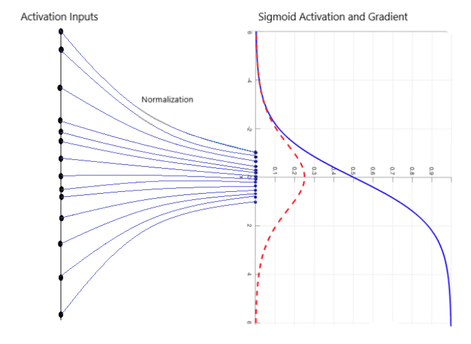
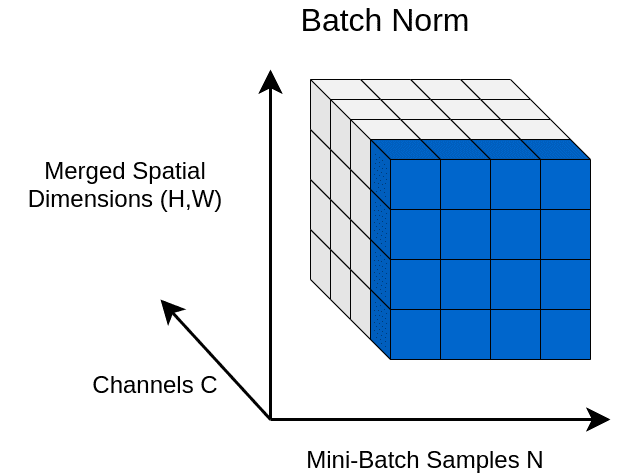

# Normalization

## 说明

标记说明：

- N 为 batch size
- H 为 height
- W 为 width
- C 为 feature channels
- $\mu ()$ 表示均值
- $\sigma ()$ 表示标准差。

因此，批量特征 x 的 shape 为 [N, C, H, W]，另外对引用的样式图像用 y 表示，mask 用 m 表示。即：

$$x, y, m \isin R^{N\times C\times H\times W} \tag{1}$$

此外，我们通过合并空间维度来可视化 4D 激活映射 x。得到 3D  shape 如下：

## Batch normalization (2015)

批量归一化（Batch Normalization, BN）对每个特征通道使用均值和方差进行归一化。

首先，图像特征的均值和方差是一阶统计量，因此，它们与全局特征相关（如图像风格）。通过这种方式，在某种程度上混合了全局特征。

从数学角度看，该方法将图像的特征缩放到相同范围内：

具体来说，我们要求特征遵循均值为 0 方差为 1的高斯分数，数学表示为：

$$BN(x) = \gamma (\frac{x-\mu (x)}{\sigma (x)})+\beta \tag{2}$$

$$\mu_c (x)=\frac{1}{NHW}\sum_{n=1}^N\sum_{h=1}^H\sum_{w=1}^W x_{nchw} \tag{3}$$

$$\mu_c (x)=\sqrt{\frac{1}{NHW} \sum_{n=1}^N\sum_{h=1}^H\sum_{w=1}^W (x_{nchw}-\mu_c(x))^2} \tag{4}$$

如下图所示：

> 图中蓝色区域，对应一个

这样空间维度和图像批处理都取了平均，这样，特征几种在一个紧凑的类高斯空间，这样更利于训练。

事实上，$\gamma$ 和 $\beta$ 都是可训练参数，这两个向量都与通道维度相同，索引 c 表示通道索引。

BN 的优点：

- 加速深度神经网络的训练
- 对每个输入小批量，计算不同的统计数据。这引入了某种形式的正则化。正则化指在训练过程中限制深度神经网络复杂性的任何形式的约束。
- 每个小批量都有一个不同的 mini-distribution。不同 mini-distributions 

## Layer normalization (2016)

## 总结

## 参考

- https://theaisummer.com/normalization/
