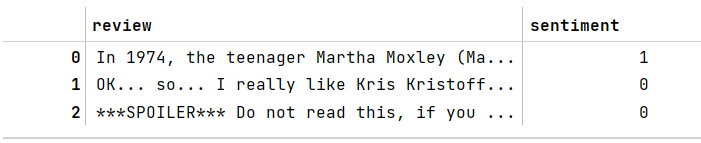

# Fine-tuning BERT 模型

- [Fine-tuning BERT 模型](#fine-tuning-bert-模型)
  - [简介](#简介)
  - [加载 IMDb 数据集](#加载-imdb-数据集)
  - [Tokenizing the dataset](#tokenizing-the-dataset)
  - [加载和微调预训练 BERT 模型](#加载和微调预训练-bert-模型)
  - [Trainer API](#trainer-api)

***

## 简介

下面微调 DistilBERT 模型，DistilBERT 是通过 distilling 预训练的 BERT 基础模型创建的轻量级 transformer 模型。原始的 BERT 基础模型的参数量超过 1.1 亿，而 DistilBERT 的参数减少了 40%。另外，在 GLUE 语言理解基准测试中，DistilBERT 在保持原 BERT 95% 的性能前提下运行速度提高了 60%。

导入包：

```python
import gzip
import shutil
import time

import pandas as pd
import requests
import torch
import torch.nn.functional as F
import torchtext

import transformers
from transformers import DistilBertTokenizerFast
from transformers import DistilBertForSequenceClassification
```

设置：

```python
torch.backends.cudnn.deterministic = True
RANDOM_SEED = 123
torch.manual_seed(RANDOM_SEED)

DEVICE = torch.device('cuda' if torch.cuda.is_available() else 'cpu')
NUM_EPOCHS = 3
```

## 加载 IMDb 数据集

- 下载

```python
url = "https://github.com/rasbt/machine-learning-book/raw/main/ch08/movie_data.csv.gz"
filename = url.split("/")[-1]
with open(filename, 'wb') as f:
    r = requests.get(url)
    f.write(r.content)
```

- 解压

```python
with gzip.open('movie_data.csv.gz', 'rb') as f_in:
    with open('movie_data.csv', 'wb') as f_out:
        shutil.copyfileobj(f_in, f_out)
```

- 使用 pandas 查看

```python
df = pd.read_csv('movie_data.csv')
df.head(3)
```



- 将数据集拆分为训练集、验证集和测试集

```python
train_texts = df.iloc[:35000]['review'].values
train_labels = df.iloc[:35000]['sentiment'].values

valid_texts = df.iloc[35000:40000]['review'].values
valid_labels = df.iloc[35000:40000]['sentiment'].values

test_texts = df.iloc[40000:]['review'].values
test_labels = df.iloc[40000:]['sentiment'].values
```

## Tokenizing the dataset

使用从预训练的模型类继承的 tokenizer 将文本 tokenize 为单词 tokens：

```python
tokenizer = DistilBertTokenizerFast.from_pretrained("distilbert-base-uncased")
train_encodings = tokenizer(list(train_texts), truncation=True, padding=True)
valid_encodings = tokenizer(list(valid_texts), truncation=True, padding=True)
test_encodings = tokenizer(list(test_texts), truncation=True, padding=True)
```

- 将以上内容打包成一个类 `IMDbDataset`，并创建相应的 data loader

```python
class IMDbDataset(torch.utils.data.Dataset):
    def __init__(self, encodings, labels):
        self.encodings = encodings
        self.labels = labels

    def __getitem__(self, idx):
        item = {key: torch.tensor(val[idx]) for key, val in self.encodings.items()}
        item['labels'] = torch.tensor(self.labels[idx])
        return item

    def __len__(self):
        return len(self.labels)
```

```python
train_dataset = IMDbDataset(train_encodings, train_labels)
valid_dataset = IMDbDataset(valid_encodings, valid_labels)
test_dataset = IMDbDataset(test_encodings, test_labels)

train_loader = torch.utils.data.DataLoader(train_dataset, batch_size=16, shuffle=True)
valid_loader = torch.utils.data.DataLoader(valid_dataset, batch_size=16, shuffle=False)
test_loader = torch.utils.data.DataLoader(test_dataset, batch_size=16, shuffle=False)
```

## 加载和微调预训练 BERT 模型

```python
model = DistilBertForSequenceClassification.from_pretrained('distilbert-base-uncased')
model.to(DEVICE)
model.train()

optim = torch.optim.Adam(model.parameters(), lr=5e-5)
```

`DistilBertForSequenceClassification` 表示对模型进行微调的下有任务为序列分类。如前所述，'distilbert-base-uncased' 是 BERT uncased 基础模型的轻量级版本，模型更小，性能也不错。其中 `uncased` 表示模型不区分大小写。

在训练模型前，定义一个精度函数来评估模型性能。

```python
def compute_accuracy(model, data_loader, device):
    with torch.no_grad():
        correct_pred, num_examples = 0, 0

        for batch_idx, batch in enumerate(data_loader):
            ### Prepare data
            input_ids = batch['input_ids'].to(device)
            attention_mask = batch['attention_mask'].to(device)
            labels = batch['labels'].to(device)
            outputs = model(input_ids, attention_mask=attention_mask)
            logits = outputs['logits']
            predicted_labels = torch.argmax(logits, 1)
            num_examples += labels.size(0)
            correct_pred += (predicted_labels == labels).sum()

        return correct_pred.float() / num_examples * 100
```

在 `compute_accuracy` 函数中，加载一个 batch，根据输出获得预测 labels。`num_examples` 记录总的样本数，`correct_pred` 记录预测正确的样本数。

将 `input_ids` 和 `attention_mask` 输入模型，`model` 返回 transformer 库特定的 `SequenceClassifierOutput` 对象。从该对象获取 logits，然后通过 `argmax` 函数转换为类标签。

下面是训练循环部分：

```python
start_time = time.time()

for epoch in range(NUM_EPOCHS):

    model.train()

    for batch_idx, batch in enumerate(train_loader):

        ### Prepare data
        input_ids = batch['input_ids'].to(DEVICE)
        attention_mask = batch['attention_mask'].to(DEVICE)
        labels = batch['labels'].to(DEVICE)

        ### Forward
        outputs = model(input_ids, attention_mask=attention_mask, labels=labels)
        loss, logits = outputs['loss'], outputs['logits']

        ### Backward
        optim.zero_grad()
        loss.backward()
        optim.step()

        ### Logging
        if not batch_idx % 250:
            print(f'Epoch: {epoch + 1:04d}/{NUM_EPOCHS:04d} | '
                  f'Batch {batch_idx:04d}/{len(train_loader):04d} | '
                  f'Loss: {loss:.4f}')

    model.eval()

    with torch.set_grad_enabled(False):
        print(f'Training accuracy: '
              f'{compute_accuracy(model, train_loader, DEVICE):.2f}%'
              f'\nValid accuracy: '
              f'{compute_accuracy(model, valid_loader, DEVICE):.2f}%')

    print(f'Time elapsed: {(time.time() - start_time) / 60:.2f} min')

print(f'Total Training Time: {(time.time() - start_time) / 60:.2f} min')
print(f'Test accuracy: {compute_accuracy(model, test_loader, DEVICE):.2f}%')
```

```txt
Epoch: 0001/0003 | Batch 0000/2188 | Loss: 0.6770
Epoch: 0001/0003 | Batch 0250/2188 | Loss: 0.2734
Epoch: 0001/0003 | Batch 0500/2188 | Loss: 0.4938
Epoch: 0001/0003 | Batch 0750/2188 | Loss: 0.1910
Epoch: 0001/0003 | Batch 1000/2188 | Loss: 0.4413
Epoch: 0001/0003 | Batch 1250/2188 | Loss: 0.2500
Epoch: 0001/0003 | Batch 1500/2188 | Loss: 0.4290
Epoch: 0001/0003 | Batch 1750/2188 | Loss: 0.3825
Epoch: 0001/0003 | Batch 2000/2188 | Loss: 0.1630
Training accuracy: 96.05%
Valid accuracy: 91.80%
Time elapsed: 6.71 min
Epoch: 0002/0003 | Batch 0000/2188 | Loss: 0.0905
Epoch: 0002/0003 | Batch 0250/2188 | Loss: 0.5524
Epoch: 0002/0003 | Batch 0500/2188 | Loss: 0.1773
Epoch: 0002/0003 | Batch 0750/2188 | Loss: 0.0282
Epoch: 0002/0003 | Batch 1000/2188 | Loss: 0.1414
Epoch: 0002/0003 | Batch 1250/2188 | Loss: 0.0427
Epoch: 0002/0003 | Batch 1500/2188 | Loss: 0.1991
Epoch: 0002/0003 | Batch 1750/2188 | Loss: 0.1503
Epoch: 0002/0003 | Batch 2000/2188 | Loss: 0.0289
Training accuracy: 98.43%
Valid accuracy: 92.72%
Time elapsed: 13.35 min
Epoch: 0003/0003 | Batch 0000/2188 | Loss: 0.0195
Epoch: 0003/0003 | Batch 0250/2188 | Loss: 0.0320
Epoch: 0003/0003 | Batch 0500/2188 | Loss: 0.0107
Epoch: 0003/0003 | Batch 0750/2188 | Loss: 0.0114
Epoch: 0003/0003 | Batch 1000/2188 | Loss: 0.0333
Epoch: 0003/0003 | Batch 1250/2188 | Loss: 0.0492
Epoch: 0003/0003 | Batch 1500/2188 | Loss: 0.0170
Epoch: 0003/0003 | Batch 1750/2188 | Loss: 0.0457
Epoch: 0003/0003 | Batch 2000/2188 | Loss: 0.4461
Training accuracy: 99.26%
Valid accuracy: 91.92%
Time elapsed: 19.96 min
Total Training Time: 19.96 min
Test accuracy: 92.57%
```

这里，我们迭代了 3 个 epoch。在每个 epoch 执行以下步骤：

1. 加载输入到设备 （GPU 或 CPU）
2. 计算模型输出和损失
3. 通过反向传播来调整权重
4. 在训练集和验证集上评估模型性能

在 3 个 epoch 后，在测试集上的准确率达到 93%，比一般 RNN 实现的 85% 高。

## Trainer API

上面手动实现了训练循环，不过 `transformers` 库提供了 Trainer API 使用更为方便。

Hugging Face 提供的 Trainer API 对 transformer 模型进行了优化，提供了全面的训练选项和各种内置功能。使用 Trainer API 可以避免自己编写训练循环。

在加载预训练模型后：

```python
model = DistilBertForSequenceClassification.from_pretrained('distilbert-base-uncased')
model.to(DEVICE)
model.train()

optim = torch.optim.Adam(model.parameters(), lr=5e-5)
```

之前的训练循环可以替换为：

```python
from transformers import Trainer, TrainingArguments

training_args = TrainingArguments(
    output_dir='./results',
    num_train_epochs=3,
    per_device_train_batch_size=16,
    per_device_eval_batch_size=16,
    logging_dir='./logs',
    logging_steps=10,
)

trainer = Trainer(
    model=model,
    args=training_args,
    train_dataset=train_dataset,
)
```

然后可以调用 `trainer.train()` 训练模型。

不过 Trainer API 没有包含测试集，也没有指定任何性能评估指标。获得模型最终性能的方法有两种。

一种是定义性能评估函数作为另一个 `Trainer` 实例的 `compute_metrics` 参数。`compute_metrics` 函数以模型的预测结果（logits）和标签为参数。为了使用该功能，建议安装 Hugging Face 的 `datasets` 库，并按如下方式使用：

```python
metric = load_metric("accuracy")

def compute_metrics(eval_pred):
    logits, labels = eval_pred  # logits are a numpy array, not pytorch tensor
    predictions = np.argmax(logits, axis=-1)
    return metric.compute(predictions=predictions, references=labels)
```

此时 `Trainer` 的实例化方法如下：

```python
trainer = Trainer(
    model=model,
    compute_metrics=compute_metrics,
    args=training_args,
    train_dataset=train_dataset,
    eval_dataset=test_dataset,
    optimizers=(optim, None)  # optimizer and learning rate scheduler
)
```

