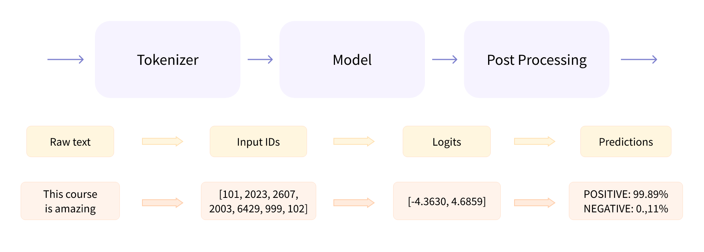
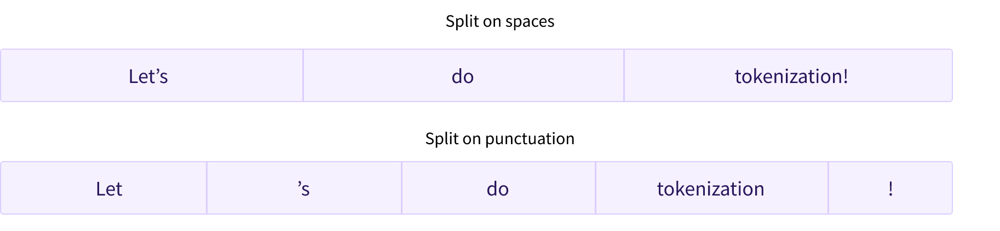

# 使用 Transformers

- [使用 Transformers](#使用-transformers)
  - [简介](#简介)
  - [pipeline 内部](#pipeline-内部)
    - [使用 tokenizer 预处理](#使用-tokenizer-预处理)
    - [浏览模型](#浏览模型)
      - [高维向量](#高维向量)
      - [模型头（Model head）](#模型头model-head)
    - [输出后处理](#输出后处理)
  - [Models](#models)
    - [创建 Transformer](#创建-transformer)
      - [不同加载方式](#不同加载方式)
      - [保存模型](#保存模型)
    - [使用 Transformer 模型进行推理](#使用-transformer-模型进行推理)
      - [使用张量作为模型输入](#使用张量作为模型输入)
  - [Tokenizers](#tokenizers)
    - [Word-based](#word-based)
    - [Character-based](#character-based)
    - [Subword tokenization](#subword-tokenization)
    - [其它算法](#其它算法)
    - [加载和保存](#加载和保存)
    - [Encoding](#encoding)
      - [Tokenization](#tokenization)
      - [从 token 到输入 ID](#从-token-到输入-id)
    - [Decoding](#decoding)
  - [参考](#参考)

***

## 简介

Transformer 模型通常非常大，包含数百万到上百亿参数，训练和部署这类模型是一项复杂的工作。此外，几乎每天都有新的模型发布，每种模型都有自己的实现，因此尝试它们绝非易事。

创建 🤗 Transformers 库就是为了解决这个问题。其目标是提供可以加载、训练和保存任何 Transformer 模型的 API。该库的主要特点：

- **易于使用**：下载、加载和使用最先进的NLP模型进行推理只需两行代码即可完成。
- **灵活**：所有模型都是简单的 PyTorch `nn.Module` 或者 TensorFlow `tf.kears.Model`，可以像它们各自的机器学习（ML）框架中的其他模型一样进行处理。
- **简单**：核心概念是 "All in one file"：模型的正向传递完全定义在一个文件中，因此代码本身是可以理解的，并且可以破解。

最后一个特性使得 🤗 Transformers 与其它 ML 库不同。Transformers 模型不是建立在跨文件共享的模块上，相反，每个模型都有自己的 layers。除了使模型更容易理解外，还可以在不影响其它模型的情况下轻松地对模型进行试验。

本章将从一个端到端的示例开始，在该示例中使用模型和 tokenizer 分词器来实现 `pipeline()` 函数的功能。然后讨论模型API，深入研究模型和配置类，并展示如何加载模型以及如何将数值输入处理为预测输出。

然后看看 tokenizer API，它是 `pipeline()` 函数的另一个主要组件。tokenizer 负责第一个和最后一个步骤，负责将文本转换为神经网络所需的数字输入，以及在需要时将数字转换回文本。最后展示如何批量处理输入。

## pipeline 内部

让我们从一个完整的示例开始，看看执行以下代码在幕后发生了什么：

```python
from transformers import pipeline

classifier = pipeline("sentiment-analysis")
classifier(
    [
        "I've been waiting for a HuggingFace course my whole life.",
        "I hate this so much!",
    ]
)
```

```python
[{'label': 'POSITIVE', 'score': 0.9598049521446228},
 {'label': 'NEGATIVE', 'score': 0.9994558691978455}]
```

`pipeline` 将三个步骤组合在一起：预处理、输入传入模型和后处理：



下面快速浏览一下这些内容。

### 使用 tokenizer 预处理

与其它神经网络一样，Transformer 模型不能直接处理原始文本，因此 `pipeline` 的第一步是将输入文本转换为数字。标记器（`tokenizer`）提供该功能：

- 将输入拆分为单词、子单词或符号（如标点符号），统称为标记(token)
- 将每个标记(token) 映射到一个整数
- 添加可能对模型有用的其他输入

所有这些预处理需要与模型预训练时完全相同，因此首先需要从 [Model Hub](https://huggingface.co/models) 下载这些信息。使用 `AutoTokenizer.from_pretrained()` 下载，提供模型的检查点名称，它将自动获取与模型的 tokenizer 相关联的数据，并对其进行缓存（因此只在第一次运行下面的代码时才会下载）。

因为 `sentiment-analysis`（情感分析）管道的默认检查点是`distilbert-base-uncased-finetuned-sst-2-english`（模型卡[地址](https://huggingface.co/distilbert-base-uncased-finetuned-sst-2-english))，运行以下代码：

```python
from transformers import AutoTokenizer

checkpoint = "distilbert-base-uncased-finetuned-sst-2-english"
tokenizer = AutoTokenizer.from_pretrained(checkpoint)
```

有了 tokenizer，就可以将文本传递给它，它会将文本转换为数字。下一步是如何将数字转换为张量。Transformers 模型只接受张量作为输入。

使用 `return_tensors` 参数指定返回的张量类型（PyTorch, TensorFlow 或 NumPy）：

```python
raw_inputs = [
    "I've been waiting for a HuggingFace course my whole life.",
    "I hate this so much!",
]
inputs = tokenizer(raw_inputs, padding=True, truncation=True, return_tensors="pt")
print(inputs)
```

现在先不管 `padding` 和 `truncation`，稍后会解释。只需记住，tokenizer 可以将一个句子或一列句子转换为指定类型张量。

以下是返回的 PyTorch 张量：

```python
{'input_ids': tensor([
    [  101,  1045,  1005,  2310,  2042,  3403,  2005,  1037, 17662, 12172,
          2607,  2026,  2878,  2166,  1012,   102],
    [  101,  1045,  5223,  2023,  2061,  2172,   999,   102,     0,     0,
             0,     0,     0,     0,     0,     0]]), 
'attention_mask': tensor([
    [1, 1, 1, 1, 1, 1, 1, 1, 1, 1, 1, 1, 1, 1, 1, 1],
    [1, 1, 1, 1, 1, 1, 1, 1, 0, 0, 0, 0, 0, 0, 0, 0]
])}
```

输出是一个包含两个键的字典：`input_ids` 和 `attention_mask`。`input_ids` 包含两行整数（每个句子一行），它们是每个句子中 token 的 id。在本章后面会解释什么是 `attention_mask`。

### 浏览模型

可以像使用 tokenizer 一样下载预训练模型。🤗 Transformers 提供了一个 `AutoModel` 类，可以使用该类的 `from_pretrained()` 下载预训练模型：

```python
from transformers import AutoModel

checkpoint = "distilbert-base-uncased-finetuned-sst-2-english"
model = AutoModel.from_pretrained(checkpoint)
```

这里下载了对应检查点，并用它实例化了一个模型。

这个架构只包含基本的 Transformer 模块：给定输入，输出隐状态（*hidden states*），也称为特征（*features*）。即对每个模型输入，Transformer 输出一个高维向量，表示模型对该输入的理解。

虽然这些隐状态本身可能就很有用，但它们通常作为另一部分模型的输入（称为 head）。不同任务可能有相同的架构，只是使用的 head 不同。

#### 高维向量

Transformers 模块输出的张量通常较大，一般包含三个维度：

- **Batch size**: 一次处理的序列数（这里为 2）。
- **Sequence length**: 序列长度（这里为16）。
- **Hidden size**: 模型输入的向量维度。

最后一个值可能很大（对小型模型，一般为 768，对大型模型可达 3072），所以称为高维向量。

将前面 tokenizer 预处理的输入输入到模型，查看该高维张量：

```python
outputs = model(**inputs)
print(outputs.last_hidden_state.shape)
```

```python
torch.Size([2, 16, 768])
```

> **NOTE** 🤗 Transformers 的输出与 `namedtuple` 或 dict 类似。可以通过属性（同上）或键（如 `outputs["last_hidden_state"]`）访问元素，也可以通过索引访问，如 `outputs[0]`。

#### 模型头（Model head）

模型 head 以隐状态高维向量为输入，将其投影到不同维度。模型 head 通常由一个或多个线性层组成：


Transformers 模型的输出直接发送到模型 head 进行处理。

如图所示，Transformer 模型由嵌入层和余下层组成。嵌入层将 tokenized 输入 ID 转换为向量，后面的 layer 使用注意力机制处理向量，产生句子的最终表示。 

🤗 Transformers 中有许多不同的结构体系，每种结构围绕特定任务而设计。例如：

- *Model (retrieve the hidden states)
- *ForCausalLM
- *ForMaskedLM
- *ForMultipleChoice
- *ForQuestionAnswering
- *ForSequenceClassification
- *ForTokenClassification

对于上面的示例，需要一个带有序列分类 head 的模型（能够将句子分类为 positive 或 negative）。因此，我们实际上不会使用 `AutoModel` 类，而是使用 `AutoModelForSequenceClassification`：

```python
from transformers import AutoModelForSequenceClassification

checkpoint = "distilbert-base-uncased-finetuned-sst-2-english"
model = AutoModelForSequenceClassification.from_pretrained(checkpoint)
outputs = model(**inputs)
```

加上模型 head 后，输出要简单得多：模型 head 以隐状态（高维向量）为输入，输出长度为 2 的向量（每个标签一个）：

```python
print(outputs.logits.shape)
```

```python
torch.Size([2, 2])
```

因为只有两个句子，每个句子两个标签，所以模型输出 shape 2x2.

### 输出后处理

目前从模型得到的输出值本身不具有特定意义：

```python
print(outputs.logits)
```

```python
tensor([[-1.5607,  1.6123],
        [ 4.1692, -3.3464]], grad_fn=<AddmmBackward0>)
```

模型对第一句的预测值为 `[-1.5607, 1.6123]`，对第二句的预测值为 `[ 4.1692, -3.3464]`。这些是 logits 值，即模型最后一层输出的原始值，不是概率值。它们需要经过 SoftMax 转换为概率（所有 🤗Transformers 模型输出 logits，因为用于训练的损失函数通常会将最后的激活函数（如SoftMax）与实际损失函数（如交叉熵）融合）：

```python
import torch

predictions = torch.nn.functional.softmax(outputs.logits, dim=-1)
print(predictions)
```

```python
tensor([[4.0195e-02, 9.5980e-01],
        [9.9946e-01, 5.4418e-04]], grad_fn=<SoftmaxBackward0>)
```

此时模型对第一句的预测值为 `[0.0402, 0.9598]`，对第二句的预测值为 `[0.9995, 0.0005]`，它们都是概率值。

为了获得每个位置对应的标签，可以检查模型配置的 `id2label` 属性（后面会详细介绍）：

```python
model.config.id2label
```

```python
{0: 'NEGATIVE', 1: 'POSITIVE'}
```

现在可以得出结论，该模型预测：

- 第一句：NEGATIVE: 0.0402, POSITIVE: 0.9598
- 第二句：NEGATIVE: 0.9995, POSITIVE: 0.0005

已经成功地复现了 pipeline 的三个步骤：

- 使用 tokenizer 进行预处理
- 通过模型传递输入
- 后处理

## Models

下面更详细地介绍如何创建和使用模型。我们将使用 `AutoModel` 类，对于从检查点实例化任意模型非常方便。

`AutoModel` 及其相关类实际上只是对库中各种模型进行简单包装，它会自动检测模型的体系架构，然后根据该架构实例化模型。

但是，如果已知模型类型，那么可以直接使用定义其体系结构的类。下面以 BERT 模型为例。

### 创建 Transformer

初始化 BERT 模型的第一步是加载配置对象：

```python
from transformers import BertConfig, BertModel

# Building the config
config = BertConfig()

# Building the model from the config
model = BertModel(config)
```

配置对象包含许多用于构建模型的属性:

```python
print(config)
```

```txt
BertConfig {
  "attention_probs_dropout_prob": 0.1,
  "classifier_dropout": null,
  "hidden_act": "gelu",
  "hidden_dropout_prob": 0.1,
  "hidden_size": 768,
  "initializer_range": 0.02,
  "intermediate_size": 3072,
  "layer_norm_eps": 1e-12,
  "max_position_embeddings": 512,
  "model_type": "bert",
  "num_attention_heads": 12,
  "num_hidden_layers": 12,
  "pad_token_id": 0,
  "position_embedding_type": "absolute",
  "transformers_version": "4.25.1",
  "type_vocab_size": 2,
  "use_cache": true,
  "vocab_size": 30522
}
```

虽然还没解释这些属性的作用，但其中一些很容易理解：`hidden_size` 定义了隐状态向量的大小，`num_hidden_layers` 定义了 Transformer 模型的层数。

#### 不同加载方式

从默认配置创建模型会使用随机值对其初始化：

```python
from transformers import BertConfig, BertModel

config = BertConfig()
model = BertModel(config)

# Model is randomly initialized!
```

可以在这种状态下使用该模型，但输出乱七八糟，需要先对齐进行训练。可以根据手头任务从头开始训练模型，但这需要很长时间和大量数据，为了**避免不必要的重复工作**，必须能够共享和重用已经训练过的模型。

使用 `from_pretrained()` 加载训练过的 Transformers 模型：

```python
from transformers import BertModel

model = BertModel.from_pretrained("bert-base-cased")
```

如前所述，我们可以用 `AutoModel` 类替换 `BertModel`。后面将统一用 `AutoModel`，这样代码更具有通用性。

上面的代码中没有使用 `BertConfig`，而是通过 `bert-base-cased` 识别符加载了一个预训练模型。这是一个模型检查点，由 BERT 的作者训练，在[模型卡片](https://huggingface.co/bert-base-cased)可以找到更多细节。

该模型现在使用检查点的权重进行初始化，可以直接对训练过的任务进行推理，也可以对新任务进行微调。从预先训练权重开始，而不是从头开始的训练，可以更快地取得好的效果。

权重已下载并缓存在缓存文件夹中（即以后调用 `from_pretrained()` 不用重新下载），默认为 `~/.cache/huggingface/hub`。可以通过设置 `HF_HOME` 环境变量来自定义缓存文件夹。

模型的标识符可以是 Model Hub 上任何模型的标识符，只要与 BERT 体系结构兼容。BERT 检查点的[完整列表](https://huggingface.co/models?filter=bert)。

#### 保存模型

保存模型和加载模型一样简单，使用与 `from_pretrained()` 对应的 `save_pretrained()` 方法：

```python
model.save_pretrained("directory_on_my_computer")
```

会在 "directory_on_my_computer" 目录生成两个文件：

```powershell
%ls directory_on_my_computer
```

```powershell
28/12/2022  16:49               682 config.json
28/12/2022  16:49       433,309,485 pytorch_model.bin
```

`config.json` 文件包含构建模型所需的信息。以及一些元数据，如使用的 🤗 Transformers 版本等。

`pytorch_model.bin` 文件也称为状态 dict (*state dictionary*)，包含模型所有的权重。这两个文件一起定义了模型：配置定义了模型架构，而权重定义了模型参数。

### 使用 Transformer 模型进行推理

知道如何加载和保存模型后，下面介绍使用模型进行推理。Transformer 模型只能处理数字，确切地说，是 tokenizer 生成的数字。在详细讨论 tokenizer 之前，先看看模型接受哪些输入。

Tokenizer 负责将输入转换为合适 ML 框架的张量，下面对其进行进一步解释。

假设有几条序列：

```python
sequences = ["Hello!", "Cool.", "Nice!"]
```

Tokenizer 这些序列转换为词汇表索引，通常称为 *input IDs*。这样，每条序列就变成一个数字列表，结果为：

```python
encoded_sequences = [
    [101, 7592, 999, 102],
    [101, 4658, 1012, 102],
    [101, 3835, 999, 102],
]
```

这是一个编码序列列表：是 list of lists。张量只接受矩形输入，上面的编码序列已经是矩形，所以直接将其转换为张量：

```python
import torch

model_inputs = torch.tensor(encoded_sequences)
```

#### 使用张量作为模型输入

以张量作为输入非常简单：

```python
output = model(model_inputs)
```

模型接受许多不同的参数，不过只有 `input IDs` 是必需的。其它参数在需要时会使用并解释。

## Tokenizers

标记器(Tokenizer) 是 NLP 管线的核心组件之一。用于将文本转换为模型可以处理的数字。模型只能处理数字，因此 Tokenizer 需要将输入文本转换为数字。下面详细介绍 tokenization 过程。

在 NLP 任务中，通常处理的数据是原始文本。例如：

```python
Jim Henson was a puppeteer
```

但是，模型只能处理数字，因此我们需要找到一种将原始文本转换为数字的方法。这就是 tokenizer 要干的活。

下面介绍几种常见的 tokenization 算法。

### Word-based

`word-based` 是最直观的 tokenizer。如下图所示，将原始文本拆分为单词，并为每个单词指定一个数字表示：




分割文本的方法有多种。例如，可以用 Python 的 `split()` 函数，用空格将文本分割为单词：

```python
tokenized_text = "Jim Henson was a puppeteer".split()
print(tokenized_text)
```

```python
['Jim', 'Henson', 'was', 'a', 'puppeteer']
```

有些 word tokenizer 对标点符号进行特殊处理。这类 tokenizer 的词汇表往往很大，词汇表由语料库（corpus）中唯一 token 数定义。

每个单词分配了一个 ID，从 0 开始一直到词汇表的大小。模型使用这些 ID 来识别每个单词。

如果我们想用 word-based tokenizer 完全覆盖一种语言，就需要为语言中的每个单词设置一个标识符，这将生成大量的 tokens。例如，英语的单词数超过 500,000 个，因此要构建从每个单词到输入 ID 的映射，需要记录这么多 ID。此外，像 “dog” 和 “dogs” 这样词的不同表示方式，模型最初无法区分，所以将 “dog” 和 “dogs” 这两个词识别为不相关。还包括 “run” 和 “running” 等这类词，模型开始都无法区分。

最后，需要一个自定义 token 来表示不在词汇表中的单词。这被称为“未知” (token)，通常表示为 “[UNK]” 或 ""。如果你发现 tokenizer 产生了很多这样的 token，这不是个好消息，说明 tokenizer 无法检索到很多词的合理表示，会丢失很多信息。所以合理的 tokenizer 应该尽可能少的把单词标记为 `[UNK]`。

character-based tokenizer 是减少 `[UNK]` 的一种有效方法。

### Character-based

基于字符的 tokenizer 将文本拆分为字符，而不是单词。这有两个好处：

- 词汇表要小得多。
- 词汇外（未知）的 token 要少得多，因为每个单词都可以从字符构建。

不过在空格和标点符号有点问题：


不过该方法也不完美。字符本身没有特别的意义，换句话说，模型还需要学习如何从字符表示单词。

另外，虽然基于字符的 tokenizer 词汇表小了，但是每个单词需要多个 token 表示，文本就需要更长的 token ID 列表来表示，模型需要处理的输入没有变小。

为了结合基于单词和基于字符的 tokenizer 的优点，出现了第三种技术：子词标记化(subword tokenization)。

### Subword tokenization

子词 tokenization 算法的基本原则：常用词不拆分，罕见词拆分为有意义的 subwords。

例如，“annoyingly” 可以看作罕见词，分解为 “annoying” 和 “ly” 。这两个 subword 出现得更频繁，同时 “annoyingly” 的含义由 “annoying” 和 “ly” 的复合含义定义。

下例显示 subword tokenization 算法如何 tokenize 序列 "Let’s do tokenization!" ：


这些 subwords 提供了很多语义信息。例如，上例中 “tokenization” 被拆分为 “token”和“ization”，这两个 subwords 本身具有语义意义，同时节省了空间，只需要两个 token 就表示了一个长词。使得我们能够用较小的词汇表覆盖较大的语料库。

这种方法在土耳其语等粘着型语言(agglutinative languages)中特别有用，这类语言通过将将子词串在一起来几乎可以形成任意长的复杂词。

### 其它算法

还有许多技术，例如：

- Byte-level BPE，用于 GPT-2
- WordPiece, 用于 BERT
- SentencePiece or Unigram, 用于多个多语言模型

对 tokenizer 的工作原理有了基本了解后，就可以开始使用 API 啦。

### 加载和保存

加载和保存 tokenizer 和保存模型一样简单。实际上，它使用的相同的两种方法： `from_pretrained()` 和 `save_pretrained()`。这两个方法加载或保存 tokenizer 使用的算法以及词汇。

从检查点加载 BERT tokenizer 与加载模型的方式一样，只是使用 `BertTokenizer` 类：

```python
from transformers import BertTokenizer

tokenizer = BertTokenizer.from_pretrained("bert-base-cased")
```

与 `AutoModel` 类似，`AutoTokenizer` 根据 checkpoint 名称从库中获得合适的 tokenizer 类，并且可以直接与 checkpoint 一起使用：

```python
from transformers import AutoTokenizer

tokenizer = AutoTokenizer.from_pretrained("bert-base-cased")
```

然后就能使用 tokenizer：

```python
tokenizer("Using a Transformer network is simple")
```

```python
{'input_ids': [101, 7993, 170, 13809, 23763, 2443, 1110, 3014, 102], 
'token_type_ids': [0, 0, 0, 0, 0, 0, 0, 0, 0], 
'attention_mask': [1, 1, 1, 1, 1, 1, 1, 1, 1]}
```

保存 Tokenizer 与保存模型的操作一样：

```python
tokenizer.save_pretrained("directory_on_my_computer")
```

后面会进一步介绍 `token_type_ids` 和 `attention_mask`。首先，我们看看如何生成 `input_ids`。

### Encoding

将文本转换为数字称为编码（*encoding*）。Encoding 分两步完成：tokenization, token 转换为 `input IDs`。


#### Tokenization

#### 从 token 到输入 ID

### Decoding

## 参考

- https://huggingface.co/course/en/chapter2/1?fw=pt
