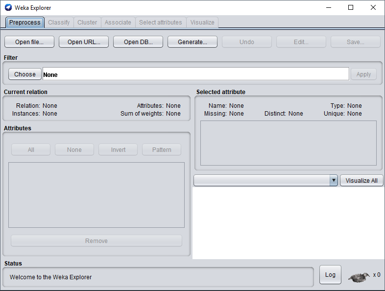
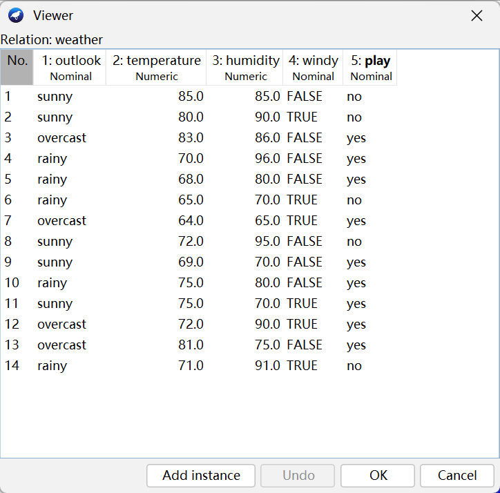
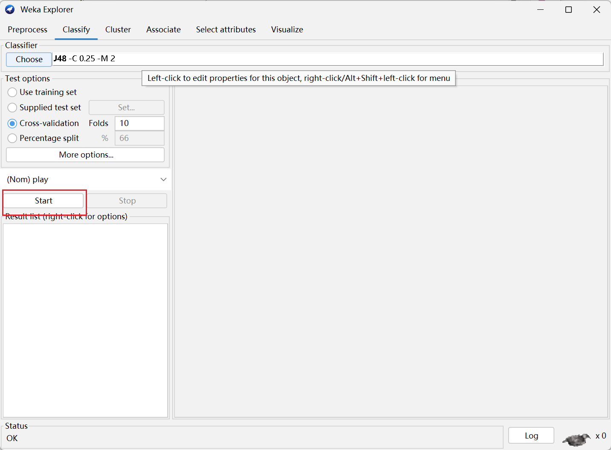

# Weka Explorer

- [Weka Explorer](#weka-explorer)
  - [简介](#简介)
  - [入门](#入门)
    - [准备数据](#准备数据)
    - [加载数据到 Explorer](#加载数据到-explorer)
    - [构建决策树](#构建决策树)
    - [查看结果](#查看结果)

@author Jiawei Mao
***

## 简介

Explorer 界面如下：

{width="600"}

| 挖掘任务面板      | 功能                              |
| ----------------- | -------------------------------- |
| Preprocess        | 数据预处理：选择和修改要处理的数据|
| Classify          | 分类：训练和测试分类或回归模型     |
| Cluster           | 聚类：从数据中聚类             |
| Associate         | 关联分析：从数据中学习关联规则   |
| Select attributes | 选择属性：选择数据中最相关的属性  |
| Visualize         | 可视化：查看数据的二维分布图     |

## 入门

假设你要构建决策树，基本步骤：

- 准备数据
- 启动 Explorer，加载数据
- 选择决策树构造方法
- 构建树并解释输出

在 Explorer 中切换算法和评估方法都很容易。

### 准备数据

数据通常以电子表格或数据库的形式存在。WEKA 的数据存储格式为 ARFF 格式，将电子表格转换为 ARFF 格式比较容易，另外 WEKA 本身也支持 CSV 格式。

### 加载数据到 Explorer

下面选择 Weka 安装目录中 data 目录中的数据 weather.numeric.arff：

{width="800px"}

从图中可以看出，该数据集包含 14 个样本，5 个属性：outlook, temperature, humidity, windy, play。默认选择了第一个属性 outlook，在 **Selected attribute** 可以看到该属性没有缺失值，有 3 个不同值，没有 unique 值，实际值包括 sunny, overcast 和 rainy。

右下角的直方图显示类别 play 的两个值对应的 outlook 属性的每个值的分布。

属性操作：

- 勾选属性，点击下方 **Remove** 按钮可以删除勾选的属性
- 点击 **None** 取消所有选择
- **Invert** 反选
- **Pattern** 选择名称匹配用户指定的正则表达式的属性
- **Undo** 撤销操作
- **Edit** 打开数据编辑窗口

{width="500"}

### 构建决策树

在 Clsssify 窗口选择 J48 分类器：

{width="800"}

选择 J48 后，该算法出现在 **Choose** 按钮旁边，点击该算法名称，弹出 J48 分类器的配置参数:

{width="400"}

一般默认参数即可。

选择分类器后，点击 **Start** 按钮开始进行分类：

{width="800"}

### 查看结果

运行输出如下：

```
=== Run information ===

Scheme:       weka.classifiers.trees.J48 -C 0.25 -M 2
Relation:     weather
Instances:    14
Attributes:   5
              outlook
              temperature
              humidity
              windy
              play
Test mode:    10-fold cross-validation

=== Classifier model (full training set) ===

J48 pruned tree
------------------

outlook = sunny
|   humidity <= 75: yes (2.0)
|   humidity > 75: no (3.0)
outlook = overcast: yes (4.0)
outlook = rainy
|   windy = TRUE: no (2.0)
|   windy = FALSE: yes (3.0)

Number of Leaves  : 	5

Size of the tree : 	8


Time taken to build model: 0 seconds

=== Stratified cross-validation ===
=== Summary ===

Correctly Classified Instances           9               64.2857 %
Incorrectly Classified Instances         5               35.7143 %
Kappa statistic                          0.186 
Mean absolute error                      0.2857
Root mean squared error                  0.4818
Relative absolute error                 60      %
Root relative squared error             97.6586 %
Total Number of Instances               14     

=== Detailed Accuracy By Class ===

                 TP Rate  FP Rate  Precision  Recall   F-Measure  MCC      ROC Area  PRC Area  Class
                 0.778    0.600    0.700      0.778    0.737      0.189    0.789     0.847     yes
                 0.400    0.222    0.500      0.400    0.444      0.189    0.789     0.738     no
Weighted Avg.    0.643    0.465    0.629      0.643    0.632      0.189    0.789     0.808     

=== Confusion Matrix ===

 a b   <-- classified as
 7 2 | a = yes
 3 2 | b = no
```

输出中包括：

- 数据集的总结
- 评估模型方法：10-fold cross-validation
- 文本形式的修剪决策树
- 决策树的预测性能

