# Weka 数据挖掘

## 绪论

Weka，全称 Waikato Environment for Knowledge Analysis，一个用于数据挖掘的免费开源工具。

参考书：Witten, I.H., Frank, E. & Hall, M.A. (2011) 
Data Mining: Practical Machine Learning Tools and Techniques, Third Edition. Morgan Kaufmann.

## 1. Weka 入门

### 1.1 简介

**Data Mining vs. Machine Learning**

通常认为，数据挖掘偏重应用，而机器学习侧重于算法。

Weka 包含：

- 100+ 分类算法
- 75 个数据预处理工具
- 25 个辅助特征选择工具
- 20 个聚类、相关性分析等大量经典算法

需要学习的内容：

- 如何加载数据
- 使用 filters 预处理数据
- 可视化分析
- 分类算法
- 解释结果
- 评估方法
- 了解不同模型
- 理解不同机器学习算法的原理
- 了解数据挖掘的缺陷

### 1.2 Explorer 界面

安装 Weka：省略。

Weka 有 4 个用户界面，如下：


下面**只需要用 Explorer 界面**。

- Experimenter 用于不同算法、不同数据集的性能比较
- KnowledgeFlow 用于构建算法流程
- Slimple CLI 是命令行界面

Explorer 界面如下：


下面主要介绍使用 Preprocess 预处理数据，用 Classify 进行数据分类，用 Visualize 进行可视化。

以天气数据集为例：

- 包含 14 个样本，对应 14 天的天气
- 每个样本包含 5 个与天气相关的属性
- Play 表示天气是否适合出去玩

目的：通过其它属性预测 Play 属性。


打开数据集：


视图：


从这里可以查看不同属性和它们的取值分布。

另外，点击右上角的 **Edit** 可以编辑数据，编辑完成后点击 **Save...** 可保存数据。

### 1.3 数据集


该数据集最后一个为**类别**，是需要预测的值。

打开数据集，界面如下：


可以查看：

- 样本数（Instances）
- 属性数（Attributes）
- 默认最后一个属性为类别属性（class）
- 在直方图上方可以修改类别属性

Weka 将一个数据集称为 **Relation**。

分类任务要素：

- 数据集为标记数据
- 特征值分为离散（nominal）和连续（numeric）类型
- 预测问题也分为离散（classification）和连续（regression）


打开天气数据集的 numeric 版本：


点击 **Edit**，可以发现和 weather.nomial.arff 的主要区别在于，温度和湿度变为数值：


在 Weka 界面可以查看数值数据的特征：

- 最小值
- 最大值
- 平均值
- 标准差
- 直方图分布


再来看 glass.arff 数据集，它是一个稍微大一点的数据集：

- 包含 214 instances
- 10 attributes


点击最后一个属性 **Type**，这是默认 class：

- Type 共有 7 种可能值，对应 7 种不同的玻璃类型
- 其它属性代表玻璃的不同特点


> [!IMPORTANT]
>
> 通过面板仔细检查各个属性，判断数据是否合理。获得高质量数据集是构建高质量模型的关键步骤。

### 1.4 构建 Classifier

**目标**：对 glass.arff 数据集构建一个 J48 分类器。

步骤：

- 打开 glass.arff 数据集
- 点击 Classify 面板
- 选择 J48 决策树模型
- 点击 **Start** 运行


在 Classifier output 可以查看输出，包括：

- 数据集信息
- 获得的模型信息
- 模型性能

采用默认参数，J48 的准确度为 66.8224 %。最后为混淆矩阵(confusion matrix)：

```
  a  b  c  d  e  f  g   <-- classified as
 50 15  3  0  0  1  1 |  a = build wind float
 16 47  6  0  2  3  2 |  b = build wind non-float
  5  5  6  0  0  1  0 |  c = vehic wind float
  0  0  0  0  0  0  0 |  d = vehic wind non-float
  0  2  0  0 10  0  1 |  e = containers
  1  1  0  0  0  7  0 |  f = tableware
  3  2  0  0  0  1 23 |  g = headlamps
```

在混淆矩阵中，性能好的模型大多数在对角线上，即正确分类的个数。

点击模型，可以编辑模型参数：


J48 参数如下：

- 其中 unpruned 为 False，表示会对决策树进行修剪，将其修改为 True，则不对决策树进行修剪
- 将 `minNumObj` 设置为 15，可以避免特别小的叶节点
- 点击 **More**，可以查看模型相关信息
- 右键可以可视化决策树


可视化决策树：


从 C4.5 到 J48

- ID3 (1979)
- C4.5 (1993)
- C4.8 (1996)
- C5.0 (commercial)

J48 是从 C4.8 的重新实现。

### 1.5 使用 filter

filter 用于数据预处理:

- AllFilter 和 MultiFilter 用于组合多种 filter
- supervised filter 需要 class 属性
- unsupervised filter 不需要 class 属性，使用更为广泛
- filter 又可以分为 attribute filter 和 instance filter


例如，使用 filter 从 weather.nominal.arff 删除一个属性，需要 `Remove` filter，这是一个 unsupservised attribute filter：

- 打开 weather.nominal.arff
- 选择 `Remove` filter
- 设置 filter
- 点击 **Apply**


这里删除了原来的第 3 个属性，humidity。

可以点击 **Undo** 撤销删除操作。

当然，删除属性还有更简单的方法：勾选属性，点击 **Remove**。

也可以删除属性的特定值，例如，删除 humidity 为 `high` 的数据，选择 `RemoveWithValues`，这是一个 instance filter：


选择删除第 3 个属性(humidity)的第 1 个值(high)：

- 设置 attributeIndex 为 3
- nominalIndices 为 1
- 点击 Apply
- 点击 Undo 撤销删除操作


对数据进行合适的预处理，可以得到性能更好的模型：

- 打开 glass.arff
- 运行 J48 (trees>J48)：准确度 66.8224 %
- 删除 **Fe** 特征，再次运行 J48：准确度 67.2897 %
- 删除 RI 和 MG 以外的所有特征，运行 J48：准确度 68.6916 %
- 查看 J48 性能

### 1.6 数据可视化

使用数据可视化面板：

- 打开 iris.arff
- 打开 Visualize 面板

可以看到一个 5x5 的图：

- 点击任意一个子图，可以放大单独显示
- 点击数据点，可以查看数据编号和属性值


点击任意一个子图，都可以放大：

- 点击 X 或 Y 可以设置坐标对应的属性
- 有些数据完整重合，此时可以调整 Jitter 添加随机抖动，从而能够示被覆盖的数据点
- 点击 Rectangle，选择一部分数据，点击 Submit，可以只显示选择区域的点


对训练的模型，右键：Visualize classifier errors，可以查看分类错误图示，对照混淆矩阵查看更清洗。

> [!TIP]
>
> `AddClassification` filter 可以添加模型分类结果。

## 2. 模型评估

### 2.1 分类模型

 如何手动构建决策树：

- 加载 segment-challenge.arff
- 选择 `UserClassifier` 分类器：这是一个手动构建决策树的方法
- 勾选 "Supplied test set"，设置 segment-test.arff 作为单独的测试集
- 点击 Start，弹出如下窗口


- 在 Data Visualizer 查看 region-centroid-row 与 intensity-mean 的视图


- 用 Rectangle 选择一部分数据（红色点），作为一个类别，可以在 Tree Visualizer 查看当前决策树


- 再选择一部分（紫色）作为下一个类别
- 依次下去

在这过程中也可以不使用矩形，而是用多边形来选择。

J48 创建的 tree 通常比自定义的好。

> [!TIP]
>
> 如果没找到 `UserClassifier`，可以在 Package Manager 单独下载。

### 2.2 训练和测试

机器学习的基本流程：


如果只有一个数据集，可以将其拆分为训练集和测试集。

下面用 J48 分析 segment 数据集：

- 打开 segment-challenge.arff 文件
- 选择 J48 决策树模型
- 设置测试集 segement-test.arff
-  运行，准确度：96.1728 %

如果没有单独的测试集，可以勾选 **Percentage split**，设置训练集和测试集的比例。

### 2.3 重复训练和测试

- 加载 segment-challenge.arff 数据集
- 选择 J48 模型
- 设置 percentage split 为 90%
- 运行：96.7% 准确度
- 在 More options 中设置不同的 seed 重复运行


| Seed     | Accuracy |
| -------- | -------- |
| 1 (默认) | 96.7     |
| 2        | 94       |
| 3        | 94       |
| 4        | 96.7     |
| 5        | 95.3     |
| 6        | 96.7     |
| 7        | 92       |
| 8        | 94       |
| 9        | 93.3     |
| 10       | 94.7     |

然后计算平均值和标准差：
$$
\overline{x}=\frac{\sum x_i}{n}=0.949
$$

$$
\sigma=\sqrt{\frac{\sum (x_i-\overline{x})^2}{n-1}}=0.018
$$

 **总结**：J48 可以得到约 95% 的准确度，偏差在 2% 以内，即 93%-97% 的准确度。

> [!NOTE]
>
> 以上操作的基本假设：训练集和测试集是从无穷总体独立抽样获得。
>
> 得到的结果不可避免有误差，通过设置 seed 和重复实现，可以获得相对可靠的准确度估计值。

### 2.4 基线准确度

- 加载数据集 diabetes.arff
- 勾选 Percentage split 测试选项，取默认的 66%
- 尝试如下分类模型
  - trees -> J48：76%
  - bayes -> NaiveBayes：77%
  - lazy -> IBK：73%
  - rules -> PART：74%

回到 diabetes.arff 数据集，该数据集包含 500 negative，268 positive，如果对所有数据都猜测为 negative，得到精度：500/768=65%。

ZeroR 模型就是该原理：选择 rules->ZeroR，勾选 Use training set，就会得到 65%。

ZeroR 用比例最高的类别作为所有类别，它几乎不用训练，得到的准确度可以作为 baseline。

在少数情况，**baseline 可能是最好的结果**：

- 选择 supermarket.arff 数据集
- 测试不同模型：
  - rules -> ZeroR (Use training set)：64%
  - trees -> J48 (Percentage split 66%)：63%
  - bayes -> NaiveBayes：63%
  - lazy -> IBk：**38%**
  - rules -> PART：63%

baseline 的结果最好，主要原因：属性并不适合作为分类的依据。

> [!TIP]
>
> 总是应该先选择一个 baseline 模型，如 ZeroR。简单的总是最好的，所以先尝试简单的，再考虑复杂的分类模型。
>
> 深入了解数据。

### 2.5 交叉验证

交叉验证是对设置不同 seed、重复运行方法（重复预留法）的改进方法，交叉验证系统重复运行预留法，是机器学习的标准评估方法。分层交叉验证（stratified cross-validation）进一步改进交叉验证。

**重复预留法（repeated holdout）**

将数据集分为 10 份，9 份用于训练，1份用于测试；设置不同 seed，重复 10 次。如下图：


**10-fold cross-validation**

上面的重复预留法的示例，就是 10 倍交叉验证：重复 10 次，计算平均值。

每个数据都有 1 次用作测试，9 次用作训练。

**分层交叉验证（stratified cross-validation）**

是交叉验证的一个简单变体：在进行数据拆分时，保证每一份每个 class 的比例基本相同。

分层交叉验证可以进一步降低评估误差。

运行完交叉验证，还需要使用整个数据集训练一次，作为**最终的模型**：


总结：

- 交叉验证比重复预留法更准确
- 分层交叉验证更好，Weka 默认采用分层交叉验证
- 使用 10 倍交叉验证，Weka 需要运行 11 次算法：前面 10 次估计模型性能，最后一次用整个数据集，得到最终模型。
- 建议：
  - 数据足够大：用 percentage split，比如二分类问题，10,000 条数据，10% 用于测试，基本足够了
  - 否则用 10 倍交叉验证

### 2.6 交叉验证结果

为什么交叉验证比重复预留法好，下面通过一个示例演示：

- 加载 diabetes.arff 数据集
- 获取基线准确度（rules -> ZeroR）：65.1%
- trees -> J48
  - 10-fold cross-validation：73.8%

10 倍交叉验证也可以用不同 seed 重复 10 次：

| 1    | 2    | 3    | 4    | 5    | 6    | 7    | 8    | 9    | 10   |
| ---- | ---- | ---- | ---- | ---- | ---- | ---- | ---- | ---- | ---- |
| 73.8 | 75.0 | 75.5 | 75.5 | 74.4 | 75.6 | 73.6 | 74.0 | 74.5 | 73.0 |

同样重复执行预留法 10 次，结果如下：


可以发现，**交叉验证比预留法的标准差要小很多**。

## 3. 简单分类模型

从简单模型开始：

- 一个属性就足够了
- 属性贡献相同，互相独立
- 使用少量属性的决策树
- 只用计算未知样本与训练样本的距离
- 属性的线性组合

没有完美的机器学习算法，机器学习算法的成功取决于具体领域。

### 3.1 从简单模型开始

**OneR**：只用一个属性构建一个单层的决策树。

基础版本：

- 每个值一个分支
- 每个分支分配最高频率类别
- 错误率：分支中不属于多余类别的比例
- 选择错误率最低的属性

以 weather.nominal.arff 数据集为例：


用 weka 执行 OneR：

- 打开 weather.nominal.arff 数据集
- 选择 ZeroR，作为 baseline：64.2857 %
- 选择 OneR (rules -> OneR)，用 cross-validation 验证：42.8571 %

抛硬币也有 50% 的准确度，所以 OneR 在这个数据集上的效果很差。

由于采用了 10-fold 交叉验证，所以用运行 11 次 OneR，第 11 次用整个数据集训练模型。

### 3.2 过拟合

下面用 OneR 来解释过拟合（overfitting）。对 weather.numeric.arff 数据集，可以对数据集中 14 个样本生成 包含 14 个分叉的 tree：


这样就可以获得准确率 100% 的模型。

OneR 有限制复杂规则的参数，不过这里为了解释拟合，跳过这一点。

Weka 操作：

- 打开 weather.numeric.arff 文件
- 选择 OneR 模型
- 结果如下

```
outlook:
	sunny	-> no
	overcast	-> yes
	rainy	-> yes
(10/14 instances correct)
```

- 删除 outlook 特征，再次尝试

```
humidity:
	< 82.5	-> yes
	>= 82.5	-> no
(10/14 instances correct)
```

OneR 有一个参数 `minBucketSize`，表示将数值属性离散化的最小 bucket-size，默认为 6，如果将其调整为 1，就会得到一个分叉很多，过拟合的模型：

```
temperature:
	< 64.5	-> yes
	< 66.5	-> no
	< 70.5	-> yes
	< 71.5	-> no
	< 77.5	-> yes
	< 80.5	-> no
	< 84.0	-> yes
	>= 84.0	-> no
(13/14 instances correct)
```

再以 diabetes.arff 数据集为例：

- 打开 diabetes.arff 文件
- 选择 ZeroR，使用 cross-validation：65.1%
- 选择 OneR，使用 cross-validation：71.5%，查看规则

```
=== Classifier model (full training set) ===

plas:
	< 114.5	-> tested_negative
	< 115.5	-> tested_positive
	< 127.5	-> tested_negative
	< 128.5	-> tested_positive
	< 133.5	-> tested_negative
	< 135.5	-> tested_positive
	< 143.5	-> tested_negative
	< 152.5	-> tested_positive
	< 154.5	-> tested_negative
	>= 154.5	-> tested_positive
(587/768 instances correct)
```

将 `minBucketSize` 修改为 1，得到一个特别复杂的模型，准确率低于 baseline：57.1615 %，**典型的过拟合**：

```
=== Classifier model (full training set) ===

pedi:
	< 0.1265	-> tested_negative
	< 0.1275	-> tested_positive
	< 0.1285	-> tested_negative
	< 0.1295	-> tested_positive
	< 0.1345	-> tested_negative
	< 0.1355	-> tested_positive
	< 0.1405	-> tested_negative
	...
	< 1.275	-> tested_negative
	< 1.3969999999999998	-> tested_positive
	< 1.837	-> tested_negative
	< 2.3085	-> tested_positive
	< 2.3745000000000003	-> tested_negative
	>= 2.3745000000000003	-> tested_positive
(672/768 instances correct)
```

如果用 training-set 作为评估，可以发现过拟合的模型效果很好：87.5 %。过拟合模型在训练集上看着很好，但是泛化性能差。

为了避免过拟合，最好的方式是：将数据集拆分为 training, test, validation 三部分。使用 training 和 test 数据集来选择模型，再使用 validation dataset 评估模型。

### 3.3 概率模型

OneR：使用一个属性建模。

相反的策略：使用所有属性，这些属性同样重要。这就是 Naive Bayes 方法。Naive Bayes 方法基于两个假设：

- 所有属性同样重要
- 这些属性在统计上独立的（从一种属性的值无法推测出其它属性的值）

独立假设通常不成立，但是 Naive Bayes 方法在实践中很有效。

贝叶斯理论：
$$
\text{Pr}(H|E)=\frac{\text{Pr}(E|H)\text{Pr}(H)}{\text{Pr}(E)}
$$
其中：

- 在分类模型中，H 代表类别，E 代表样本

- $Pr(H)$ 为 H 的先验概率，即在得到证据前事件的概率，就是 baseline 概率，例如在天气数据中，有 9 个 yes 和 5 个 no，因此 play 是 yes 的概率为 9/14，play 是 no 的概率为 5/14，根据贝叶斯公式，可以基于证据（样本数据）来校正 $Pr(H)$，得到所谓的 H 的后验概率，即知道证据后的概率
- $Pr(H|E)$ 为 H 的后验概率，即得到证据后事件的概率
- Naive 假设：证据（样本）由统计上独立的部分组成，在天气数据集中，指 4 个不同属性值相互独立，因此

$$
Pr(H|E)=\frac{Pr(E_1|H)Pr(E_2|H)\cdots Pr(E_n|H)Pr(H)}{Pr(E)}
$$

以天气数据集为例：


上表中的值可以直接转换为概率值，例如，对 yes 类别：Sunny 的概率为 $2/9$，即 $P(E_1|H)=2/9$。

对 Play，可以计算先验概率 $P(yes)=9/14$，$P(no)=5/14$。

> [!TIP]
>
> 不考虑特征，只看结果，统计 yes 和 no 的比例，就是先验概率。

例如，现在要计算如下事件的概率：

| Outlook | Temp. | Humidity | Wind | Play |
| ------- | ----- | -------- | ---- | ---- |
| Sunny   | Cool  | High     | True | ?    |

计算两个类别的概率，基于独立假设，可以将各个概率分别相乘，然后乘以 $P(H)$：
$$
P(\text{yes})=\frac{2}{9}\times\frac{3}{9}\times\frac{3}{9}\times\frac{3}{9}\times\frac{9}{14}=0.0053
$$

$$
P(\text{no})=\frac{3}{5}\times\frac{1}{5}\times\frac{4}{5}\times\frac{3}{5}\times\frac{5}{14}=0.0206
$$

进行归一化，得到概率：
$$
P(\text{yes})=\frac{0.0053}{0.0053+0.0206}=0.205
$$

$$
P(\text{no})=\frac{0.0206}{0.0053+0.0206}=0.795
$$

总结：{Outlook: Sunnay, Temp.: Cool, Humidity: High, Wind: True} 为证据，概率：
$$
\begin{aligned}
P(yes|E)&=
	P(\text{Outlook=Sunny|yes})\\
	&\times P(\text{Temp.=Cool|yes})\\
	&\times P(\text{Humidity=High|yes})\\
	&\times P(\text{Windy=True|yes})\\
	&\times\frac{P(yes)}{P(E)} \\
	&=\frac{\frac{2}{9}\times\frac{3}{9}\times\frac{3}{9}\times\frac{3}{9}\times\frac{9}{14}}{P(E)}
\end{aligned}
$$

我们不知道 $P(E)$，但是没关系，针对 $P(no|E)$ 可以进行相同的计算，因为两个概率相加为 1，分母相同，因此可以得到 $P(yes|E)$ 和 $P(no|E)$ 的概率。

使用 Weka 执行 Naive Bayes：

- 打开 weather.nominal.arff
- 选择 bayes>NaiveBayes 模型
- 运行

生成的模型如下：

```
=== Classifier model (full training set) ===

Naive Bayes Classifier

                Class
Attribute         yes     no
               (0.63) (0.38)
=============================
outlook
  sunny            3.0    4.0
  overcast         5.0    1.0
  rainy            4.0    3.0
  [total]         12.0    8.0

temperature
  hot              3.0    3.0
  mild             5.0    3.0
  cool             4.0    2.0
  [total]         12.0    8.0

humidity
  high             4.0    5.0
  normal           7.0    2.0
  [total]         11.0    7.0

windy
  TRUE             4.0    4.0
  FALSE            7.0    3.0
  [total]         11.0    7.0
```

这个计算方式和前面表格演示的一样，不过每个数字都加了 1。例如，Outlook 的 Yes 在表格中为 2, 4, 3，而 weka 输出的为 3, 5, 4，weka 为了避免 0 频率的出现，导致相关的概率相乘全部为 0，因此每个次数都 +1。

朴素贝叶斯总结：

- 朴素贝叶斯假设所有属性共享相同且独立
- 虽然独立假设不成立，但是朴素贝叶斯在实际应用中效果很好
  - 可能因为分类不需要准确的概率估计，只需要正确类别的概率最大即可
- 朴素贝叶斯的问题：如果两个属性的值完全相同，会导致朴素贝叶斯无法功能，此时可以采用特征选择排除冗余属性，然后就可以继续使用朴素贝叶斯

### 3.4 决策树

下面通过 J48 模型介绍决策树。

J48 采用 top-down 递归分治策略：

- **选择**：选择一个属性作为 root-node
- **拆分**：根据属性值将数据集拆分为不同子集
  - 每类属性值一个分支
- **重复**：对每个分支递归采用该策略
- **终止**：分支所含样本的类别相同时，终止拆分

这里的问题是，如何选择 root-note？

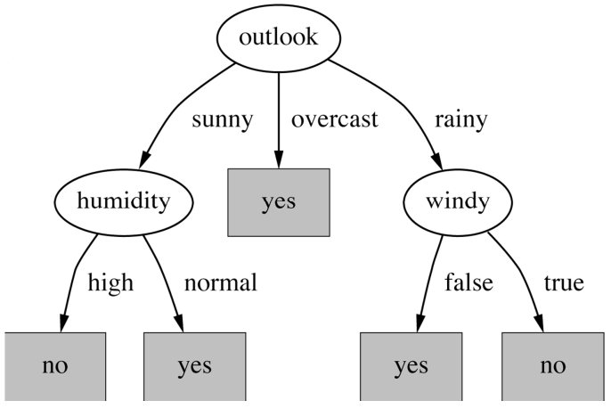

例如，下面是天气数据集以不同属性作为 root-node 的结果：

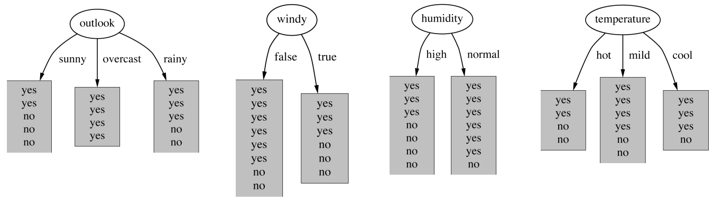

我们希望得到的分支越纯越好，这样就不需要继续拆分。outlook 的 overcast 分支只有 yes，不需要继续拆分，看上去最合适。那么如何量化纯度。

最适合拆分的属性具有如下特点：

- 目标是得到最小的决策树
- top-down 方法采用启发式方法
  - 选择生成最纯节点的属性（都是 yes 或都是 no 的节点），这样就不需要继续拆分
  - 即最大信息增益的节点

那么，如何计算纯度？这里用到信息论里的熵，信息熵以 bits 为单位：
$$
entropy(p_1,p_2,\cdots,p_n)=-p_1\log p_1-p_2\log p_2\cdots -p_n\log p_n
$$
因为概率都不会大于 1，所以 $\log p$ 为负数，前面加符号变为正数，所以信息熵的值为正数。

信息增益（information gain）：

- 知道属性后获得的额外信息量，是属性对训练数据分类的有效性的度量
- 加上熵是样本中所含杂质的度量，那么信息增益就是根据属性对样本进行划分导致熵的减少
- 拆分前的熵-拆分后的熵

以天气数据为例：

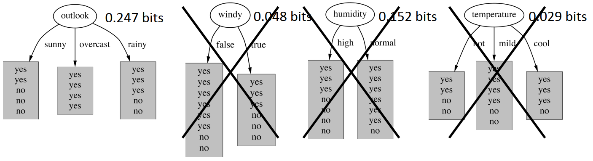

**信息增益的计算**，以 windy 属性为例，拆分前的信息熵为：
$$
Entropy([9+,5-])=-9/14\log_2(9/14)-5/14\log_2(5/14)=0.94
$$
拆分后分为两部分：
$$
Entropy([6+,2-])=-6/8\log_2 (6/8)-2/8\log(2/8)=0.811
$$

$$
Entropy([3+,3-])=-3/6\log_2(3/6)-3/6\log_2(3/6)=1
$$

信息增益为：
$$
gain(windy)=0.94-(8/14)*0.811-(6/14)*1=0.048
$$
其它属性的信息增益计算方法相同。

 outlook 的信息增益最大，以 outlook 为 root-note，然后继续拆分：

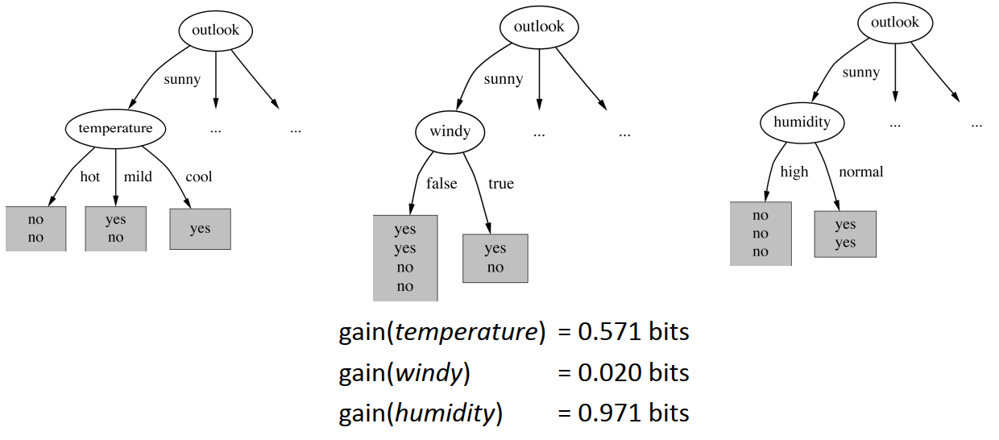

对 sunny 分支继续拆分，sunny 分支的熵为：
$$
H(sunny)=-2/5\log_2(2/5)-3/5\log_2(3/5)=0.971
$$
如果以 temperature 拆分：
$$
H(sunny,hot)=0
$$

$$
H(sunny,cool)=0
$$

$$
H(sunny,mild)=-1/2\log_2(1/2)-1/2\log_2(1/2)=1
$$

因此，temperature 的平均值熵为：
$$
H(sunny,temperature)=(2/5)*0+(1/5)*0+(2/5)*1=0.4
$$
以 temperature 拆分 sunny 的信息增益为：
$$
gain(temperature)=0.971-0.4=0.571
$$
其它分支计算方法相同。显然，以 humidity 继续拆分的信息增益最大，且得到两个纯分支，不需要继续拆分。

Weka 操作：

- 打开 weather.nominal.arff 文件
- 选择 J48 模型
- 运行

得到的模型如下：

- 首先是 outlook
- outlook 下的 sunny 以 humidity 继续拆分
- outlook 下的 overcast 全部为 yes
- outlook 下的 rainy 以 windy 继续拆分

```
outlook = sunny
|   humidity = high: no (3.0)
|   humidity = normal: yes (2.0)
outlook = overcast: yes (4.0)
outlook = rainy
|   windy = TRUE: no (2.0)
|   windy = FALSE: yes (3.0)
```

可视化树：

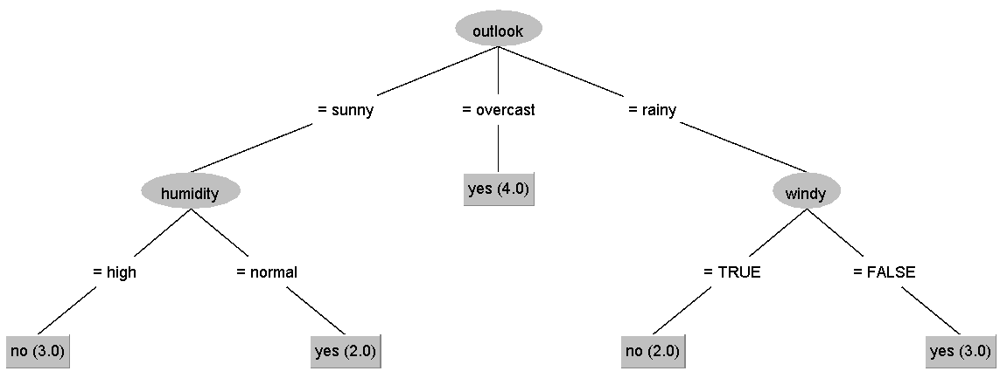

总结：

- J48 是一个 top-down 决策树算法
- 完全基于信息论
- 生成的 tree 很容易理解
- 选择属性的方法有很多，上面使用了信息增益，在实践中，不过的选择方法差别不大
- 在实际应用中，还需要进行修改，J48 中包含了一些较为复杂的算法，以保证在不同情况下能够运行

### 3.5 修剪决策树

修剪决策树，也许在训练集上表现差点，但是在测试集上可能更好。依然以天气数据集为例：

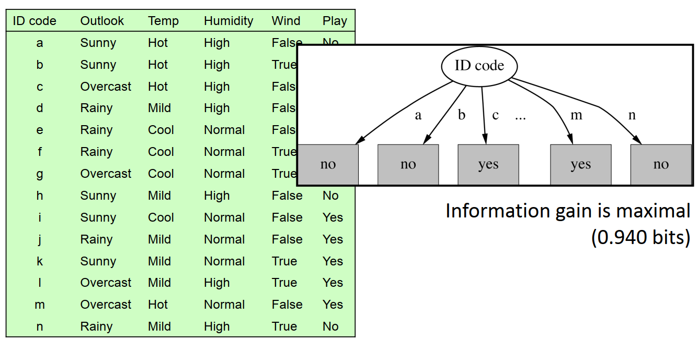

这里添加了一个 ID code 属性，每个样本的 ID code 值都不同。

如果按照信息增益计算每个属性，可以发现 ID code 的信息增益为  0.940 bits。远大于 outlook 的 0.247，但是该属性完全无法泛化。

如何**修剪决策树**：

- 如果 node 太小，不再继续拆分（J48 的 `minNumObj` 参数，默认为 2）
- 先构建完整的决策树，然后从叶节点回溯反向修剪，每个阶段使用统计检验（`confidenceFactor` 参数，默认 0.25，值越小修剪越多），这比一开始修剪效果更好
- 有时候修建内部节点更合适，使得下方的 subtree 提升一级，`subtreeRaising` 参数，默认 true。该参数增加了算法的复杂度，所以关闭它可以缩短运行时间
- 修剪决策树是一个复杂的主题，而且不是特别有启发性，**不建议修改 J48 的参数**，默认参数性能通常很好

修剪决策树的目的是避免**过拟合**，修剪决策树，不仅得到一个更小的 tree，有时候还能得到更好的结果。例如：

- 打开 **diabetes.arff** 文件
- 选择 J48 模型
- 默认修剪：73.8281 % accuracy，20 leaves, 39 nodes
- 关闭修剪（`unpruned` 设置为 True）：72.6563 %，22 leaves, 43 nodes，tree 稍微第一点

在以 **breast-cancer.arff** 数据集为例：

- 默认修剪：75.5245 % accuracy，4 leaves, 6 nodes
- 关闭修剪：69.5804 % accuracy, 152 leaves, 179 nodes，这个 tree 太大了

所以，通常应该修剪决策树，在没有确信理由时，建议采用 J48 默认参数。

总结：

- C4.5/J48 是一个早期非常流行的机器学习方法
- 决策树有许多剪枝方法
  - 剪枝方法对决策树的大小影响很大，通常可以打打简化决策树
  - 剪枝往往会稍微降低 accuracy，但是可以避免过拟合
- 剪枝是一种通用技术，除了决策树也可以用于树以外的结构，如 decision rules

### 3.6 最近邻

最近邻是最简单的机器学习算法，它只是记忆，没有学习：

- 对新的样本，在训练集中搜索与它**最像**样本
  - 样本本身代表知识
  - 这是一种 lazy learning：在预测之前什么也不用做
- 基于实例学习（instance-based learning）就是最近邻学习（nearest-neighbor learning）

下面是一个二维样本空间示意图：

- 蓝色和白色的点代表两种不同的类型
- 红色为分类未知的点
- 计算红色点与两个类别最近点的距离，就可以判断该点的类别

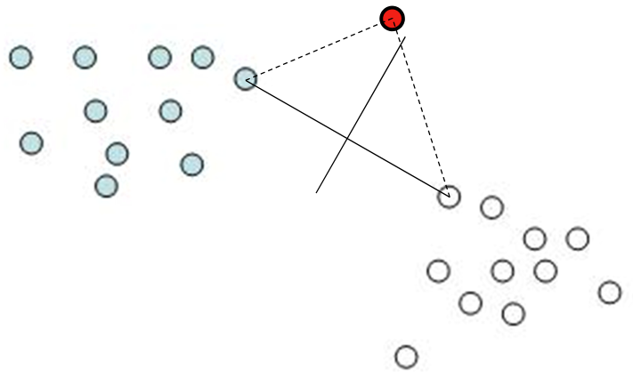

如何判断两个样本是否相似，需要一个**相似函数（similarity function）**：

- 数字属性
  - 常规的欧几里得距离：坐标差值的平方和
  - 曼哈度距离：差值的绝对值的和
- nominal 属性
  - 不同距离为 1，相同距离为 0
- 将属性标准化为 0 到 1 之间，避免距离完全由数值较大的属性主导

**噪音样本**：

- 噪音样本会导致分类错误
- 通过 k-nearest-neighbors 可以部分避免噪音干扰
  - 找到最近 k 个最近样本的分类，取频率最高的作为类别

**Weka**

weka 中的 kNN 算法为 IBk （instance-based learning）。示例：

- 打开 glass.arff 数据集
- 选择 lazy > IBk 模型，选择 k=1,5,20
- 10-fold 交叉验证

| k=1   | k=5   | k=20  |
| ----- | ----- | ----- |
| 70.6% | 67.8% | 65.4% |

> [!TIP]
>
> 用 IBk 的 `KNN` 参数设置 k 值，默认为 1.

对一个包含许多噪音的数据集，随着 k 增大，准确度会提高一点；随着 k 继续增大，准确率会开始降低；如果 k 设置为数据集大小，计算测试样本到所有训练样本的距离，并且求平均值，会得到一个接近 baseline 的准确率。

**kNN 总结**：

- kNN 通常比较准确，但是很慢
  - 每次预测需要扫描整个训练集
  - 采用特殊的数据结构可以更快一点
- kNN 假设所有属性都一样重要
  - 补救措施：属性选择或者加权属性
- 噪音样本
  - 采用 k 个最近邻居进行投票
  - 根据预测准确率对样本进行加权
  - 为每个类别确定可靠的原型
- kNN 是一个古老的模型，从 1950s 开始使用
  - 如果训练集 $n\rightarrow \infty$, $k\rightarrow \infty$，并且 $k/n \rightarrow 0$，此时 kNN 趋于这个数据集的理论最小错误率
  - 随着 n 增大和 k 增大，kNN 可以得到较好的分类结果

## 4. 更多分类模型

### 4.1 分类边界

使用 Weka 的 Boundary Visualizer 可视化分类边界。

下面以 OneR 模型和 iris.2D.arff 数据集为例：

- 打开 iris.2D.arff 文件（删除 iris.arff 数据集中的 `sepallength` 和 `sepalwidth` 属性得到该数据集）
- 在 Weka GUI Chooser，选择 Visualization>**BoundaryVisualizer**
  - 打开 iris.2D.arff
  - X 为 petallength, Y 为 petalwidth
  - 不同类别的数据点用不同颜色标识

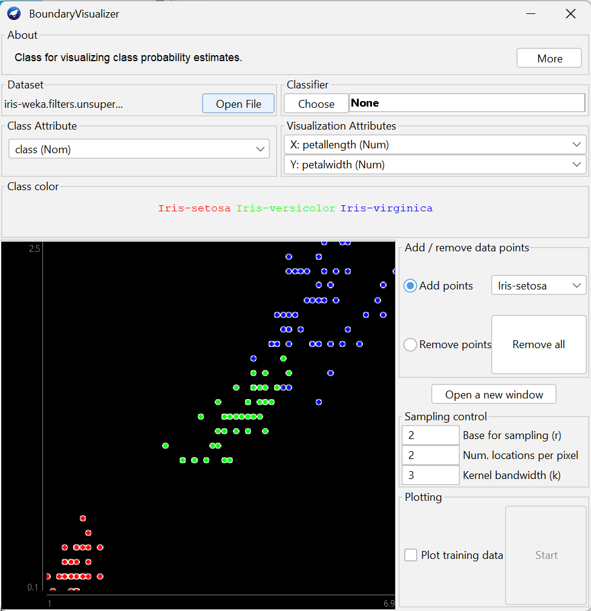

- 选择分类器 OneR
- 勾选 Plot training data
- 点击 Start

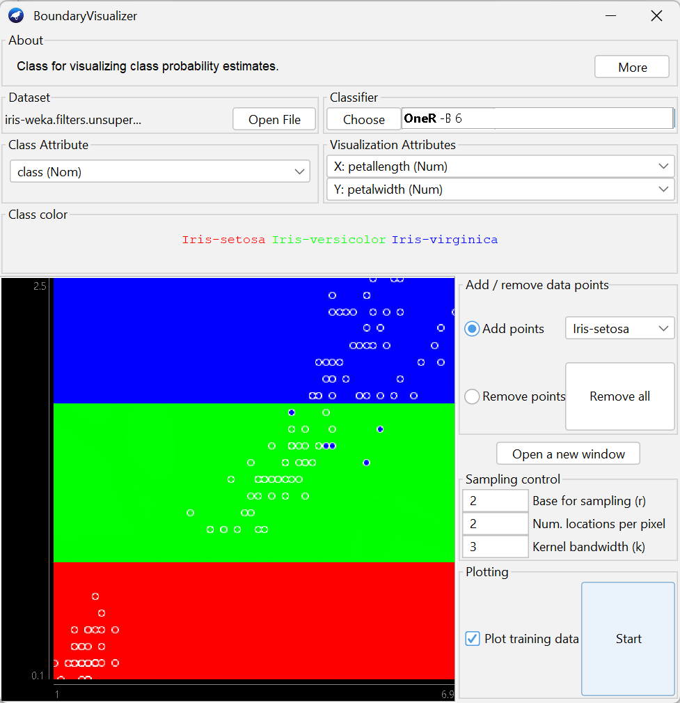

不同背景色显示了决策分界线，训练集叠加在上面。

下面在 **Explorer** 查看 OneR 是如何处理该数据集：

- 打开数据集 iris.2D.arff
- 选择 OneR，运行

```
=== Classifier model (full training set) ===

petalwidth:
	< 0.8	-> Iris-setosa
	< 1.75	-> Iris-versicolor
	>= 1.75	-> Iris-virginica
(144/150 instances correct)
```

可以发现，OneR 采用 petalwidth 进行分类，<0.8 为 Iris-setosa，<1.75 为 Iris-versicolor，>=1.75 为 Iris-virginica，与 BoundaryVisualizer 可视化结果一样。这就是 OneR 生成的决策分界线。

再来看看其他模型的决策分界线：

**IBk**

- 选择 lazy>IBk
- 勾选 Plot training data
- 点击 Start

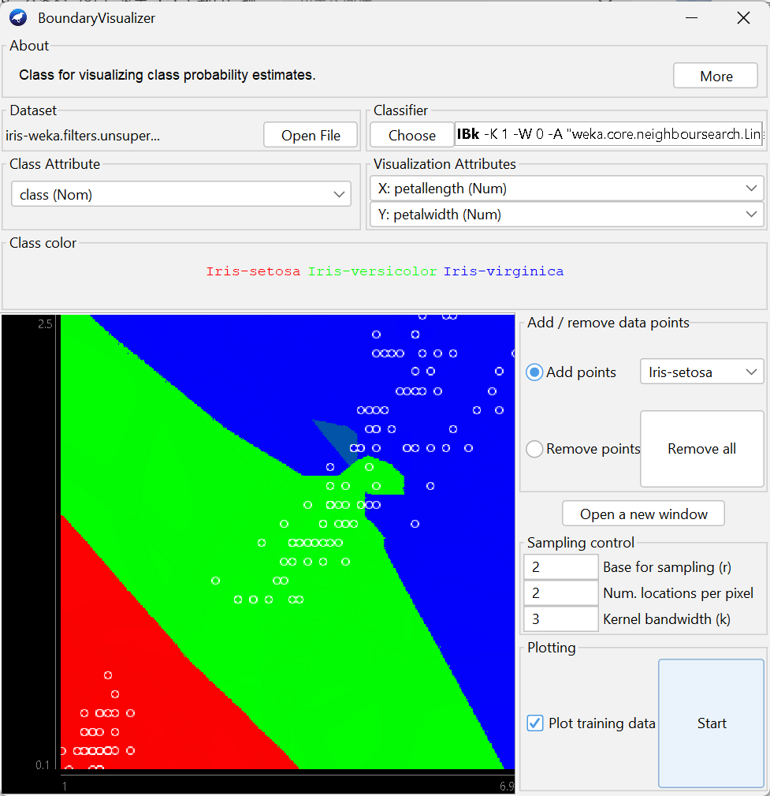

- 如果设置 k=5，会出现过渡区域

过渡区域通过投票决定类别。

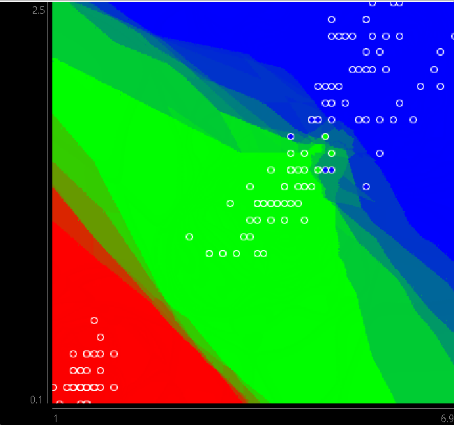

**NaiveBayes**

- 选择 NaiveBayes，设置 `useSupervisedDiscretization` 为 true

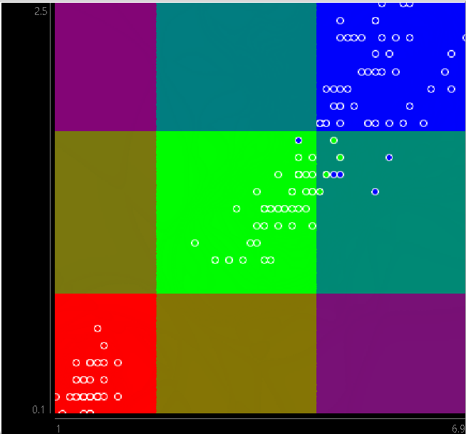

朴素贝叶斯认为所有属性贡献相同，且互相独立。所以决策边界为两种属性相乘，得到一个概率的棋盘布局。

**J48**

结合 Explorer 中的输出更容易理解。

```
J48 pruned tree
------------------

petalwidth <= 0.6: Iris-setosa (50.0)
petalwidth > 0.6
|   petalwidth <= 1.7
|   |   petallength <= 4.9: Iris-versicolor (48.0/1.0)
|   |   petallength > 4.9
|   |   |   petalwidth <= 1.5: Iris-virginica (3.0)
|   |   |   petalwidth > 1.5: Iris-versicolor (3.0/1.0)
|   petalwidth > 1.7: Iris-virginica (46.0/1.0)

Number of Leaves  : 	5

Size of the tree : 	9
```


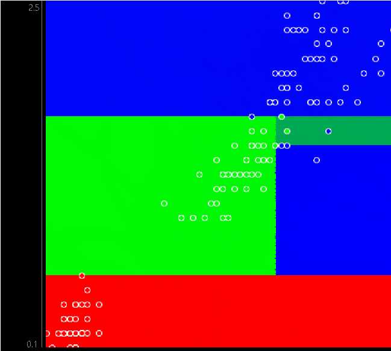

提高 `minNumObj` 可以简化决策树，得到的决策边界更简单。

**总结：**

- 分类模型在样本空间中创建决策边界
- 不同模型有不同偏好：对比 OneR, IBk, NaiveBayes, J48
- 决策边界可视化局限于数值属性和 2D 图，所以这个可视化工具应用有限，不过可以帮助理解不同模型

### 4.2 线性回归

数值预测，即回归：
$$
x=w_0+w_1a_1+w_2a_2+\cdots+w_ka_k
$$
对二维平面，只有一个 $a$，图示：

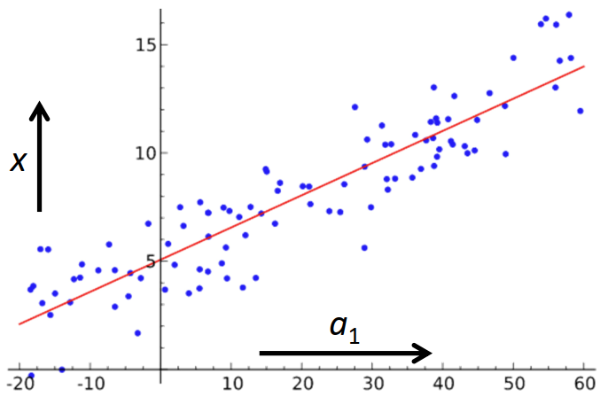

线性回归模型的训练，选择合适的权重最小化训练集上的平方误差：
$$
\sum_{i=1}^n(x^{(i)}-\sum_{j=0}^kw_ja_j^{(i)})^2
$$
这是一个标准的矩阵问题，当样本数大于属性数就有解。

对 nominal 属性：

- 如果只有两个值，可以转换为 0 和 1
- 如果有多个值

**Weka 操作：**

- 打开 cpu.arff 文件：只有数字属性和 class，class 也是数值
- 选择 functions>**LinearRegression**
- 运行

输出如下：

```
Linear Regression Model

class =

      0.0491 * MYCT +
      0.0152 * MMIN +
      0.0056 * MMAX +
      0.6298 * CACH +
      1.4599 * CHMAX +
    -56.075 

Time taken to build model: 0.03 seconds

=== Cross-validation ===
=== Summary ===

Correlation coefficient                  0.9012
Mean absolute error                     41.0886
Root mean squared error                 69.556 
Relative absolute error                 42.6943 %
Root relative squared error             43.2421 %
Total Number of Instances              209     
```

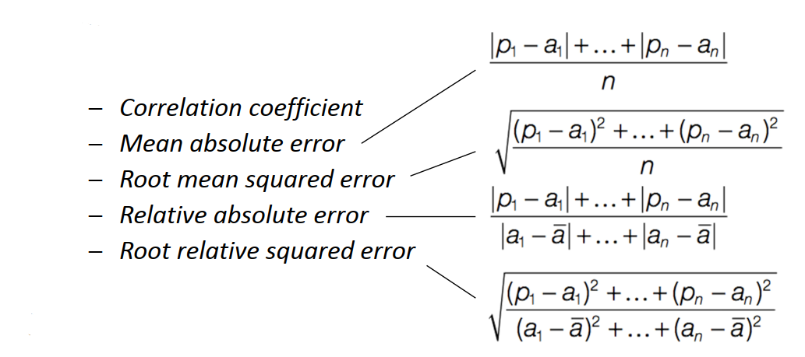

**model tree**：

- 每个 leaf 是一个线性回归模型
- 多个线性模型组成一个连续函数

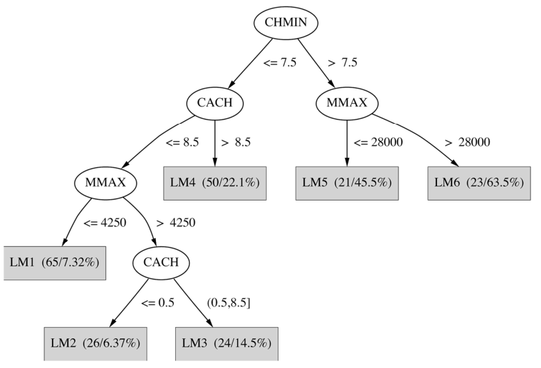

在 weka 中，trees>M5P 代表 model-tree 模型：

- 依然是 cpu.arff 数据集
- 选择 trees > M5P
- 运行
- 可视化 tree

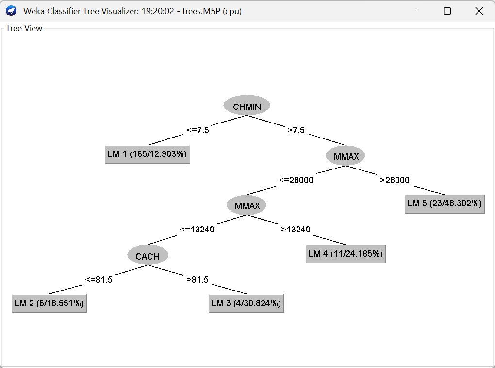

该 model-tree 从 LM1 到 LM5，有 5 个线性模型。在输出可以看到这几个线性模型的详细定义。交叉验证结果如下：

```
Correlation coefficient                  0.9274
Mean absolute error                     29.8309
Root mean squared error                 60.7112
Relative absolute error                 30.9967 %
Root relative squared error             37.7434 %
Total Number of Instances              209  
```

显然，多个线性模型比一个线性模型拟合效果更好。

### 4.3 使用回归进行分类


### 4.4 逻辑回归

### 4.5 SVM

### 4.6 集成学习


## 5. 汇总

## 参考

- https://www.bilibili.com/video/BV1Hb411q7Bf

