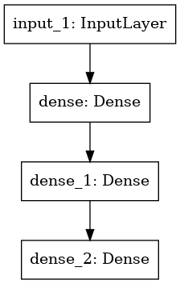
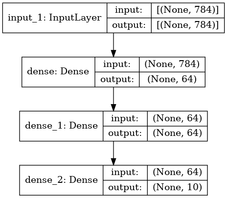

# 函数 API

- [函数 API](#函数-api)
  - [简介](#简介)
  - [训练、评估和推断](#训练评估和推断)
  - [模型的保存和序列化](#模型的保存和序列化)
  - [参考](#参考)

2021-11-10, 16:35
***

## 简介

Keras 函数 API 相比 `tf.keras.Sequential` API 是一种更为灵活的创建模型的方法。函数 API 可以处理非线性拓扑结构模型、共享层模型，甚至包含多个输入或输出的模型。

其主要思想是，深度学习模型是 layer 的有向无环图（directed acyclic graph, DAG），函数 API 是构建这种图的方法。

考虑如下模型：

```py
(input: 784-dimensional vectors)
       ↧
[Dense (64 units, relu activation)]
       ↧
[Dense (64 units, relu activation)]
       ↧
[Dense (10 units, softmax activation)]
       ↧
(output: logits of a probability distribution over 10 classes)
```

这是一个简单的单层图。使用函数 API 创建该模型，首先创建输入 node：

```py
inputs = keras.Input(shape=(784,))
```

输入数据被设置为长度为 784 的向量。

假如输入是一个 shape 为 `(32, 32, 3)` 的图片，可以定义：

```py
img_inputs = keras.Input(shape=(32, 32, 3))
```

`inputs` 包含输入数据的 shape 和 `dtype`：

```py
>>> inputs.shape
TensorShape([None, 784])
>>> inputs.dtype
tf.float32
```

然后创建下一层，并将 `inputs` 对象作为输入：

```py
dense = layers.Dense(64, activation="relu")
x = dense(inputs)
```

该操作等价于将 `inputs` 传入 `dense` 层，获得输出 `x`。

继续创建余下两层：

```py
x = layers.Dense(64, activation="relu")(x)
outputs = layers.Dense(10)(x)
```

此时可以将 `inputs` 和 `outputs` 作为参数创建 `Model`：

```py
model = keras.Model(inputs=inputs, outputs=outputs, name="mnist_model")
```

查看模型：

```py
>>> model.summary()

Model: "mnist_model"
_________________________________________________________________
 Layer (type)                Output Shape              Param #   
=================================================================
 input_1 (InputLayer)        [(None, 784)]             0         
                                                                 
 dense (Dense)               (None, 64)                50240     
                                                                 
 dense_1 (Dense)             (None, 64)                4160      
                                                                 
 dense_2 (Dense)             (None, 10)                650       
                                                                 
=================================================================
Total params: 55,050
Trainable params: 55,050
Non-trainable params: 0
```

也可以将模型结构输出为图片：

```py
keras.utils.plot_model(model, "my_first_model.png")
```



还可以将每层的 input 和 output shape 绘制到图中：

```py
keras.utils.plot_model(model, "my_first_model_with_shape_info.png", show_shapes=True)
```



"graph of layers" 是深度学习模型直观的思维图，而函数API是创建模型的一种方式。

## 训练、评估和推断

使用函数 API 训练、评估和推断的工作方式和[序列模型](sequential_api.md)完全相同。

`Model` 类提供了内置的训练循环（`fit()` 方法）以及评估循环（`evaluate()`）。并且可以自定义这些循环，以实现监督学习以外的算法，如 GAN。

下面，我们载入 MNIST 数据集，训练上面创建的模型，并使用测试数据评估模型：

```py
(x_train, y_train), (x_test, y_test) = keras.datasets.mnist.load_data()

x_train = x_train.reshape(60000, 784).astype("float32") / 255
x_test = x_test.reshape(10000, 784).astype("float32") / 255

model.compile(
    loss=keras.losses.SparseCategoricalCrossentropy(from_logits=True),
    optimizer=keras.optimizers.RMSprop(),
    metrics=["accuracy"],
)

history = model.fit(x_train, y_train, batch_size=64, epochs=2, validation_split=0.2)

test_scores = model.evaluate(x_test, y_test, verbose=2)
print("Test loss:", test_scores[0])
print("Test accuracy:", test_scores[1])
```

```txt
Epoch 1/2
750/750 [==============================] - 3s 3ms/step - loss: 0.3430 - accuracy: 0.9035 - val_loss: 0.1851 - val_accuracy: 0.9463
Epoch 2/2
750/750 [==============================] - 2s 3ms/step - loss: 0.1585 - accuracy: 0.9527 - val_loss: 0.1366 - val_accuracy: 0.9597
313/313 - 0s - loss: 0.1341 - accuracy: 0.9592
Test loss: 0.13414572179317474
Test accuracy: 0.9592000246047974
```

## 模型的保存和序列化


## 参考

- https://tensorflow.google.cn/guide/keras/functional/
