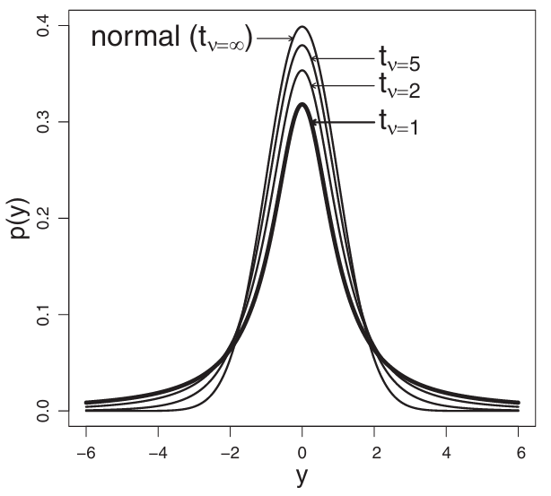
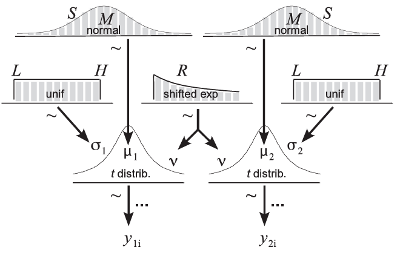
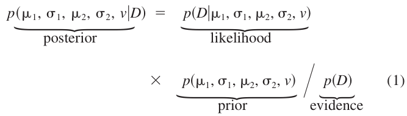
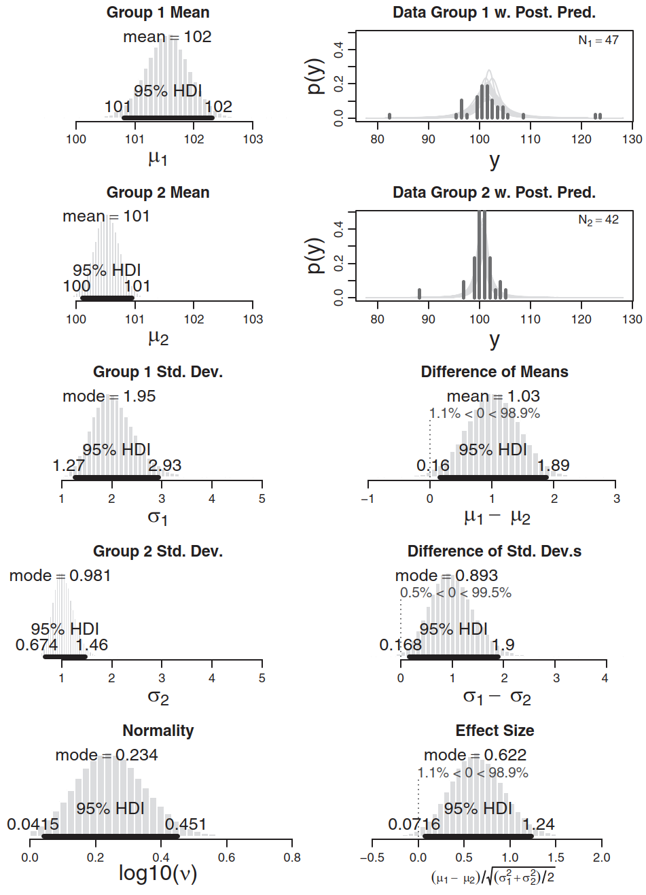
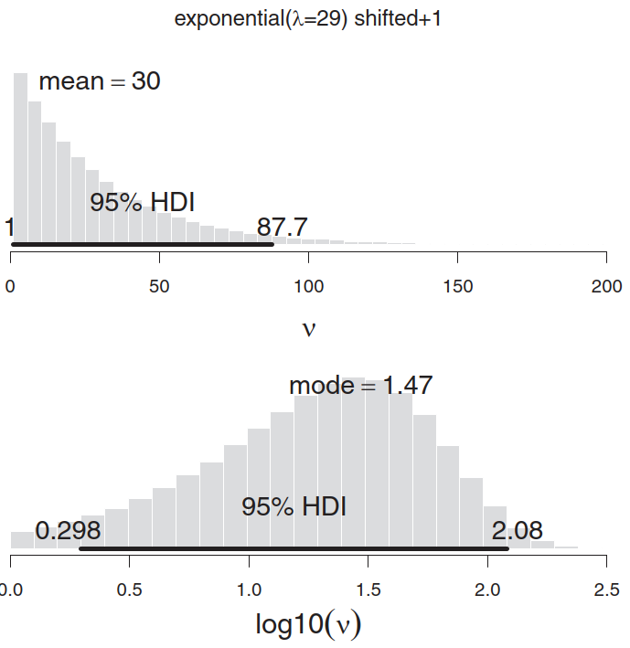

# Baysian Estimation Supersedes the t-test

2026-04-07⭐
@author Jiawei Mao

***
## 简介

**贝叶斯估计优于 t 检验（BEST）**

科研中最常见的流程之一，是比较两组对象。在获得两组数据后，研究者会提出各种比较问题：一组与另一组差异有多大？是否有充分把握认为该差异不为零？对差异幅度的确信程度如何？这些问题很难回答，因为即使研究者尽量控制数据中的无关干扰，数据仍会受到随机波动的影响。由于数据中存在“噪声”，研究者需要借助概率推断的统计方法来解读数据。当从数学描述中有实际意义的参数（如两组均值参数的差异）来解读数据时，**贝叶斯分析能够提供关于参数可信值的完整信息**。贝叶斯分析也比传统的原假设显著性检验方法更直观。

本文介绍了一种直观的**贝叶斯方法**，用于分析两组数据。该方法能够生成两组数据均值与标准差的完整分布信息。可以展示**所有可能的均值差异、标准差差异以及效应量**的相对可信度。借助这种显式的可信参数值分布，无需像**原假设显著性检验**（NHST）中那样依赖 p 值，即可对原假设对应的参数值进行推断。与 NHST 不同，当估计结果置信度较高时，贝叶斯方法不仅可以**拒绝**原假设，还能够**接受**原假设。该新方法通过将数据描述为**厚尾分布**而非正态分布（具体程度由数据本身决定），从而实现对异常值的稳健处理。此外，该新方法还分别实现了回顾性与前瞻性两类统计功效分析。

该分析方法通过**R**和**JAGS**这两种免费编程语言实现，可在 Macintosh、Linux 及 Windows 操作系统上运行。文中提供了完整的安装说明以及可直接运行的示例代码。这些程序还能灵活扩展，适用于其他类型的数据与分析场景。因此，几乎所有拥有计算机的用户都可以使用该软件。

本文分为两个主要章节，其后附有附录。

- 第一部分介绍贝叶斯分析，并通过实例阐释其分析结果。文中强调了贝叶斯参数估计所提供的丰富信息，并举例说明贝叶斯功效分析。
- 第二部分将贝叶斯方法与传统原假设显著性检验（NHST）中的 t 检验进行对比。该部分不仅指出 NHST 之 t 检验提供的信息相对匮乏，还指出 t-test 的若干基础逻辑问题。

本文还为熟悉另一种贝叶斯假设检验方法的读者提供了附录，该方法基于模型比较，并使用贝叶斯因子作为决策统计量。附录中指出，贝叶斯模型比较所提供的信息，通常不如第一部分重点介绍的贝叶斯参数估计方法丰富。

近年来，关于**原假设显著性检验（NHST）的弊端**以及**贝叶斯数据分析的优势**已有越来越多的有力阐述。尽管如此，仍有部分人认为，在两组比较这类简单场景下，NHST 与贝叶斯方法得出的结论往往趋于一致：“因此，如果你关注的核心问题可以简单表述为适合 t 检验的形式，那么确实没有必要对如此简单的问题动用整套贝叶斯方法”（Brooks，2003，第 2694 页）。与之相反，本文表明：**贝叶斯参数估计比 NHST 的 t 检验提供丰富得多的信息**，且二者得出的结论可能存在差异。无论两种方法的推断结果是否一致，基于贝叶斯参数估计的决策都比基于 NHST 的决策更具坚实依据。

结论鲜明而简洁：**贝叶斯参数估计可以取代 NHST 的 t 检验**。

## 稳健贝叶斯估计

### 贝叶斯估计概述

**贝叶斯推断**只是在一组候选值构成的空间中对可信度进行重新分配。例如，假设发生了一起案件，存在若干互不相关的嫌疑人。当证据指向其中一名嫌疑人时，其他嫌疑人便得以洗脱嫌疑。这种排除嫌疑的逻辑，正是基于数据对信念进行重新分配。当数据排除了部分嫌疑人时，反向的重新分配同样成立：剩余嫌疑人的嫌疑程度会相应升高。正如虚构侦探夏洛克・福尔摩斯所言（柯南・道尔，1890）：当你排除了所有不可能，剩下的无论多么难以置信，都一定是真相。

在数据分析场景中，需要解释含噪声数据中的某种规律。我们用**数学模型**（如线性回归）来描述这种规律，而模型中的参数（如线性回归的斜率）则用于描述趋势的大小。用于描述数据的可能 “候选参数空间”，就相当于各类可能性所构成的空间。在贝叶斯估计中，我们会将可信度**重新分配给与数据相符的参数值**，并降低与数据不符的参数值的可信度。

### 两组数据的描述性模型

大多数统计分析的第一步，是为数据指定一个描述性模型。模型包含具有实际意义的参数，而我们的目标就是估计这些参数的取值。例如，传统 t 检验采用正态分布来描述两组中各自的数据。正态分布的参数，即均值（μ₁、μ₂）和标准差（σ₁、σ₂），描述了数据中有实际意义的特征。具体而言，均值的差值（μ₂−μ₁）反映了两组数据集中趋势的差异大小，而标准差的差值（σ₂−σ₁）则反映了两组数据离散程度的差异大小。作为分析者，我们的主要目标是**估计这些差异的幅度**，并**评估估计结果的不确定性**。贝叶斯方法可以同时实现这两个目标。

假设两组条件或组别下的数据均为**连续定量数据**（如反应时间、温度、体重等）。为描述数据分布，传统 t 检验假定每组数据均服从**正态分布**。尽管正态性假设便于数学推导，但在使用本文所述的数值方法时，这一假设并非必需；而在实际数据存在**异常值**的情况下，该假设也不适用。处理异常值的一种有效方法是采用尾部比正态分布更厚的分布来描述数据。此类场景中常用的分布是**t 分布**，本文中将其作为一种便捷的数据描述性分布使用，而非用于计算 p 值的抽样分布。换言之，仅将 t 分布用作描述数据的简便方式，**并非用 t 分布来做 t 检验**。已有大量文献采用 t 分布描述含异常值的数据，能够兼容异常值的估计方法被称为**稳健统计方法**。

图 1 展示了 t 分布与正态分布叠加的示例。t 分布尾部的相对高度由希腊字母 ν（nu）表示的参数控制，其取值范围为1 至无穷大。当 ν 取值较小时，t 分布呈现**厚尾**特征；当 ν 取值较大时（如大于 100），t 分布近似于正态分布。因此，将 ν 称为 t 分布的**正态性参数**。（传统上，在抽样分布的语境中，该参数被称为**自由度**。由于本文不会在该语境下使用 t 分布，因此不采用这一可能引起误解的术语。）通过将 ν 设为较小值，t 分布可用于描述含异常值的数据；而将 ν 设为较大值时，t 分布也可描述无异常值的正态数据。与正态分布类似，t 分布同样包含均值参数 μ 和标准差参数 σ。



> **图 1**.不同 ν 参数的 t 分布。当 ν 取值较小时，t 分布的尾部比正态分布更厚。在这些示例中，均值设为 0，标准差设置为 1.

在当前数据模型中，我将使用**t 分布**来描述每组数据，每个组别拥有各自独立的**均值**与**标准差**。由于异常值通常数量较少，我会为两组数据使用**相同的 ν 参数**，这样两组数据都能为 ν 的估计提供信息。因此，对数据的描述涉及**五个参数**：两组的均值（μ₁ 和 μ₂）、两组的标准差（σ₁ 和 σ₂），以及组内数据的正态性参数（ν）。我将**采用贝叶斯推断来估计这五个参数**。

如前所述，贝叶斯推断是将可信度重新分配给与数据相符的参数值。要执行贝叶斯推断，首先必须设定一组**参数的先验分布**，该分布体现了在未获得新观测数据之前，对各参数取值已有的认知。

这种分配被称为**先验分布**。先验分布必须能够被该分析所面向的、持审慎态度的科研同行所接受。因此，先验分布不能简单地预设预期的结果。如果符合分析的目的与受众，先验分布可以基于已有的研究结果来设定。由于本文探讨的是通用方法，而非特定应用领域，因此文中采用的先验分布设置得**范围极广、信息模糊**，以此体现对参数取值的高度先验不确定性。这种不确定性先验的设定意味着，先验分布对参数估计的影响极小；在进行贝叶斯参数估计时，即便数据量不多，也足以覆盖先验假设带来的影响。

图 2 展示了描述性模型及其参数的先验分布。图底部标记了来自第 j 组的第 i 个观测值 $y_{ji}$。数据由 t 分布描述，展示在图的中部。先验分布则在图的顶部标出。具体而言，对均值参数 μ1 和 μ2 的先验分布设定为范围极宽的正态分布，图中以代表性的正态曲线表示。为了让先验分布相对于任意数据尺度保持宽泛，我将均值 μ 先验的标准差 S 设定为合并数据标准差的 1000 倍。均值先验的均值 $M$ 则设定为合并数据的均值；这一设置仅用于使先验的尺度与任意数据尺度相匹配。因此，如果 y 是距离指标，其尺度既可以是纳米，也可以是光年，而先验分布都保持同样的无信息倾向。

- 对标准差的先验同样设定为无信息形式，采用均匀分布，其下限 L 设为合并数据标准差的千分之一，上限 H 设为合并数据标准差的一千倍。
- 最后，参数 ν 的先验服从指数分布，该分布将先验可信度相对均匀地分配在近似正态分布与厚尾分布之间。ν 的具体先验分布见附录 A。



> **图2** 稳健贝叶斯估计描述模型的结构图。在图的底部，第 1 组数据记为 $y_{1i}$，第 2 组数据记为 $y_{2i}$。模型假定数据服从 t 分布，如图中从 t 分布图标指向数据的向下箭头所示。每条箭头上的波浪号（~）表示数据为随机分布，下方箭头上的省略号（…）表示所有 $y_i$ 独立同分布。两组数据拥有不同的均值（μ1 和 μ2）与不同的标准差（σ1 和 σ2），而参数 ν 由两组共享（如分叉箭头所示），待估参数总计五个。
>
> 模型为这些参数设定了范围宽泛、无信息倾向的先验分布，如图上半部分的图标所示。先验分布上叠加了直方图柱形，用以表示其由极大规模随机样本表征，且与图 3-5 中后验分布的直方图相对应。
>
> **符号说明**：S = 标准差；M = 均值；L = 下限值；H = 上限值；R = 速率；unif = 均匀分布；shifted exp = 平移指数分布；distrib. = 分布。

### 灵活性：变体与扩展

该分析程序默认采用**无信息先验分布**，对后验分布的影响极小。如附录 B 所述，用户可以根据需要修改程序，指定其他先验分布。这种灵活性有助于检验后验结果在先验合理变化时的稳健性。在一些应用场景中，如果可以基于已公开的前期研究设定**信息性较强的先验分布**，这种灵活性同样具有实用价值。

该分析程序默认采用 t 分布描述各组数据的分布形态。用户可以对程序进行修改，以指定其他分布形态来描述数据。例如，如果数据呈现偏态，使用对数正态分布来描述数据可能会更为合适。附录 B 中说明了具体实现方法。

**稳健贝叶斯估计**可以（在 R 和 JAGS 编程语言中）扩展至单组或多组研究设计。对于单组数据，包括来自同一对象重复测量所得的单组数据，只需使用修正后的模型估计该组的均值 μ、标准差 σ 与正态性参数 ν 即可。

而对多组数据，图 2 中的模型可以通过两种方式进行扩展：

1. 各组拥有各自的均值 μⱼ 和标准差 σⱼ，但所有组共用同一个正态性参数 ν。
2. 很重要的一点，如果需要，模型可以在组间均值上增设一个更高层级的分布。这一高层级分布用于描述各组 μⱼ 的整体分布，同时估计总体均值与组间变异性。

这种层次结构的一个主要优势在于，不同组均值的估计值会向总体均值**收缩（shrinkage）**，收缩程度由组间的实际离散程度决定。具体来说，当多个组的均值相近时，这种相似性会使高层级分布估计出较小的组间变异性，进而将偏离较大的组的估计值向多数组的中心方向拉近。收缩的幅度由数据本身决定：当较多组别表现相似时，离群组别会出现更明显的收缩。在进行多组间多重比较时，估计值的收缩是降低假阳性结果的一种自然方式，因为它能抑制由异常数据偶然造成的虚假差异。层次结构的设定有助于在各组估计结果之间共享信息，但这一结构并非必需，仅当顶层分布能够有效描述组间变异性时才适用。

请注意，**收缩效应来源于层次模型结构，而非贝叶斯估计本身**。非贝叶斯方法（如极大似然估计）在层次模型中同样会出现收缩现象，但贝叶斯方法灵活性更强，能够轻松实现各类复杂的非线性层次模型。例如，扩展后的模型还可以在各组标准差上设置更高层级的分布（Kruschke, 2011b，第 18.1.1.1 节），使得每个组别都有独立的标准差估计，同时各组的估计结果可以相互提供信息，从而在数据支持的前提下实现一定程度的方差齐性约束。对于 **零假设显著性检验（NHST）** 流程而言，复杂的非线性层次模型往往极具挑战性，因为难以生成用于从嵌套模型中计算 p 值的抽样分布。Gelman（2005, 2006）、Gelman、Hill 与 Yajima（2012）以及 Kruschke（2010a, 2010b, 2011b）提供了关于所谓 **层次贝叶斯方差分析（ANOVA）** 的更多细节。完整程序可参见 Kruschke（2011b），例如程序 `ANOVAonewayJagsSTZ.R` 和 `ANOVAtwowayJagsSTZ.R`。

### 贝叶斯估计模型总结

该模型使用**五个参数**描述数据：每组数据各自的均值和标准差，以及由所有组共享的正态性参数。在这五个参数的空间上，先验可信度的分布设置得非常模糊且宽泛，因此先验分布对估计结果的影响极小，**数据主导了贝叶斯推断过程**。贝叶斯估计会将可信度重新分配至最能拟合观测数据的参数取值上，最终得到的是五个参数的**联合后验分布**，从而在给定数据的条件下，展示出具有可信度的五参数组合取值。

## 贝叶斯估计原理

如前所述，贝叶斯推断是在给定数据的条件下，对模型中各参数取值的可信度进行重新分配。实现这种可信度重新分配的数学方法由**贝叶斯公式**给出。该公式基于条件概率之间的简单关系，但若应用于参数与数据的分析中，则会产生极为深远的影响。将数据集记为 $D$，它包含来自两组数据的所有观测值 $y_{ji}$。贝叶斯公式通过**给定参数时数据的概率**以及**参数的先验概率**，推导出**给定数据时参数取值的概率**。对于图 2 中所示描述模型，贝叶斯公式形式如下：



公式 1 中的贝叶斯法则可简单概括为：参数组合 μ1、σ1、μ2、σ2、ν的**后验可信度**，等于该参数组合对应的似然性乘以其先验可信度，再除以常数 $p(D)$。

- 由于假设数据为独立抽样，**似然性**即为图 2 中 t 分布的概率密度在所有数据点上的连乘积。
- 先验分布则是图 2 上方五个独立参数分布的乘积。
- 常数 $p(D)$ 被不同学者称为**证据**或**边缘似然**。理论上，其值通过在整个参数空间内对似然性与先验分布的乘积积分得到。对于许多模型而言，该积分无法通过解析方法计算，这在很长一段时间内严重制约了贝叶斯方法的广泛应用，直到现代数值方法的出现才不再需要显式计算 $p(D)$。

后验分布可以通过从中生成大量具有代表性的样本来实现任意高精度的近似，而无需显式计算 $p(D)$。实现这一过程的算法被称为**马尔可夫链蒙特卡洛（MCMC）方法**，本文即采用了该方法。MCMC 样本因其数值生成方式也被称为**值链**，它会提供成千上万组参数组 μ1, σ1, μ2, σ2, ν。每一组数值组合都代表了能同时拟合观测数据与先验分布的可信参数取值。成千上万组具有代表性的参数值会以直方图的形式进行可视化汇总，如图 2 中的先验分布以及后续展示的后验分布所示。基于 MCMC 样本，研究者可以轻松得到感兴趣的可信参数值的任意特征，例如可信值的均值、众数以及可信区间。尤为重要的是，研究者可以通过对每一组代表性参数组合计算 μ1−μ2，来考察均值的可信差异；对标准差的差异也可采用同样方式处理。下文将提供若干实例。

为进行贝叶斯推断计算，我将使用名为**R**的编程语言以及名为**JAGS**的 MCMC 抽样语言；JAGS 可通过 R 中的 rjags 程序包调用（Plummer，2003）。程序的编写风格参照了近期一本教材中的范例（Kruschke，2011b）。所有软件均为免费，安装简便，程序也易于运行，详见网址 http://www.indiana.edu/kruschke/BEST/。其中 “BEST” 代表**贝叶斯估计（Bayesian estimation）**。

在安装好相关软件和程序后，运行分析十分简便。完整示例可参考在 R 中打开`BESTexample.R`文件，并阅读文件内的注释。

开展分析只需**四个简单步骤**：

1. 使用命令 `source("BEST.R")` 将相关程序加载到 R 中。
2. 将两组数据以向量形式输入 R，记为 y1 和 y2。
3. 使用命令 `mcmcChain <- BESTmcmc(y1, y2)` 生成 MCMC 链。
4. 使用命令 `BESTplot(y1, y2, mcmcChain)` 绘制结果图。

下文将展示结果示例。

### 题外话：MCMC 抽样的技术细节

马尔可夫链蒙特卡洛（MCMC）抽样会从后验分布中生成大量具有代表性的可信参数值样本。样本量越大，对真实后验分布的代表性就越好。程序默认的 MCMC 样本量为 **100,000**。这一样本量（也称为链长）对于一般应用场景而言是足够的。

注意，不要将参数值的**MCMC 样本**与实测**观测数据样本**混淆。数据样本只有一组，且不随 MCMC 样本量的变化而改变。在给定这组固定数据的前提下，更长的 MCMC 链只是对参数值后验分布提供**更高精度的表示**。

由于 MCMC 过程是随机抽取可信参数值样本，因此对同一组数据重复分析，得到的结果会略有差异。在大多数应用中，这些微小的波动不会产生实质性影响。不过，如果用户希望后验分布的 MCMC 近似结果更加稳定，可以设置更长的链长。链长越长，分析程序运行所需的时间也会相应增加。**建议用户在条件允许的情况下，尽可能使用更长的链**。

MCMC 的目标是生成精确且可靠的后验分布表示。遗憾的是，MCMC 算法生成的参数链可能会出现**聚集性**（学术上称为**自相关性**）。降低这种聚集性的一种方法是对链进行 **thinning（抽稀 / 间隔抽样）**，即只使用链中每隔 k 步的抽样值，其中 k 是由用户合理选择的任意数值。经过抽稀后的链虽然聚集性降低，但长度也远短于原始链，因此对后验分布特征的估计可靠性也会下降。研究表明，在大多数典型应用中，仅通过**运行一条较长的链而不进行抽稀**，就可以充分平滑聚集性，并且长链能够给出后验分布的可靠估计（例如 Jackman, 2009, p. 263；Link & Eaton, 2012）。因此，本程序**默认不进行抽稀**，但用户仍可根据需要自行设置抽稀。

### 估计 Null 值

心理学家以及其他领域的科研人员，都以**是否能够拒绝零值**的方式来构建研究问题。例如，在对两组对象进行研究时，研究目标会被设定为试图拒绝 “两组均值相等” 这一零假设。换言之，均值差异的 “零值假设” 为原假设，而研究目标就是将该数值判定为不可信并予以拒绝。

以拒绝差值为零的方式构建研究，存在一个问题：**理论即便表述得非常模糊，也依然可以得到 “验证”**。例如，理论研究者可以宣称某种药物能提升智力，而只要观测到的提升幅度在统计上大于零，无论效果多么小，这一主张就会被 “证实”。与之相反，**强理论**会预测具体的差异大小，或是变量间特定形式的关系（如牛顿力学）。因此，致力于构建强理论的研究者需要对参数值进行估计，而不仅仅是拒绝零值。贝叶斯估计正是追求强理论研究的极佳工具。

贝叶斯估计也可用于评估**零值假设的可信度**。只需查看可信参数值的后验分布，观察零值落在什么位置即可。如果零假设远离可信度最高的取值区间，则可以拒绝该零假设。后文将提供相关示例。

贝叶斯估计不仅可以**拒绝**零假设，还可以**接受**零假设。研究者需要在零值周围设定一个**实际等效区间（ROPE）**，该区间所包含的参数取值，在实际应用中被认为与零值的差异小到可以忽略不计。ROPE 的大小取决于具体应用领域。举一个通用示例：按照惯例，效应量为 0.1 通常被认为是很小的效应，因此效应量的 ROPE 可以设定为 −0.1 到 0.1。当几乎所有可信参数值都落在该 ROPE 内时，就可以从实际应用角度接受零假设值。本文后续会给出相关示例。除了作为贝叶斯分析的决策工具之外，有研究还建议使用 ROPE 来提高理论的预测精度。

对零假设值的检验，还有另一种贝叶斯方法，该方法将表示零假设的模型与表达所有可能参数取值的模型进行比较。该方法重点关注**贝叶斯因子**，它表示一组数据在其中一个模型下的整体似然，与在另一模型下的整体似然的比值。在贝叶斯因子方法中，参数估计不是重点。此外，贝叶斯因子的取值对备择模型中先验分布的选择十分敏感。尽管贝叶斯因子方法适用于部分应用场景，但参数估计法通常能得到更具参考价值的结果。感兴趣的读者可在附录 D 中查阅更多细节。

## 稳健贝叶斯估计示例

下面我将讨论**稳健贝叶斯估计**的三个示例。

1. 对两组中等样本量数据，数据存在均值差异、标准差差异，且存在异常值
2. 对两组小样本量数据，贝叶斯分析的结论是：两组均值不存在可信的差异
3. 对两组大样本量数据，贝叶斯分析的结论是：从实际应用角度来看，两组均值是相等的

在这三种情形中，贝叶斯分析提供的信息都远多于传统假设检验（NHST）t 检验所提供的信息，并且三种情况下得到的结论均与 NHST t 检验的结论不同。本文后续会讨论对应的 NHST t 检验结果。

### 1. 均值、标准差存在差异且包含异常值

以两组人群进行智力测验（IQ 测试）所得数据为例。第 1 组（$N_1=47$）服用了一种 “益智药”，第 2 组（$N_2=42$）为服用安慰剂的对照组。图 3 右上方面板展示了这些数据的直方图。（图 3 所用数据是根据 t 分布随机生成的，完整数据可通过 http://www.indiana.edu/~kruschke/BEST/ 上提供的免费软件运行示例获取）。第 1 组的样本均值为 101.91，第 2 组的样本均值为 100.36，但两组内部数据均存在较大的离散程度，且两组的方差看起来也不相同，数据中还出现了若干异常值。那么，这两组之间是否存在**可信的差异**？



> **图 3** 右上角显示两组数据的直方图，并叠加了代表性的后验预测（Post. Pred.）分布曲线。左列展示五维后验分布的边缘分布，对应图 2 中的五个先验直方图。右下角显示均值差异与效应量的后验分布。HDI：最高密度区间；w.：带有；Std. Dev.：标准差。

稳健贝叶斯估计可以得到组间差异的丰富信息。如前所述，MCMC 方法会在给定数据下，生成大量可信的参数组合。这些参数值组合是后验分布的代表性样本。图 3 展示了 100,000 个可信参数值组合的直方图。需要说明的是，这些直方图反映的是**参数值的分布**，而非模拟数据的分布。图中仅有的数据直方图是图 3 右上角面板，其横坐标标记为 y，这些数据为实际观测到的数值。其余直方图均展示了基于**这一组实测数据**得到的、来自后验分布的 100,000 个参数值。具体而言，图 3 左列的五个直方图展示了与图 2 中五个先验直方图相对应的后验分布。例如，图 2 左侧展示的参数 μ₁ 的宽均匀先验分布，在图 3 中左位置变为了呈平滑峰形、且相对更集中的后验分布。

每个直方图都标注了集中趋势：对大致对称的分布采用**均值**，对明显偏斜的分布采用**众数**。每个直方图同时标出了 95% 高密度区间（HDI），该区间能有效反映大部分高可信值的分布范围。根据定义，HDI 内部的所有数值，其概率密度均高于外部的任意数值，且 95% HDI 包含的点的总概率质量占整个分布的 95%。为节省空间，图 3 中绘制的数值均四舍五入保留三位有效数字。

图 3 左上面板显示，μ1 可信值的均值为 101.55（保留三位有效数字后为 102），95% 最高密度区间（HDI）为 100.81 至 102.32；μ2 的 MCMC 链均值为 100.52，95% 最高密度区间为 100.11 至 100.95。因此，均值差值 μ1−μ2 的平均值为 1.03，结果展示在右列中间的图表中。可以看到，均值差值的 95% 最高密度区间远高于零，且 98.9% 的可信值均大于零。由此可以得出结论：两组均值确实存在可信差异。需要重点理解的是，贝叶斯分析会生成可信值的完整分布，而需要借助独立的决策规则，才能将后验分布转化为针对特定取值的确定性结论。

贝叶斯分析同时给出了两组数据标准差的可信取值，其直方图绘制于图 3 的左列。两组标准差的差值展示在图 3 右列中，可以看到差值为零并不在 95% 最高可信差值范围内，且 99.5% 的可信差值均大于零。因此，不仅第一组的均值显著高于第二组，第一组的标准差同样可信地大于第二组。结合第一组服用益智药物的背景，该结果表明：该药物整体上提升了测验分数，但同时也增大了被试间的个体差异，这意味着部分人可能会受到药物的不良影响，而另一些人则可能从中获益显著。

这种对数据变异性的影响在现实中已有先例；例如，心理压力会增大人群间的个体差异（拉撒勒斯与埃里克森，1952）。

## 源码

说明：

| 组件           | 实现细节                                                     |
| :------------- | :----------------------------------------------------------- |
| **采样框架**   | Gibbs 扫描 + 单变量 Metropolis 步骤                          |
| **提议分布**   | 对称正态随机游走：`N(current, exp(log_sd[i])^2)`             |
| **接受率**     | `exp( log π(proposal) - log π(current) )`                    |
| **自适应目标** | 每个参数接受率接近 0.44                                      |
| **自适应规则** | 每 50 步调整一次 `log_sd[i]`，调整幅度 `min(0.01, 1/√(batch_count))`，方向取决于接受率高于或低于 0.44 |
| **存储**       | 每个样本保存参数向量，可选附加 `data_calc` 结果              |

```javascript
// 计算非标准 studentT 分布的概率密度，用作 BEST 模型的似然函数，允许数据具有厚尾（离群值）
function dt_non_norm(x, mean, sd, df) {
    return 1 / sd * jStat.studentt.pdf( (x - mean) / sd, df)
}
```

```javascript
// 执行两个独立样本 t-test: 不是函数名所说的配对 t-test
function paired_t_test(x1, x2) {
    var n1 = x1.length
    var n2 = x2.length
    mean1 = jStat.mean(x1)
    mean2 = jStat.mean(x2)
    var var1 = Math.pow(jStat.stdev(x1, true), 2)
    var var2 = Math.pow(jStat.stdev(x2, true), 2)
   	// 合并方差
    var sd = Math.sqrt( ((n1 - 1) * var1 + (n2 - 1) * var2) / (n1 + n2 - 2))
    // t 统计量
    var t = (mean1 - mean2) / (sd * Math.sqrt(1 / n1 + 1 / n2))
    // 计算 p 值，第三个参数是自由度，最后一个 +1 可能是笔误
    var p = jStat.ttest(t, n1 + n2 - 2 +1)
    return [mean1 - mean2, t, p]
}
```

```javascript
// 将输入字符串转换为数组
function string_to_num_array(s) {
    // 去除首尾非数字字符
    s = s.replace(/[^-1234567890.]+$/, '').replace(/^[^-1234567890.]+/, '')
    return jStat.map(s.split(/[^-1234567890.]+/), function(x) {return parseFloat(x)})
}
```

```javascript
// 将数据 `x` 分箱为 breaks 个区间，返回么给区间的中点和频率 [[中点1，频率1],[中点2，频率2]]
function histogram_counts(x, breaks) {
    var min = jStat.min(x)
    var max = jStat.max(x)
    var bins = []
    for(var i =0; i < breaks; i++) {bins.push([min + i/(breaks) * (max - min) + (max - min) / breaks / 2, 0])}
    for(var i = 0; i < x.length; i++) {
        bin_i = Math.floor((x[i] - min) / (max - min) * breaks)
        if(isNaN(bin_i)) {bin_i = 0}
        if(bin_i > breaks - 1) {bin_i = breaks - 1}
        if(bin_i < 0) {bin_i = 0}
        bins[bin_i][1]++
    }
    return bins
}
```


```js
function HDIofMCMC(x) {
    x = x.sort(function(a,b){return a-b})
    var ci_nbr_of_points = Math.floor(x.length * 0.95)
    var min_width_ci = [jStat.min(x), jStat.max(x)] // just initializing
    for(var i = 0; i < x.length - ci_nbr_of_points; i++) {
        var ci_width = x[i + ci_nbr_of_points] - x[i]
        if(ci_width < min_width_ci[1] - min_width_ci[0]) {
            min_width_ci = [x[i], x[i + ci_nbr_of_points]]
        }
    }
    return min_width_ci
}

function perc_larger_and_smaller_than(comp, data) {
    comps = jStat.map( data, function( x ) {
        if(x >= comp) {
            return 1
        } else {
            return 0
        }
    })
    mean_larger = jStat.mean(comps)
    return [1 - mean_larger, mean_larger]
}

function chain_to_plot_data(chain, step_size, samples_to_keep) {
    if(samples_to_keep != null) {
        step_size = chain.length / samples_to_keep
    } 
    plot_data = []
    for(var i = 0; i < chain[0].length; i++) {
        plot_data.push([])
    }
    for(var i = 0; i < chain.length; i += step_size) {
        var sample_i = Math.floor(i)
        var sample = chain[sample_i]
        for(var param_i = 0; param_i < sample.length; param_i++) {
            plot_data[param_i].push([sample_i, sample[param_i]])
        }
    }
    return plot_data
}

function param_chain(chain, param_i) {
    var param_data = []
    for (var i = 0; i < chain.length; i++) {
        param_data.push(chain[i][param_i])
    }
    return param_data
}

// Constructor for the adaptive metropolis within Gibbs
// start_values,参数初始值，一个数组，长度为参数个数 d
// posterior,一个函数，输入参数数组（长度为 d），返回该参数对应的 对数后验密度（或对数联合密度）。
// 注意代码中直接用 prop_post_dens - curr_post_dens 计算接受概率，说明 posterior 返回的是对数密度。
// data_calc,可选函数，输入当前参数数组，返回一个数组（例如预测值、对数似然等）
// 这些值会与参数一起存储在链中，便于后续分析。若为 null，则只存储参数。
function amwg(start_values, posterior, data_calc) {
    var n_params = start_values.length // 参数个数
    var batch_count = 0
    var batch_size = 50 // 自适应调整的批次大小（每更新 50 次后调整一次步长）
    var chain = [] // 存储所有样本的数组，每个元素是参数数组（可能附加 data_calc 的结果）
    var curr_state = start_values // 当前参数状态
    var log_sd = [] // 每个参数对应的对数提议标准差（实际标准差 = exp(log_sd[i])），
    				// 初始为 0 → 标准差为 1
    this.log_sd = log_sd
    var acceptance_count = [] // 每个参数在当前批次内被接受的次数（每批次结束后清零）
    var running_asynch = false // 标记是否正在执行异步采样
    for (var i = 0; i < n_params; i++) {
        log_sd[i] = 0
        acceptance_count[i] = 0 
    }

    function next_sample() {
        if(data_calc != null) {
            chain.push(curr_state.concat(data_calc(curr_state)))
        } else {
            chain.push(curr_state) //  将当前状态追加到 chain 数组
        }

        for(var param_i = 0; param_i < n_params; param_i++) {
            // 从以当前值为中心、标准差为 exp(log_sd[i]) 的正态分布中抽取候选值。
            var param_prop = jStat.normal.sample(curr_state[param_i] , Math.exp( log_sd[param_i]) )
            // 复制当前状态，只替换第 param_i 个分量。
            var prop = curr_state.slice()
            prop[param_i] = param_prop
            
            // 计算接受概率
            try {
                // 因为 posterior 返回对数密度，所以指数即为密度比。
                // 由于提议分布对称（正态随机游走），接受率简化为：
                var curr_post_dens = posterior(curr_state)
                var prop_post_dens = posterior(prop)
                
                // 若 curr_post_dens 不是有限数（如 -Infinity 或 NaN），则强制 accept_prob = 1（跳出不良区域）。
                if(! isFinite(curr_post_dens)) {
                    // if curr_post_dens is as bad as, say, negative infinity or NaN we should always jump
                    var accept_prob = 1
                } else { 
                    var accept_prob = Math.exp(prop_post_dens - curr_post_dens)
                }
            } catch(err) { // Probably SD < 0 or similar...
                var accept_prob = 0 //  若 posterior 调用抛出异常（如标准差为负等），则 accept_prob = 0（拒绝提议）。
            }
            // 代码中直接用 exp(Δlog) 作为接受概率，未取 min(1, ...)，
            // 而是后续与 Math.random() 比较：若 accept_prob > random 则接受。
            // 这等效于 min(1, exp(Δlog))，因为当 exp(Δlog) > 1 时必然大于随机数，
            // 当 <1 时以该概率接受。
            
            // 如果接受，增加该参数的接受计数，并更新当前状态。
            if(accept_prob > Math.random()) {
                acceptance_count[param_i]++
                curr_state = prop
            } // else do nothing
        }

        // 每完成 batch_size 次完整 Gibbs 扫描（即 chain.length % batch_size == 0），进行自适应
        if(chain.length % batch_size == 0) {
            batch_count++
            for(var param_i = 0; param_i < n_params; param_i++) {
                // 目标接受率：0.44，这是对于一维随机游走 Metropolis 在目标分布为正态时的最优值。
                // 接受率高于目标 → 增大步长（log_sd 增加 → 标准差变大）；低于目标 → 减小步长。
                // 批次大小固定为 50，平衡了自适应稳定性和计算开销。
                if(acceptance_count[param_i] / batch_size > 0.44) {
                    log_sd[param_i] += Math.min(0.01, 1/Math.sqrt(batch_count))
                } else if(acceptance_count[param_i] / batch_size < 0.44) {
                    log_sd[param_i] -= Math.min(0.01, 1/Math.sqrt(batch_count))
                }
                acceptance_count[param_i] = 0 
            }
        }
        return curr_state
    }

    this.next_sample = next_sample
	
    //  返回完整的样本链。
    this.get_chain = function() {return chain}
    // 返回当前参数状态。
    this.get_curr_state = function() {return curr_state}
    // 返回当前状态的对数后验密度。
    this.get_curr_post_dens = function() {return posterior(curr_state)}

    // 先保存当前链的副本，然后运行 n_samples(n)（生成 n 个新样本），最后恢复原来的链。实际上这个函数会丢弃 n 个样本，但保留之前的链，用于预热期。注意：它没有真正“燃烧”掉前 n 个样本，而是运行了 n 步后把链还原，因此 chain 中不会包含这些样本，适合在采样前先预热。
    this.burn = function(n) {
        var temp_chain = chain.slice()
        this.n_samples(n)
        chain = temp_chain
    }

    // 生成 n 个新样本（每次调用 next_sample 产生一个样本），并返回最后一个样本。注意循环次数为 n-1，然后额外调用一次 next_sample，总共 n 次
    function n_samples(n) {
        for(var i = 0; i < n - 1; i++) {
            next_sample()
        }
        return next_sample()
    }

    this.n_samples = n_samples

    this.is_running_asynch = function() {return running_asynch}

    function n_samples_asynch(n, nbr_of_samples) {
        if(n > 0) {
            running_asynch = true
            n_samples(nbr_of_samples)
            return setTimeout(function() {n_samples_asynch(n - nbr_of_samples, nbr_of_samples)}, 0)
        } else {
            running_asynch = false
        }
    }

    this.n_samples_asynch = n_samples_asynch
}

function make_BEST_posterior_func(y1, y2) {
    data = [y1, y2]
    mean_mu = jStat.mean(y1.concat(y2))
    sd_mu = jStat.stdev(y1.concat(y2)) * 1000000
    sigma_low = jStat.stdev(y1.concat(y2)) / 1000
    sigma_high = jStat.stdev(y1.concat(y2)) * 1000

    var posterior = function(params) {
        var mu = [params[0], params[1]]
        var sigma = [params[2], params[3]]
        var nu = params[4]
        var log_p = 0
        // 
        log_p += Math.log(jStat.exponential.pdf( nu - 1, 1/29 ))
        for(var group = 0; group < 2; group++) {
            log_p += Math.log(jStat.uniform.pdf( sigma[group], sigma_low, sigma_high ))
            log_p += Math.log(jStat.normal.pdf( mu[group], mean_mu, sd_mu ))
            
            // 似然函数
            for(var subj_i = 0; subj_i < data[group].length; subj_i++) {
                log_p += Math.log(dt_non_norm(data[group][subj_i], mu[group], sigma[group], nu ))
            }
        }
        return log_p
    }

    return posterior
}

function plot_mcmc_chain(div_id, plot_data, title) {
    $.plot($("#" + div_id), [{data: plot_data, label: title}], {shadowSize: 0})
}

function plot_mcmc_hist(div_id, param_data, show_hdi, comp_value, xlim) {
    var bar_data = histogram_counts(param_data, 30)
    var bar_width = bar_data[1][0] - bar_data[0][0]

    var mean = jStat.mean(param_data)
    var mean_data = [[mean, 0]]
    var mean_label = "Mean: " + mean.toPrecision(3)
    if(show_hdi) {
        var hdi = HDIofMCMC(param_data)
        var hdi_data = [[hdi[0], 0], [hdi[1], 0]]
        var hdi_label = "95% HDI ("+ hdi[0].toPrecision(3) + ", " + hdi[1].toPrecision(3) +")"
    }

    if(comp_value != null) {
        var comp_data = [[comp_value, 0], [comp_value, Infinity]]
        var comp_perc = perc_larger_and_smaller_than(comp_value, param_data)
        var comp_label = "" + (comp_perc[0] * 100).toPrecision(3) + "% < " + comp_value + " < " + (comp_perc[1] * 100).toPrecision(3) + "%"

    }
    var plot_options = {font: {size: 9}, shadowSize: 0, yaxis: {autoscaleMargin:0.66}}

    if(xlim != null) {
        plot_options["xaxis"] = {min: xlim[0], max: xlim[1]}
    }
    if(show_hdi && comp_value == null) {
        $.plot($("#" + div_id), [{data: bar_data, bars: {show: true, align: "center", barWidth: bar_width}},[] , {data: hdi_data, label: hdi_label, lines: {lineWidth: 5}}, {data: mean_data, label: mean_label, points: { show: true }}], plot_options)
    } else if(! show_hdi && comp_value != null){
        $.plot($("#" + div_id), [{data: bar_data, bars: {show: true, align: "center", barWidth: bar_width}}, {data: comp_data, label: comp_label, lines: {lineWidth: 2}}, {data: mean_data, label: mean_label, points: { show: true }}], plot_options)
    } else if(show_hdi && comp_value != null){
        $.plot($("#" + div_id), [{data: bar_data, bars: {show: true, align: "center", barWidth: bar_width}}, {data: comp_data, label: comp_label, lines: {lineWidth: 2}}, {data: hdi_data, label: hdi_label, lines: {lineWidth: 5}}, {data: mean_data, label: mean_label, points: { show: true }}], plot_options)
    }else {
        $.plot($("#" + div_id), [{data: bar_data, bars: {show: true, align: "center", barWidth: bar_width}}, {data: mean_data, label: mean_label, points: { show: true }}], plot_options)
    }
}
```

- **对数后验函数**：`posterior` 必须返回**对数**密度，否则 `exp(Δlog)` 会出错。
- **接受率截断**：代码没有显式执行 `min(1, exp(...))`，但通过与 `Math.random()` 比较等效实现了截断。
- **初始步长**：`log_sd[i] = 0` → 标准差为 1。对量纲差异大的参数可能不合适，建议用户提前缩放参数或修改初始值。
- **batch_size 固定**：若参数维度很高或后验非常崎岖，可能需要调大 batch_size 以降低方差。
- **自适应仅基于当前批次接受率**：没有使用指数平滑或累积接受率，可能受随机波动影响。但批次内样本数 50 通常足够稳定。
- **异常处理**：当 `posterior` 抛出异常时直接设 `accept_prob = 0`，可能导致链拒绝所有提议。更好的做法是捕获异常后返回一个极低的对数密度（如 `-Infinity`）。

```javascript
// 从 MCMC 样本计算 95% 最高密度区间
function HDIofMCMC(x) {
    x = x.sort(function(a,b){return a-b})
    var ci_nbr_of_points = Math.floor(x.length * 0.95)
    var min_width_ci = [jStat.min(x), jStat.max(x)] // just initializing
    for(var i = 0; i < x.length - ci_nbr_of_points; i++) {
        var ci_width = x[i + ci_nbr_of_points] - x[i]
        if(ci_width < min_width_ci[1] - min_width_ci[0]) {
            min_width_ci = [x[i], x[i + ci_nbr_of_points]]
        }
    }
    return min_width_ci
}

// 计算 data 中大于和小于 comp 的比例
function perc_larger_and_smaller_than(comp, data) {
    comps = jStat.map( data, function( x ) {
        if(x >= comp) {
            return 1
        } else {
            return 0
        }
    })
    mean_larger = jStat.mean(comps)
    return [1 - mean_larger, mean_larger]
}

// 对 MCMC 链进行 subsampling，避免绘图时点过密
// step_size，采样步长；若提供 samples_to_keep，则自动计算步长
function chain_to_plot_data(chain, step_size, samples_to_keep) {
    if(samples_to_keep != null) {
        step_size = chain.length / samples_to_keep
    } 
    plot_data = []
    for(var i = 0; i < chain[0].length; i++) {
        plot_data.push([])
    }
    for(var i = 0; i < chain.length; i += step_size) {
        var sample_i = Math.floor(i)
        var sample = chain[sample_i]
        for(var param_i = 0; param_i < sample.length; param_i++) {
            plot_data[param_i].push([sample_i, sample[param_i]])
        }
    }
    return plot_data
}

function param_chain(chain, param_i) {
    var param_data = []
    for (var i = 0; i < chain.length; i++) {
        param_data.push(chain[i][param_i])
    }
    return param_data
}

// Constructor for the adaptive metropolis within Gibbs
function amwg(start_values, posterior, data_calc) {
    var n_params = start_values.length
    var batch_count = 0
    var batch_size = 50
    var chain = []
    var curr_state = start_values
    var log_sd = []
    this.log_sd = log_sd
    var acceptance_count = []
    var running_asynch = false
    for (var i = 0; i < n_params; i++) {
        log_sd[i] = 0
        acceptance_count[i] = 0 
    }

    function next_sample() {
        if(data_calc != null) {
            chain.push(curr_state.concat(data_calc(curr_state)))
        } else {
            chain.push(curr_state)
        }

        for(var param_i = 0; param_i < n_params; param_i++) {
            var param_prop = jStat.normal.sample(curr_state[param_i] , Math.exp( log_sd[param_i]) )
            var prop = curr_state.slice()
            prop[param_i] = param_prop
            try {
                var curr_post_dens = posterior(curr_state)
                var prop_post_dens = posterior(prop)
                if(! isFinite(curr_post_dens)) {
                    // if curr_post_dens is as bad as, say, negative infinity or NaN we should always jump
                    var accept_prob = 1
                } else { 
                    var accept_prob = Math.exp(prop_post_dens - curr_post_dens)
                }
            } catch(err) { // Probably SD < 0 or similar...
                var accept_prob = 0
            }
            if(accept_prob > Math.random()) {
                acceptance_count[param_i]++
                curr_state = prop
            } // else do nothing
        }

        if(chain.length % batch_size == 0) {
            batch_count++
            for(var param_i = 0; param_i < n_params; param_i++) {
                if(acceptance_count[param_i] / batch_size > 0.44) {
                    log_sd[param_i] += Math.min(0.01, 1/Math.sqrt(batch_count))
                } else if(acceptance_count[param_i] / batch_size < 0.44) {
                    log_sd[param_i] -= Math.min(0.01, 1/Math.sqrt(batch_count))
                }
                acceptance_count[param_i] = 0 
            }
        }
        return curr_state
    }

    this.next_sample = next_sample

    this.get_chain = function() {return chain}
    this.get_curr_state = function() {return curr_state}
    this.get_curr_post_dens = function() {return posterior(curr_state)}

    this.burn = function(n) {
        var temp_chain = chain.slice()
        this.n_samples(n)
        chain = temp_chain
    }

    function n_samples(n) {
        for(var i = 0; i < n - 1; i++) {
            next_sample()
        }
        return next_sample()
    }

    this.n_samples = n_samples

    this.is_running_asynch = function() {return running_asynch}

    function n_samples_asynch(n, nbr_of_samples) {
        if(n > 0) {
            running_asynch = true
            n_samples(nbr_of_samples)
            return setTimeout(function() {n_samples_asynch(n - nbr_of_samples, nbr_of_samples)}, 0)
        } else {
            running_asynch = false
        }
    }

    this.n_samples_asynch = n_samples_asynch
}

function make_BEST_posterior_func(y1, y2) {
    data = [y1, y2]
    // 合并后的均值
    mean_mu = jStat.mean(y1.concat(y2))
    sd_mu = jStat.stdev(y1.concat(y2)) * 1000000
    sigma_low = jStat.stdev(y1.concat(y2)) / 1000
    sigma_high = jStat.stdev(y1.concat(y2)) * 1000


    var posterior = function(params) {
        var mu = [params[0], params[1]]
        var sigma = [params[2], params[3]]
        var nu = params[4]
        var log_p = 0
        log_p += Math.log(jStat.exponential.pdf( nu - 1, 1/29 ))
        for(var group = 0; group < 2; group++) {
            log_p += Math.log(jStat.uniform.pdf( sigma[group], sigma_low, sigma_high ))
            log_p += Math.log(jStat.normal.pdf( mu[group], mean_mu, sd_mu ))
            for(var subj_i = 0; subj_i < data[group].length; subj_i++) {
                log_p += Math.log(dt_non_norm(data[group][subj_i], mu[group], sigma[group], nu ))
            }
        }
        return log_p
    }

    return posterior
}

function plot_mcmc_chain(div_id, plot_data, title) {
    $.plot($("#" + div_id), [{data: plot_data, label: title}], {shadowSize: 0})
}

function plot_mcmc_hist(div_id, param_data, show_hdi, comp_value, xlim) {
    var bar_data = histogram_counts(param_data, 30)
    var bar_width = bar_data[1][0] - bar_data[0][0]

    var mean = jStat.mean(param_data)
    var mean_data = [[mean, 0]]
    var mean_label = "Mean: " + mean.toPrecision(3)
    if(show_hdi) {
        var hdi = HDIofMCMC(param_data)
        var hdi_data = [[hdi[0], 0], [hdi[1], 0]]
        var hdi_label = "95% HDI ("+ hdi[0].toPrecision(3) + ", " + hdi[1].toPrecision(3) +")"
    }

    if(comp_value != null) {
        var comp_data = [[comp_value, 0], [comp_value, Infinity]]
        var comp_perc = perc_larger_and_smaller_than(comp_value, param_data)
        var comp_label = "" + (comp_perc[0] * 100).toPrecision(3) + "% < " + comp_value + " < " + (comp_perc[1] * 100).toPrecision(3) + "%"

    }
    var plot_options = {font: {size: 9}, shadowSize: 0, yaxis: {autoscaleMargin:0.66}}

    if(xlim != null) {
        plot_options["xaxis"] = {min: xlim[0], max: xlim[1]}
    }
    if(show_hdi && comp_value == null) {
        $.plot($("#" + div_id), [{data: bar_data, bars: {show: true, align: "center", barWidth: bar_width}},[] , {data: hdi_data, label: hdi_label, lines: {lineWidth: 5}}, {data: mean_data, label: mean_label, points: { show: true }}], plot_options)
    } else if(! show_hdi && comp_value != null){
        $.plot($("#" + div_id), [{data: bar_data, bars: {show: true, align: "center", barWidth: bar_width}}, {data: comp_data, label: comp_label, lines: {lineWidth: 2}}, {data: mean_data, label: mean_label, points: { show: true }}], plot_options)
    } else if(show_hdi && comp_value != null){
        $.plot($("#" + div_id), [{data: bar_data, bars: {show: true, align: "center", barWidth: bar_width}}, {data: comp_data, label: comp_label, lines: {lineWidth: 2}}, {data: hdi_data, label: hdi_label, lines: {lineWidth: 5}}, {data: mean_data, label: mean_label, points: { show: true }}], plot_options)
    }else {
        $.plot($("#" + div_id), [{data: bar_data, bars: {show: true, align: "center", barWidth: bar_width}}, {data: mean_data, label: mean_label, points: { show: true }}], plot_options)
    }
}

var burn_timeout_id
    var sample_timeout_id
    var plot_timeout_id
    
    $(document).ready(function() {
        $("#diff_plots_div").hide();
        $("#more_results_wrapper_div").hide();
        
    });
    
    function write_log(s) {
        $("#log").val($("#log").val() + s)
        $("#log").scrollTop($("#log")[0].scrollHeight);
    }

    function run_BEST() {
        write_log("\n")
        window.clearTimeout(burn_timeout_id)
        window.clearTimeout(sample_timeout_id)
        window.clearTimeout(plot_timeout_id)
        $("#start_button").html('Click to restart!');

        y1 = string_to_num_array($("#data_group_1").val())
        y2 = string_to_num_array($("#data_group_2").val())

        try {
            jStat.map(y1.concat(y2), function(x) {if(x - 0 != x) throw "ERROR"})
        } catch(err) {
            write_log("ERROR: Data not supplied for both groups or not formatted correctly.\n")
            return
        }

        var n_samples = parseInt($("#nbr_of_samples_input").val()) + 10
        var n_burnin = parseInt($("#nbr_of_burnin_input").val())


        if(n_samples < 1 || n_burnin < 1 || n_samples - 0 != n_samples || n_burnin - 0 != n_burnin) {
            write_log("ERROR: Nbr of burn-in samples and nbr of regular samples should be > 1, right?\n")
            return
        }

        var posterior = make_BEST_posterior_func(y1, y2)

        // Function to calculate some more statistics from the chain
        var data_calc = function(params) {
            var mu_diff = params[0] - params[1]
            var sd_diff = params[2] - params[3]
            var effect_size = (params[0] - params[1]) / Math.sqrt((Math.pow(params[2], 2) + Math.pow(params[3], 2)) / 2 )
            var normality = Math.log(params[4]) / Math.LN10
            return [mu_diff, sd_diff, normality, effect_size]
        }

        var inits = [jStat.mean(y1), jStat.mean(y2), jStat.stdev(y1), jStat.stdev(y2), 5]

        var sampler = new amwg(inits, posterior, data_calc)

        function burn_asynch(n) {
            sampler.burn(500)
            write_log("*")
            if(n > 0) {
                burn_timeout_id = setTimeout(function() {burn_asynch(n - 1)}, 0)
            } else {
                if(! isFinite(sampler.get_curr_post_dens())) {
                write_log("Warning: At the end of the burn-in phase the log-posterior was " + sampler.get_curr_post_dens() + " which is probably due to floating point errors in the javascript code. Try a longer burn-in phase.")    
            }
                write_log("\n-- Finished Burn in phase --\n")
                write_log("\n-- Started sampling phase --\n")
                $("#diff_plots_div").show();
                sample_timeout_id = sampler.n_samples_asynch(n_samples, 50)
                plot_asynch()
            }
        }
        

        function plot_asynch() {
            var plot_start_time = new Date()
            var chain = sampler.get_chain()
            var plot_data = chain_to_plot_data(chain, Math.ceil(n_samples / 1000))
            plot_mcmc_chain("group_diff_plot", plot_data[5], "samples")
            //plot_mcmc_chain("plot3", plot_data[2] , "title2")
            //plot_mcmc_chain("plot5", plot_data[4], "title3")

            plot_mcmc_hist("group_diff_hist", param_chain(chain, 5), true, 0)
            //plot_mcmc_hist("plot4", param_chain(sampler.get_chain(), 2), true)
            //plot_mcmc_hist("plot6", param_chain(sampler.get_chain(), 4), true)
            
            var plot_time = (new Date()) - plot_start_time
            if(sampler.is_running_asynch()) {
                plot_timeout_id = setTimeout(function() {plot_asynch()}, plot_time * 2 )
            } else {
                write_log("\n -- Finished sampling phase --\n ")
                write_log("-- Results plotted below --\n ")
                $("#more_results_wrapper_div").show();
                log_t_test()
                show_result()

            }
        }

        function log_t_test() {
            var t_res = paired_t_test(y1, y2)
            var mean_diff = t_res[0].toPrecision(4)
            var t = t_res[1].toPrecision(4)
            var p = t_res[2].toPrecision(4)
            write_log("\n-- For comparison, a standard two-tailed t-test --\n ")
            write_log("Mean group difference: " + mean_diff + "\n ")
            write_log("t: " + t + "\n ")
            write_log("p: " + p + "\n ")

        }

        function show_result() {
            var chain = sampler.get_chain()
            var plot_data = chain_to_plot_data(chain, Math.ceil(n_samples / 1000))
            mean_chains = param_chain(chain, 0).concat(param_chain(chain, 1))
            mean_xlim = [jStat.min(mean_chains), jStat.max(mean_chains)]
            sd_chains = param_chain(chain, 2).concat(param_chain(chain, 3))
            sd_xlim = [jStat.min(sd_chains), jStat.max(sd_chains)]

            plot_mcmc_chain("group_diff_plot", plot_data[5], "samples")
            plot_mcmc_chain("group1_mean_plot", plot_data[0], "samples")
            plot_mcmc_chain("group1_sd_plot", plot_data[2], "samples")
            plot_mcmc_chain("group2_mean_plot", plot_data[1], "samples")
            plot_mcmc_chain("group2_sd_plot", plot_data[3], "samples")
            plot_mcmc_chain("sd_diff_plot", plot_data[6], "samples")
            plot_mcmc_chain("normality_plot", plot_data[7], "samples")
            plot_mcmc_chain("effect_size_plot", plot_data[8], "samples")

            plot_mcmc_hist("group_diff_hist", param_chain(chain, 5), true, 0)
            plot_mcmc_hist("group1_mean_hist", param_chain(chain, 0), true, null, mean_xlim)
            plot_mcmc_hist("group1_sd_hist", param_chain(chain, 2), true, null, sd_xlim)
            plot_mcmc_hist("group2_mean_hist", param_chain(chain, 1), true, null, mean_xlim)
            plot_mcmc_hist("group2_sd_hist", param_chain(chain, 3), true, null, sd_xlim)
            plot_mcmc_hist("sd_diff_hist", param_chain(chain, 6), true, 0)
            plot_mcmc_hist("normality_hist", param_chain(chain, 7), true)
            plot_mcmc_hist("effect_size_hist", param_chain(chain, 8), true, 0)

        }

        write_log("-- Started Burn in phase --\n")
        burn_asynch(Math.ceil(n_burnin /  500))
    }
```


## PyMC 实现

https://www.pymc.io/projects/examples/en/latest/case_studies/BEST.html

多种统计推断方法涉及对两组数据的比较。我们可能关心其中一组数据是否大于另一组，或二者是否存在差异。我们需要借助统计模型来完成这一分析，因为真实差异往往伴随着测量误差或随机噪声，因此无法仅通过观测数据计算出的差值直接得出结论。

对两个（或更多）样本进行统计比较的标准方法是**统计检验**。该过程先提出原假设，原假设通常认为各组之间不存在差异；随后通过选择的检验统计量，判断在该假设成立的前提下，观测数据的分布是否合理。当计算得到的检验统计量高于某一预先设定的临界值时，就会拒绝原假设。

遗憾的是，正确开展假设检验并非易事，而且其结果也极易被误读。构建统计检验的过程需要使用者做出若干主观选择（如选用何种统计检验方法、设定何种原假设、确定显著性水平），这些选择很少基于当前待解决的问题或决策进行合理论证，而是源自完全随意的习惯性做法。假设检验为使用者提供的证据是间接且不完整的，并且通常会夸大反对原假设的依据。

一种更具信息量、更高效的组间比较方法是**基于估计而非假设检验**，且以**贝叶斯概率**而非频率学派思想为指导。也就是说，我们不再检验两组是否存在差异，而是转而**估计二者的差异大小**，这在本质上能提供更多有效信息。此外，我们还会对与该差异相关的不确定性进行估计，其中既包含因我们对模型参数认知不足产生的不确定性（认知不确定性），也包含由系统固有随机性导致的不确定性（随机不确定性）。

## 示例：药物试验评估

为说明该贝叶斯估计方法在实际中如何应用，我们将采用克鲁施克提出的一个虚构案例，该案例与药物临床试验评估相关。此项试验旨在评估一种 “聪明药” 的疗效 —— 该药预期可提升智力，试验通过对比实验组（服用药物者）与对照组（服用安慰剂者）的受试者智商分数展开。其中，实验组有 47 名受试者，对照组有 42 名受试者。

```java
double[] iqDrug = new double[]{
        101, 100, 102, 104, 102, 97, 105, 105, 98, 101, 100, 123, 105, 103,
        100, 95, 102, 106, 109, 102, 82, 102, 100, 102, 102, 101, 102, 102,
        103, 103, 97, 97, 103, 101, 97, 104, 96, 103, 124, 101, 101, 100,
        101, 101, 104, 100, 101};
double[] iqPlacebo = new double[]{
        99, 101, 100, 101, 102, 100, 97, 101, 104, 101, 102, 102, 100, 105,
        88, 101, 100, 104, 100, 100, 100, 101, 102, 103, 97, 101, 101, 100,
        101, 99, 101, 100, 100, 101, 100, 99, 101, 100, 102, 99, 100, 99
};
```

贝叶斯推断方法的第一步是构建与该问题相对应的完整概率模型。在本示例中，克鲁施克选用**t 分布**来描述各组分数的分布情况。相较于正态分布，t 分布对异常观测值不那么敏感，因此这一选择提升了分析的**稳健性**。含三个参数的学生 t 分布可分别设定均值μ、精度λ（方差的倒数）以及自由度ν：
$$
f(x|μ,λ,ν)=\frac{Γ(\frac{ν+1}{2})}{Γ(\frac{ν}{2})}(\frac{λ}{\pi ν})^{\frac{1}{2}}[1+\frac{λ(x-μ)^2}{ν}]^{-\frac{ν+1}{2}}
$$
**自由度**本质上决定了数据的 “正态程度”：当自由度较大时，该分布会趋近于正态分布；而当自由度较小（趋近于零）时，会使得分布拥有更厚的尾部。因此，模型的似然函数定义如下：
$$
y_i^{(treat)}\sim T(ν,\mu_1,\sigma_1)\\
y_i^{(placebo)}\sim T(ν,\mu_2,\sigma_2)
$$
为了简化假设，这里假定两组数据的正态性程度（自由度）相同。当然，我们会为均值和标准差分别设置独立的参数。由于均值为连续实数值，我们对其采用正态先验分布，并将超参数设定为数据的合并经验均值与两倍合并经验标准差，这相当于为这些参数赋予了非常宽泛的信息（重要的是，先验上不会偏向任何一组）。
$$
\mu_k\sim N(\overline{x},2s)
$$

```java
double[] data = ArrayUtils.concat(iqDrug, iqPlacebo);
double mu_m = StatUtils.mean(data);
double mu_s = StatUtils.standardDeviation(data) * 2;
```

对于标准差，我们为其设定均匀先验分布，取值范围覆盖结果变量（IQ）变异性的合理区间。

在克鲁施克的原始模型中，他为各组标准差设置了范围极宽的均匀先验分布：

- 下限为合并经验标准差的千分之一
- 上限为合并经验标准差的一千倍

这种先验选择并不妥当，因为关于人类认知测量的基础先验知识表明，数据的变异程度不可能达到这一上限。IQ是标准化测量指标，限制了特定人群 IQ 分数的可能变异范围。当对这些数值设置范围如此宽泛的均匀先验时，实质上是将大量先验权重赋予了不合理的取值。尽管在本示例中这几乎不会产生实际影响，但通常而言，最好尽可能将已有的先验信息应用到先验分布的参数设定中。

因此，我们将为各组标准差设定为均匀分布 (0.1,10)。

我们沿用克鲁施克的设定，为该参数设置**指数先验分布**，其均值为 30；这使得在学生 t 分布下，用于描述数据从正态尾部到厚尾特征的参数区间，获得了较高的先验概率。

```java
```

## 附录 A：ν 的先验分布

图 A1 展示了正态性参数 ν 的先验分布。其概率密度为：
$$
p(ν|λ)=(1/λ)\exp[-(ν-1)/λ]
$$
其中，$ν\ge 1$, $λ=29$，即均值为 29 的指数分布。选择该先验的原因，是它在近似正态分布（$ν>30$） 与厚尾分布 ($ν<30$) 之间取得平衡。在选择该分布前，研究者考虑过多种其他分布，包括不同形式的均匀分布、平移 gamma 分布，以及平移和折叠 t 分布。如附录 B 所示，用户若需要，可以很容易修改该先验设置。



> **Fig.A1** 正态性参数 ν 的先验分布。上图展示了 ν 的分布，其示意图绘制于图 2 中部。下图以对数刻度log10(ν)展示同一分布，便于与图 3 中的后验分布进行对比。HDI：最高密度区间。

## 附录 B：使用其它先验分布或似然函数

下面介绍如何修改贝叶斯估计程序 `BEST.R` 以使用其它先验分布或似然函数。由于篇幅有限，这里假设作者已掌握 JAGS/BUGS 程序的基本结构。

图 2 中的模型在 JAGS 软件中的表达形式如下：

```R
model {
    for ( i in 1:Ntotal ) {
    	yi ~ dt( mu[x[i]], tau[x[i], nu )
    }
    for ( j in 1:2 ) {
        mu[j]   dnorm( muM, muP )
        tau[j]  - 1/pow( sigma[j], 2 )
        sigma[j]   dunif( sigmaLow, sigmaHigh )
    }
    nu  - nuMinusOne   1
    nuMinusOne   dexp(1/29)
}
```


## 参考

- https://www.sumsar.net/best_online/
- https://rdrr.io/cran/BEST/f/inst/doc/BEST.pdf
- https://github.com/JBLecomte/doingBayesianDataAnalysis/tree/master
- https://github.com/strawlab/best