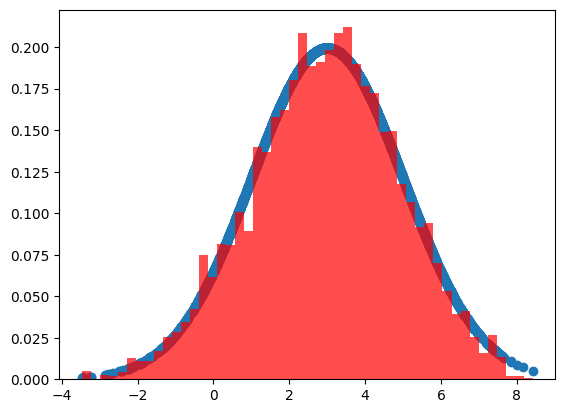
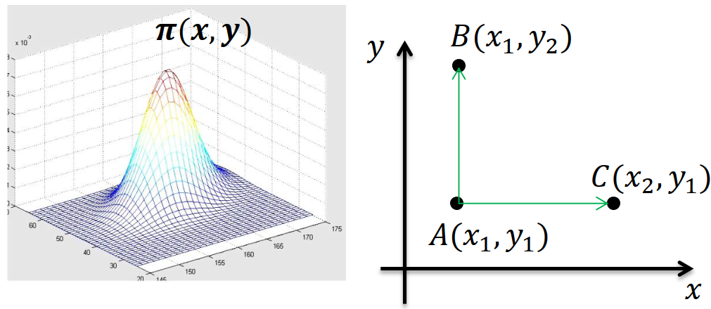
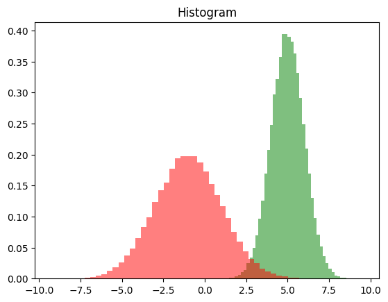

# Markov Chain Monte Carlo (MCMC)

2025-12-26⭐
@author Jiawei Mao
***
## 简介

Markov Chain Monte Carlo (MCMC) 是非常强大的 Monte Carlo 方法，常用于贝叶斯推断。

MCMC 由两个 MC 组成：

- 蒙特卡罗（Monte Carlo Simulation，简称 MC）
- 马尔科夫链（Markov Chain，简称 MC）

## 蒙特卡罗

蒙特卡罗（Monte Carlo, MCMC）本质就是随机抽样。早期的蒙特卡罗方法用于求解一些不好求解的积分问题，比如：
$$
\theta=\int_a^b f(x)dx
$$
如果很难求解 $f(x)$ 的原函数，这个积分就不好求。此时可以通过蒙特卡罗模拟求解近似值。假设函数图像如下：


在 $[a,b]$ 之间随机采样，比如 $x_0$，然后用 $f(x_0)$ 代表在 $[a,b]$ 之间所有 $f(x)$ 的值。那么上面定积分的近似求解为：
$$
(b-a)f(x_0)
$$
当然，用一个值代表 $[a,b]$ 之间所有 $f(x)$ 的值，这个假设太粗糙。我们可以在 $[a,b]$ 区间采样 $n$ 个值：$x_0,x_1,\cdots,x_{n-1}$，用它们的平均值代表 $[a,b]$ 区间所有的 $f(x)$ 值。此时的定积分近似解为：
$$
\frac{b-a}{n}\sum_{i=0}^{n-1}f(x_i)
$$
虽然该方法在一定程度上可以求解出近似解，但它隐含了一个假定，即 $x$ 在 $[a,b]$ 之间是均匀分布的，绝大多数情况与实际不符。因此其模拟结果可能与真实值相差甚远。

怎么解决该问题？如果可以得到 $x$ 在 $[a,b]$ 之间的概率分布函数 $p(x)$，那么可以采用如下方式计算定积分：
$$
\theta=\int_a^b f(x)dx=\int_a^b \frac{f(x)}{p(x)}p(x)dx\approx \frac{1}{n}\sum_{i=1}^{n-1}\frac{f(x_i)}{p(x_i)}
$$
该式子最右边就是**蒙特卡罗方法的一般形式**。这里是连续函数形式的蒙特卡罗方法，在离散时也成立。

如果假设 $x$ 在 $[a,b]$ 之间均匀分布，$p(x_i)=\frac{1}{b-a}$，就可以得到前面的特殊形式：
$$
\frac{1}{n}\sum_{i=1}^{n-1}\frac{f(x_i)}{p(x_i)}=\frac{1}{n}\sum_{i=1}^{n-1}\frac{f(x_i)}{1/(b-a)}=\frac{b-a}{n}\sum_{i=0}^{n-1}f(x_i)
$$
即开始的均匀分布可以作为一般概率分布函数 $p(x)$ 为均匀分布时的特例。

接下来的问题是如何求出 $x$ 的概率分布 $p(x)$。

### 概率分布采样

蒙特卡罗方法的关键是如何得到 $x$ 的概率分布。得到 $x$ 的概率分布，就可以基于概率分布采集 $n$ 的样本，代入蒙特卡洛的公式即可求解。但是还有一个关键问题，即如何基于概率分布进行采样。

对常见的均匀分布 $U(0,1)$ 很容易采样，一般通过线性同余很容易生成 $(0,1)$ 之间的伪随机数样本。而其它常见的概率分布，无论是离散的还是连续的，它们的样本都可以通过 $U(0,1)$ 的样本转换得到。比如二维正态分布的样本 $(Z_1,Z_2)$ 可以通过独立采样得到的均匀分布样本 $(X_1,X_2)$ 通过如下式子转换得到：
$$
Z_1=\sqrt{-2\ln X_1}\cos(2\pi X_2)\\
Z_2=\sqrt{-2\ln X_1}\sin(2\pi X_2)
$$
其它一些常见的连续分布，如 $t$ 分布，F 分布，Beta 分布，Gamma 分布等，都可以通过类似的方式从均匀分布得到的样本转换得到。在 Python 的 numpy, scikit-learn 等类库中，都有生成这些常见分布的函数。

但是，很多时候 $x$ 的概率分布**不是这些常见分布**，难以执行这类转换。怎么处理？

### 接受-拒绝采样

如果概率分布不是常见的分布，一个可行的办法是采用接受-拒绝采样。

既然 $p(x)$ 太复杂，在程序中无法直接采样，那么我们设定一个程序可采样的分布 $q(x)$，比如高斯分布，然后按照一定的方法拒绝某些样本，以达到接近 $p(x)$ 分布的目的。其中 $q(x)$ 称为 **proposal distribution**。


过程：设定一个方便采样的常用概率分布函数 $q(x)$，以及一个常量 $k$，使得 $p(x)$ 总是在 $kq(x)$ 的下方，如上图。

1. 首先，采样得到 $q(x)$ 的一个样本 $z_0$，采样方法参考 [概率分布采样](#概率分布采样)
2. 然后，从均匀分布 $(0,kq(z_0))$ 中采样得到一个 $u$，如果 $u$ 落在上图中的灰色区域，则拒绝这次抽样，否则接受这个样本 $z_0$
3. 重复以上过程，得到 $n$ 个接受样本  $z_0,z_1,\cdots,z_{n-1}$

该过程通过一系列接受-拒绝决策达到从 $q(x)$ 模拟 $p(x)$ 概率分布的目的。

### 蒙特卡罗方法小结

使用接受-拒绝采样，可以实现一些不常见概率分布的采样。但接受-拒绝采样只能部分满足需求，比如：

1. 对一些二维分布 $p(x,y)$，有时候我们只能得到条件分布 $p(x|y)$ 后 $p(y|x)$，很难得到二维分布 $p(x,y)$ 的 一般形式，这时我们无法采用接受-拒绝采样得到符合分布的样本
2. 对一些高维的复杂分布 $p(x_1,x_2,...,x_n)$，要找到一个合适的 $q(x)$ 与 $k$ 非常困难

因此，要想将蒙特卡罗方法作为一个通用的采样模拟方法，必须解决如何得到各种复杂概率分布的采样问题。马尔科夫链就是帮助我们实现复杂概率分布的采样问题。

## 马尔科夫链

用蒙特卡罗方法随机模拟求解一下复杂的连续积分或离散求和问题，但该方法需要得到对应概率分布的样本集合，而想得到这样的样本集合很困难。因此需要马尔科夫链帮忙。

马尔科夫链定义本身很简单，它假设某一时刻状态转移的概率只依赖于它前一个状态。以天气为例，假设每天的天气是一个状态，可能值：晴天、阴天、雨天；马尔科夫性质表示，今天是什么天气，只与昨天天气有关，而与更早的天气无关。虽然该假设很武断，但这样大大简化了模型的复杂性，因此马尔科夫链在很多时间序列模型中得到应用，比如循环神经网络、隐式马尔科夫模型等。

数学定义：假设状态序列是 $\cdots,X_{t-2},X_{t-1},X_t,X_{t+1},\cdots$，那么时刻 $X_{t+1}$ 状态的条件概率只依赖于 $X_t$，即：
$$
P(X_{t+1}|\cdots X_{t-2},X_{t-1},X_t)=P(X_{t+1}|X_t)
$$
既然某一时刻状态转移的概率只依赖于它的前一个状态，那么只要能求出系统中任意两个状态之间的转换概率，这个马尔科夫链模型就定了。例如：


这个马尔科夫链表示股市模型，共有三种状态：牛市（Bull）、熊市（Bear）和横盘（Stagnant）。

每个状态都以一定的概率转化到下一个状态。比如，牛市转化到横盘的概率为 0.025。这个状态概率转化图可以用矩阵表示。将矩阵 $P$ 某一位置 $P(i,j)$ 的值为 $P(j|i)$，即从状态 $i$ 转换到状态 $j$ 的概率，并定义牛市为状态 0，熊市为状态 1，横盘为状态 2。这样就得到马尔科夫链模型的状态转移矩阵：
$$
P=\begin{pmatrix}
    0.9 & 0.075 & 0.025\\
    0.15 & 0.8 & 0.05\\
    0.25 & 0.25 & 0.5
\end{pmatrix}
$$

### 状态转移矩阵的性质

得到马尔科夫链模型的状态转移矩阵，下面看看该矩阵的性质。

以上面的状态转移矩阵为例，假设当前股市的概率分布为 $[0.3,0.4,0.3]$，即 30% 概率为牛市，40% 概率为熊市，30% 概率为横盘。将该状态作为序列概率分布的初始状态 $t_0$，将其代入状态转移矩阵计算 $t_1,t_2,t_3,\cdots$ 的状态，代码如下：

```python
import numpy as np

matrix = np.matrix(
    [[0.9, 0.075, 0.025],
     [0.15, 0.8, 0.05],
     [0.25, 0.25, 0.5]],
    dtype=float)
vector1 = np.matrix([[0.3, 0.4, 0.3]], dtype=float)
for i in range(100):
    vector1 = vector1 * matrix
    print("Current round:", i + 1)
    print(vector1)
```

```
Current round: 1
[[0.405  0.4175 0.1775]]
Current round: 2
[[0.4715  0.40875 0.11975]]
Current round: 3
[[0.5156 0.3923 0.0921]]
...
Current round: 58
[[0.62499999 0.31250001 0.0625    ]]
Current round: 59
[[0.62499999 0.3125     0.0625    ]]
Current round: 60
[[0.625  0.3125 0.0625]]
Current round: 61
...
Current round: 99
[[0.625  0.3125 0.0625]]
Current round: 100
[[0.625  0.3125 0.0625]]
```

可以发现，从 60 轮开始，状态概率分布就不变了，一直保持在 `[0.625  0.3125 0.0625]`，即 62.5% 的牛市，31.25% 的熊市与 6.25% 的横盘。那么，这是不是巧合？

下面换一个初始概率分布试试，用 $[0.7,0.1,0.2]$ 作为初始概率分布：

```python
matrix = np.matrix([[0.9, 0.075, 0.025],
                    [0.15, 0.8, 0.05],
                    [0.25, 0.25, 0.5]], dtype=float)
vector1 = np.matrix([[0.7, 0.1, 0.2]], dtype=float)
for i in range(100):
    vector1 = vector1 * matrix
    print("Current round:", i + 1)
    print(vector1)
```

```
Current round: 1
[[0.695  0.1825 0.1225]]
Current round: 2
[[0.6835  0.22875 0.08775]]
Current round: 3
[[0.6714 0.2562 0.0724]]
...
Current round: 55
[[0.62500001 0.31249999 0.0625    ]]
Current round: 56
[[0.62500001 0.31249999 0.0625    ]]
Current round: 57
[[0.625  0.3125 0.0625]]
...
Current round: 99
[[0.625  0.3125 0.0625]]
Current round: 100
[[0.625  0.3125 0.0625]]
```

可以看到，采用不同初始概率分布，最终状态的概率分布趋于同一个稳定的概率分布 `[0.625  0.3125 0.0625]`，所以马尔科夫链模型的状态转移矩阵收敛到的稳定概率分布与初始状态概率无关。

这是一个非常好的性质，例如，对 一个稳定概率分布，如果得到了对应的马尔科夫链模型的状态转移矩阵，就可以用任意的概率分布样本开始，代入马尔科夫链模型的状态转移矩阵，经过一些序列转换，最终就可以得到符合对应稳定概率分布的样本。

这个性质不光对上面的状态转移矩阵有效，对绝大多数的其它马尔科夫链模型的状态转移矩阵也有效。同时不光是离散状态，对连续状态也成立。

对一个确定的状态矩阵矩阵 $P$，它的 $n$ 次幂 $P^n$ 在 $n$ 大于一定值的时候，可以发现也是确定的。例如：

```python
matrix = np.matrix([[0.9, 0.075, 0.025],
                    [0.15, 0.8, 0.05],
                    [0.25, 0.25, 0.5]], dtype=float)
for i in range(10):
    matrix = matrix * matrix
    print("Current round:", i + 1)
    print(matrix)
```

```
Current round: 1
[[0.8275  0.13375 0.03875]
 [0.2675  0.66375 0.06875]
 [0.3875  0.34375 0.26875]]
...
Current round: 5
[[0.62502532 0.31247685 0.06249783]
 [0.6249537  0.31254233 0.06250397]
 [0.62497828 0.31251986 0.06250186]]
Current round: 6
[[0.625  0.3125 0.0625]
 [0.625  0.3125 0.0625]
 [0.625  0.3125 0.0625]]
...
Current round: 9
[[0.625  0.3125 0.0625]
 [0.625  0.3125 0.0625]
 [0.625  0.3125 0.0625]]
Current round: 10
[[0.625  0.3125 0.0625]
 [0.625  0.3125 0.0625]
 [0.625  0.3125 0.0625]]
```

可以发现，当 $n\ge 6$ 以后，$P^n$ 的值稳定不再变化，而且每一行都是 $[0.625  0.3125 0.0625]$，与前面的稳定分布一致。这个性质不限制离散状态，在连续状态也成立。

**马尔科夫链的收敛性质的数学表示**

如果一个非周期的马尔科夫链有状态转移矩阵 $P$，并且它的任何两个状态是联通的，那么 $\lim\limits_{n\rightarrow\infty}P_{ij}^n$ 与 $i$ 无关：

$$
\lim\limits_{n\rightarrow\infty}P_{ij}^n=\pi(j) \tag{1}
$$

$$
\lim\limits_{n\rightarrow\infty}P^n=\begin{pmatrix}
    \pi(1) & \pi(2) & \cdots &\pi(j) & \cdots\\
    \pi(1) & \pi(2) & \cdots &\pi(j) & \cdots\\
    \cdots & \cdots & \cdots & \cdots & \cdots\\
    \pi(1) & \pi(2) & \cdots &\pi(j) & \cdots\\
\end{pmatrix} \tag{2}
$$

$$
\pi(j)=\sum_{i=1}^{\infty}\pi(i)P_{ij} \tag{3}
$$

$\pi$ 是方程 $\pi P=\pi$ 的唯一非负解，其中：

$$
\pi=[\pi(1),\pi(2),\cdots,\pi(j),\cdots]\quad \sum_{i=0}^{\infty}\pi(i)=1
$$

解释：

1. 非周期的马尔科夫链：指马尔科夫链的状态转化不是循环的，如果是循环的则永远不会收敛。幸运的是我们遇到的马尔科夫链一般都是非周期性的。
2. 任意两个状态是连通的：从任意一个状态可以通过有限步到达其它的任意一个状态，不会出现条件概率一直为 0 导致不可达的情况
3. 马尔科夫链的状态数目可以是有限的，也可以是无限的，因此可以用于连续概率分布和离散概率分布
4. $\pi$ 通常称为马尔科夫链的平稳分布

### 基于马尔科夫链采样

如果得到某个平稳分布对应的马尔科夫链状态转移矩阵，就很容易采出符合这个平稳分布的样本。

任意初始概率分布 $\pi_0(x)$，经过第一轮马尔科夫链状态转移后的概率是 $\pi_1(x)$，第 $i$ 轮的概率分布是 $\pi_i(x)$。假设经过 $n$ 轮后马尔科夫链收敛到我们的平稳分布 $\pi(x)$，即：

$$
\pi_n(x)=\pi_{n+1}(x)=\pi_{n+2}(x)=\cdots=\pi(x)
$$

对每个分布 $\pi_i(x)$，有：

$$
\pi_i(x)=\pi_{i-1}(x)P=\pi_{i-2}(x)P^2=\pi_0(x)P^i
$$

现在可以开始采样了。基于任意初始简单概率分布，比如高斯分布 $\pi_0(x)$ 采样得到的状态值 $x_0$，基于条件概率分布 $P(x|x_0)$ 采样状态值 $x_1$，一直进行下午，当状态转移执行足够次数，比如 $n$ 次，就认为此时的采样集合 $(x_n,x_{n+1},x_{n+2},\cdots)$ 是符合我们的平稳分布的对应样本集合，可以用来做蒙特卡洛模拟了。

总结基于马尔科夫链的采样过程：

1. 输入马尔科夫链状态转移矩阵 $P$，设定状态转移次数阈值 $n_1$，需要的样本个数 $n_2$
2. 从任意简单概率分布采样得到初始状态值 $x_0$
3. 从 $t=0$ 到 $n_1+n_2-1$：从条件概率 $P(x|x_t)$ 中采样得到样本  $x_{t+1}$

样本集合 $(x_{n_1},x_{n_1+1},\cdots,x_{n_1+n_2-1})$ 即为我们需要的平稳分布的样本集合。

### 马尔科夫链采样小结

假定我们可以得到稳定分布对应的马尔科夫链状态转移矩阵，就可以用马尔科夫链采样得到我们需要的样本，今儿进行蒙特卡罗模拟。

这里一个重要的问题是，给定任意一个稳定分布 $\pi$，如果得到它在马尔科夫链中的状态转移矩阵 $P$？

MCMC 采样解决了该问题，下面讨论 MCMC 采样以及它的改进版本：MH 采样和 Gibbs 采样。

## MCMC 采样

给定一个稳定分布 $\pi$，很难直接找到对应的马尔科夫链状态转移矩阵 $P$。只要解决该问题，就可以找到一种通用的概率分布采样方法，进而用于蒙特卡罗模拟。

### 马尔科夫链的细致平稳条件

如果非周期马尔科夫链的状态转移矩阵 $P$ 和概率分布 $\pi(x)$ 对所有 $i$ 满足：
$$
\pi(i)P(i,j)=\pi(j)P(j,i)
$$
则称概率分布 $\pi(x)$ 是状态转移矩阵 $P$ 的平稳分布。

证明很简单，由细致平稳条件有：
$$
\sum_{i=1}^{\infty}\pi(i)P(i,j)=\sum_{i=1}^{\infty}\pi(j)P(j,i)=\pi(j)\sum_{i=1}^{\infty}P(j,i)=\pi(j)
$$
用矩阵表示即为：
$$
\pi P = \pi
$$
即满足马尔科夫链的收敛性质。因此，只要我们找到使概率分布 $\pi(x)$ 满足细致平稳分布的矩阵 $P$ 即可。

不幸的是，仅仅从细致平稳条件还是很难找到合适的矩阵 $P$。比如，我们的目标平稳分布是 $\pi(x)$，随机找一个马尔科夫链状态转移矩阵 $Q$，它很难满足细致平稳条件，即：
$$
\pi(i)Q(i,j)\ne \pi(j)Q(j,i)
$$
那么，如何使这个等式满足呢？下面看看 MCMC 采样如何解决该问题。

### MCMC 采样原理

由于一般情况下，目标平稳分布 $\pi(x)$ 和某一个马尔科夫联状态转移矩阵 $Q$ 不满足细致平衡条件，即：
$$
\pi(i)Q(i,j)\ne \pi(j)Q(j,i)
$$
可以对该式子进行改造，使细致平稳条件成立。引入一个 $\alpha(i,j)$，即：
$$
\pi(i)Q(i,j)\alpha(i,j)= \pi(j)Q(j,i)\alpha(j,i)
$$
问题是，什么样的 $\alpha(i,j)$ 可以使等式成立？其实很简单，只要满足下面两个式子：
$$
\alpha(i,j)=\pi(j)Q(j,i)\\
\alpha(j,i)=\pi(i)Q(i,j)\\
$$
这样，就得到分布 $\pi(x)$ 对应的马尔科夫链状态转移矩阵 $P$，满足：
$$
P(i,j)=Q(i,j)\alpha(i,j)
$$
简而言之，目标矩阵 $P$ 可以通过任意一个马尔科夫链状态转移矩阵 $P$ 乘以 $\alpha(i,j)$ 得到。

$\alpha(i,j)$ 一般称为接受率，取值在 $[0,1]$ 之间，可以理解为一个概率值。即目标矩阵 $P$ 可以通过任意一个马尔科夫链状态转移矩阵 $Q$ 以一定的接受率获得。这与[接受-拒绝采样](#接受-拒绝采样) 类似：接受-拒绝采样以一个常见分布通过一定的接受-拒绝概率得到一个非常见分布，这里以一个常见的马尔科夫链状态转移矩阵 $Q$ 通过一定的接受-拒绝概率得到目标转移矩阵 $P$，两者的思路类似。

总结 MCMC 采样过程：

1. 输入任意马尔科夫链状态转移矩阵 $Q$，平稳分布 $\pi(x)$，设定状态转移次数阈值 $n_1$，需要的样本个数 $n_2$
2. 从任意简单概率分布采样得到初始状态值 $x_0$
3. 从 $t=0$ 到 $n_1+n_2-1$
   a. 从条件概率分布 $Q(x|x_t)$ 中采样得到样本 $x^*$
   b. 从均匀分布采样 $u\sim U[0,1]$
   c. 如果 $u<\alpha(x,x^*)=\pi(x^*)Q(x^*,x_t)$，则接受转移 $x_t\rightarrow x^*$，即 $x_{t+1}=x^*$
   d. 否则不接受转移，即 $x_{t+1}=x_t$

样本集 $(x_{n_1},x_{n_1+1},\cdots,x_{n_1+n_2-1})$ 即为我们所需的平稳分布对应的样本集合。

这个过程就是 MCMC 采样的完整理论，但是这个采样算法比较难应用：问题在第3 步的步骤 c 接受率这儿。由于 $\alpha(x_t,x^*)$ 可能非常小，比如 0.1，导致大部分的采样值被拒绝转移，采样效率很低。有可能采样了上百万次马尔科夫链还没有收敛，也就是说上面这个 $n_1$ 要非常大，这让人难以接受。所以轮到 MH 采样出场了。

## MH 采样

MH 采样是 Metropolis-Hastings 采样的缩写，该算法最先由 Metropolis 提出，被 Hastings 改进。

MH 采样解决了 MCMC 采样接受率过低的问题。

回到 MCMC 采样的细致平稳条件：
$$
\pi(i)Q(i,j)\alpha(i,j)= \pi(j)Q(j,i)\alpha(j,i)
$$
采样效率低是因为 $\alpha(i,j)$ 太小了，比如 $\alpha(i,j)=0.1$, $\alpha(j,i)=0.2$，即：
$$
\pi(i)Q(i,j)\times 0.1=\pi(j)Q(j,i)\times 0.2
$$
这时，如果两边同时扩大 5 倍，接受率提高到 0.5，细致平稳条件依然成立，即：
$$
\pi(i)Q(i,j)\times 0.5=\pi(j)Q(j,i)\times 1
$$
因此，我们可以对接受率做如下改进：
$$
\alpha(i,j)=\min\{\frac{\pi(j)Q(j,i)}{\pi(i)Q(i,j)},1\}
$$
通过这个小的改造，就得到可以在实际中使用的 MH 采样算法。过程如下：

1. 输入任意马尔科夫链状态转移矩阵 $Q$，平稳分布 $\pi(x)$，设定状态转移次数阈值 $n_1$，需要的样本数 $n_2$
2. 从任意简单概率分布采样得到初始状态 $x_0$
3. 从 $t=0$ 到 $t=n_1+n_2-1$:
   1. 从条件概率分布 $Q(x|x_t)$ 中采样得到样本 $x^*$
   2. 从均匀分布采样 $u\sim U[0,1]$
   3. 如果 $u<\alpha(x_t,x^*)=\min\{\frac{\pi(j)Q(j,i)}{\pi(i)Q(i,j)},1\}$，则接受转移 $x_t\rightarrow x^*$，即 $x_{t+1}=x^*$
   4. 否则不接受转移，即 $x_{t+1}=x_t$

样本集合 $\{x_{n_1},x_{n_1+1},\cdots,x_{n_1+n_2-1}\}$ 即为所需的平稳分布对应的样本集合。

很多时候，如果我们选择的马尔科夫链状态转移矩阵 $Q$ 是对称的，即 $Q(i,j)=Q(j,i)$，此时接受率可以进一步简化为：
$$
\alpha(i,j)=\min\{\frac{\pi(j)}{\pi(i)},1\}
$$

### MH 采样实例

假设目标平稳分布是一个均值为 3，标准差为 2 的正态分布，而选择的马尔科夫状态转移矩阵 $Q(i,j)$ 的条件转移概率是以 $i$ 为均值，方差为 1 的正态分布在位置 $j$ 的值。

这个例子只是用来加深对 MH 采样的理解，实际上一维正态分布这种简单分布用不着用 MH 采样。

```python
import random
import math
from scipy.stats import norm
import matplotlib.pyplot as plt
%matplotlib inline

# 目标分布
def norm_dist_prob(theta):
    return norm.pdf(theta, loc=3, scale=2)

T = 5000
pi = [0 for i in range(T)] # 
sigma = 1
t = 0
while t < T - 1:
    t = t + 1
    # Q(x|x_t): 正态分布，位置为 pi[t-1]，rvs 随机抽样，得到下一个样本
    pi_star = norm.rvs(loc=pi[t - 1], scale=sigma, size=1, random_state=None)
    # Q 分布对称，采用简化公式
    alpha = min(1, (norm_dist_prob(pi_star[0]) / norm_dist_prob(pi[t - 1])))
    u = random.uniform(0, 1)
    if u < alpha:
        pi[t] = pi_star[0]
    else:
        pi[t] = pi[t - 1]

plt.scatter(pi, norm.pdf(pi, loc=3, scale=2))
num_bins = 50
plt.hist(pi, num_bins, density=True, facecolor='red', alpha=0.7)
plt.show()
```



从图中可以看出采样值的分布与真实分布之间的关系，样本比较符合对应分布。

### MH 采样总结

MH 采样解决了使用蒙特卡罗方法需要的任意概率分布抽样问题，在实际生产环境中得到了广泛应用。

但在大数据时代，MH 采样面料两个难题：

1. 数据的特征非常多，MH 采样由于接受率计算式 $\frac{\pi(j)Q(j,i)}{\pi(i)Q(i,j)}$ 的存在，在高维时需要的计算时间非常多，算法效率低。同时 $\alpha(i,j)$ 一般小于  1，有时候辛苦计算出来却被拒绝了
2. 由于特征维度大，很多时候甚至难以 求出目标分布各个特征联合分布，但是可以方便求出各个特征之间的条件概率分布。这时候能不能在只有各个维度之间条件概率的情况下方便采样呢？

Gibbs 采样解决了上面两个问题，因此在大数据时代，MCMC 采样基本是 Gibbs 采样的天下。

## Gibbs 采样

MH 采样很好解决了蒙特卡罗方法需要的任意概率分布的采样问题。但是 MC 有两个缺点：1. 需要计算接受率，在高维时计算量大。并且由于接受率的原因导致算法收敛时间长；2. 有些高维数据，特征的条件概率好求，但是特征的联合分布不要求。因此需要一个好的方法来改进 MH 采样。

回到细致平稳条件：如果非周期马尔科夫链的状态转移矩阵 $P$ 的概率分布 $\pi(x)$ 对所有 $i,j$满足：
$$
\pi(i)P(i,j)=\pi(j)P(j,i)
$$
就称概率分布 $\pi(x)$ 是状态转移矩阵 $P$ 的平稳分布。

MH 采样通过引入接受率使细致平稳条件成立。现在换一个思路。



从二维数据分布开始，假设 $\pi(x_1,x_2)$ 是一个二维联合数据分布，观察第一个特征维度相同的两个点 $A(x_1,y_1)$ 和 $B(x_1,y_2)$，容易发现下面两个式子成立：
$$
\pi(A)=\pi(x_1,y_1)=\pi(x_1)\pi(y_1|x_1)\\
\pi(B)=\pi(x_1,y_2)=\pi(x_1)\pi(y_2|x_1)\\
$$
那么：
$$
\pi(A)\pi(y_2|x_1)=\pi(B)\pi(y_1|x_1)
$$
观察该式，以及细致平稳条件的公式，如果用条件概率 $\pi(y_2|x_1)$ 作为马尔科夫链的状态转移概率，则任意两个点之间的转移满足细致平稳条件。同样的道理，在 $y_1$ 这条直线上，如果用条件概率分布 $\pi(x_1|y_1)$ 作为马尔科夫链的状态转移概率，则任意两个点之间的转移也满足细致平稳条件。

基于该发现，可以构造分布 $\pi(x_1,x_2)$ 的马尔科夫链对应的状态转移矩阵 $P$:
$$
P(A\rightarrow B)=\pi(x_2^B|x_1^{(1)}) \quad\text{if } x_1^{(A)}=x_1^{(B)}=x_1^{(1)}\\
P(A\rightarrow C)=\pi(x_1^C|x_2^{(1)}) \quad\text{if } x_2^{(A)}=x_2^{(C)}=x_2^{(1)}\\
P(A\rightarrow D)=0 \quad \text{else}
$$
即要求其中一个变量保持不变。

有了这个状态转移矩阵，很容易验证二维平面的任意两点 $E,F$ 满足细致平稳条件时：
$$
\pi(E)P(E\rightarrow F)=\pi(F)P(F\rightarrow E)
$$
于是，这个二维空间上的马氏链将收敛到平稳分布 $\pi(x,y)$。

### 二维 Gibbs 采样

二维 Gibbs 采样，需要两个维度之间的条件概率。具体过程如下：

1. 输入平稳分布 $\pi(x_1,x_2)$，设定状态转移次数阈值 $n_1$，需要的样本个数 $n_2$
2. 随机初始化状态值 $x_1^{(0)}$ 和 $x_2^{(0)}$
3. 从 $t=0$ 到 $n_1+n_2-1$
   1. 从条件概率分布 $P(x_2|x_2^{t})$ 采样得到样本 $x_2^{t+1}$
   2. 从条件概率分布 $P(x_1|x_2^{t+1})$ 采样得到样本 $x_1^{t+1}$

样本集合 $\{(x_1^{n_1},x_2^{n_1}),(x_1^{n_1+1},x_2^{n_1+1})\cdots,(x_1^{n_1+n_2-1},x_2^{n_1+n_2-1})\}$ 即为我们需要的平稳分布对应的样本集合。

整个采样过程中，通过转换坐标轴哦，采样的过程为：
$$
(x_1^{1},x_2^1)\rightarrow (x_1^1,x_2^2)\rightarrow (x_1^2,x_2^2)\rightarrow\cdots\rightarrow (x_1^{n_1+n_2-1},x_2^{n_1+n_2-1})
$$
采样在两个坐标上不停的轮换。当然，坐标轴轮换不是必须的，也可以每次随机选择一个坐标轴进行采样。不过常用的 Gibbs 采样的实现都是基于坐标轴轮换。


### 多维 Gibbs 采样

Gibbs 推广到多维也是成立的。比如一个 $n$ 维概率分布 $\pi(x_1,x_2,\cdots,x_n)$，可以通过在 $n$ 个坐标轴上轮转采样得到新的样本。对于轮转到的任意一个坐标轴 $x_i$ 上的转移，马尔可夫链的状态转移概率为 $P(x_i|x_1,x_2,\cdots,x_{i-1},x_{i+1},\cdots,x_n)$，即固定 $n-1$ 个坐标轴，在某一个坐标轴上移动。

具体的算法过程如下：

1. 输入平稳分布 $\pi(x_1,x_2,\cdots,x_n)$ 或对应所有特征的条件概率分布，设定状态转移次数阈值 $n_1$ 和需要的样本个数 $n_2$
2. 随机初始化初始状态值 $(x_1^{(0)},x_2^{(0)},\cdots,x_n^{(0)})$
3. 从 $t=0$ 到 $n_1+n_2-1$
   1. 从条件概率分布 $P(x_1|x_2^t,x_3^t,\cdots,x_n^t)$ 采样得到样本 $x_1^{t+1}$
   2. 从条件概率分布 $P(x_2|x_1^{t+1},x_3^t,\cdots,x_n^t)$ 中采样得到样本 $x_2^{t+1}$
   3. ...
   4. 从条件概率分布 $P(x_j|x_1^{t+1},x_2^{t+1},\cdots,x_{j-1}^{t+1},x_{j+1}^t,\cdots,x_n^t)$ 采样得到样本 $x_j^{t+1}$
   5. ...
   6. 从条件概率分布 $P(x_n|x_1^{t+1},x_2^{t+1},\cdots,x_{n-1}^{t+1})$ 中采样得到样本 $t_n^{t+1}$

样本集合 $\{(x_1^{n_1},x_2^{n_1},\cdots,x_n^{n_1}),\cdots,(x_1^{n_1+n_2-1},\cdots,x_n^{n_1+n_2-1})\}$ 就是所需的平稳分布对应的样本集合。

整个采样过程和 Lasso 回归的坐标下降算法非常相似，只不过 Lasso 回归是固定 $n-1$ 特特征，对某一个特征求极值；而 Gibbs 采样是固定 $n-1$ 个特征对余下一个特征采样。

同样的，轮转坐标轴不是必须的，我们可以随机选择某一个坐标轴积极性状态转移，只不过常用的 Gibbs 采样的实现都是基于坐标轴轮换。

### 二维 Gibbs 采样实例

假设我们要采样的是一个二维正态分布 $N(\mu,\Sigma)$，其中：
$$
\mu=(\mu_1,\mu_2)=(5,-1)
$$

$$
\Sigma=\begin{pmatrix}
    \sigma_1^2&\rho\sigma_1\sigma_2\\
    \rho\sigma_1\sigma_2&\sigma_2^2
\end{pmatrix}=\begin{pmatrix}
    1&1\\
    1&4
\end{pmatrix}
$$

而采样过程中需要的状态转移条件分布为：

$$
P(x_1|x_2)=Norm(\mu_1+\rho\sigma_1/\sigma_2(x_2-\mu_2),(1-\rho^2)\sigma_1^2)\\
P(x_2|x_1)=Norm(\mu_2+\rho\sigma_2/\sigma_1(x_1-\mu_1),(1-\rho^2)\sigma_2^2)
$$

代码如下：

```python
from mpl_toolkits.mplot3d import Axes3D
from scipy.stats import multivariate_normal

samplesource = multivariate_normal(mean=[5, -1], cov=[[1, 0.5], [0.5, 2]])

def p_ygivenx(x, m1, m2, s1, s2):
    return (random.normalvariate(m2 + rho * s2 / s1 * (x - m1), math.sqrt(1 - rho ** 2) * s2))

def p_xgiveny(y, m1, m2, s1, s2):
    return (random.normalvariate(m1 + rho * s1 / s2 * (y - m2), math.sqrt(1 - rho ** 2) * s1))

N = 5000
K = 20
x_res = []
y_res = []
z_res = []
m1 = 5
m2 = -1
s1 = 1
s2 = 2

rho = 0.5
y = m2

for i in range(N):
    for j in range(K):
        x = p_xgiveny(y, m1, m2, s1, s2)
        y = p_ygivenx(x, m1, m2, s1, s2)
        z = samplesource.pdf([x, y])
        x_res.append(x)
        y_res.append(y)
        z_res.append(z)

num_bins = 50
plt.hist(x_res, num_bins, density=True, facecolor='green', alpha=0.5)
plt.hist(y_res, num_bins, density=True, facecolor='red', alpha=0.5)
plt.title('Histogram')
plt.show()
```



查看二维正态分布：

### Gibbs 采样小结

由于 Gibbs 采样在高维特征空间的优势，目前通常意义上的 MCMC 采样都是用的 Gibbs 采样。当然，Gibbs 采样是从 MH 采样的基础上演化而来，同时要求数据至少有两个维度，一维概率分布的采样没法用 Gibbs 采样，这次仍然用 MH 采样。

##  参考

- https://github.com/ljpzzz/machinelearning
