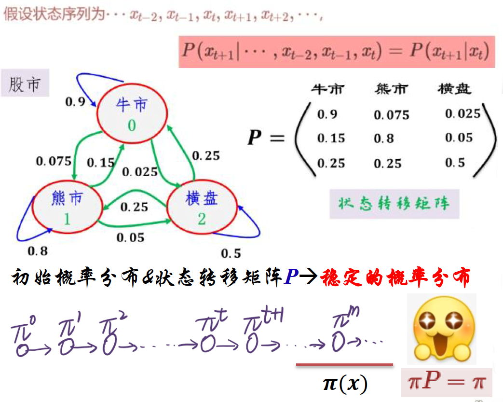

# MCMC 采样

## 简介

对指定初始概率和状态转移矩阵，经过多次状态转移，最后 $\pi$ 趋于稳定，得到一个稳定的概率分布。

因此，MCMC 可以用于指定概率分布的采样。
$$
\pi P=\pi \tag{1}
$$
如何计算状态转移矩阵 $P$？

如果 （1）式成立，那么细致平衡条件成立：
$$
\pi(i)P(i,j)=\pi(j)P(j,i)
$$
如果处于状态 $i$ 的概率 $\pi(i)$ 很高，那么从 $i$ 转移到 $j$ 的概率 $P(i,j)$ 就很低；如果处于状态 $j$ 的概率 $\pi(j)$ 很低，那么从 $j$ 转移到 $i$ 的概率 $P(j,i)$ 就很高。

应用场景：

- 目标分布已知，直接抽样困难
- 目标分布 $\pi(x)$ 难以归一化

## MH 采样

MH 算法（Metropolis-Hastings）

为了计算概率转移矩阵 $P$.取**随机**矩阵 $Q$，同时引入 $\alpha$，满足：
$$
\pi(i)Q(i,j)\alpha(i,j)=\pi(j)Q(j,i)\alpha(j,i) \tag{2}
$$
即：
$$
P(i,j)=Q(i,j)\alpha(i,j) \tag{3}
$$
取 $\alpha(i,j)=\pi(j)Q(j,i)$, $\alpha(j,i)=\pi(i)Q(i,j)$，(2) 式必然成立。

$\alpha(i,j)$ 可以理解为从 $j$ 转移到 $i$ 的概率 $\pi(j)Q(j,i)$。因此 (3) 式可以理解为从 $Q(i,j)$ 有一定概率 $\alpha(i,j)$ 等于 $P(i,j)$，与拒绝抽样类似：

通过随机转移矩阵 $Q$ 进行采样，但是样本被保留下来继续抽样的概率为 $\alpha$。

 过程：

1. 给定任意的转移矩阵 $Q$，和平稳分布 $\pi(x)$
2. $t=0$ 随机产生一个初始状态 $x_0$
3. 从条件概率分布 $Q(x|x_0)$ 中采样 $x^*$ ($x^*$ 不一定满足 P 分布)
4. 从均匀分布产生 $u\sim U(0,1)$
5. 如果 $u<\alpha(x_0,x^*)=\min(\frac{\pi(j)Q(j,i)}{\pi(i)Q(i,j)},1)$，接受 $x^*\rightarrow t=1,x_1=x^*$
6. 否则拒绝这次采样，$t=1,x_1=x_0$
7. 继续 2-6，直到 $t>T$，达到平衡
8. $t>T$ 之后的所有接受样本即需要的平稳分布样本

MH 问题：高维不适用

## 吉布斯采样（Gibbs）

MH 的主要问题是高维不适用，Gibbs 采样尝试解决该问题。

以二维高斯分布为例：

$$
\pi(A)=\pi(x_1,y_1)=\pi(x_1)\pi(y_1|x_1)\\
\pi(B)=\pi(x_1,y_2)=\pi(x_1)\pi(y_2|x_1)\\
$$
那么：
$$
\pi(A)\pi(y_2|x_1)=\pi(B)\pi(y_1|x_1)
$$
这就是细致平衡条件：$\pi(i)P(i,j)=\pi(j)P(j,i)$，所以可以使用马尔科夫链进行采样。即：
$$
\pi(A)P(A\rightarrow B)=\pi(B)P(B\rightarrow A)
$$
由于 $\pi$ 已知，所以可以直接计算 $\pi(y_2|x_1)$ 和 $\pi(y_1|x_2)$，不需要拒绝概率，直接采样。

**多维**采样方法类似，一次只能在一个方向上采样：$A(x_1^t,x_2^t,\cdots,x_n^t)$, $B(x_1^{t+1},x_2^{t},\cdots,x_n^{t})$
$$
P(A\rightarrow B)=\pi(x_1|x_2^t,\cdots,x_n^t)
$$
Gibbs 采样步骤：

1. 给定平稳分布 $\pi(x_1,x_2)$
2. $t=0$ 随机产生一个初始状态 $(x_1^{(0)},x_2^{(0)})$
3. 

**问题**：只允许在平行坐标轴方向上样

## 参考

- https://every-algorithm.github.io/2024/06/03/metropolishastings_algorithm.html
