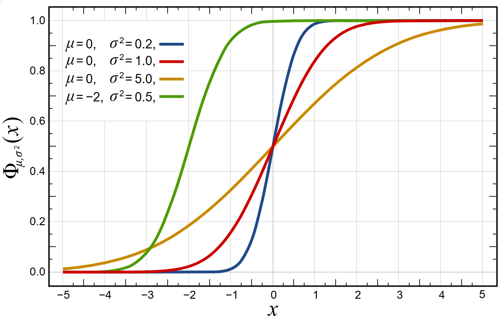
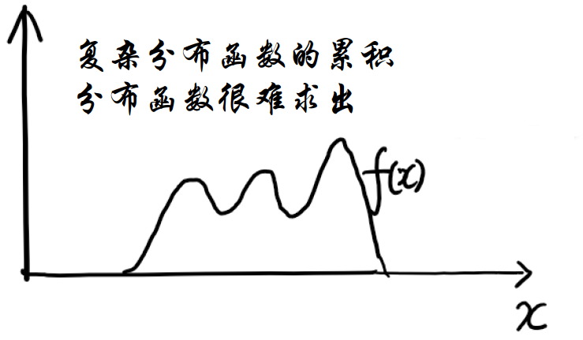
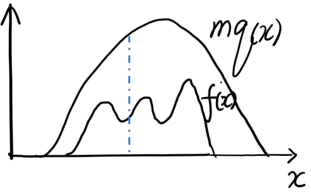

# Monte Carlo

蒙特卡洛（Monte Carlo, MCMC）本质就是随机抽样。

## 抽样服从特定分布的样本

从累计分布函数（CDF）抽样：

CDF 在 0 到 1 之间单调递增。根据 CDF 可以推导原始的 PDF 函数。

设 CDF 为 $F(x)$：
$$
F(x)=\int_{-\infty}^x f(t)dt
$$
在 0-1 之间平均抽样：$i\sim U(0,1)$，那么 $x_i=F^{-1}(i)$。即根据随机抽到的概率值，计算对应的 $x$ 的值。这样就实现了服从特定分布的抽样。

## Rejection 抽样

CDF 涉及的积分计算 $\int_{-\infty}^x f(t)dt$ 不一定好计算。它可能是一个很复杂的函数，例如：

此时可以找一个计算好算的函数，比如 $q(x)$，并且满足 $mq(x)\ge f(x)$。如下图：

这样就可以抽样服从 $mq(x)$ 分布的样本。比如，抽取了一个样本 $x_i$，它服从 $mq(x)$ 分布，但不一定服从 $f(x)$ 分布。所以增加了一个筛选策略：

- 以概率 $p=\frac{f(x)}{mq(x)}$ 接受
- 以概率 $1-p$ 拒绝

即以 $mq(x)$ 与 $f(x)$ 在不同位置的概率比值作为对应 $x$ 的接受概率。

所以，在 $f(x)$ 概率为 0 位置的采样不会被接受，在 $f(x)$ 值大的地方接受概率大，保证了抽样服从 $f(x)$ 分布。

该方法的主要问题：

- 合适的 $q(x)$ 不好找: $q(x)$ 太大会导致许多无效抽样，即接受概率太低
- 高维不适用

## 参考

- https://apurvanakade.github.io/Monte-Carlo-Methods/
- https://www.openmarkov.org/
- https://www.bilibili.com/video/BV17D4y1o7J2
- https://www.numberanalytics.com/blog/ultimate-gibbs-sampling-guide
- https://cfteach.github.io/BRDS_DATA644/MCMC_from_scratch_all.html
- https://www2.bcs.rochester.edu/sites/jacobslab/cheat_sheet/MetropolisHastingsSampling.pdf
- https://www.statlect.com/fundamentals-of-statistics/Metropolis-Hastings-algorithm