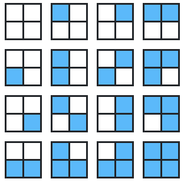

# 计数

## 简介

计数（counting）很简单，但它是计算机的基础。

## 分步计数

**定义**：计数的分步原理（又称为计数的乘积规则）

如果一个试验分为两部分，第一部分有 $m$ 种可能结果，第二部分有 $n$ 种可能结果，那么实验结果总数为 $m\cdot n$。

用集合符号重写：

- 试验第一部分可能结果为集合 $A$，其中 $|A|=m$
- 试验第一部分可能结果为集合 $B$，其中 $|B|=n$
- 则实现总结果数为 $|A||B|=m\cdot n$

可观测宇宙中原子数量约为 $10^{80}$。这个数字通常用于演示计算机永远无法解决的任务。问题可能迅速增长到荒谬的规模。例如，有一个 art 项目用于展示所有可能的图片。这肯定需要很长时间，因为肯定有很多图片，但具体有多少呢？可以假设颜色模型为 true color，包含 $2^{24}\approx 17$ million 种同颜色。

那么不同设备可以生成多少种不同图片：

a. 1200 万像素的智能手机

b. 300 像素的网格

c. 12 像素的网格

分步计数：一步步构建图像，每次从 1700 万颜色中选择一个，包含 $n$ 个像素的数组可以产生 $(\text{17 millon})^n$ 个不同图片。$(\text{17 million})^12\approx 10^{86}$，因此 12 像素的网格产生的图片数量已经是宇宙原子数量的一百万倍。

**围棋**

围棋棋盘有 $19\times 19$ 个点，每个点可以是空的、白棋和黑棋。通过分步计数可以计算所有可能的布局：$3^{19\times 19}\approx 10^{172}$。

## or 计数

**定义**：互斥计数（mutually exclusive counting）

如果实验结果可以从集合 $A$ 或 $B$ 中得出，其中集合 $A$ 中的结果与集合 $B$ 中的结果没有相同的（互斥），那么实验有 $|A or B|=|A|+|B|$ 种可能。当两个 group 互斥，计数就变得简单。

**定义**：Inclusion-Exclusion Counting

如果实验结果可以从集合 $A$ 或 $B$ 中得出，集合 $A$ 和集合 $B$ 可能重叠（不互斥），那么实验结果数量为 $|A \text{ or } B|=|A|+|B|-|A \text{ and } B|$ 种可能。

## 过多计数和修正

以生成图像为例，假设只有 4 个像素，每个像素可以是蓝色和白色，那么有 $2^4=6$ 种可能。如下：

现在添加一个限制，要求蓝色的数量必须为奇数。有两种计数方法：

1. 从原始 16 个图像开始，减去 8 个包含 0， 2， 4 个蓝色像素的图像；
2. 使用互斥计数：生成 1 个蓝色像素的有 4 种，3 个蓝色像素的有 4 种

两种方式结果一致。

再添加一个限制：

## 参考

- https://chrispiech.github.io/probabilityForComputerScientists/en/part1/counting/