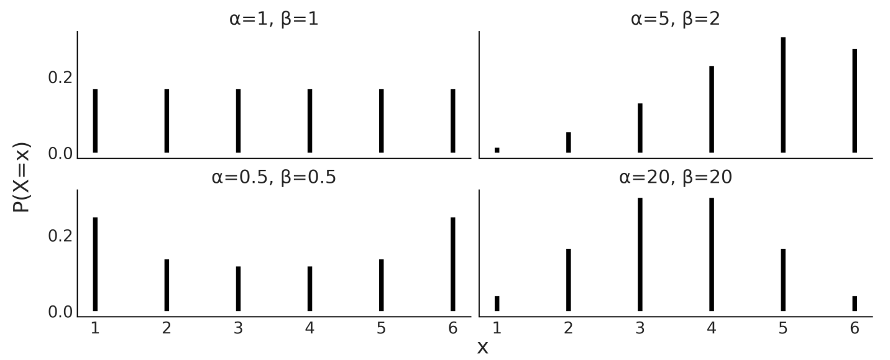
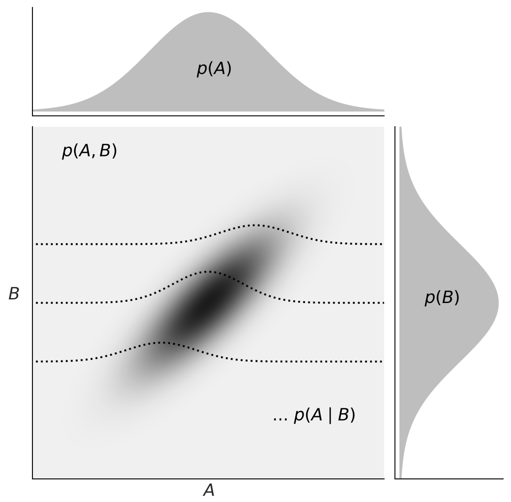
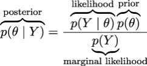
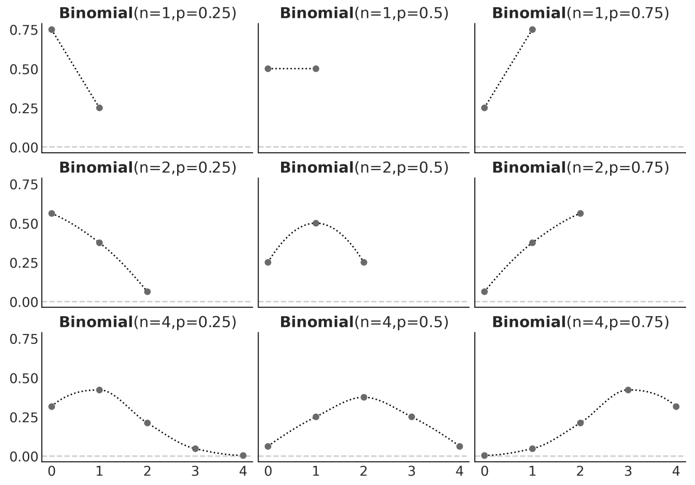
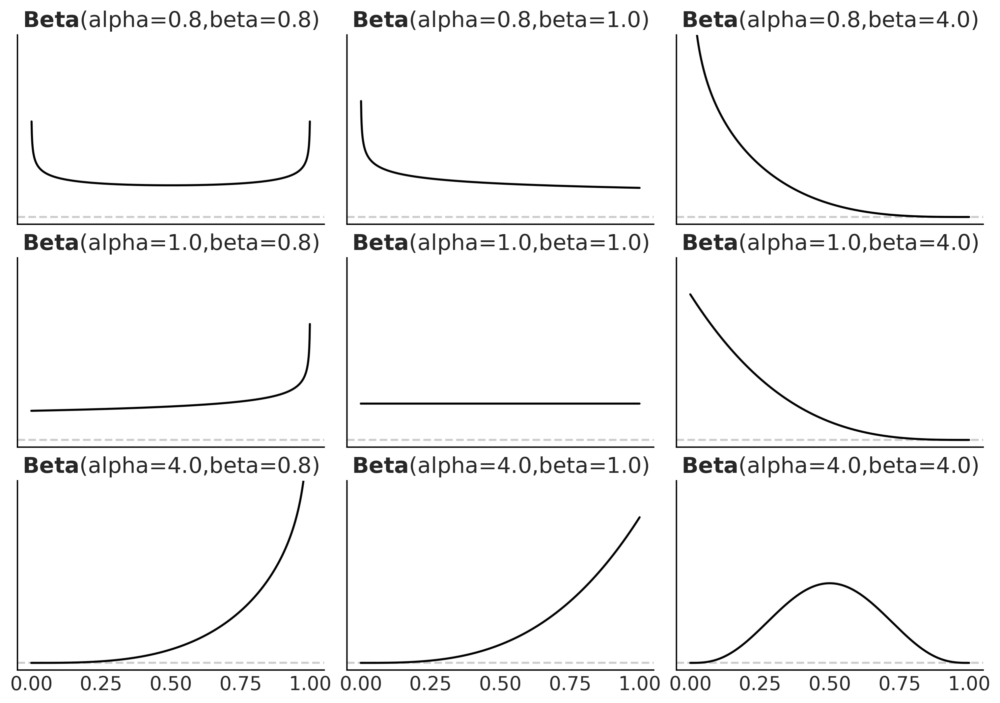
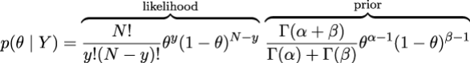
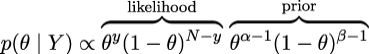
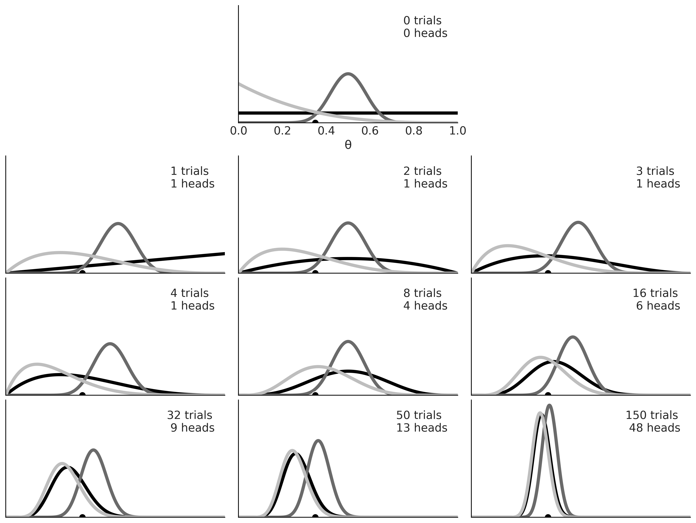
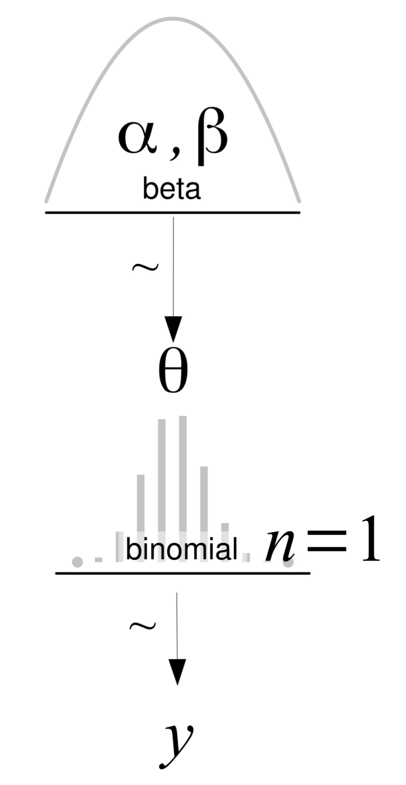
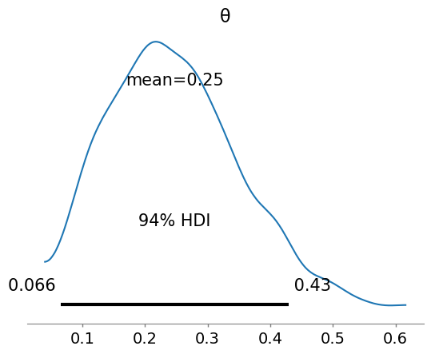

# 贝叶斯概述

- [贝叶斯概述](#贝叶斯概述)
  - [1. 概念](#1-概念)
    - [1.1 样本空间和事件](#11-样本空间和事件)
    - [1.2 随机变量](#12-随机变量)
    - [1.3 离散随机变量的分布](#13-离散随机变量的分布)
    - [1.4 连续随机变量的分布](#14-连续随机变量的分布)
    - [1.5 累计分布函数](#15-累计分布函数)
    - [1.6 条件概率](#16-条件概率)
    - [1.7 期望值](#17-期望值)
    - [1.8 贝叶斯理论](#18-贝叶斯理论)
  - [2. 概率](#2-概率)
  - [3. 概率，不确定性和逻辑](#3-概率不确定性和逻辑)
  - [4. 单个参数推断](#4-单个参数推断)
    - [(1) 抛硬币问题](#1-抛硬币问题)
    - [(2) 选择似然度](#2-选择似然度)
    - [(3) 选择先验](#3-选择先验)
    - [(4) 计算后验](#4-计算后验)
    - [(5) 先验的影响](#5-先验的影响)
  - [5. 如何选择先验](#5-如何选择先验)
  - [6. 贝叶斯分析展示](#6-贝叶斯分析展示)
    - [模型表示和可视化](#模型表示和可视化)
    - [总结后验](#总结后验)
  - [7. 示例](#7-示例)

2024-05-20 🧡
@author Jiawei Mao
***

## 1. 概念

### 1.1 样本空间和事件

样本空间：可能的样本分布。

事件：样本空间的子集。

概率：事件发生的可能性

- 最大值为 1，概率为 1 的事件称为必然事件
- 最小值为 0，概率为 0 的事件称为不可能事件

互斥事件：不能同时发生的事件。

概率定义：给定样本空间 $S$, 和事件 $A$, $A$ 是 $S$ 的子集，概率是一个函数 $P$。

函数 $P$ 有以下限制（三个公理）：

1. 事件发生的概率为非负数；
2. $P(S)=1$
3. 如果 $A_1, A_2,...$ 为互斥事件，即它们不能同时发生，那么 $P(A_1,A_2,\cdots)=P(A_1)+P(A_2)+\cdots$

> 公理，公认为真的理论，可以作为推理的起点。

概率，就是一种特殊的函数，没有什么特别的。

### 1.2 随机变量

随机变量：将样本空间映射到实数 $\Reals$ 的函数。

例如，如果变量 $X$ 代表掷一次筛子的点数，那么其值 $x$ 包含整数 $\{1, 2, 3, 4, 5, 6\}$。此时可以用：

- $P(X=3)$ 表示获得 3 的概率；
- $P(X=x)$ 表示获得 $x$ 的概率；
- $P(X\le x)$ 表示获得值小于等于 $x$ 的概率。

随机变量的用处与 Python 函数类似：将代码封装在函数中，就可以存储、重用和隐藏对数据的复杂操作。还可以将多个函数组合起来使用。随机变量在统计学中起着类似作用。

样本空间到 $\R$ 的映射是确定的，没有随机性。那么为什么称为随机变量？因为我们可以反复从变量请求值，每次获得的值都看额能不同。随机性来自与事件相关的概率。

随机变量分为离散型和连续型。

### 1.3 离散随机变量的分布

概率分布（probability distribution）：所有可能事件的概率。

以圆为例：
$$
x^2+y^2=r^2
$$
给定参数 $r$，就能够定义一个圆（忽略圆心问题）。

概率分布和圆一样，都有其数学表达式和对应的参数，每个不同的参数值对应一个成员。例如，下图是 `BetaBinomial` 分布的 4 个成员，bar 的高度为对应 $x$ 值的概率。$x$ 小于 1 或大于 6 时，概率为 0。



> `BetaBinomial` 分布包含参数 $\alpha$ 和 $\beta$。
>
> 图示：http://www.distributome.org/js/calc/BetaBinomialCalculator.html

`BetaBinomial` 分布的**概率质量函数**（probability mass function）：
$$
pmf(x)=\binom{n}{x}\frac{B(x+\alpha, n-x+\beta)}{B(\alpha, \beta)}
$$

对离散随机变量，pmf 函数返回对应 $x$ 值的概率，即 $pmf(x)=P(X=x)$。

理解或记住 `BetaBinomial` 对我们来说毫无意义。这里只是要说明，概率分布就是一个函数。

数学表达式非常有用，它很简洁，可以用来推导属性，但是理解起来比较困难。可视化则可以更好的帮助我们理解概率分布。

### 1.4 连续随机变量的分布

正态分布是最广为人知的连续随机变量分布。

连续随机变量的概率用**概率密度函数**（probability density function, pdf）表示，但是和 $x$ 对应的函数值不是概率，而是概率密度，通过积分获得概率：
$$
P(a<X<b)=\int_a^b pdf(x)dx
$$

### 1.5 累计分布函数

除了 pmf 和 pdf，还可以已使用**累计分布函数**（cumulative distribution function, cdf）描述分布。

随机变量 $X$ 的累计分布函数 $F_X$ 定义为：
$$
F_X(x)=P(X\le x)
$$
即获得小于等于 $x$ 的概率。

### 1.6 条件概率

给定两个事件 $A$ 和 $B$，$P(B)>0$，$B$ 发生的条件下 $A$ 的概率记为 $P(A|B)$：
$$
P(A|B)=\frac{P(A,B)}{P(B)}
$$
 $P(A,B)$ 是事件 A 和 B 同时发生的概率。

$P(A|B)$ 被称为**条件概率**，它是在已经事件 B 发生时，事件 A 发生的概率。

- 条件概率可以大于、小于或等于无条件概率。
- 如果知道 B 不能提供关于 A 的信息，则 $P(A|B)=P(A)$，即 A 和 B 相互独立。
- 相反，如果 B 提供了关于 A 的有用信息，那么条件概率可能大于或小于无条件概率，取决于知道 B 是使 A 发生的可能性增加还是减小。

以掷筛子为例，对均匀 6 面骰子，获得 3 的概率为 $P(X=3)=1/6$：

- 如果知道是奇数，则 $P(X=3|X=\{1,3,5\})=1/3$；
- 如果知道是偶数，则 $P(X=3|X=\{2,4,6\})=0$；

可以发现，以发现的数据为条件，实际上改变了样本空间。

**条件概率**是统计学的核心。

如下图所示：



- 中心部分以灰度表示概率 $P(A,B)$，颜色越深概率密度越高。
- 上边和右边为 $p(A)$ 和 $p(B)$ 的**边缘分布**（marginal distributions）。
- 要计算 A 的边缘分布，计算联合概率 $p(A,B)$ 在 B 上的平均值，直观上就是将联合分布投影到一个维度。
- 图中虚线是 3 个不同 B 值的条件概率 $p(A|B)$，通过给定 B 值计算联合概率 $p(A,B)$ 获得。可以将其看作给定 B 值 A 的分布。

### 1.7 期望值

如果 $X$ 是离散随机变量，那么其期望值为：
$$
E(X)=\sum_x xP(X=x)
$$
这就是均值，或者加权平均值。

期望值，计算的是分布的平均值。

只要确定了分布的参数，理论上就可以计算它的期望值。就和圆一样，知道了半径，就可以计算圆的面积。

另一个期望值为方差（variance），方差描述分布的扩散。标准差的单位与变量相同，使用比方差更广泛。

均值和方差又称为分布的**矩**（moment），其它的矩还有：

- 偏度（skewness, $\gamma$）：分布的不对称性；
- 峰度（kurtosis, $\kappa$）：tails 和 extreme 值。

### 1.8 贝叶斯理论

Bayes 定理：

$$
p(\theta|Y)=\frac{p(Y|\theta)p(\theta)}{p(Y)}
$$

这就是 Bayes 统计的核心。

根据条件概率公式很容易推导出 Bayes 定理：
$$
p(\theta,Y)=p(\theta|Y)p(Y)=p(Y|\theta)p(\theta)
$$

因此：

$$
p(\theta|Y)=\frac{p(Y|\theta)p(\theta)}{p(Y)}
$$

为什么贝叶斯定理很重要？

如果 $Y$ 是因，$\theta$ 是果，那么贝叶斯定理将从因到果，转换为从果到因。

$p(\theta,Y)$ 和 $p(Y|\theta)$ 很可能不一样。例如，一个阿根廷人为教皇的概率，和教皇为阿根廷人的概率不同。47,000,000 阿根廷人，只有一个是教皇，即 $p(教皇|阿根廷人)\approx \frac{1}{47000000}$，但是教皇一定是阿根廷人呢，即 $p(阿根廷人|教皇)=1$。

如果将 $\theta$ 替换为假设，将 $Y$ 替换为数据，贝叶斯定理告诉我们如何根据数据 $Y$ 计算假设 $\theta$ 的概率。那么，如何将一个假设转换为贝叶斯可以处理的东西呢？这就要用到概率分布。

这里，假设的概率非常狭义，通常就是对一个概率分布函数的参数的假设。

下面再次对贝叶斯定理的不同部分进行解释：



说明：

- **先验分布**（prior distribution）$p(\theta)$：反应我们看到数据 Y 之前对参数 $\theta$ 的了解。

- **似然**（likelihood）$p(Y|\theta)$：在这里将数据引入分析，它表示给定参数下数据的合理性，即观测到样本 $Y$ 的**条件概率**。

- **后验分布**（posterior distribution）$p(\theta|Y)$：后验分布是 Bayes 分析的结果，反映了给定数据和模型下我们对问题的所有了解。

  后验分布是模型参数的概率分布，不是单个值。后验分布是先验分布和似然之间的平衡。从概念上讲，后验是根据数据更新先验得到的结果。理论上，一个 bayes 分析得到的后验可以作为另一个分析的先验。因此，贝叶斯特别适合按顺序提供的数据。

- **边缘似然**（marginal likelihood）$p(Y)$：有时也称为证据，是观测到的数据在参数所有可能取值上的平均概率。可以写为 $\int_{\Theta}p(Y|\theta)p(\theta)d\theta$。边缘似然可以看作一个 **Normalization** 因子，确实后验分布 pmf  或 pdf 取值合适。如果忽略边缘似然，贝叶斯定理可以写为：

$$
p(\theta|Y)\propto p(Y|\theta)p(\theta)
$$

## 2. 概率

概率可以解释为长期实验的结果，其反复实验，得到指定结果的比例大概有多少。这通常称为**频率论**解释（frequentist）。

概率的另一种解释为主观解释（subjective）或 **Bayes 解释**（Bayesian interpretation），将概率看作对事件不确定性的度量。即概率是我们对世界的认知状态，不一定是基于重复试验。

## 3. 概率，不确定性和逻辑

概率可以帮助我们量化不确定性。

如果我们没有关于某个问题的信息，则可以假设，每一种可能事件等可能发生，即每个可能的事件分配相同概率。在没有信息时，不确定性最大。

如果知道某些事件发生的可能性更大，那么就可以提高这些事件的概率，而赋予其它事件更低的概率。

事件：只是变量可以取的任何可能值（或子集）。

概率的概念也与逻辑学有关。逻辑的 true 和 false 对应概率的极限情况。

> **贝叶斯精神**
>
> 概率用来衡量我们对参数的不确定性，贝叶斯定理是一种根据新的数据更新概率的方法，期望减少这种不确定性。

## 4. 单个参数推断

到目前对贝叶斯统计的概念有了基本了解，下面通过一个简单的例子来介绍如何做贝叶斯统计。即采用贝叶斯方法推断单个未知参数。

### (1) 抛硬币问题

抛硬币问题，或者是 `BetaBinomial` 模型，是一个统计学中的经典问题：多次抛硬币，记录正面和反面的次数。基于试验数据，判断硬币是否均匀？或者说，硬币的 bias 有多大。

抛硬币问题是学习 Bayes 统计基础的很好示例，因为它的模型简单，求解和计算容易。此外，许多现实问题都是这种 binary 形式。

为了估计硬币的 bias，或者说，采用贝叶斯分析回答任何问题，都需要**数据**和**概率模型**。对抛硬币问题，假设抛了多次，记录观察到正面的次数，数据收集已完成。下面详细介绍模型。

第一步，概括 bias 的概念。设硬币总是正面的 bias 为 1，总是反面的 bias 为 0，bias 为 0.5 表示一半正面一半反面。用参数 $\theta$ 表示 bias，变量 $Y$ 表示正面次数。根据 Bayes 定理，还需要先验 $p(\theta)$ 和似然 $p(Y|\theta)$。

### (2) 选择似然度

选择 likelihood，就是选择条件概率 $p(Y|\theta)$ 的模型。假设：

- 只有两种可能的结果：正面和反面；
- 两次抛硬币互相不影响，即抛硬币相互独立；
- 所有抛硬币都来自相同的分布；

因此，随机变量抛硬币是**独立同分布**变量（independent and identically distributed, iid）。

基于这些假设，二项分布是 likelihood 的良好近似：
$$
p(Y|\theta)=\binom{N}{y}\theta^y(1-\theta)^{N-y}
$$

其中 $\binom{N}{y}$ 为归一化因子。

这是一个离散分布，在给定 $\theta$ 下，返回 $N$ 次抛硬币得到 $y$ 次正面的概率。

下面是 Binomial family 的 9 个分布：



>  对离散分布，概率加和为 1.

对抛硬币问题，二项分布是 likelihood 的合理选择。其中 $\theta$ 是抛硬币得到正面的概率。

### (3) 选择先验

选择 Beta 分布作为先验。Beta 分布在贝叶斯统计中很常用，定义：

$$
p(\theta)=\frac{\Gamma(\alpha+\beta)}{\Gamma(\alpha)+\Gamma(\beta)}\theta^{\alpha-1}(1-\theta)^{\beta-1}
$$

其中 $\frac{\Gamma(\alpha+\beta)}{\Gamma(\alpha)+\Gamma(\beta)}$ 为归一化项。

可以发现，Beta 分布和二项分布很相似，就归一化项不同。其中 $\Gamma$ 表示 gamma 函数，在这里不是很重要，它保证分布的积分为 1。

Beta 分布有两个参数，$\alpha$ 和 $\beta$，下图是 9 个 Beta 分布：



为什么选择 Beta 分布？

- 一个重要原因是 Beta 分布被限制在 0 到 1 之间，和参数 $\theta$ 一样。当需要建模二项变量的比例时，通常使用 Beta 分布。
- 另一个原因是 Beta 分布很灵活。如上图所示，Beta 分布有很多形状，有类似均匀分布、高斯分布，也是类似 U 型分布。
- 第三个原因：Beta 分布是二项分布的共轭先验。当先验分布和 likelihood 结合，返回的后验分布与先验分布具有相同的函数形式，就称它为 likelihood 的共轭先验。

选择二项分布作为似然，Beta 分布作为先验。Beta 分布和二项分布结合，产生的后验依然是 Beta 分布，所以 **Beta 分布是二项分布的共轭先验**。

另外还有一对共轭先验：**正态分布是正态分布的共轭先验**。

贝叶斯分析在很多年都局限于使用共轭先验。共轭性确保了后验的数学可追溯性（tractability），这一点很重要，因为贝叶斯统计的一个常见问题是得到一个无法获得解析解的后验。

现在这已经不是问题，不管是否选择共轭先验，现代计算方法都能够解决。

### (4) 计算后验

根据贝叶斯定理，后验与（先验*似然）成正比。因此，对抛硬币问题，需要将二项分布与 Beta 分布相乘：



去掉所有与 $\theta$ 无关的项，简化表达式。得到：



重新排序，可以发现依然是 Beta 分布形式。即：

$$
p(\theta|Y)=Beta(\alpha_{prior}+y,\beta_{prior}+N-y)
$$

根据这个解析表达式，就可以计算后验。下图是 3 个先验和不同试验次数更新得到的后验。均采用 Beta 分布，对应参数：

```python
beta_params = [(1, 1), (20, 20), (1, 4)]
```



第一个 subplot 试验次数为 0，三条曲线表示先验分布：

- 均匀先验（黑色）：表示 bias 的所有可能值的先验概率相同；
- 类高斯先验（深灰色）：以 0.5 为中心，该先验表明硬币正面和反面落地的概率大致相同，可以认为这个先验与硬币是均匀的相容；
- skewed 先验（浅灰）：大部分权重在 tail 部分。

余下 subplots 显示连续试验得到的后验分布。图中 0.35 处的黑点为真实 $\theta$。当然，在实际问题中，我们并不知道真实的 $\theta$。

从这里我们可以学到：

- 贝叶斯分析的结果为后验分布——不是一个值，而是给定数据和模型得到的一个合理分布；
- 最可能的值为后验模型的 mode（分布的峰值）；
- 后验的 spread与参数的不确定性成正比，分布越分散，就越不确定；
- 直觉上，支持某个结果的数据越多，我们对这个结果越有信心。因此，虽然 $\frac{1}{2}=\frac{4}{8}=0.5$，但是 8 次试验出现 4 次正面，比 2 次试验出现 1 次正面，认为 bias 为 0.5 的信心更足。这种直觉可以从后验分布中看出，如 subplot 3 和 6，两个 mode 相同，但是 subplot 3 比 subplot 6 要更分散；
- 当数据量足够大，不同先验的两个或多个贝叶斯模型往往会收敛到相同结果。如果有无限数据，无论使用哪种先验，都会得到相同的后验；
- 在实际中，有限且相对少的数据有可以得到所需后验；
- 后验收敛到相同分布的速度取决于速度和模型。可以看到，黑色先验（均匀）和灰色先验（tail bias）产生的后验很快收敛到相同分布，而深灰色先验收敛较慢，150 试验后依然与其它两个分布不同；
- 另外还有一点从图中看不出来：每次使用一个值更新后验与多个值一起更新后验，会得到相同结果。我们可以计算 150 次后验，每次增加一个观测值，并使用得到的后验作为新的先验，或者一次计算 150 次试验结果得到后验，结果完全一样。

### (5) 先验的影响

从上面的例子可以看出，先验会影响推论。

既然所有的先验都会收敛到相同的收敛，那不要先验是不是更好？在应用中，不设置先验，等价于采用默认先验。

我们可以认为每个（统计）模型，无论是否为贝叶斯模型，都有某种先验。例如，在频率统计中采用的许多流程可以视为贝叶斯模型在某些条件的特殊情况，如 flat 先验。

极大似然是估计参数的常用方法，这种方法不用设置先验，只需找到最大化似然的单个值。估计值通常加个上角表示，如 $\hat{\theta}$。与后验估计不同，后验估计是一个分布，而 $\hat{\theta}$ 是一个点估计，是一个数字。对抛硬币问题，可以直接计算点估计：
$$
\hat{\theta}=\frac{y}{N}
$$
回到前面的试验，与黑色的后验模式对比（uniform/flat 先验），你会发现 $\hat{\theta}$ 与后验分布的 mode 一致。这不是偶数，实际上，**设置 uniform 先验并选择后验的 mode，等价于极大似然法**。

我们无法避免先验，而且在分析中采用先验有一个潜在的好处。最直接的好处是得到后验分布，这是合理值的分布，而不仅仅是最可能的值。一个分布提供的信息比点估计要多，至少分布的宽度与估计的不确定性相关。另外，计算后验 意味着对先验的平均，使得模型不容易过拟合，预测更稳健。

先验还有其它好处。统计计算的一般经验：当你有计算问题，通常是模型除了问题。选择合理的先验，可以让推理更容易、更快。

先验的一个隐藏好处，是考虑先验，可以让你更深入的思考问题和手头的数据。建模过程本身可以让我们更好地理解。明确先验，可以得到更透明的模型，更容易调试、向他人解释，以及更近。

## 5. 如何选择先验

贝叶斯分析的新手往往对如何选择先验比较困惑，会担心先验分布无法代表数据。

有些人喜欢用 non-informative 先验，又称为 flat 先验或模糊先验。这些先验对分析的影响较小。但是没有真正的 non-informative 先验。并且，根据一些先验信息，我们可以做得更好。

所以，我们建议使用弱信息先验（weak-informative）。对许多问题，我们通常知道参数大致的取值范围。因此，可以使用先验将这些 weak-information 放入模型。这些先验的作用是使后验分布保持在一定的合理范围内，所以也被称为**正则化先验**（regularizing prior）。

informative 先验是强先验，它传递了大量信息。它也是一个有效选择。从你的领域知识中找到高质量的信息并将其转换为先验信息可能很容易，也可能不容易。以结构生物信息学为例，人们采用贝叶斯或非贝叶斯方法，利用他们得到的所有先验信息来研究和预测蛋白质的结果。这是合理的，因为科学家几十年来精心设计实验收集数据，有大量值得信赖的先验信息可用，不使用这些信息才有问题。抛弃有价值的信息，从零开始，不客观也不科学。即，有可靠的先验信息，就应该使用它。

[PreliZ](https://preliz.readthedocs.io/en/latest/) 是一个用于先验启发的 Python 库。它可以帮助提出、表示和形象化你的先验指示。例如，可以让 PreliZ 计算满足指定约束的制定分布的参数。假设我们要计算一个 Beta 分布，它 90% 的概率质量落在 0.1 到 0.7 之间：

```python
import preliz as pz

dist = pz.Beta()
pz.maxent(dist, 0.1, 0.7, 0.9)
```

所得 Beta 分布的参数为 $\alpha=2.5$, $\beta=3.6$。

`pz.maxent` 函数计算指定约束条件下的最大熵分布。为什么选最大熵分布？因为这等价于这些约束条件下信息最少的分布。

启发先验有许多方面，PreliZ 提供了许多其它方法来启发先验。具体可参考 [PreliZ 文档](https://preliz.readthedocs.io/en/latest/)。

构建模型是一个迭代过程，有些迭代只要几分钟，有些可能需要几年。可重复性很重要，模型透明假设有助于可重复性。如果不确定先验，可以使用多个先验（或似然）进行分析，探索不同先验的影响也可以带来有价值的信息。建模过程的一部分，也是对假设的验证，包括先验和似然。不同假设会导致不同的模型和可能不同的结果。通过数据和对问题的专业知识，我们可以比较模型。

## 6. 贝叶斯分析展示

创建报告和交流结果是统计和数据科学实践的核心。

### 模型表示和可视化

你展示结果时，应该同时展示模型。展示概率模型的常见方式：
$$
\theta \sim Beta(\alpha,\beta)\\
y \sim Bin(n=1,p=\theta)
$$
这是我们在抛硬币的例子中使用的模型。$\sim$ 表示左边的随机变量服从右边的分布。即，$\theta$ 服从参数为 $\alpha$ 和 $\beta$ 的 Beta 分布，$y$ 服用参数为 $n=1, p=\theta$ 的二项分布。

也采用采用 Kruschke 图表示分布：



上面是产生 $\theta$ 值的先验，中间为似然，下面是数据 $y$。

箭头表示变量之间的关系，符号 $\sim$ 表示变量的随机性。

### 总结后验

贝叶斯分析的结果是一个后验分布，包含指定模型和数据集下参数的信息。因此，通过后验可以获得模型和数据的逻辑结果。一种常见做法是报告每个参数的均值（或 mode, median），以了解分布的位置；以及分散度相关指标，如标准差，以了解估计的不确定性。标准差对类正态分布很有效，但对其它类型的分布，如 skewed 分布，会产生误导。

高密度区间（highest-density interval, HDI）是总结后验分布的分散情况。HDI 是包含指定概率密度的最小 interval，比如，如果说某个分析的 95% HDI 是 [2,5]，表示根据模型和数据，参数在 2 到 5 之间的概率为 0.95。HDI 的选择视应用而定，ArviZ 默认为 94%。

[ArviZ](https://www.arviz.org/en/latest/) 是一个用于贝叶斯模型探索性分析的 Python 包，它有许多辅助总结后验的函数。例如，`az.plot_posterior` 生成包含 $\theta$ 均值和 HDI 的图。该分布不需要是后验分布，任何分布都行。下图是 Beta 分布的一个随机样本：

```python
import arviz as az
import numpy as np

np.random.seed(1)

az.plot_posterior({'θ': pz.Beta(4, 12).rvs(1000)})
```



> Beta 分布：均值为 0.25，HDI 为 84%。

注意，如果你熟悉频率主义范式，需要知道 HDI 与置信区间不同。在频率框架中，认为总体的参数是固定值；频率置信区间指以多少概率包含参数值的区间。在贝叶斯框架中，总体参数是随机变量，因此可以讨论参数具有特定值或在特定区间的概率。

## 7. 示例

**例 1：** 一个罐子里有 4 颗糖：2 颗草莓味的、1 颗蓝莓味的、1 颗肉桂味的。从中随机选一个、

a. 这个实验的样本空间是什么？

{草莓, 草莓, 蓝莓, 肉桂}

b. 将事件 A 定义为抽到草莓味的，事件 B 定义为抽到不是肉桂味的。事件 A 和 B 的概率分别为多少？
$$
P(A)=\frac{2}{4}=\frac{1}{2}
$$

$$
P(B)=\frac{4-1}{4}=\frac{3}{4}
$$

c. 事件 A 和 B 是否互斥，为什么？

互斥事件满足：
$$
P(AB)=P(A)+P(B)
$$
这里：
$$
P(AB)=3/4\\
P(A)+P(B)=5/4
$$
显然，A 和 B 不是互斥事件。

**例 2：** 使用不同参数查看 BetaBinomial 和 Gaussian 分布。

