# 置信区间

- [置信区间](#置信区间)
  - [1. 简介](#1-简介)
  - [2. 均值置信区间（σ已知）](#2-均值置信区间σ已知)
    - [估计总体参数](#估计总体参数)
      - [点估计](#点估计)
      - [区间估计](#区间估计)
      - [置信水平](#置信水平)
      - [误差范围](#误差范围)
    - [总体均值的置信区间](#总体均值的置信区间)
      - [计算总体均值置信区间](#计算总体均值置信区间)
      - [总体均值置信区间的代码实现](#总体均值置信区间的代码实现)
      - [总体正态分布的置信区间](#总体正态分布的置信区间)
    - [样本大小](#样本大小)
    - [标准正态分布](#标准正态分布)
    - [Java 实现](#java-实现)
  - [3. 均值置信区间（σ未知）](#3-均值置信区间σ未知)
    - [t 分布](#t-分布)
    - [置信区间与 t 分布](#置信区间与-t-分布)
  - [4. 总体比例的置信区间](#4-总体比例的置信区间)
    - [总体比例的点估计](#总体比例的点估计)
    - [总体比例的置信区间](#总体比例的置信区间)
    - [计算最小样本量](#计算最小样本量)
  - [5. 方差和标准差的置信区间](#5-方差和标准差的置信区间)
    - [卡方分布](#卡方分布)
    - [方差和标准差的置信区间](#方差和标准差的置信区间)

2024-11-14⭐
@author Jiawei Mao
***

## 1. 简介

**置信区间**（confidence interval），是统计学的第二个主要分支：统计推断的基础。例如，假设一个国际象棋俱乐部想要估计其成员的平均智商，随机样本均值为 115，由于该估计值由数轴上的单个点对应的单个数字表示，所以被称为**点估计**（point estimate）。

使用点估计的主要问题在于，估计值很难恰好等于总体的确切参数，如均值、标准差。因此要采用区间值，即判断总体参数落在指定区间的可能性。例如，假设俱乐部希望获得的平均智商有 90% 的可信度，下图是构造置信区间的大致方法：


即有 90% 的把握认为其成员的平均智商在 111.7 到 118.3 之间。
the club can be 90% confident that the mean IQ of its members is between 111.7 and 118.3.

> **总结**
> How confident you are that your interval contains the population parameter.

## 2. 均值置信区间（σ已知）

### 估计总体参数

统计推断：使用**样本**统计量来估计**未知总体参数值**。

下面介绍如何使用样本统计量估计总体均值 $\mu$，其中总体标准差 $\sigma$ 已知。实现该推断，需要从点估计开始。

#### 点估计

**点估计（point estimate）**： 估计单个总体参数的值。总体均值 $\mu$ 的无偏估计是样本均值 $\overline{x}$。

使用无偏且可变性低的样本统计量来估计总体参数更可靠。当样本统计量不高估也不低估总体参数，那么它就是总体参数的**无偏估计**。我们知道大小相同的所有可能样本均值的均值，等于总体均值，因此 $\overline{x}$ 是 $\mu$ 的**无偏估计（unbiased estimator）**。当增加 $n$，样本均值的标准差 $\sigma/\sqrt{n}$ 随之降低，其可变性降低。

**例 1：计算点估计值**

随机抽取 40 名学生作为样本，记录他们一周的体育活动时间。求总体均值 $\mu$ 的点估计值，即学校所有学生每周体育活动时间的平均小时数。样本数据如下：

```
19 18 18 15 21 21 23 20
21 19 16 19 22 15 19 24
20 24 20 17 18 17 19 20
20 20 22 24 22 23 23 21
22 20 17 21 16 18 18 25
```

**解：** 样本均值

$$
\overline{x} = \frac{\sum x}{n}=\frac{797}{40}\approx 19.9
$$

因此，所有学生每周体育活动时间的点估计值约为 19.9 小时。

需要说明的是，总体均值恰好为 19.9 的概率几乎为零。所以，不采用点估计来估计 $\mu$ 恰好为 19.9 的概率，而是估计 $\mu$ 在某个区间的概率，这叫作 **区间估计**（interval estimate）。

#### 区间估计

> **区间估计**：估计总体参数的区间或值的范围。

虽然例 1 中的点估计值大概率不等于实际的总体均值，但它很可能十分接近总体均值。为了构造区间估计，通常将点估计值作为区间的中心，然后添加**误差范围**。例如，如果误差设为 0.6，则区间估计值为：

$$
19.9 \pm 0.6 \qquad \text{or} \qquad 19.3<\mu < 20.5
$$

点估计和区间估计的示意图如下：

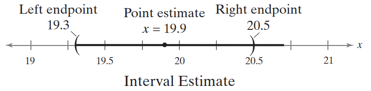

在确定区间估计的误差范围前，首先要定义区间估计包含总体均值 $\mu$ 的**置信水平**。

#### 置信水平

> **置信水平（level of confidence）**：区间估计包含总体参数的概率（假设估计过程重复很多次）。

根据中心极限定理，当样本量 $n\ge 30$，样本均值的抽样分布**近似正态分布**。因此，置信水平 $c$ 是标准正态曲线下临界值 $-z_c$ 和 $z_c$ 之间的面积。如下图所示：


剩下的面积是 $1-c$，因此单个尾巴的面积是：

$$
\frac{1}{2}(1-c)
$$

例如，如果置信水平 $c=90%$，则 5% 的面积位于左侧，对应 $-z_c=-1.645$；5% 的面积位于右侧，对应 $z_c=1.645$。如下表所示。

|置信水平|$z_c$|
|---|---|
|90% |1.645|
|95% |1.96|
|99% |2.575|

> [!TIP]
>
> 置信水平通常取 90%、95% 和 99%。上表是和置信水平对应的 z-score 值。

点估计与实际参数值的差异称为**抽样误差（sampling error）**。当估计 $\mu$ 时，抽样误差为 $\overline{x}-\mu$。大多情况下，$\mu$ 未知，且 $\overline{x}$ 随样本变化。但是，当确定置信水平和抽样分布时，可以计算**误差的最大值**。

#### 误差范围

给定置信水平 $c$，**误差范围（margin of error E）**，是点估计和它所估计参数值之间的最大可能距离。误差范围又称为**最大估计误**差（maximum error of estimate）或**误差限**（error tolerance）。

对已知 $\sigma$ 的总体均值 $\mu$，误差范围是：

$$
E=z_c\sigma_{\overline{x}}=z_c\frac{\sigma}{\sqrt{n}}
$$

需满足的前提条件：

1. 样本随机；
2. 总体为正态分布或 $n\ge 30$。（根据中心极限定理，当 $n\ge 30$，**样本均值的抽样分布**近似正态分布）。

**例 2：计算误差范围**

使用例 1 的数据，置信水平设为 95%，计算所有学生每周体育活动平均时间的误差范围。假设总体标准差为 2.3 小时。

**解：** 已知（$\sigma=2.3$），样本随机，且样本数 $n=40\ge 30$，所以可以使用上面的公式计算 $E$。

95% 置信水平对应的 z-score 为 1.96，这意味着标准正态曲线下 95% 的面积落在均值的 1.96 个标准差范围内。如下图所示：


> 这样可行是因为根据中心极限定理，当 $n\ge 30$，样本均值的分布接近正态曲线。

使用 $z_c=1.96$, $\sigma=2.3$ 和 $n=40$，得到：

$$
E=z_c\frac{\sigma}{\sqrt{n}}=1.96\cdot \frac{2.3}{\sqrt{40}}\approx 0.7
$$

**结论：** 在 95% 置信水平下，总体均值的误差范围是 0.7 小时。


### 总体均值的置信区间

使用点估计和误差范围，可以构造总体参数的区间估计。这个区间估计称为**置信区间（confidence interval）**。

**定义：** 总体均值 $\mu$ 的置信区间 $c$ 为：

$$
\overline{x}-E < \mu < \overline{x} + E
$$

假设估计过程重复很多次，置信区间包含 $\mu$ 的概率为 $c$。

#### 计算总体均值置信区间

计算总体均值置信区间的流程（$\sigma$ 已知）：

1. 确定 $\sigma$ 已知，样本随机，且总体为正态分布或 $n \ge 30$；
2. 获得样本统计量 $n$ 和 $\overline{x}$：$\overline{x}=\frac{\sum x}{n}$；
3. [查表](#标准正态分布)获得置信水平对应的临界值 $z_c$；
4. 计算误差范围 $E=z_c\frac{\sigma}{\sqrt{n}}$；
5. 计算左端点和右端点，得到置信区间：$\overline{x} -E < \mu < \overline{x} + E$

**例 3：** 使用例 1 的数据和例 2 的结果，计算所有学生每周体育活动时间的平均值的 95% 置信区间。

从例 1 和 例 2 可知，样本均值 $\overline{x}\approx 21.1$，误差范围 $E\approx 0.7$，置信区间为：

- 左端点

$$
\overline{x} - E \approx 21.1-0.7=20.4
$$

- 右端点

$$
\overline{x}+E\approx 21.1+0.7=21.8
$$

所以置信区间为：$20.4 < \mu < 21.8$。

**结论：** 有 95% 置信水平，所有学生每周花在体育活动上的平均时间在 20.4 到 21.8 小时之间。

#### 总体均值置信区间的代码实现

```java
public static DoubleRange getMeanConfidenceInterval(double[] values, double sigma,
        double confidenceLevel) {

    DescriptiveStatistics statistics = new DescriptiveStatistics(values);
    NormalDistribution distribution = new NormalDistribution();
    long sampleSize = statistics.getN();
    double mean = statistics.getMean();

    double criticalValue = distribution.inverseCumulativeProbability((confidenceLevel + 1) / 2);
    double marginError = criticalValue * sigma / FastMath.sqrt(sampleSize);
    return DoubleRange.of(mean - marginError, mean + marginError);
}
```

**例 4：** 使用例 1 的数据，构建学生每周体育活动平均时间的 99% 的置信区间。

```java
double[] data = new double[]{
        19, 18, 18, 15, 21, 21, 23, 20,
        21, 19, 16, 19, 22, 15, 19, 24,
        20, 24, 20, 17, 18, 17, 19, 20,
        20, 20, 22, 24, 22, 23, 23, 21,
        22, 20, 17, 21, 16, 18, 18, 25
};
DoubleRange confidenceInterval = ConfidenceInterval.getMeanConfidenceInterval(data, 2.4, 0.99);
System.out.println(confidenceInterval);
```

```
[18.94754150443763..20.90245849556237]
```

即总体均值 99% 的置信区间为 (18.9, 20.9)。

**结论：** 在 99% 置信水平下，学生每周花在体育活动上的平均时间在 18.9 到 20.9 之间。

使用上面数据构建不同执行水平下的置信区间：

```java
System.out.println(ConfidenceInterval.getMeanConfidenceInterval(data, 2.4, 0.75));
System.out.println(ConfidenceInterval.getMeanConfidenceInterval(data, 2.4, 0.85));
System.out.println(ConfidenceInterval.getMeanConfidenceInterval(data, 2.4, 0.90));
```

```
[19.48847310236581..20.361526897634192]
[19.37873621460104..20.47126378539896]
[19.300821934549333..20.54917806545067]
```

可以发现，使用相同的样本数据时，置信水平越大，置信区间越宽。

#### 总体正态分布的置信区间

对 $\sigma$ 已知的总体正态分布，对样本量没有限制。

**例 5：** 创建总体分布为正态分布的置信区间。

一所大学的招生办想估计以下目前入学的所有学生的平均年龄。随机抽样 20 名学生，平均年龄为 22.9。从过去的研究来看，标准差为 1.5 年，且**总体为正态分布**。构建总体平均年龄的 90% 置信区间。

因为 $\sigma$ 已知，样本随机，总体为正态分布，所以不要求样本数大于 30，计算置信区间：

```java
NormalDistribution distribution = new NormalDistribution();

double criticalValue = distribution.inverseCumulativeProbability((0.9 + 1) / 2);
double marginError = criticalValue * 1.5 / FastMath.sqrt(20);
double sampleMean = 22.9;
System.out.println(marginError);
System.out.println(sampleMean - marginError);
System.out.println(sampleMean + marginError);
```

```
0.5517006784350859
22.348299321564912
23.451700678435085
```

**结论：** 有 90% 的置信度学生的平均年龄在 22.3 到 23.5 岁之间。

构造置信区间后，正确解释结果也很重要。对例 5 构造的 90% 置信区间。因为总体均值 $\mu$ 在抽样前就固定了，说以它要么在区间内，要么不在区间内。表述为：“有 90% 的概率，实际均值在 (22.3, 23.5) 范围内”是错误的，因为该表述暗含 $\mu$ 是可变的，而实际上 $\mu$ 固定不变。

**解释置信区间的正确方法**是：有 90% 的置信度，平均值在 (22.3, 23.5) 区间内。

这意味着，当收集大量样本，并为每个样本创建置信区间，大约 90% 的区间会包含 $\mu$，如下图所示：


> 水平线段表示相同大小的不同样本的 90% 置信区间。从统计上看 10 个应该有 9 个包含总体均值。

该解释指示通过置信区间估计总体均值的成功率。


### 样本大小

对相同的样本统计量，随着置信水平的增加，置信区间变宽，总体均值估计的精度降低。

在不降低置信度的情况下提高估计精度的一种方法是**增加样本量**。但是，对于给定的误差范围，需要多大的样本量才能保证一定程度的置信度呢？可以使用误差范围公式计算：

$$
E=z_c\frac{\sigma}{\sqrt{n}}
$$

通过该公式可以推导出最小样本量 $n$。

给定置信水平 $c$ 和误差范围 $E$，估计总体均值 $\mu$ 需要的**最小样本量** $n$ 为：

$$
n=(\frac{z_c\sigma}{E})^2
$$

如果 $n$ 不是整数，将其舍入到下一个整数。另外，当 $\sigma$ 未知，可以用样本方差 $s$ 来估计它，前提是你有一个不小于 30 的随机样本。 

**例 6：计算最小样本大小**

例 1 想要估计所有学生每周体育活动上的平均时长。那么，在 95% 置信水平下，使抽样误差在 0.5 小时内，需要多少样本？

**解：** 置信水平 $c=0.95$，$z_c=1.96$，$\sigma=2.3$，$E=0.5$，最小样本大小：

$$
n=(\frac{z_c\sigma}{E})^2=(\frac{1.96\cdot 2.4}{0.5})^2\approx 88.51
$$

因为 n 不是整数，舍入为 89。因此，至少需要 82 名学生作为样本。

**结论：** 因为已有 40 个数据，所以样本还需要 42 名学生的数据。请注意，82 是最小样本量。

### 标准正态分布


|z|.09|.08|.07|.06|.05|.04|.03|.02|.01|.00|
|---|---|---|---|---|---|---|---|---|---|---|
|−3.4|.0002|.0003|.0003|.0003|.0003|.0003|.0003|.0003|.0003|.0003|
|−3.3|.0003|.0004|.0004|.0004|.0004|.0004|.0004|.0005|.0005|.0005|
|−3.2|.0005|.0005|.0005|.0006|.0006|.0006|.0006|.0006|.0007|.0007|
|−3.1|.0007|.0007|.0008|.0008|.0008|.0008|.0009|.0009|.0009|.0010|
|−3.0|.0010|.0010|.0011|.0011|.0011|.0012|.0012|.0013|.0013|.0013|
|−2.9|.0014|.0014|.0015|.0015|.0016|.0016|.0017|.0018|.0018|.0019|
|−2.8|.0019|.0020|.0021|.0021|.0022|.0023|.0023|.0024|.0025|.0026|
|−2.7|.0026|.0027|.0028|.0029|.0030|.0031|.0032|.0033|.0034|.0035|
|−2.6|.0036|.0037|.0038|.0039|.0040|.0041|.0043|.0044|.0045|.0047|
|−2.5|.0048|.0049|.0051|.0052|.0054|.0055|.0057|.0059|.0060|.0062|
|−2.4|.0064|.0066|.0068|.0069|.0071|.0073|.0075|.0078|.0080|.0082|
|−2.3|.0084|.0087|.0089|.0091|.0094|.0096|.0099|.0102|.0104|.0107|
|−2.2|.0110|.0113|.0116|.0119|.0122|.0125|.0129|.0132|.0136|.0139|
|−2.1|.0143|.0146|.0150|.0154|.0158|.0162|.0166|.0170|.0174|.0179|
|−2.0|.0183|.0188|.0192|.0197|.0202|.0207|.0212|.0217|.0222|.0228|
|−1.9|.0233|.0239|.0244|.0250|.0256|.0262|.0268|.0274|.0281|.0287|
|−1.8|.0294|.0301|.0307|.0314|.0322|.0329|.0336|.0344|.0351|.0359|
|−1.7|.0367|.0375|.0384|.0392|.0401|.0409|.0418|.0427|.0436|.0446|
|−1.6|.0455|.0465|.0475|.0485|.0495|.0505|.0516|.0526|.0537|.0548|
|−1.5|.0559|.0571|.0582|.0594|.0606|.0618|.0630|.0643|.0655|.0668|
|−1.4|.0681|.0694|.0708|.0721|.0735|.0749|.0764|.0778|.0793|.0808|
|−1.3|.0823|.0838|.0853|.0869|.0885|.0901|.0918|.0934|.0951|.0968|
|−1.2|.0985|.1003|.1020|.1038|.1056|.1075|.1093|.1112|.1131|.1151|
|−1.1|.1170|.1190|.1210|.1230|.1251|.1271|.1292|.1314|.1335|.1357|
|−1.0|.1379|.1401|.1423|.1446|.1469|.1492|.1515|.1539|.1562|.1587|
|−0.9|.1611|.1635|.1660|.1685|.1711|.1736|.1762|.1788|.1814|.1841|
|−0.8|.1867|.1894|.1922|.1949|.1977|.2005|.2033|.2061|.2090|.2119|
|−0.7|.2148|.2177|.2206|.2236|.2266|.2296|.2327|.2358|.2389|.2420|
|−0.6|.2451|.2483|.2514|.2546|.2578|.2611|.2643|.2676|.2709|.2743|
|−0.5|.2776|.2810|.2843|.2877|.2912|.2946|.2981|.3015|.3050|.3085|
|−0.4|.3121|.3156|.3192|.3228|.3264|.3300|.3336|.3372|.3409|.3446|
|−0.3|.3483|.3520|.3557|.3594|.3632|.3669|.3707|.3745|.3783|.3821|
|−0.2|.3859|.3897|.3936|.3974|.4013|.4052|.4090|.4129|.4168|.4207|
|−0.1|.4247|.4286|.4325|.4364|.4404|.4443|.4483|.4522|.4562|.4602|
|−0.0|.4641|.4681|.4721|.4761|.4801|.4840|.4880|.4920|.4960|.5000|

|z|.00 |.01|.02|.03|.04|.05|.06|.07|.08|.09|
|---|---|---|---|---|---|---|---|---|---|---|
|0.0|.5000|.5040|.5080|.5120|.5160|.5199|.5239|.5279|.5319|.5359|
|0.1|.5398|.5438|.5478|.5517|.5557|.5596|.5636|.5675|.5714|.5753|
|0.2|.5793|.5832|.5871|.5910|.5948|.5987|.6026|.6064|.6103|.6141|
|0.3|.6179|.6217|.6255|.6293|.6331|.6368|.6406|.6443|.6480|.6517|
|0.4|.6554|.6591|.6628|.6664|.6700|.6736|.6772|.6808|.6844|.6879|
|0.5|.6915|.6950|.6985|.7019|.7054|.7088|.7123|.7157|.7190|.7224|
|0.6|.7257|.7291|.7324|.7357|.7389|.7422|.7454|.7486|.7517|.7549|
|0.7|.7580|.7611|.7642|.7673|.7704|.7734|.7764|.7794|.7823|.7852|
|0.8|.7881|.7910|.7939|.7967|.7995|.8023|.8051|.8078|.8106|.8133|
|0.9|.8159|.8186|.8212|.8238|.8264|.8289|.8315|.8340|.8365|.8389|
|1.0|.8413|.8438|.8461|.8485|.8508|.8531|.8554|.8577|.8599|.8621|
|1.1|.8643|.8665|.8686|.8708|.8729|.8749|.8770|.8790|.8810|.8830|
|1.2|.8849|.8869|.8888|.8907|.8925|.8944|.8962|.8980|.8997|.9015|
|1.3|.9032|.9049|.9066|.9082|.9099|.9115|.9131|.9147|.9162|.9177|
|1.4|.9192|.9207|.9222|.9236|.9251|.9265|.9279|.9292|.9306|.9319|
|1.5|.9332|.9345|.9357|.9370|.9382|.9394|.9406|.9418|.9429|.9441|
|1.6|.9452|.9463|.9474|.9484|.9495|.9505|.9515|.9525|.9535|.9545|
|1.7|.9554|.9564|.9573|.9582|.9591|.9599|.9608|.9616|.9625|.9633|
|1.8|.9641|.9649|.9656|.9664|.9671|.9678|.9686|.9693|.9699|.9706|
|1.9|.9713|.9719|.9726|.9732|.9738|.9744|.9750|.9756|.9761|.9767|
|2.0|.9772|.9778|.9783|.9788|.9793|.9798|.9803|.9808|.9812|.9817|
|2.1|.9821|.9826|.9830|.9834|.9838|.9842|.9846|.9850|.9854|.9857|
|2.2|.9861|.9864|.9868|.9871|.9875|.9878|.9881|.9884|.9887|.9890|
|2.3|.9893|.9896|.9898|.9901|.9904|.9906|.9909|.9911|.9913|.9916|
|2.4|.9918|.9920|.9922|.9925|.9927|.9929|.9931|.9932|.9934|.9936|
|2.5|.9938|.9940|.9941|.9943|.9945|.9946|.9948|.9949|.9951|.9952|
|2.6|.9953|.9955|.9956|.9957|.9959|.9960|.9961|.9962|.9963|.9964|
|2.7|.9965|.9966|.9967|.9968|.9969|.9970|.9971|.9972|.9973|.9974|
|2.8|.9974|.9975|.9976|.9977|.9977|.9978|.9979|.9979|.9980|.9981|
|2.9|.9981|.9982|.9982|.9983|.9984|.9984|.9985|.9985|.9986|.9986|
|3.0|.9987|.9987|.9987|.9988|.9988|.9989|.9989|.9989|.9990|.9990|
|3.1|.9990|.9991|.9991|.9991|.9992|.9992|.9992|.9992|.9993|.9993|
|3.2|.9993|.9993|.9994|.9994|.9994|.9994|.9994|.9995|.9995|.9995|
|3.3|.9995|.9995|.9995|.9996|.9996|.9996|.9996|.9996|.9996|.9997|
|3.4|.9997|.9997|.9997|.9997|.9997|.9997|.9997|.9997|.9997|.9998|

**临界值**


|置信水平 c|$z_c$|
|---|---|
|0.80|1.28|
|0.90|1.645|
|0.95|1.96|
|0.99|2.575|

### Java 实现

- 均值

```java
double[] data = new double[]{
        19, 18, 18, 15, 21, 21, 23, 20,
        21, 19, 16, 19, 22, 15, 19, 24,
        20, 24, 20, 17, 18, 17, 19, 20,
        20, 20, 22, 24, 22, 23, 23, 21,
        22, 20, 17, 21, 16, 18, 18, 25
};
double mean = StatUtils.mean(data);
```

- 正态分布的临界值

```java
NormalDistribution distribution = new NormalDistribution();
double criticalValue = distribution.inverseCumulativeProbability(0.5);
assertEquals(criticalValue, 0.0);
```

- 通过置信水平计算临界值

```java
NormalDistribution distribution = new NormalDistribution();
return distribution.inverseCumulativeProbability((confidenceLevel + 1) / 2);
```

`confidenceLevel` 是中间区域的面积 (c)，我们要计算右侧的临界值（即正数），就需要得到去掉右侧的所有面积，右侧面积为 $(1-c)/2$，余下面积为 $1-(1-c)/2=(1+c)/2$。

- 计算误差范围

```java
double zc = getCriticalValue(confidenceLevel);
return zc * sigma / FastMath.sqrt(sampleSize);
```

- 计算置信区间

```java
public static DoubleRange getMeanConfidenceInterval(double[] values, double sigma,
        double confidenceLevel) {
    DescriptiveStatistics statistics = new DescriptiveStatistics(values);
    NormalDistribution distribution = new NormalDistribution();
    long sampleSize = statistics.getN();
    double mean = statistics.getMean();

    double criticalValue = distribution.inverseCumulativeProbability((confidenceLevel + 1) / 2);
    double marginError = criticalValue * sigma / FastMath.sqrt(sampleSize);
    return DoubleRange.of(mean - marginError, mean + marginError);
}
```

- 计算最小样本量

```java
public static int getMinSampleSize(double sigma, double confidenceLevel,
        double marginError) {
    NormalDistribution distribution = new NormalDistribution();
    double criticalValue = distribution.inverseCumulativeProbability((confidenceLevel + 1) / 2);
    double val = criticalValue * sigma / marginError;
    return (int) FastMath.ceil(val * val);
}
```
## 3. 均值置信区间（σ未知）

### t 分布

在许多实际情况总体标准差未知。在总体 $\sigma$ 未知时，如何构建总体均值的置信区间？

如果总体为正态分布，或者样本量不小于 30，可以用随机样本的标准差 $s$ 来估计总体标准差 $\sigma$。但是，此时 $\overline{x}$ 的抽样分布不服从正态分布，而是 t 分布。

如果随机变量 $x$ 近似正态分布，那么：

$$
t=\frac{\overline{x}-\mu}{s/\sqrt{n}}
$$

服从 **t 分布**。t 的临界值用 $t_c$ 表示。下面是 t 分布的几个性质。

1. t 分布的均值、中位数和众数为 0；
2. t 分布呈钟形，以均值对称；
3. t 分布曲线下的面积为 1；
4. t 分布的尾巴要比标准正态分布的尾巴粗一点；
5. t 分布的标准差随样本量的变化而变化，但大于 1；
6. t 分布包含一系列曲线，每条曲线由自由度决定。**自由度**（degree of freedom, d.f.）是计算样本统计量（如 $\overline{x}$）后剩下的选择。当使用 t 分布估计总体均值，自由度等于：

$$
\text{d.f.}=n-1
$$

7. 随着自由度增加，t 分布趋近于标准正态分布。如下图所示，当自由度大于 30，t 分布近似正态分布。

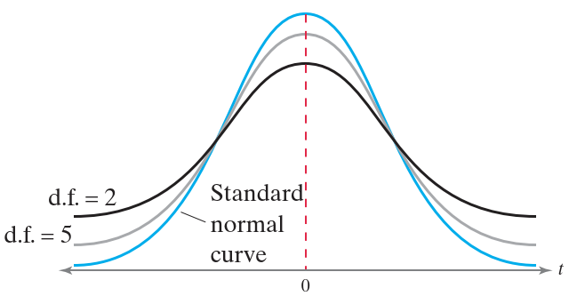

**例 1** 计算 t 的临界值

当样本量为 15，计算 95% 置信水平的临界值 $t_c$。

```java
public static double getCriticalValue(double confidenceLevel, int degreeOfFreedom) {
    TDistribution distribution = new TDistribution(degreeOfFreedom);
    return distribution.inverseCumulativeProbability((confidenceLevel + 1) / 2);
}

double criticalValue = ConfidenceInterval.getCriticalValue(0.95, 14);
assertEquals(criticalValue, 2.145, 1e-3);
```

图示：

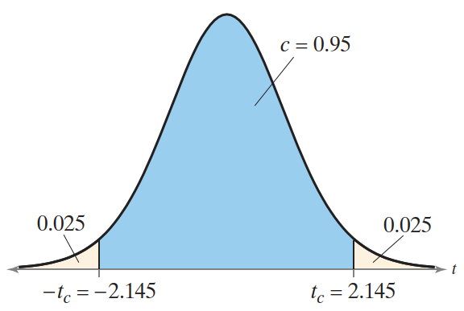

**结论：** 对自由度为 14 的 t 分布，95% 的面积位于 $t\pm 2.145$ 之间。

### 置信区间与 t 分布

在 σ 未知时使用 t 分布构造置信区间与 σ 已知时使用标准正态分布构造置信区间类似，都是使用点估计 $\overline{x}$ 和误差范围 $E$。

σ 未知，使用样本标准差 $s$ 和临界值 $t_c$ 估计误差范围。因为 E 的计算公式为：

$$
E=t_c\frac{s}{\sqrt{n}}
$$

**σ 未知时构建总体均值的置信区间流程**

1. 确定 σ 未知，样本随机，总体为正态分布或 $n\ge 30$
2. 计算样本统计量 $n$, $\overline{x}$, $s$

$$
\overline{x}=\frac{\sum x}{n}\qquad s=\sqrt{\frac{\sum(x-\overline{x})^2}{n-1}}
$$

3. 确定自由度，置信水平 $c$ 和临界值 $t_c$

$$
\text{d.f.=n-1}
$$

4. 计算误差范围 E

$$
E=t_c\frac{s}{\sqrt{n}}
$$

5. 计算左端点和右端点，形成置信区间

$$
\overline{x}-E<\mu < \overline{x}+E
$$

**例 2** 构造置信区间

随机选择 16 家咖啡店，测量每家咖啡店出售咖啡的温度。样本平均值为 162.0℉，样本标准差为 10.0℉。构造咖啡的总体平均温度的 95% 置信区间。假设温度大致呈正态分布。

**解：** σ 未知，样本随机，总体为正态分布；$n=16$, $\overline{x}=162.0℉$, $s=10.0℉$, $\text{d.f.}=n-1=15$, $c=95%$，计算临界值：

```java
double criticalValue1 = ConfidenceInterval.getCriticalValue(0.95, 15);
System.out.println(criticalValue1);
// 2.131449545559789
```

计算误差范围：

$$
E=t_c\frac{s}{\sqrt{n}}=2.131\cdot \frac{10}{\sqrt{16}}\approx 5.3
$$

因此置信区间为：

$$
162.0-5.3 < \mu < 162.0+5.3\\
156.7 < \mu < 167.3
$$

**总结：** 以 95% 的置信度，所售咖啡的总体平均温度在 156.7℉ 到 167.3℉ 之间。

**例 3** 构造置信区间

随机选择 36 辆在经销商销售的同款汽车，并确定每辆汽车在售出前在经销商处停放的天数。样本平均值为 9.75 天，标准差为 2.39 天。为该车型在经销商停放的天数的总体平均数构建 99% 的置信区间。

**解：** σ 未知，样本随机，样本大小 $n\ge 30$；$\overline{x}=9.75$, $s=2.39$；自由度 $\text{d.f.}=35$，计算临界值：

```java
System.out.println(ConfidenceInterval.getCriticalValue(0.99, 35));
// 2.7238055892080832
```

计算误差范围：

$$
E=t_c\frac{s}{\sqrt{n}}=2.724\cdot \frac{2.39}{\sqrt{36}}\approx 1.09
$$

因此置信区间为：

$$
9.75-1.09<\mu<9.75+1.09\\
8.66<\mu<10.84
$$
如下图所示：

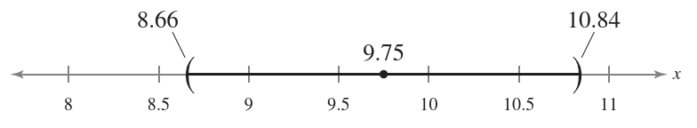

**结论：** 在 99% 置信度下，该车型在经销商停留的天数的总体平均数在 8.66 和 10.84 之间。

**何时用正态分布，何时用 t 分布？**

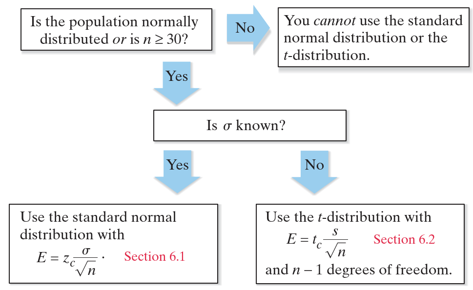

**例 4** 选择标准正态分布还是 t 分布

随机选择 25 栋新建房屋，平均建造成本为 181,000 美元，总体标准差为 28,000 美元。假设建设成本呈正态分布，应该用标准正态分布还是 t 分布构建总体平均成本的 95% 置信区间？

**解：** 总体为正态分布，已知 σ，因此用标准正态分布。

## 4. 总体比例的置信区间

### 总体比例的点估计

二项试验一次成功的概率为 $p$，这个概率就是**总体比例（population proportion）**。下面介绍如何使用置信区间估计总体比例 $p$。与均值的置信区间一样，从点估计开始。

**成功的总体比例 $p$ 的点估计 (point estimate for p)** ：样本中成功的比例，记为：

$$
\hat{p}=\frac{x}{}n
$$

$n$ 为样本大小，$x$ 为样本中成功的次数。

失败的总体比例的点估计为 $\hat{q}=1-\hat{p}$。

**例 1** 计算 p 的点估计

对 1550 名美国成年人的调查中发现，1054 名使用 Facebook。找出使用 Facebook 的美国成年人的比例的点估计。

**解：** 总体比例的点估计为样本中的比例。因此：

$$
\hat{p}=\frac{1054}{1550}=0.68=68%
$$

**结论：** 使用 Facebook 的美国成年人比例的点估计值为 68%。

### 总体比例的置信区间

构建总体比例的置信区间与构建总体均值的置信区间大同小异。也是从点估计开始，然后计算误差范围。

**总体比例 p 的c-置信区间为：**

$$
\hat{p}-E<p<\hat{p}+E
$$

其中：

$$
E=z_c\sqrt{\frac{\hat{p}\hat{q}}{n}}
$$

假设重复无数次估计过程，则置信区间包含 $p$ 的概率为 c。

在[正态分布](../distribution/normal.md#5-二项分布的正态近似)有介绍，当 $np\ge 5$, $nq\ge 5$ 可以用正态分布近似二项分布。同样，当 $n\hat{p}\ge 5$, $n\hat{q}\ge 5$，$\hat{p}$ 的抽样分布近似正态分布，其均值为：

$$
\mu_{\hat{p}}=p
$$

标准差为：

$$
\sigma_{\hat{p}}=\sqrt{\frac{pq}{n}}
$$

 即：$\sigma_{\hat{p}}=\frac{\sigma}{n}=\frac{\sqrt{npq}}{n}=\sqrt{\frac{pq}{n}}$。

 **构建总体比例置信区间的流程**

 1. 确定样本统计量 $n$ 和 $x$
 2. 计算点估计 $\hat{p}$

$$
\hat{p}=\frac{x}{n}
$$

3. 确定 $\hat{p}$ 的抽样分布是否能用正态分布近似

$$
n\hat{p} \ge 5,\quad n\hat{q}\ge 5
$$

4. 计算置信水平 c 对应的临界值 $z_c$
5. 计算误差范围

$$
E=z_c\sqrt{\frac{\hat{p}\hat{q}}{n}}
$$

6. 计算左端点和右端点，形成置信区间

第 4 步计算临界值的方法与已知 σ 总体均值临界值的计算方法相同。

**例 2** 构造 $p$ 的置信区间

使用例 1 的数据为使用 Facebook 的美国成年人的比例构造 95% 的置信区间。

**解：** 已知 $\hat{p}=0.68$，因此：

$$
\hat{q}-1-\hat{p}=1-0.68=0.32
$$

这里，$n=1550$：

$$
n\hat{p}=1550\cdot 0.68=1054 > 5\\
n\hat{q}=1550\cdot 0.32=496 > 5
$$

因此可以用正态分布近似 $\hat{p}$ 的抽样分布。

95% 置信区间对应的 $z_c=1.96$，因此误差范围是：

$$
E=z_c\sqrt{\frac{\hat{p}\hat{q}}{n}}=1.96\sqrt{\frac{0.68\cdot 0.32}{1550}}\approx 0.023
$$

由此得到置信区间：

$$
\hat{p}-E < p < \hat{p}+E\\
0.68-0.023 < p < 0.68+0.023\\
0.657 < p < 0.703
$$

图示：

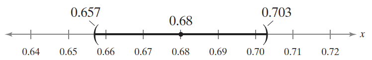

**结论：** 在 95% 置信水平下，使用 Facebook 的美国成年人比例在 65.7% 到 70.3% 之间。

95% 是民意调查的典型值，不过结果通常不采用置信区间的形式，而是采用：调查发现，68% 的美国成年人使用 Facebook，该调查的误差范围为 $\pm 2.3\%$。

**例 3**：构造 p 的置信区间

下图是对 800 名 18-29 岁美国成年人的调查。对通过电视获取新闻的 18-29 岁人口的比例构造 99% 的置信区间。

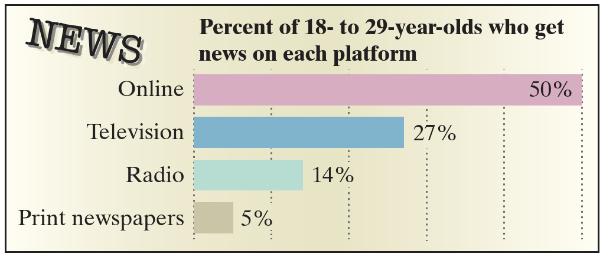

**解：** 从图可知，$\hat{p}=0.27$，因此，$\hat{q}=1-0.27=0.73$。$n=800$：

$$
n\hat{p}=800\cdot 0.27=216 > 5\\
n\hat{q}=800\cdot 0.73=584 > 5
$$

因此可以用正态分布近似 $\hat{p}$ 的抽样分布。99% 的置信区间对应 $z_c=2.575$，误差范围：

$$
E=z_c\sqrt{\frac{\hat{p}\hat{q}}{n}}=\approx 2.575\cdot \sqrt{\frac{0.27\cdot 0.73}{800}}=\approx 0.04
$$

计算置信区间：

$$
\hat{p}-E < p < \hat{p}+E\\
0.27-0.04 < p < 0.27+0.04\\
0.23 < p < 0.31
$$

图示：

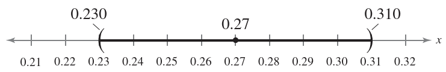

**结论：** 在 99% 的置信度下，18-29 岁通过电视获取新闻的人口比例在 23.0% 到 31.0% 之间。

### 计算最小样本量

在不降低置信水平的情况下提高置信区间的精度的一种方法是增加样本量。

**估计 p 的最小样本量**

给定执行水平 c 和误差范围 $E$，估计总体比例 $p$ 所需最小样本量 $n$ 为：

$$
n=\hat{p}\hat{q}(\frac{z_c}{E})^2
$$

如果 $n$ 不是整数，则向上取整。另外，该公式假设对 $\hat{p}$ 和 $\hat{q}$ 有初步估计，如果没有，使用 $\hat{p}=\hat{q}=0.5$。

**例 4**：确定最小样本量

加入你在参加竞选，希望以 95% 的置信度估计投票给你的选民比例。你要求误差不超过 3%。计算需要的最小样本量：

1. 没有 $\hat{p}$ 的初步估计值
2. 初步估计 $\hat{p}=0.31$

**解：** 
1. 由于没有 $\hat{p}$ 的预估值，所以用 $\hat{p}=\hat{q}=0.5$，95% 置信度对应 $z_c=1.96$, $E=0.03$，由此计算 $n$:

$$
n=\hat{p}\hat{q}(\frac{z_c}{E})^2=0.5\cdot 0.5 (\frac{1.96}{0.03})^2\approx 1067.11
$$

向上取整得到 1068.

2. 有 $\hat{p}$ 的预估值，$\hat{p}=0.31$, $\hat{q}=0.69$, 使用 $z_c=1.96$ 和 $E=0.03$，计算 $n$:

$$
n=\hat{p}\hat{q}(\frac{z_c}{E})^2=0.31\cdot 0.69(\frac{1.96}{0.03})^2\approx 913.02
$$

向上取整得到 914.

**结论：** 如果没有 $\hat{p}$ 的初步估计值，最少需要 1068 样本；如果初步估计 $\hat{p}=0.31$，则样本量至少为 914。因此，当没有初步估计值，需要更大的样本量。

## 5. 方差和标准差的置信区间

### 卡方分布

在汽车制造业中，必须严格控制生产零件的尺寸，重要的零件变化要小。如何测量并控制零件的变化量？可以从点估计开始。

> [!IMPORTANT]
>
> $\sigma^2$ 的点估计值为 $s^2$，$\sigma$ 的点估计值为 $s$。$\sigma^2$ 的最无偏估计为 $s^2$。

可以使用 **卡方分布（chi-square distribution）** 来构建方差和标准差的置信区间。

如果随机变量 $x$ 服从正态分布，那么对任意 $n>1$:

$$
\chi^2=\frac{(n-1)s^2}{\sigma^2}
$$

服从卡方分布。

卡方分布的性质：

1. $\chi^2$ 的所有值大于或等于 0
2. 卡方分布是一类曲线，每条曲线自由度确定。使用自由度 $n-1$ 的卡方分布构建 $\sigma^2$ 的置信区间

$$
\text{d.f.}=n-1
$$

3. 卡峰分布曲线下的总面积为 1
4. 卡方分布呈右偏（右边尾巴），即分布不对称
5. 不同自由度对应不同卡方分布。随着自由度增加，卡方分布趋近正态分布，如下图

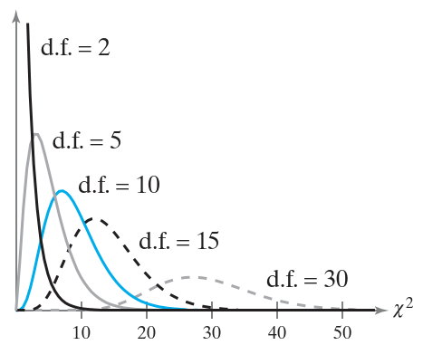

卡方分布每个置信水平有两个置信水平。$\chi^2_R$ 表示右尾临界值，$\chi^2_L$ 表示左尾临界值。见下表：

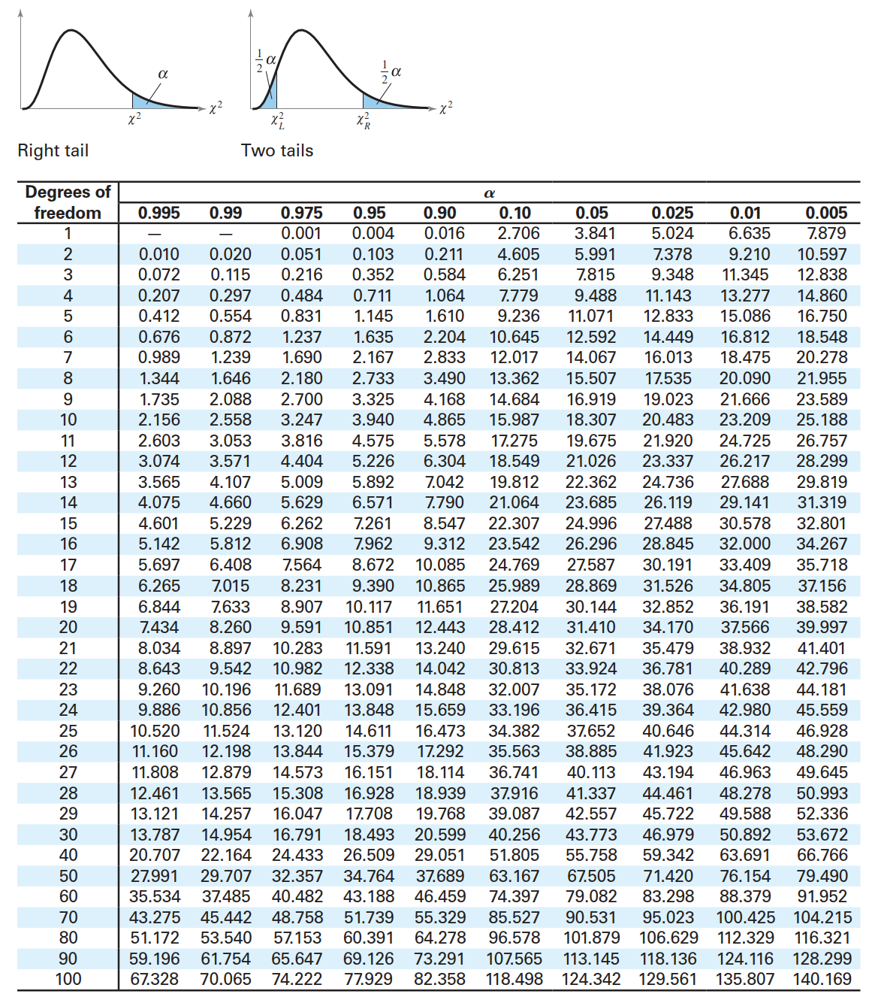

**例 1：** 计算 $\chi^2$ 的临界值

当样本量为 18，计算 95% 置信区间的临界值 $\chi^2_R$ 和 $\chi^2_L$。

**解：** 自由度：

$$
\text{d.f.}=n-1=17
$$

$\chi^2_R$ 右侧面积：

$$
\text{Area}_R=\frac{1-c}{2}=\frac{1-0.95}{2}=0.025
$$

$\chi^2_L$ 右侧面积：

$$
\text{Area}_L=\frac{1+c}{2}=\frac{1+0.95}{2}=0.975
$$

查表得：$\chi^2_L=7.564$, $\chi^2_R=30.191$。

**结论：** 对自由度为 17 的卡方分布曲线，曲面下面积的 95% 位于 7.564 和 30.191 之间。如下图所示：

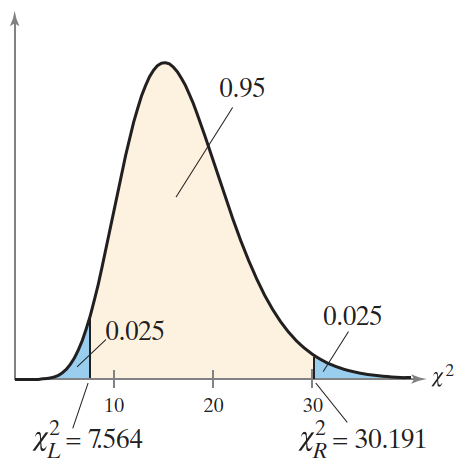

### 方差和标准差的置信区间

可以使用临界值 $\chi^2_R$ 和 $\chi^2_L$ 构建总体方差和标准差的置信区间。

方差的最佳点估计为 $s^2$，标准差的最佳点估计是 $s$。由于卡方分布不对称，因此 $\sigma^2$ 的置信区间不能写成 $s^2\pm E$ 的形式。必须单独计算两个端点。

总体方差 $\sigma^2$ 的置信区间：

$$
\frac{(n-1)s^2}{\chi^2_R}<\sigma^2<\frac{(n-1)s^2}{\chi^2_L}
$$

总体标准差 $\sigma$ 的置信区间：

$$
\sqrt{\frac{(n-1)s^2}{\chi^2_R}}<\sigma<\sqrt{\frac{(n-1)s^2}{\chi^2_L}}
$$

重复无数次估计过程，则置信区间包含 $\sigma^2$ 或 $\sigma$ 的概率为 c。

**构建方差或标准差的置信区间的流程**

1. 确定总体为正态分布
2. 确定样本统计量 $n$ 和自由度，$\text{d.f.}=n-1$
3. 计算点估计值 $s^2$

$$
s^2=\frac{\sum(x-\overline{x})^2}{n-1}
$$

4. 根据置信水平 $c$ 和自由度，查表临界值 $\chi^2_R$ 和 $\chi^2_L$
5. 计算左端点和右端点，构造总体方差的置信区间

$$
\frac{(n-1)s^2}{\chi^2_R}<\sigma^2<\frac{(n-1)s^2}{\chi^2_L}
$$

6. 取端点的平方根，计算总体标准擦汗的置信区间

$$
\sqrt{\frac{(n-1)s^2}{\chi^2_R}}<\sigma<\sqrt{\frac{(n-1)s^2}{\chi^2_L}}
$$

**例 2：** 构造置信区间

随机选择并称重 30 个过敏药物样本，样本标准差为 1.20 毫克。假设药物种类呈正态分布，为总体方差和标准差构建 99% 置信区间。

**解：** 总体呈正态分布，自由度 $\text{d.f.}=n-1=29$, $s^2=1.20$，$\chi^2_R$ 右侧面积为 0.005，$\chi^2_L$ 右侧面积为 0.995，查表得：

$$
\chi^2_R=52.336 \qquad \chi^2_L=13.121
$$
 
计算左端点：

$$
\frac{(n-1)s^2}{\chi^2_R}=\frac{29\cdot 1.20^2}{52.336}\approx 0.80
$$

计算右端点：

$$
\frac{(n-1)s^2}{\chi^2_L}=\frac{29\cdot 1.20^2}{13.121}\approx 3.18
$$

得到 $\sigma^2$ 的置信水平：

$$
0.80 <\sigma^2<3.18
$$

$\sigma$ 的置信区间：

$$
\sqrt{0.8} < \sigma<\sqrt{3.18}\\
0.89 < \sigma< 1.78\\
$$

**结论：** 在 99% 的置信水平下，总体方差介于 0.80 和 3.18 之间，总体标准差介于 0.89 和 1.78 之间。

