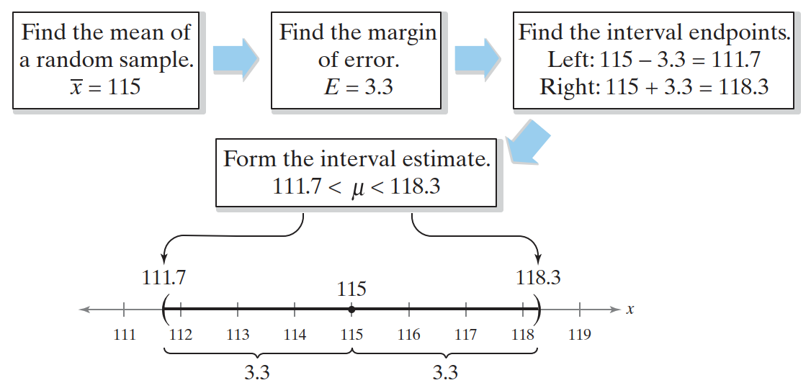
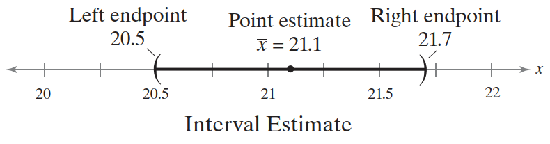
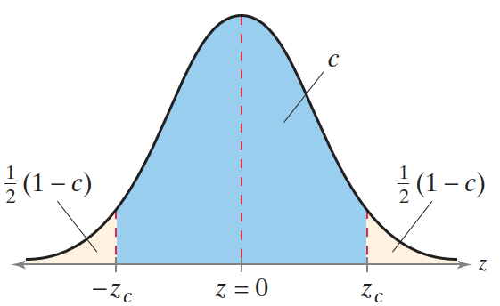
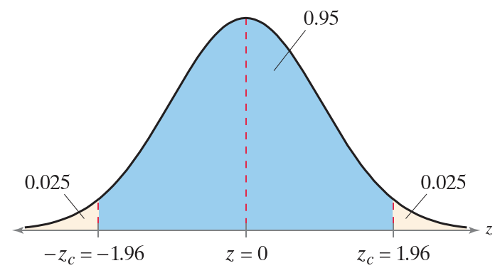
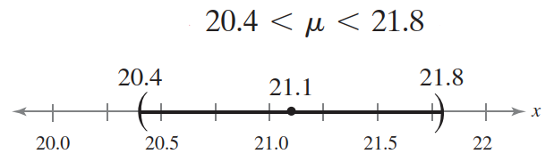
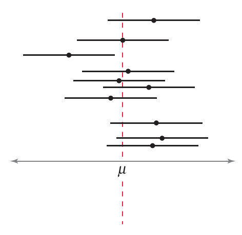
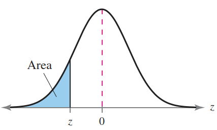
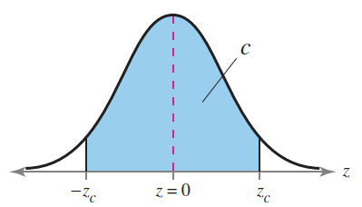

# 均值置信区间（σ 已知）


## 简介

置信区间（confidence interval），是统计学的第二个主要分支，统计推断的基础。例如，假设一个国际象棋俱乐部想要估计其成员的平均智商，随机样本均值为 115，因为这个估计的每个点包含单个数字，所以被称为**点估计**（point estimate）。

使用点估计的主要问题在于，它极少恰好等于总体的确切参数，如均值、标准差。因此要采用区间值，其判断总体参数落在指定区间的可能性。例如，假设俱乐部希望获得平均智商有 90% 的可信度，下图是构造置信区间的大致方法：



即有 90% 的把握认为其成员的平均智商在 111.7 到 118.3 之间。

## 估计总体参数

统计推断：使用**样本**统计量来估计**未知总体参数值**。下面介绍如何使用样本统计量估计总体参数 $\mu$，其中总体标准差 $\sigma$ 已知。

!!! note
    **点估计**（point estimate）：估计总体参数的单个值。总体均值 $\mu$ 的无偏估计是样本均值 $\overline{x}$。

当样本统计量不高估、也不低估总体参数，那么它就是总体参数的**无偏估计**。例如，我们知道大小相同的所有可能样本均值的均值，等于总体均值，因此 $\overline{x}$ 是 $\mu$ 的无偏估计（unbiased estimator）。当增加 $n$，样本均值标准差 $\sigma/\sqrt{n}$ 随之降低，其变异性减低。

**例 1：** 计算点估计值

随机抽取 40 名学生运行员作为样本，记录他们一周的体育活动时间。求总体均值 $\mu$ 的点估计值，即学校所有学生运行员每周体育活动时间的平均小时数。样本数据如下：

```
19 25 15 21 22 20 20 22
22 21 21 23 22 16 21 18
25 23 23 21 22 24 18 19
23 20 19 19 24 25 17 21
21 25 23 18 22 20 21 21
```

**解：**

样本均值：

$$
\overline{x} = \frac{\sum x}{n}=\frac{842}{40}\approx 21.1
$$

因此，所有学生运行员每周在体育活动上花费的平均小时数的点估计值约为 21.1 小时。

需要说明的是，总体均值恰好为 21.1 的概率几乎为零。所以，使用无法使用点估计来估计 $\mu$ 恰好为 21.1 的概率，但是可以估计 $\mu$ 在某个区间的概率，这就是**区间估计**（interval estimate）。

!!! DEFINITION
    **区间估计：** 估计总体参数的区间或范围值。

虽然我们可以假设例 1 中的点估计值与实际的总体均值不等，但它很可能十分接近总体均值，因此可以将点估计作为区间估计的中心，然后添加**误差范围**。例如，如果误差设为 0.6，则区间估计值为：

$$
21.1 \pm 0.6 \qquad \text{or} \qquad 20.5<\mu < 21.7
$$

点估计和区间估计的关系如下图所示：



在确定区间估计值的误差范围前，首先要确定区间估计值包含总体均值 $\mu$ 的**置信水平**。

!!! note
    **置信水平（level of confidence）**：区间估计包含总体参数的概率（假设估计过程重复很多次）。

根据中心极限定理，当 $n\ge 30$，样本均值的抽样分布**近似正态分布**。置信水平 $c$ 是标准正态曲线下临界值 $-z_c$ 和 $z_c$ 之间的面积。如下图所示：



剩下的面积是 $1-c$，因此单个尾巴的面积是：

$$
\frac{1}{2}(1-c)
$$

例如，如果置信水平 $c=90%$，则 5% 的面积位于左侧，对应 $-z_c=-1.645$，5% 的面积位于右侧，对应 $z_c=1.645$。如下表所示。

**tip**: 置信水平通常取 90%、95% 和 99%。下表是和置信水平对应的 z-score 值。

|置信水平|$z_c$|
|---|---|
|90% |1.645|
|95% |1.96|
|99% |2.575|

点估计值与实际参数值的差异称为**抽样误差（sampling error）**。当估计 $\mu$ 时，抽样误差为 $\overline{x}-\mu$。大多情况下，$\mu$ 未知，$\overline{x}$ 随样本变化。但是，当知道置信水平和抽样分布时，可以计算误差的最大值。

**定义：** 给定置信水平 $c$，**误差范围（margin of error E）**，又称为最大估计误差（maximum error of estimate）或误差限（error tolerance），是点估计和它所估计参数值之间的最大可能距离。对已知 $\sigma$ 的总体均值 $\mu$，误差范围是：

$$
E=z_c\sigma_{\overline{x}}=z_c\frac{\sigma}{\sqrt{n}}
$$

前提条件：

1. 样本随机；
2. 至少满足以下一个条件：总体为正态分布或 $n\ge 30$。（根据中心极限定理，当 $n\ge 30$，**样本均值的抽样分布**近似正态分布）。

**例 2：** 计算误差范围

使用例 1 的数据，置信水平设为 95%，计算所有学生运行员每周体育活动平均小时数的误差范围。假设总体标准差为 2.3  小时。

**解：** 已知（$\sigma=2.3$），样本随机，且样本数 $n=40\ge 30$，可以使用上面的公式计算 $E$。95% 置信水平对应的 z-score 为 1.96，这意味着标准正态曲线下 95% 的面积落在均值在 1.96 个标准差范围内。如下图所示：



> 这样可行是因为根据中心极限定理，当 $n\ge 30$，样本均值的分布接近正态曲线。

使用 $z_c=1.96$, $\sigma=2.3$ 和 $n=40$，得到：

$$
E=z_c\frac{\sigma}{\sqrt{n}}=1.96\cdot \frac{2.3}{\sqrt{40}}\approx 0.7
$$

**解释：** 我们有 95% 信心总体均值的误差范围是 0.7 小时。

## 总体均值的置信区间

使用点估计和误差范围，可以构造总体参数的区间估计，如 $\mu$。这个区间估计称为**置信区间（confidence interval）**。

**定义：** 总体均值 $\mu$ 的置信区间 $c$ 为：

$$
\overline{x}-E < \mu < \overline{x} + E
$$

假设估计过程重复很逗次，置信区间包含 $\mu$ 的概率为 $c$。

### 计算总体均值置信区间的步骤

计算总体均值置信区间的流程（$\sigma$ 已知）：

1. 确定 $\sigma$ 已知，样本是随机的，总体为正态分布或 $n \ge 30$；
2. 获得样本统计量 $n$ 和 $\overline{x}$：$\overline{x}=\frac{\sum x}{n}$；
3. [查表](#标准正态分布)获得置信水平对应的临界值 $z_c$；
4. 计算误差范围 $E=z_c\frac{\sigma}{\sqrt{n}}$；
5. 计算左端点和右端点，得到置信区间：$\overline{x} -E < \mu < \overline{x} + E$

**例 3：** 通过例 1 和例 2，得到了样本均值 $\overline{x}\approx 21.1$ 和误差范围 $E\approx 0.7$，置信区间为：

- 左端点

$$
\overline{x} - E \approx 21.1-0.7=20.4
$$

- 右端点

$$
\overline{x}+E\approx 21.1+0.7=21.8
$$

所以置信区间为：



**结论：** 有 95% 的把握所有学生运动员花在体育活动上的时间的平均在 20.4 到 21.8 小时之间。

使用说明：

- 使用相同样本数据，置信水平越大，置信区间也越大。
- 当总体为正态分布，且 $\sigma$ 已知，就不要求样本量，即使 $n < 30$。

### 计算总体均值置信区间的代码实现

```java
public static DoubleRange meanConfidenceInterval(double[] values, double sigma,
        double confidenceLevel) {

    DescriptiveStatistics statistics = new DescriptiveStatistics(values);
    NormalDistribution distribution = new NormalDistribution();
    long sampleSize = statistics.getN();
    double mean = statistics.getMean();

    double criticalValue = distribution.inverseCumulativeProbability((confidenceLevel + 1) / 2);
    double marginError = criticalValue * sigma / FastMath.sqrt(sampleSize);
    return DoubleRange.of(mean - marginError, mean + marginError);
}
```

### 示例：总体正态分布

一所大学的招生办想估计目前入学的所有学生的平均年龄。随机抽样 20 名学生，平均年龄为 22.9。从过去的研究来看，标准差为 1.5 年，总体为正态分布。构建人口平均年龄的 90% 置信区间。

因为总体为正态分布，所以不要求样本数大于 30，计算置信区间：

```java
NormalDistribution distribution = new NormalDistribution();

double criticalValue = distribution.inverseCumulativeProbability((0.9 + 1) / 2);
double marginError = criticalValue * 1.5 / FastMath.sqrt(20);
double sampleMean = 22.9;
System.out.println(marginError);
System.out.println(sampleMean - marginError);
System.out.println(sampleMean + marginError);
```

```
0.5517006784350859
22.348299321564912
23.451700678435085
```

**结论：** 有 90% 的置信度学生的平均年龄在 22.3 到 23.5 岁之间。

在构造置信区间后，正确解释结果很重要。对上例构造的 90% 置信区间。因为总体均值 $\mu$ 在抽样前就固定了，要么在区间内，要么不在区间内。表述为：有 90% 的概率，实际均值在 (22.3, 23.5) 范围内是错误的，因为该表述暗含 $\mu$ 是可变的，而实际上 $\mu$ 是固定不变的。

**解释置信区间的正确方法**是：有 90% 的置信度，平均值在 (22.3, 23.5) 区间内。这意味着，当收集大量样本，并为每个样本创建置信区间，大约 90% 的区间会包含 $\mu$，如下图所示：



> 水平线段表示相同大小的不同样本的 90% 置信区间。从统计上看 10 个应该有 9 个包含总体均值。

该解释指示通过置信区间估计总体均值的成功率。

## 样本大小

对相同的样本统计量，随着置信水平的增加，置信区间随之变宽，总体均值估计的精度降低。

在不降低置信度的情况下提高估计精度的一种方法是增加样本量。但是，对于给定的误差范围，需要多大的样本量才能保证一定程度哦置信度呢？使用误差范围公式是：

$$
E=z_c\frac{\sigma}{\sqrt{n}}
$$

通过该公式可以推导出最小样本量 $n$。

给定置信水平 $c$ 和误差范围 $E$，估计总体均值 $\mu$ 需要的**最小样本量** $n$ 为：

$$
n=(\frac{z_c\sigma}{E})^2
$$

如果 $n$ 不是整数，将其舍入到下一个整数。另外，当 $\sigma$ 未知，可以用样本方差 $s$ 来估计它，前提是你有一个不小于 30 的随机样本。 

**例 6：** 计算最小样本大小

例 1 想要估计所有学生每周花在体育活动上的平均时长。在 95% 置信度下使抽样误差在 0.5 小时内，需要多少样本？

置信水平 $c=0.95$，$z_c=1.96$，$\sigma=2.3$，$E=0.5$，最小样本大小：

$$
n=(\frac{z_c\sigma}{E})^2=(\frac{1.96\cdot 2.3}{0.5})^2\approx 81.29
$$

因为 n 不是整数，舍入为 82。因此，至少需要 82 名学作为样本。

**结论：** 因为已有 40 个数据，所以样本还需要 42 名学生的数据。请注意，82 是最小样本量。


## 标准正态分布



|z|.09|.08|.07|.06|.05|.04|.03|.02|.01|.00|
|---|---|---|---|---|---|---|---|---|---|---|
|−3.4|.0002|.0003|.0003|.0003|.0003|.0003|.0003|.0003|.0003|.0003|
|−3.3|.0003|.0004|.0004|.0004|.0004|.0004|.0004|.0005|.0005|.0005|
|−3.2|.0005|.0005|.0005|.0006|.0006|.0006|.0006|.0006|.0007|.0007|
|−3.1|.0007|.0007|.0008|.0008|.0008|.0008|.0009|.0009|.0009|.0010|
|−3.0|.0010|.0010|.0011|.0011|.0011|.0012|.0012|.0013|.0013|.0013|
|−2.9|.0014|.0014|.0015|.0015|.0016|.0016|.0017|.0018|.0018|.0019|
|−2.8|.0019|.0020|.0021|.0021|.0022|.0023|.0023|.0024|.0025|.0026|
|−2.7|.0026|.0027|.0028|.0029|.0030|.0031|.0032|.0033|.0034|.0035|
|−2.6|.0036|.0037|.0038|.0039|.0040|.0041|.0043|.0044|.0045|.0047|
|−2.5|.0048|.0049|.0051|.0052|.0054|.0055|.0057|.0059|.0060|.0062|
|−2.4|.0064|.0066|.0068|.0069|.0071|.0073|.0075|.0078|.0080|.0082|
|−2.3|.0084|.0087|.0089|.0091|.0094|.0096|.0099|.0102|.0104|.0107|
|−2.2|.0110|.0113|.0116|.0119|.0122|.0125|.0129|.0132|.0136|.0139|
|−2.1|.0143|.0146|.0150|.0154|.0158|.0162|.0166|.0170|.0174|.0179|
|−2.0|.0183|.0188|.0192|.0197|.0202|.0207|.0212|.0217|.0222|.0228|
|−1.9|.0233|.0239|.0244|.0250|.0256|.0262|.0268|.0274|.0281|.0287|
|−1.8|.0294|.0301|.0307|.0314|.0322|.0329|.0336|.0344|.0351|.0359|
|−1.7|.0367|.0375|.0384|.0392|.0401|.0409|.0418|.0427|.0436|.0446|
|−1.6|.0455|.0465|.0475|.0485|.0495|.0505|.0516|.0526|.0537|.0548|
|−1.5|.0559|.0571|.0582|.0594|.0606|.0618|.0630|.0643|.0655|.0668|
|−1.4|.0681|.0694|.0708|.0721|.0735|.0749|.0764|.0778|.0793|.0808|
|−1.3|.0823|.0838|.0853|.0869|.0885|.0901|.0918|.0934|.0951|.0968|
|−1.2|.0985|.1003|.1020|.1038|.1056|.1075|.1093|.1112|.1131|.1151|
|−1.1|.1170|.1190|.1210|.1230|.1251|.1271|.1292|.1314|.1335|.1357|
|−1.0|.1379|.1401|.1423|.1446|.1469|.1492|.1515|.1539|.1562|.1587|
|−0.9|.1611|.1635|.1660|.1685|.1711|.1736|.1762|.1788|.1814|.1841|
|−0.8|.1867|.1894|.1922|.1949|.1977|.2005|.2033|.2061|.2090|.2119|
|−0.7|.2148|.2177|.2206|.2236|.2266|.2296|.2327|.2358|.2389|.2420|
|−0.6|.2451|.2483|.2514|.2546|.2578|.2611|.2643|.2676|.2709|.2743|
|−0.5|.2776|.2810|.2843|.2877|.2912|.2946|.2981|.3015|.3050|.3085|
|−0.4|.3121|.3156|.3192|.3228|.3264|.3300|.3336|.3372|.3409|.3446|
|−0.3|.3483|.3520|.3557|.3594|.3632|.3669|.3707|.3745|.3783|.3821|
|−0.2|.3859|.3897|.3936|.3974|.4013|.4052|.4090|.4129|.4168|.4207|
|−0.1|.4247|.4286|.4325|.4364|.4404|.4443|.4483|.4522|.4562|.4602|
|−0.0|.4641|.4681|.4721|.4761|.4801|.4840|.4880|.4920|.4960|.5000|

|z|.00 |.01|.02|.03|.04|.05|.06|.07|.08|.09|
|---|---|---|---|---|---|---|---|---|---|---|
|0.0|.5000|.5040|.5080|.5120|.5160|.5199|.5239|.5279|.5319|.5359|
|0.1|.5398|.5438|.5478|.5517|.5557|.5596|.5636|.5675|.5714|.5753|
|0.2|.5793|.5832|.5871|.5910|.5948|.5987|.6026|.6064|.6103|.6141|
|0.3|.6179|.6217|.6255|.6293|.6331|.6368|.6406|.6443|.6480|.6517|
|0.4|.6554|.6591|.6628|.6664|.6700|.6736|.6772|.6808|.6844|.6879|
|0.5|.6915|.6950|.6985|.7019|.7054|.7088|.7123|.7157|.7190|.7224|
|0.6|.7257|.7291|.7324|.7357|.7389|.7422|.7454|.7486|.7517|.7549|
|0.7|.7580|.7611|.7642|.7673|.7704|.7734|.7764|.7794|.7823|.7852|
|0.8|.7881|.7910|.7939|.7967|.7995|.8023|.8051|.8078|.8106|.8133|
|0.9|.8159|.8186|.8212|.8238|.8264|.8289|.8315|.8340|.8365|.8389|
|1.0|.8413|.8438|.8461|.8485|.8508|.8531|.8554|.8577|.8599|.8621|
|1.1|.8643|.8665|.8686|.8708|.8729|.8749|.8770|.8790|.8810|.8830|
|1.2|.8849|.8869|.8888|.8907|.8925|.8944|.8962|.8980|.8997|.9015|
|1.3|.9032|.9049|.9066|.9082|.9099|.9115|.9131|.9147|.9162|.9177|
|1.4|.9192|.9207|.9222|.9236|.9251|.9265|.9279|.9292|.9306|.9319|
|1.5|.9332|.9345|.9357|.9370|.9382|.9394|.9406|.9418|.9429|.9441|
|1.6|.9452|.9463|.9474|.9484|.9495|.9505|.9515|.9525|.9535|.9545|
|1.7|.9554|.9564|.9573|.9582|.9591|.9599|.9608|.9616|.9625|.9633|
|1.8|.9641|.9649|.9656|.9664|.9671|.9678|.9686|.9693|.9699|.9706|
|1.9|.9713|.9719|.9726|.9732|.9738|.9744|.9750|.9756|.9761|.9767|
|2.0|.9772|.9778|.9783|.9788|.9793|.9798|.9803|.9808|.9812|.9817|
|2.1|.9821|.9826|.9830|.9834|.9838|.9842|.9846|.9850|.9854|.9857|
|2.2|.9861|.9864|.9868|.9871|.9875|.9878|.9881|.9884|.9887|.9890|
|2.3|.9893|.9896|.9898|.9901|.9904|.9906|.9909|.9911|.9913|.9916|
|2.4|.9918|.9920|.9922|.9925|.9927|.9929|.9931|.9932|.9934|.9936|
|2.5|.9938|.9940|.9941|.9943|.9945|.9946|.9948|.9949|.9951|.9952|
|2.6|.9953|.9955|.9956|.9957|.9959|.9960|.9961|.9962|.9963|.9964|
|2.7|.9965|.9966|.9967|.9968|.9969|.9970|.9971|.9972|.9973|.9974|
|2.8|.9974|.9975|.9976|.9977|.9977|.9978|.9979|.9979|.9980|.9981|
|2.9|.9981|.9982|.9982|.9983|.9984|.9984|.9985|.9985|.9986|.9986|
|3.0|.9987|.9987|.9987|.9988|.9988|.9989|.9989|.9989|.9990|.9990|
|3.1|.9990|.9991|.9991|.9991|.9992|.9992|.9992|.9992|.9993|.9993|
|3.2|.9993|.9993|.9994|.9994|.9994|.9994|.9994|.9995|.9995|.9995|
|3.3|.9995|.9995|.9995|.9996|.9996|.9996|.9996|.9996|.9996|.9997|
|3.4|.9997|.9997|.9997|.9997|.9997|.9997|.9997|.9997|.9997|.9998|

**临界值**



|置信水平 c|$z_c$|
|---|---|
|0.80|1.28|
|0.90|1.645|
|0.95|1.96|
|0.99|2.575|

除了查表，在 hipparchus 中可以直接计算临界值：

```java

```

