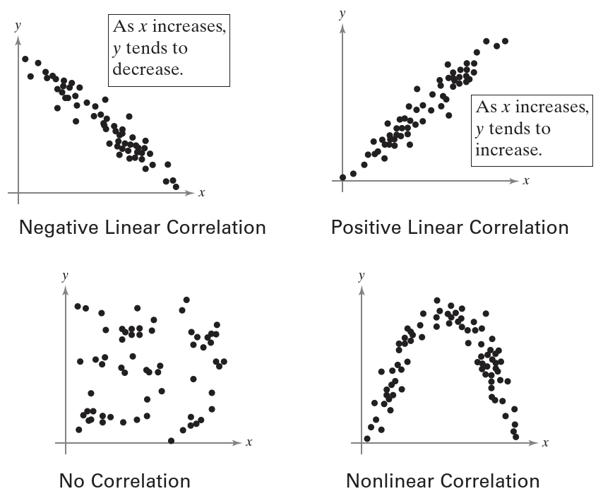
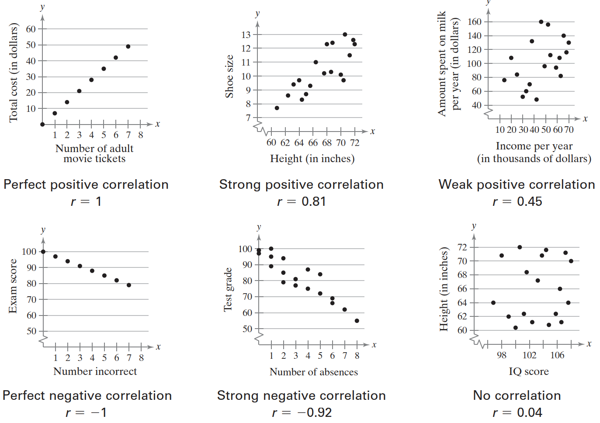
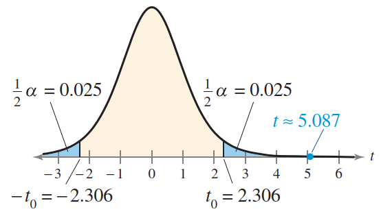
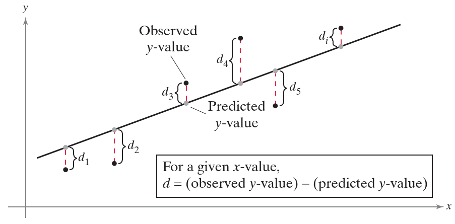
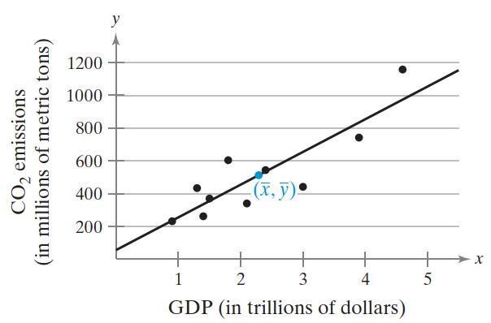
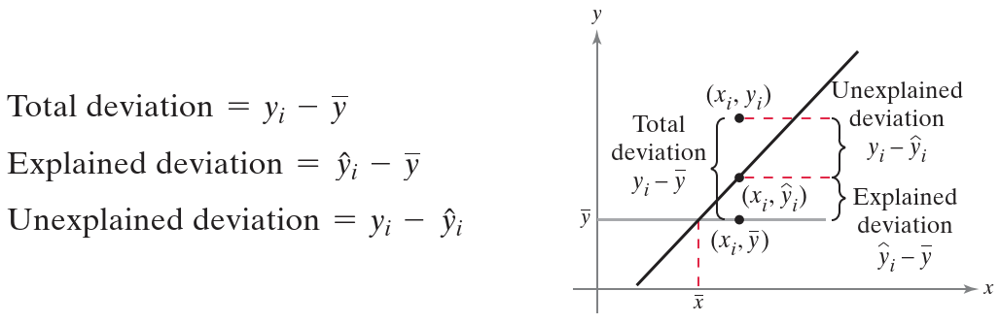
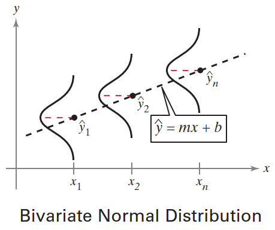

# 相关性和回归

- [相关性和回归](#相关性和回归)
  - [1. 相关性](#1-相关性)
    - [相关性概述](#相关性概述)
    - [相关系数](#相关系数)
    - [使用表格检验总体相关系数](#使用表格检验总体相关系数)
    - [总体相关系数的假设检验](#总体相关系数的假设检验)
    - [相关性和因果关系](#相关性和因果关系)
  - [2. 线性回归](#2-线性回归)
    - [回归线](#回归线)
    - [回归线的应用](#回归线的应用)
  - [3. 回归和预测区间](#3-回归和预测区间)
    - [回归线的变化](#回归线的变化)
    - [判定系数](#判定系数)
    - [估计标准差](#估计标准差)
    - [预测区间](#预测区间)
  - [4. 多元回归](#4-多元回归)
    - [多元回归方程](#多元回归方程)

2024-12-09 ⭐
@author Jiawei Mao
***

## 1. 相关性

### 相关性概述

下面将介绍两个连续变量之间的相关性，以及如何确定相关性是否显著。

**相关性**（correlation）指两个变量之间的关系。数据可以用有序对 $(x,y)$ 的形式表示，其中 x 称为**自变量**（independent 或 explanatory），y 称为**因变量**（dependent 或 response）。

将有序对 $(x,y)$ 绘制到笛卡尔坐标，得到**散点图**。自变量 x 对应横轴，因变量 y 对应纵轴。可以使用散点图确定两个变量之间是否存在**线性相关性**。下面的散点图显示了几种相关性类型：



### 相关系数

使用散点图解释相关性过于主观。**相关系数**（correlation coefficient）是精确衡量两个变量之间线性相关性的类型和强度的方法。

以符号 $r$ 表示样本相关系数，定义为：
$$
r=\frac{n\sum xy-(\sum x)(\sum y)}{\sqrt{n\sum x^2-(\sum x)^2}\sqrt{n\sum y^2-(\sum y)^2}}
$$

其中 $n$ 为数据点个数。**总体相关系数**（population correlation coefficient）用希腊字符 $\rho$ 表示。

相关系数的范围是 [-1,1]：

- 当 x 和 y 具有强正线性相关性，$r$ 趋近于 1；
- 当 x 和 y 具有强负线性相关性，$r$ 趋近于 -1；
- 当 x 和 y 完全正线性相关或负线性相关，$r$ 为 1 或 -1；
- 当 x 和 y 没有线性相关性，$r$ 趋近于 0.

> [!WARNING]
>
> 当 $r$ 接近 0，不代表 x 和 y 没有关系，只是表示不存在**线性关系**。

示例：



要使用样本相关系数 $r$ 推测总体，需要：

1. 配对数据 $(x,y)$ 随机
2. x 和 y 具有二元正态分布（bivariate normal distribution）

**计算相关系数**

1. 计算 x 加和：$\sum x$
2. 计算 y 加和：$\sum y$
3. 计算 xy 加和：$\sum xy$
4. 计算 x 的平方和：$\sum x^2$
5. 计算 y 的平方和：$\sum y^2$
6. 使用以上 5 个加和，计算相关系数

$$
r=\frac{n\sum xy-(\sum x)(\sum y)}{\sqrt{n\sum x^2-(\sum x)^2}\sqrt{n\sum y^2-(\sum y)^2}}
$$

### 使用表格检验总体相关系数

得到样本相关系数 $r$ 后，需要判断是否有足够证据来判断总体相关系数 $\rho$ 是否显著。换言之，基于样本的几个数据点，能否推断这些数据点所属的总体？基于少量样本判断总体不可避免会犯错。

在相关性研究中，当你认为相关性显著但实际不显著时，这种事件发生的概率就是显著性水平，通常设置为 $\alpha=0.01$ 或 0.05。当 $\alpha=0.05$，你认为总体相关系数显著，但实际上有 5% 的可能其实不显著。

相关系数显著，其绝对值应该接近 1。要确定总体相关系数 $r$ 是否显著，可以使用下表的临界值。如果 $|r|$ 大于临界值，则有足够证据表明总体相关性显著。否则，没有足够证据表明总体相关性显著。例如，当 $n=5$, $\alpha=0.01$，则样本相关系数的绝对值 $|r|$ 必须大于 0.959 才有足够证据表明总体相关性显著。否则，没有足够证据得到总体相关性显著的结论。

**Pearson 相关系数临界值表**

当 r 的绝对值大于表格中的值，表示相关性显著。

|n|$\alpha=0.05$|$\alpha=0.01$|
|---|---|---|
|4 |0.950| 0.990|
|5 |0.878| 0.959|
|6 |0.811| 0.917|
|7 |0.754| 0.875|
|8 |0.707| 0.834|
|9 |0.666| 0.798|
|10 |0.632 |0.765|
|11 |0.602 |0.735|
|12 |0.576 |0.708|
|13 |0.553 |0.684|
|14 |0.532 |0.661|
|15 |0.514 |0.641|
|16 |0.497 |0.623|
|17 |0.482 |0.606|
|18 |0.468 |0.590|
|19 |0.456 |0.575|
|20 |0.444 |0.561|
|21 |0.433 |0.549|
|22 |0.423 |0.537|
|23 |0.413 |0.526|
|24 |0.404 |0.515|
|25 |0.396 |0.505|
|26 |0.388 |0.496|
|27 |0.381 |0.487|
|28 |0.374 |0.479|
|29 |0.367 |0.471|
|30 |0.361 |0.463|
|35 |0.334 |0.430|
|40 |0.312 |0.403|
|45 |0.294 |0.380|
|50 |0.279 |0.361|
|55 |0.266 |0.345|
|60 |0.254 |0.330|
|65 |0.244 |0.317|
|70 |0.235 |0.306|
|75 |0.227 |0.296|
|80 |0.220 |0.286|
|85 |0.213 |0.278|
|90 |0.207 |0.270|
|95 |0.202 |0.263|
|100 |0.197 |0.256|

相关系数 $\rho$ 检验流程：

1. 确定样本数 $n$
2. 执行显著性水平 $\alpha$
3. 查找临界值（参考上表）
4. 确定相关性是否显著：如果相关系数的绝对值 $|r|$ 大于临界值，则相关性显著；否则，没有足够证据得出相关性显著的结论

### 总体相关系数的假设检验

可以使用假设检验来确定样本相关系数 $r$ 是否提供了足够证据得出总体相关系数 $\rho$ 显著的结论。$\rho$ 的假设检验可以是单尾或双尾检验，对应的零假设和备择假设如下：

- 左尾检验

$$
\begin{cases}
    H_0: \rho\ge 0 \quad \text{没有显著的负相关性}\\
    H_a: \rho < 0 \quad \text{有显著的负相关性}
\end{cases}
$$

- 右尾检验

$$
\begin{cases}
    H_0: \rho \le 0 \quad\text{没有显著正相关性}\\
    H_a: \rho > 0 \quad\text{有显著正相关性}
\end{cases}
$$

- 双尾检验

$$
\begin{cases}
    H_0: \rho=0\quad\text{没有显著相关性}\\
    H_a: \rho\ne 0 \quad\text{有显著相关性}
\end{cases}
$$

下面仅考虑 $\rho$ 的双尾假设检验。

**相关系数的 t 检验**

可以用 t-test 检验两个变量之间的相关性是否显著。检验统计量为 $r$， 标准化检验统计量为：
$$
t=\frac{r}{\sigma_r}=\frac{r}{\sqrt{\frac{1-r^2}{n-2}}}
$$

**该标准化检验统计量服从自由度为 n-2 的 t 分布**，其中 $n$ 为数据点数。之所以是 $n-2$，是因为每个变量都失去了一个自由度。

**相关系数 $\rho$ 的 t 检验流程**

1. 指定零假设和备择假设：$H_0$ 和 $H_a$
2. 指定显著性水平 $\alpha$
3. 确定自由度：$\text{d.f.}=n-2$
4. 确定临界值和拒绝域
5. 计算标准化检验统计量

$$
t=\frac{r}{\sqrt{\frac{1-r^2}{n-2}}}
$$

6. 拒绝或无法拒绝零假设：如果 $t$ 在拒绝域，则拒绝 $H_0$，否则，无法拒绝 $H_0$

> [!NOTE]
>
> 对相关系数执行 t-test，需要满足计算相关系数的前提条件，即：数据随机；x 和 y 服从二元正态分布。

**例：** 相关系数的 t 检验

假设有 10 个数据点，相关系数 $r=0.874$，令 $\alpha=0.05$，检验该相关系数的显著性。

1. 零假设和备择假设

$$
\begin{cases}
    H_0: \rho=0\quad\text{没有显著相关性}\\
    H_a: \rho\ne 0 \quad\text{有显著相关性}
\end{cases}
$$

2. 显著性水平 $\alpha=0.05$
3. 自由度：$\text{d.f.}=n-2=8$
4. 临界值和拒绝域

这是一个双尾检验，根据 $\alpha=0.05$, $\text{d.f.}=8$，得到临界值 $-t_0=-2.306$ 和 $t_0=2.306$。因此拒绝域为 $t<-2.306$ 和 $t>2.306$。

5. 计算标准化检验统计量

$$
\begin{aligned}
    t&=\frac{r}{\sqrt{\frac{1-r^2}{n-2}}}\\
    &\approx\frac{0.874}{\sqrt{\frac{1-(0.874)^2}{10-2}}}\\
    &\approx 5.087
\end{aligned}
$$

如下图所示：



因为 $t$ 在拒绝域中，因此拒绝零假设。

在 5% 的显著性水平下，有足够证据表明 GDP 与二氧化碳排放量之间存在显著的线性相关性。

### 相关性和因果关系

两个变量高度相关并不代表变量之间存在因果关系。

当两个变量之间存在显著相关性，可以考虑如下可能性：

1. 变量之间是否有直接的因果关系？(cause-and-effect relationship)

简而言之，$x$ 是否会导致 $y$。例如，考虑 GDP 与二氧化碳排放量之间的关系，是否能得出 GDP 增加将导致二氧化碳排放量增加。

2. 变量之间是否存在反向的因果关系？

y 是否会导致 x？

3. 变量之间的关系是否可能是由第三个变量或者其他几个变量的组合导致的？

4. 两个变量之间的关系有没有可能只是巧合？

## 2. 线性回归

### 回归线

在确定两个变量之间的线性相关性显著后，下一步是确定最能拟合数据的直线方程，这条线称为**回归线**（regression line）。根据回归线可以给定 x 预测 y 值。

如下图所示，对每个数据点，$d_i$ 表示给定 x 值观测 y 值和预测 y 值的差异。这些差异称为**残差**（residuals），可以是正数、负数或 0。当数据点位于直线上方，$d_i$ 为正数，当数据点位于直线下方，$d_i$ 为负数，当观测 y 值和预测 y 值相等，$d_i$ 为 0。对通过数据点的所有可能的直线，**回归线**是残差平方和最小的直线：
$$
\sum d_i^2
$$




> [!NOTE]
>
> **回归线**（regression line），又称为**最佳拟合线**（line of best fit），是残差和最小的线。

在代数中，直线方程形式为：
$$
y=mx+b
$$
根据回归线方程，可以通过自变量 x 来预测因变量 y。

回归线方程一般记为：
$$
\hat{y}=mx+b
$$
其中，$\hat{y}$ 为指定 x 的预测值。斜率 $m$ 和截距 $b$ 计算方法：
$$
m=\frac{n\sum xy-(\sum x)(\sum y)}{n\sum x^2-(\sum x)^2}
$$

$$
b=\overline{y}-m\overline{x}=\frac{\sum y}{n}-m\frac{\sum x}{n}
$$

**例：** 拟合回归直线

GDP 和二氧化碳排放量数据如下：

|GDP|CO2排放量|
|---|---|
|1.8|604.4|
|1.3|434.2|
|2.4|544.0|
|1.5|370.4|
|3.9|742.3|
|2.1|340.5|
|0.9|232.0|
|1.4|262.3|
|3.0|441.9|
|4.6|1157.7|

线性相关假设检验：

```java
double[] x = new double[]{
        1.8, 1.3, 2.4, 1.5, 3.9, 2.1, 0.9, 1.4, 3.0, 4.6
};
double[] y = new double[]{
        604.4, 434.2, 544.0, 370.4, 742.3, 340.5, 232.0, 262.3, 441.9, 1157.7
};
double pValue = CorrelationUtils.getTwoTailedPValue(x, y);
assertEquals(9.5516561E-4, pValue, 1E-10);
```

p-value 等于 9.55E-4，在显著性水平 0.01 下，有足够证据表明 GDP 与二氧化碳排放量之间存在显著的线性相关性。

可以采用前面介绍的公式计算斜率和截距，不过这里采用 commons-math 计算：

```java
double[] x = new double[]{
        1.8, 1.3, 2.4, 1.5, 3.9, 2.1, 0.9, 1.4, 3.0, 4.6
};
double[] y = new double[]{
        604.4, 434.2, 544.0, 370.4, 742.3, 340.5, 232.0, 262.3, 441.9, 1157.7
};
SimpleRegression regression = new SimpleRegression(true);
for (int i = 0; i < x.length; i++) {
    regression.addData(x[i], y[i]);
}
assertEquals(199.535, regression.getSlope(), 1E-3);
assertEquals(56.036, regression.getIntercept(), 1E-3);
```

图示：



### 回归线的应用

当 x 和 y 的相关性显著，可以使用回归线方程预测某些 x 对应的 y 值。预测值仅对**观察值范围内的 x** 有意义。例如，在 GDP 与二氧化碳排放量示例中，GDP 范围从 0.9 到 4.6，因此预测 x=0.2 或 14.5 时的二氧化碳排放量就不合适。

## 3. 回归和预测区间

### 回归线的变化

下面介绍相关性和回归中使用的两个指标：判定系数（coefficient of determination）和标准差。

对每个数据点，有三种偏差值，如下图所示：



回归线的**总偏差**（total variation）定义为所有 y 值与 y 平均值之间差值的平方和：
$$
\text{total variation}=\sum (y_i-\overline{y})^2
$$
**解释偏差**（explained variation）指预测 y 值和 y 平均值差值的平方和：
$$
\text{explained variation}=\sum(\hat{y}_i-\overline{y})^2
$$
**未解释偏差**（unexplained variation）为 y 值和预测 y 值差值的平方和：
$$
\text{unexplained variation}=\sum(y_i-\hat{y}_i)^2
$$
顾名思义，解释偏差可以用 x 和 y 的关系来解释。未解释不变不能用 x 和 y 之间的关系解释，而是由其它因素造成的，如抽样误差、巧合或潜在的其它变量。

### 判定系数

相关系数的平方就是**判定系数**（coefficient of determination）。可以证明，判定系数等于解释偏差与总偏差之比。即：
$$
r^2=\frac{\text{解释偏差}}{\text{总偏差}}
$$
正确理解判定系数很重要。例如，如果相关系数为 $r=0.900$，那么判定系数为：
$$
r^2=(0.900)^2=0.810
$$

这表示 y 的 81% 变化可以通过 x 和 y 之间的关系解释，剩余 19% 的变化无法解释，可能是由其它因素造成的，如抽样误差、巧合或潜在变量。

### 估计标准差

指定 x 值，$\hat{y}$ 预测值为点估计。可以从 $\hat{y}$ 构造区间估计。但首先需要计算估计的标准误。

估计的标准误 $s_e$ 是给定 $x_i$ 时观测值 $y_i$ 与预测值 $\hat{y}$ 的标准差。定义为：
$$
s_e=\sqrt{\frac{\sum (y_i-\hat{y}_i)^2}{n-2}}
$$

其中，$n$ 为数据点数。

可以发现，估计的标准差是未解释变量除以 $n-2$ 后的平方根。因此，y 的观测值与估计值越近，估计的标准差越小。

如果已经计算斜率 $m$ 和截距 $b$，也可以采用公式计算估计的标准误：
$$
s_e=\sqrt{\frac{\sum y^2-b\sum y-m\sum xy}{n-2}}
$$

### 预测区间

计算相关系数的要求之一是两个变量 x 和 y 服从二元正态分布。对任意固定的 x 值，对应的 y 值服从正态分布；对任意固定的 y 值，对应的 x 值服从正态分布，这两个变量就服从**二元正态分布**（bivariate normal distribution）。



由于回归方程式使用随机的成对确定确定的，并且假定 x 和 y 服从二元正态分布，因此可以为 y 的真实值构建一个**预测区间**（prediction interval）。可以使用自由度为 n-2 的 t 分布构建该预测区间。

给定线性回归方程 $\hat{y}=mx+b$ 和 $x_0$，y 的 c-预测区间为 $\hat{y}-E<y<\hat{y}+E$，其中：
$$
E=t_cs_e\sqrt{1+\frac{1}{n}+\frac{n(x_0-\overline{x})^2}{n\sum x^2-(\sum x)^2}}
$$
点估计值为 $\hat{y}$，误差幅度为 $E$。假设重复无数次估计过程，预测区间包含 y 的概率为 c (置信水平)。

**为特定 x 构造 y 的预测区间**

1. 确定样本数和自由度 $\text{d.f.}=n-2$
2. 根据回归方程和指定 x 值计算点估计值 $\hat{y}$: $\hat{y}_i=mx_i+b$
3. 根据 t 分布和置信水平 c 确定临界值 $t_c$ 
4. 计算估计的标准误

$$
s_e=\sqrt{\frac{\sum(y_i-\hat{y}_i)^2}{n-2}}
$$

5. 计算误差幅度（margin of error）

$$
E=t_cs_e\sqrt{1+\frac{1}{n}+\frac{n(x_0-\overline{x})^2}{n\sum x^2-(\sum x)^2}}
$$

6. 计算左端点和右端点，构造预测区间

左端点：$\hat{y}-E$
右端点：$\hat{y}+E$
预测区间：$\hat{y}-E<y<\hat{y}+E$

**示例：** 构造预测区间

对 GDP 和二氧化碳排放量示例，构造 GDP 为 2.8 时的 90% 预测区间。

**解：** 因为 $n=10$，因此 $\text{d.f.}=10-2=8$。前面已经计算过回归方程：

$$
\hat{y}=199.535x + 56.036
$$

给定 $x=2.8$，其点估计值为：

$$
\hat{y}=199.535\times 2.8 + 56.036=614.734
$$

根据自由度为 8 的 t 分布，p=0.05 时的临界值 $t_c=1.860$。$s_e\approx 141.935$，由此计算：

$$
E\approx 279.382
$$

根据 $\hat{y}=614.734$ 和 $E\approx 279.382$，因此预测区间为：

$$
335.352 < y < 894.116
$$
90% 的确信当 GDP 为 2.8 时，二氧化碳排放量在 35.352 到 894.116 之间。

当 x 接近 $\overline{x}$，y 的预测区间变窄。当 x 远离 $\overline{x}$，y 的预测区间变宽。这是不应该使用回归方程预测 x 值范围之外的 x 对应的 y 值的原因之一。

## 4. 多元回归

### 多元回归方程

包含多个自变量的回归模型称为**多元回归模型**。

多个自变量 $x_1$, $x_2$, $x_3$,..., $x_k$ 的一个因变量 $y$ 的多元回归方程形式为：
$$
\hat{y}=b+m_1x_1+m_2x_2+m_3x_3+\cdots+m_kx_k
$$

多元回归相关的数学公式很复杂，因此下面只使用软件拟合多元回归方程，以及如何解释结果。

**例 1** 拟合多元回归方程

工资与工作年限、经验和教育程度之间的关系。选取 8 名员工，得到如下数据：

| 员工 | 工资（y） | 工作年限 x1 | 经验 x2 | 教育 x3 |
| ---- | --------- | ----------- | ------- | ------- |
| A    | 57,310    | 10          | 2       | 16      |
| B    | 57,380    | 5           | 6       | 16      |
| C    | 54,135    | 3           | 1       | 12      |
| D    | 56,985    | 6           | 5       | 14      |
| E    | 58,715    | 8           | 8       | 16      |
| F    | 60,620    | 20          | 0       | 12      |
| G    | 59,200    | 8           | 4       | 18      |
| H    | 60,320    | 14          | 6       | 17      |

计算：

```java
OLSMultipleLinearRegression regression = new OLSMultipleLinearRegression();
double[] y = new double[]{
        57310, 57380, 54135, 56985, 58715, 60620, 59200, 60320
};
double[][] x = new double[8][];
x[0] = new double[]{10, 2, 16};
x[1] = new double[]{5, 6, 16};
x[2] = new double[]{3, 1, 12};
x[3] = new double[]{6, 5, 14};
x[4] = new double[]{8, 8, 16};
x[5] = new double[]{20, 0, 12};
x[6] = new double[]{8, 4, 18};
x[7] = new double[]{14, 6, 17};
regression.newSampleData(y, x);

double[] parameters = regression.estimateRegressionParameters();
assertEquals(49764, parameters[0], 1); // 常数项
assertEquals(364.4, parameters[1], 0.1); // x1 参数
assertEquals(228, parameters[2], 1); // x2 参数
assertEquals(267, parameters[3], 1); // x3 参数
```
