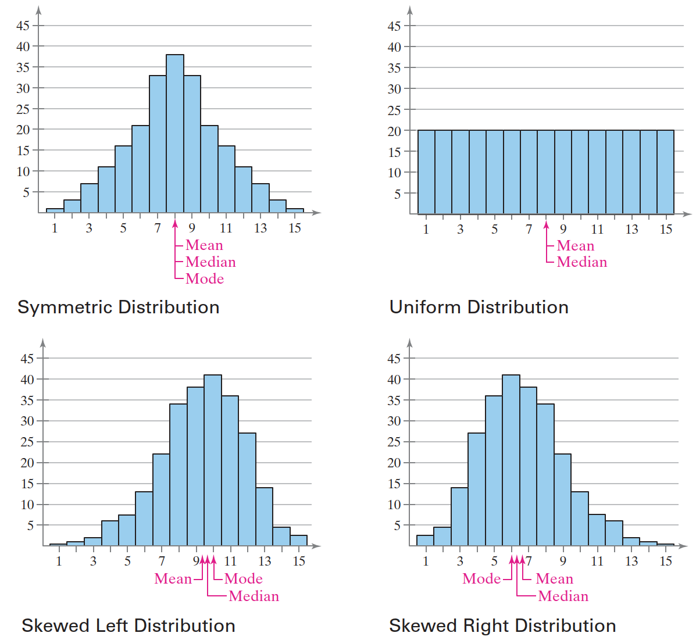
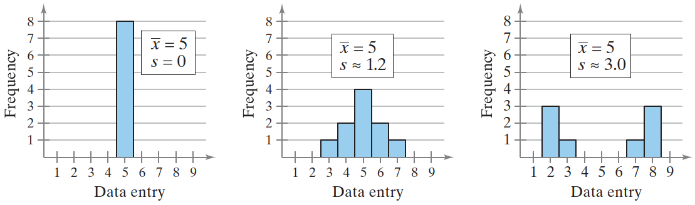

# 描述统计学

2024-05-06 ⭐
@author Jiawei Mao

***

## 1. 数据的集中趋势

### 平均值、中位数和众数

**集中趋势度量**，指一个代表数据集的典型值或中心值的数值。三种最常用的度量为：

- 平均值（mean）
- 中位数（median）
- 众数（mode）

总体平均值：

$$
\mu=\frac{\sum x}{N}
$$

样本平均值：

$$
\overline{x}=\frac{\sum x}{n}
$$

计算样本均值：

```java
double mean = StatUtils.mean(274, 235, 223, 268, 290, 285, 235);
assertEquals(mean, 258.6, 1e-1);
```

中位数，对数据集排序后，位于数据中间的值：

- 当数据有奇数个，中位数是中间的数据；
- 当数据有偶数个，中位数是中间两个数的平均值。

计算中位数：

```java
double median = StatUtils.percentile(new double[]{223, 235, 235, 268, 274, 285, 290}, 50);
assertEquals(median, 268, 0.1);
```

偶数个数值，计算中位数：

```java
double median2 = StatUtils.percentile(new double[]{223, 235, 235, 268, 274, 290}, 50);
assertEquals(median2, 251.5, 0.01);
```

**众数（mode）** 是数据集中出现频率最高的值：

- 当没有重复出现的数据，就没有众数；
- 当两个数值以相同的最高频率出现，则有两个众数，称为**双峰（bimodal）**。

众数是唯一可用于描述 nominal 数据类型的指标。在处理定量数据是，很少使用众数。

> 平均值、中位数和众数各有优缺点。平均值是一个可靠的指标，因为它考虑了数据集的每个数据，但是，当数据集包含**离群值（outlier）** 时，平均值可能会受到很大影响。

**离群值（outlier）** 指远离数据集中其它样本的数据。有些离群值是有效数据，有些则是由于数据记录错误而产生。数据集可以有多个离群值，从而导致分布中出现 **gap**。

### 加权平均值

**加权平均值（weighted mean）** 
$$
\overline{x}=\frac{\sum xw}{\sum w}=\frac{w_1x_1+w_2x_2+\cdots+w_nx_n}{w_1+w_2+\cdots+w_n}
$$

其中 $w$ 是 $x$ 的权重值。

### 分布形状

对称分布：一个垂直线从中分开，两边是近似镜像。

均匀分布：所有类别具有近似或相等的频率（概率）。

当分布图形的发生倾斜，分为：

- 尾巴向左延伸（skewed left, negatively skewed）
- 尾巴向右延伸（skewed right, positively skewed）

当分布为对称分布且为单峰、均值、中位数和众数相等。

当分布向左倾斜，均值小于中位数，中位数通常小于众数。

当分布向右倾斜，均值大于中位数，中位数通常大于众数。

如下图所示：



## 2. 数据的离散程度

下面介绍数据集的变化（或分散）的指标。

### 范围

最简单的分散指标是数据集的**范围（range）**。

数据集的**范围（range）** 是该数据集中最大值和最小值的差值。range 指标只能用于定量数据。

$$
\text{Range}=\text{MaxData}-\text{MinData}
$$

range 易于计算，但它只使用数据集的两个数据。

### 方差和标准差

方差用来度量随机变量和其数学期望的偏离程度。

方差和标准差使用数据集的所有数据计算。

总体数据集中某个数据 $x$ 的**偏差(deviation)**是该数据与数据集平均值 $\mu$ 之间的差值：
$$
\text{deviation of x}=x-\mu
$$
所有偏差的加和为 0，因此计算所有偏差的均值没有意义。为了克服该问题，取偏差的平方。

在总体数据集中，偏差平方的平均值为总体方差。

**总体方差(population variance)**
$$
\sigma^2=\frac{\sum(x-\mu)^2}{N}
$$
方差的缺点是单位与数据集不同。为了解决该问题，可以对方差求平方根，得到标准差。

**总体标准差(standard deviation)**
$$
\sigma=\sqrt{\sigma^2}=\sqrt{\frac{\sum(x-\mu)^2}{N}}
$$
标准差的特点：

- 标准差衡量数据集相对平均值的变化，其单位与数据集相同
- 标准差是中大于或等于 0，当 $\sigma=0$，数据集没有变化，即所有数据的值相同
- 数据离平均值越远（更加分散），$\sigma$ 值增加

标准差又称为**均方差**。

**样本方差(sample variance)**
$$
s^2=\frac{\sum(x-\overline{x})^2}{n-1}
$$
**样本标准差(sample standard deviation)**
$$
s=\sqrt{s^2}=\sqrt{\frac{\sum(x-\overline{x})^2}{n-1}}
$$

### 解释标准差

标准差是衡量数据偏离平均值的指标，数据越分散，标准差越大。



### 均方误差

**均方误差**（mean squared error, MSE）是数据与**真实值**的偏差的平方和的平均值。均方误差的开方叫均方根误差，均方根误差和标准差形式接近。

所以，方差是数据集与平均值的关系，均方误差是数据集与真实值的关系。
