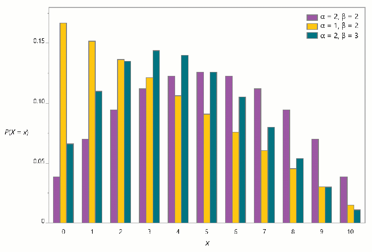

# Beta-Binomial

## 简介

beta-binomial 分布用于 n 次独立伯努利试验中的成功次数的建模。它是二项分布的扩展：在二项分布中，每次试验的成功概率固定不变；而在贝塔二项分布中，该**成功概率不是固定值**，而是一个服从贝塔分布的随机变量。当二项分布数据的方差大于二项分布的理论期望方差时，使用该分布进行建模十分有效。

beta-binomial 分布实例：

- 使用多枚不均匀的硬币进行抛投实验，正面朝上的次数。由于硬币重量不同，每枚硬币掷出正面的概率可能存在差异。
- 固定批量产品中的不合格品数量，其中不同批次的次品率是随机的。
- 一场罚球比赛中，二十名技术水平各不相同的篮球运动员成功罚中的次数。

## beta-binomial 分布特点

模型参数：

- n, 试验次数
- $\alpha$，形状参数
- $\beta$，形状参数

质量函数：
$$
p(X=x)=\binom{n}{x}\frac{B(x+\alpha,n-x+\beta)}{B(\alpha,\beta)}
$$
其中，$B$ 是 beta 函数，$x=0,1,...,n$, $\alpha>0, \beta>0$。

均值：
$$
\frac{n\alpha}{\alpha+\beta}
$$
方差：
$$
\frac{n\alpha\beta}{(\alpha+\beta)^2}\frac{\alpha+\beta+n}{\alpha+\beta+1}
$$
下图显示 $n=10$ 时不同 $\alpha$ 和 $\beta$ 的 beta-binomial 分布：

## 何时使用 beta-binomial 分布

参考假设你从 n 次独立二元试验中收集数据，并发现观测计数的方差**大于**二项模型的预期方差，即数据存在**过度离散**现象。当试验的成功概率不固定，在不同试验间存在差异时，就可能出现过度离散。此时，beta-binomial 分布是一个合适的模型。例如，若你希望将这类数据建模为独立预测变量的函数，可以采用广义回归模型，并指定响应变量服从贝塔二项分布。（如果数据呈现**欠离散**特征，即观测方差小于理论期望方差，可考虑使用超几何分布进行建模。）

## 参考

- https://en.wikipedia.org/wiki/Beta-binomial_distribution