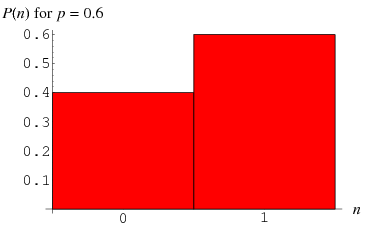

# 伯努利分布

- [伯努利分布](#伯努利分布)
  - [简介](#简介)
  - [应用](#应用)

2020-07-04, 14:35
***

## 简介

以瑞士数学家 Jacob Bernoulli 命名的伯努利分布是最常见的 0-1 分布，即它的随机变量取值只有 0 或 1，其概率密度函数为：

$$P(n)=\begin{cases}
    1-p &\text{for } n=0 \\
    p &\text{for } n=1.
\end{cases}$$

也可以写为：

$$p(n)=p^n\times(1-p)^{1-n}$$

对应的分布函数为：

$$D(n)=\begin{cases}
    1-p &\text{for }n=0 \\
    1 &\text{for }n=1.
\end{cases}$$

每次试验的成功概率相同，这种独立重复的试验称为伯努利试验（Bernoulli trial）。

## 应用

伯努利分布是最简单的离散分布，它是其它复杂离散分布的基础。例如：

|分布|定义|
|---|---|
|二项分布|`n` 次试验成功的次数|
|几何分布|第一次成功前失败的次数|
|负二项分布|第 n 次成功前失败的次数|
