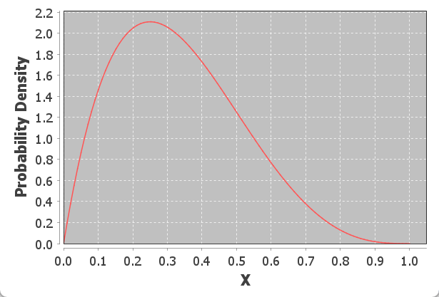
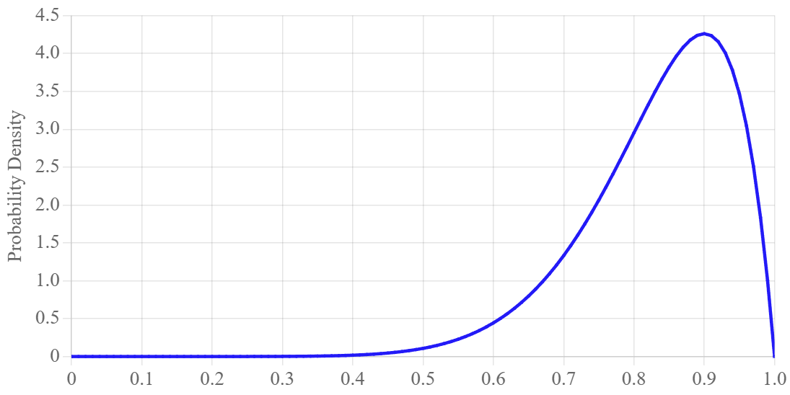
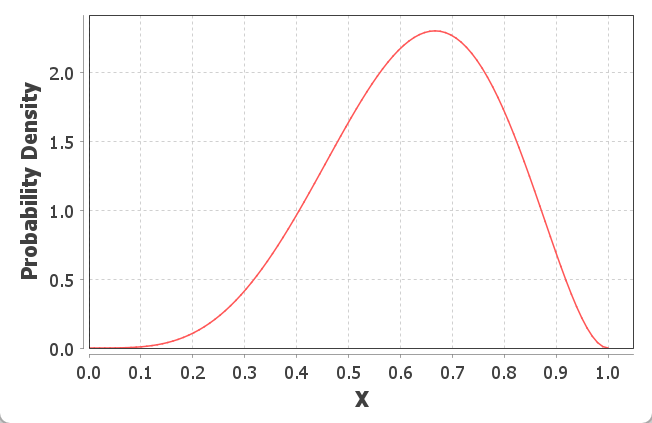
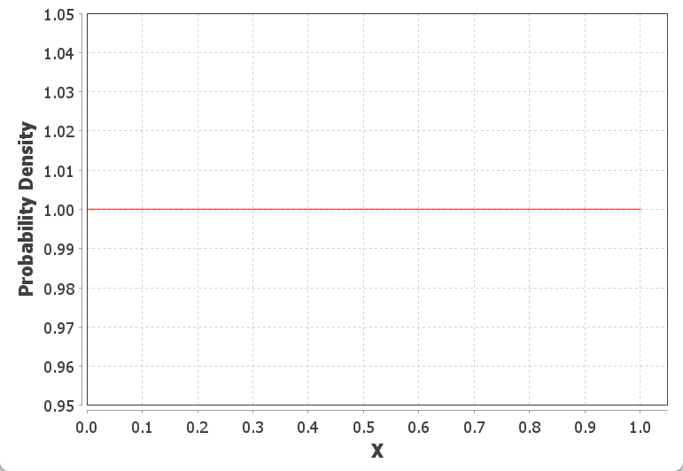
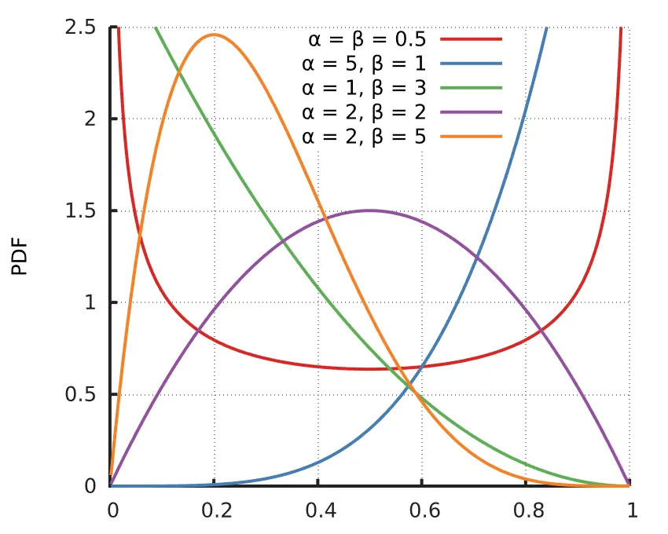

# Beta 分布

2025-12-11⭐
@author Jiawei Mao
***
## 简介

Beta 分布常用作概率的概率分布。当概率本身存在不确定性，可以将概率表示为随机变量。

**Beta 随机变量**
$$
X \sim \Beta(a, b)
$$
对二项分布，观察到 $a-1$ 成功，$b-1$ 次失败的概率 $p$ 的分布。

**参数**：

- $a>0$，表示成功次数 +1，即成功次数=a-1
- $b>0$，表示失败次数 +1，即失败次数=b-1

那么，$B(2,2)$ 表示 1 次成功和 1 次失败。

其中 $x$ 为概率值，范围 $x\in [0,1]$。

PDF 定义：
$$
Beta(x;a,b)=\frac{1}{B(a,b)}x^{a-1}(x-1)^{b-1}
$$
**期望值**
$$
E[X]=\frac{a}{a+b}
$$
**方差**
$$
Var(X)=\frac{ab}{(a+b)^2(a+b+1)}
$$
**PDF 示意图**

a=2, b=4

## 抛硬币

假设有一枚硬币，想知道它出现正面的真实概率 $p$。抛硬币 10 次，看到 9 次正面和 1 次反面。基于这些证据，你对 $p$ 的 belief 是什么？根据概率定义，我们可以猜测 $p\approx \frac{9}{10}$。这是一个非常粗糙的估计，而是单个值无法表达不确定性。

我们是否可以用一个随机变量来表示真实概率？设 $X$ 表示硬币正面出现的真实概率。如果 $X=0.7$，则正面出现的概率为 0.7。$X$ 必然是一个在 $[0,1]$ 之间的连续随机变量。

在抛硬币之前，假设硬币出现正面的概率服从均匀分布：$X\sim U(0,1)$。令 $H$ 表示出现正面次数的随机变量，$T$ 为出现背面次数的随机变量。那么 $P(X=x|H=9,T=1)$ 的概率是多少？

这个概率不容易思考！而是另一个概率更容易推导：$P(H=,T=1|X=x)$。即假设正面的概率为 $p$，在 10 次抛硬币中出现 9 次正面和 1 次反面的概率。这就是一个二项概率，其中 $n=10$，$p=x$，$k=9$：
$$
P(H=9,T=1|X=x)=\binom{10}{9}x^9(1-x)^1
$$

根据贝叶斯定理可以计算：
$$
\begin{aligned}
    f(X=x|H=9,T=1)&=\frac{P(H=9,T=1|X=x)\cdot f(X=x)}{P(H=9,T=1)}&\text{Bayes Theorem}\\
    &=\frac{\binom{10}{9}x^9(1-x)^1\cdot f(X=x)}{P(H=9,T=1)}&\text{Binomial PMF}\\
    &=\frac{\binom{10}{9}x^9(1-x)^1\cdot 1}{P(H=9,T=1)}&\text{Uniform PMF}\\
    &=\frac{\binom{10}{9}}{P(H=9,T=1)}x^9(1-x)^1 &\text{前面为常量}\\
    &=K\cdot x^9(1-x)^1 &\text{重命名常量}
\end{aligned}
$$

设 $K=110$ （无论 K 取什么值，都会得到相同的形状，只是缩放了）：

从该图可以看出：

1. 虽然只抛了 10 次，但我们非常有信心出现正面的正式概率 $p>0.5$
2. $X=0.9$ 的可能性几乎是 $X=0.6$ 的 10 倍
3. $f(X=1)=0$ 是合理的，因为如果正面出现的概率为 1，不会出现一次反面

> [!NOTE]
>
> 在上面的推导中，将 $P(H=9,T=1)$ 作为一个常数，为什么？
>
> 其概率为在所有可能 $x$ 的情况下，出现 9 个正面的概率。可以使用全概率公式：
> $$
> \begin{aligned}
> P(H=9,T=1)=\int_{y=1}^1P(H=9,T=1|X=y)f(X=y)
> \end{aligned}
> $$
>
> 这很难计算，但实际上是一个常数。

## Beta 推导

对上面的公式进行推广，用 $h$ 表示正面次数，$t$ 表示范奶奶次数。

在 $h+t$ 次抛硬币实验中，用 $H=h$ 表示看到 $h$ 个正面的事件，$T=t$ 表示看到 $t$ 个反面的事件。使用相同的步骤计算概率密度函数 $f(X=x|H=h,T=t)$。从贝叶斯定理开始：
$$
\begin{aligned}
    f(X=x|H=h,T=t)&=\frac{P(H=h,T=t|X=x)f(X=x)}{P(H=h,T=t)}&\text{Bayes Theorem}\\
    &=\frac{\binom{h+t}{h}x^h(1-x)^t}{P(H=h,T=t)} &\text{Binomial PMF, Uniform PDF}\\
    &=\frac{\binom{h+t}{t}}{P(H=h,T=t)}x^h(1-x)^t\\
    &=\frac{1}{c}\cdot x^h(1-x)^t&\text{其中 } c=\int_0^1x^h(1-x)^tdx
\end{aligned}
$$

这里使用贝叶斯方法计算概率，定义了一个概率密度函数，因此是一个随机变量。该随机变量成为 Beta 分布，其定义如下：

$X\sim Beta(a,b) $ 的概率密度函数（PDF）为：
$$
f(X=x)=\begin{cases}
    \frac{1}{B(a,b)}x^{a-1}(1-x)^{b-1} &\text{if } 0<x<1\\
    0 & \text{其它}
\end{cases}
$$

其中：
$$
B(a,b)=\int_{0}^1x^{a-1}(1-x)^{b-1}dx
$$

Beta 分布的均值 $E[X]=\frac{a}{a+b}$，方差 $Var{X}=\frac{ab}{(a+b)^2(a+b+1)}$。所有现代编程语言都有计算Beta 分布 CDF 的包，不需要手动计算。

对硬币正面朝上的概率进行建模：设 $a=h+1$, $b=t+1$。硬币朝上概率的分布用 Beta 随机变量表示。

**示例**：一种 药物给 6 名患者使用，其中 4 人治愈。那么可以将该药物治愈患者的概率表示为 $X\sim Beta(a=5,b=3)$：

注意，治愈患者概率的最可能 belief 是 4/6，即治愈患者比例。该分布表示治愈概率取 4/6 以外的值不是 0，当然概率不太可能是 0.01 或 0.09，但 0.5 可能性也很大。

## Beta 作为先验

可以将 $X\sim Beta(a,b)$ 作为先验，反应在抛硬币之前的概率。这是一个主观设定，表示 $a+b-2$ 次虚构试验，其中 $a-1$ 次正面，$b-1$ 次反面。如果你观察到 $h+t$ 次真实试验，其中 $h$ 个正面，就可以更新 belief。新的 belief 为 $X\sim Beta(a+h,b+t)$。使用先验 $Beta(1,1)=Uni(0,1)$ 表示没有任何虚构试验，所以先验上我们对硬币一无所知。下面是将 Beta 作为先验对 $X$ 分布的正面：

如果先验 belief 为 $X\sim Beta(a,b)$，那么后验 belief 为 $Beta(a+h,b+t)$：

$$
\begin{aligned}
    f(X=x|H=h,T=t)&=\frac{P(H=h,T=t|X=x)f(X=x)}{P(H=h,T=t)}&\text{Bayes Theorem}\\
    &=\binom{h+t}{h}x^h(1-x)^t\cdot \frac{1}{c}\cdot x^{a-1}(1-x)^{b-1} &\text{Beta PMF, Uniform PDF}\\
    &=K\cdot x^h(1-x)^t\cdot x^{a-1}(1-x)^{b-1}\\
    &=K\cdot x^{a+h-1}(1-x)^{b+t-1}
\end{aligned}
$$

最后一个就是 $Beta(a+h,b+t)$ 的 PDF。

如果有一个 Beta 先验 belief，那么后验 belief 也是 Beta，就很方便。这使得 Beta 在代码和证明中都很方便，尤其是对 belief 进行多次更新时。这种在观测前后分布类型相同的性质称为**共轭先验**（conjugate prior）。

**问题**：虚构试验编造先验是否合理？有些人认为没问题（他们被称为贝叶斯主义者），有些人则认为不应该虚构先验 belief (他们被查恒为频率主义者 frequentist)。一般而言，对一个小型数据集，有一个好的先验 belief，预测能力可以大大提升。

beta-prior (beta 先验) 和 uniform-prior (均匀先验)之间有深刻连续。事实证明，$Beta(1,1)=Uni(0,1)$。$Beta(1,1)$ 表示虚拟的 0 次正面和 0 次反面。

 ## 示例

打开邮件，点击所给链接的概率？

电子邮件服务商提供的比例为 2.4%，那么如何选择 β 分布？β 分布的均值 $\frac{\alpha}{\alpha+\beta}=0.024$，可以选择 Beta(1,41), Beta(2,80), Beta(5,200) 等。α+β 的值越小，分布就越宽（毕竟证据不足）。下面使用最弱的先验，即 Beta(1,41)。弱的先验意味着随着收集数据的增加，它更容易被实际数据改变；而更强的先验，比如 Beta(5,200)，则需要更多的数据才能改变。

是否使用强先验，需要根据先验数据描述你当前所做事情的吻合程度来判断。在处理少量数据时，弱的先验数据也能帮助我们做出更真实的估计。

在使用 β 分布时，可以通过直接将两个 β 分布的参数相加来计算后验分布：
$$
Beta(\alpha_{后验},\beta_{后验})=Beta(\alpha_{先验}+\alpha_{似然}，\beta_{先验}+\beta_{似然})
$$
贝叶斯统计学：

- 随着收集的数据越来越多，先验信念可能会被新的数据慢慢削弱
- 在数据很少的情况下，先验信念压制所掌握的数据
- 随着不断收集与先验信念不一致的数据，后验信念就会慢慢偏向收集的数据，偏离最初的先验信念
- 最好从一个比较弱的先验信念开始

**没有先验概率**

前面知道邮件点击率高达 80% 很离谱，所以使用邮件提供商的数据作为先验做出了更好的估计。如果没有数据可以用来构建先验，仍然可以请有营销经验的人做出一个估计。例如，营销人员可能会根据个人估计转换率应该在 20% 左右。

依然选择一个相对较弱的先验，如 Beta(2,8)，以表明预期的转化率在 20% 左右。这个分布只是一个猜测，但重要的是我们可以量化这个猜测。几乎对每一项业务，专家通常可以根据以往的经验和观察提供有效的先验信息。

通过量化这些经验和观察，可以得到更准确的估计，并了解它们在不同的专家之间的变化。如果一个营销人员确定真实的转化率是 20%，就可以将这个信念建模为 Beta(200,800)。随着收集数据的增多，可以比较模型，构建多个置信区间，对任意专家的信念建立量化模型。此外，随着获得信息越来越多，由先验信息造成的差异会逐渐减小。

**没有任何信息**

有些统计学派认为，在没有任何其它信息的情况下进行参数估计，参数 α 和 β 都应该是 1。这相当于使用了一个非常弱的先验，认为每种结果的可能性相同：Beta(1,1)。这是在没有信息的情况下我们所能做出的 “最公平”（也最弱）的先验。公平先验也成为**无信息先验**（noninformative prior）。对应的 Beta 分布就是一条直线：

所有结果的可能性都相等，平均可能性为 0.5.

## 分布特点

- 当 $\alpha=\beta=1$，Beta 分布退化为 $(0,1)$ 之间的均匀分布
- 当  α > 1 且  β > 1 时，密度函数呈单峰形态

- 当  α < 1 且  β < 1 时，密度函数呈U形

- 当  α > β 时，分布整体左偏（众数偏向1）
- 当  α < β 时，分布整体右偏（众数偏向0）

## 参考 

- https://en.wikipedia.org/wiki/Beta_distribution
- https://chrispiech.github.io/probabilityForComputerScientists/en/index.html